@(工作笔记)

# Alfred-Workflows-record

[TOC]


---

## 1. Triggers

### 1.1 Hotkey(快捷键)

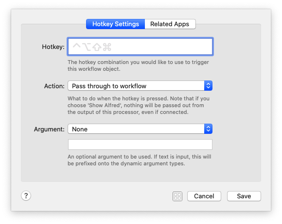
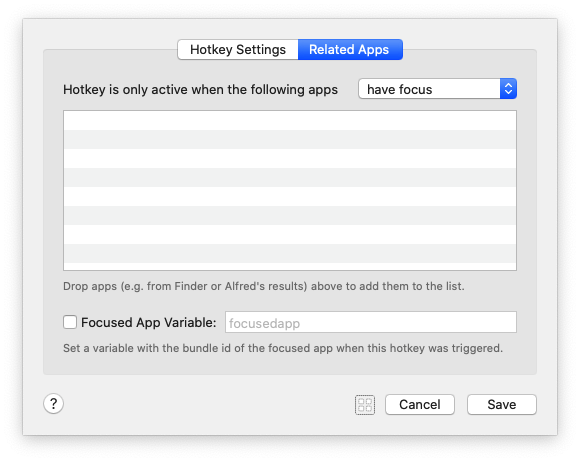

```plain
The hotkey combination you would like to use to trigger this workflow object.
您想用来触发此工作流程对象的热键组合。
```

```plain
What to do when the hotkey is pressed. Note that if you choose 'Show Alfred; nothing will be passed out from the output of this processor, even if connected.
按下热键时该怎么办。 请注意，如果选择“显示Alfred； 即使已连接，该处理器的输出也不会传递任何信息

一句话: 
	1. 参数能往下传给其他组件
	2. 参数不传给下面组件, 而是显示在 alfred的输入框中
```
像这样:


**一般是往下传…** 除非选择一个文件获取路径 想做点什么的时候

```plain
An optional argument to be used. If text is input, this will be prefixed onto the dynamic argument types.
要使用的可选参数。 如果输入了文本，则将在动态参数类型上添加前缀。

前缀也包含进往下传递的 {query}变量中...
```


argument: 有4种选项

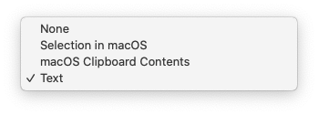

1. 不传递参数
2. 选中文件或者文件夹 会获取路径, 并以此作为参数
3. 剪贴板内容作为参数
4. 输入的内容作为参数


Simulate modifier keys released 模拟释放的修饰键
Wait until modifier keys are released 等待直到释放修饰键
Pass through modifier keys (Fastest) 通过修改键（最快）


**Focused App Variable**


Focused App Variable 能识别 再哪个app上使用了 快捷键, 从而使用不同的处理


###  Remote

### Snippet

### External

### File Action


```plain
This is the searchable name you will see in the file actions view.
这是您将在文件操作视图中看到的可搜索名称。

Files will be passed into scripts as tab separated.
文件将以制表符分隔的形式传递到脚本中。

Accepts multiple files 
接受多个文件 | 不知道怎么用

Drop in files to set the file types this filter will match. Leave empty to search all file types. Use [+] to
add file UTIs manually, and prefix UTIs witha + do a broader match within the content type tree. ,
放入文件以设置此过滤器将匹配的文件类型。 留空以搜索所有文件类型。 使用[+]手动添加文件UTI，并在内容类型树中使用+前缀添加UTI。 ，
```

[文件类型](https://www.alfredapp.com/help/workflows/inputs/file-filter/#contenttree)


用open 关键字 搜索到jpg 之后, 按方向键右键, 会显示列表


### Contact Action

### Fallback Search


```plain
Select the title and subtext you would like to use for this keyword based input. These represent the text you see in Alfred's results when using the keyword.
选择要用于此基于关键字的输入的标题和副文本。 这些代表您在使用关键字时在Alfred结果中看到的文本。
```


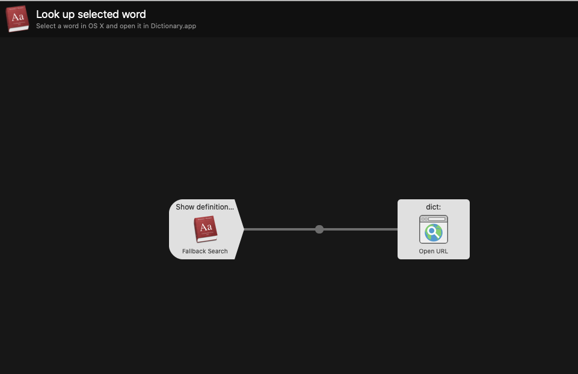


---

## Inputs

### Keyword


```plain
Enter the keyword you would like to use for this input. By default, keywords require arguments. You can alternatively select if an argument should be optional or if no argument is required.
输入您要用于此输入的关键字。 默认情况下，关键字需要参数。 您也可以选择参数是可选参数还是不需要参数。

Enter the title and subtext you would like to use for this
keyword based input. These represent the text you see 
in Alfred's results when using the keyword.
输入您要用于此基于关键字的输入的标题和副文本。 这些代表您在使用关键字时在Alfred结果中看到的文本。
```


### File Filter

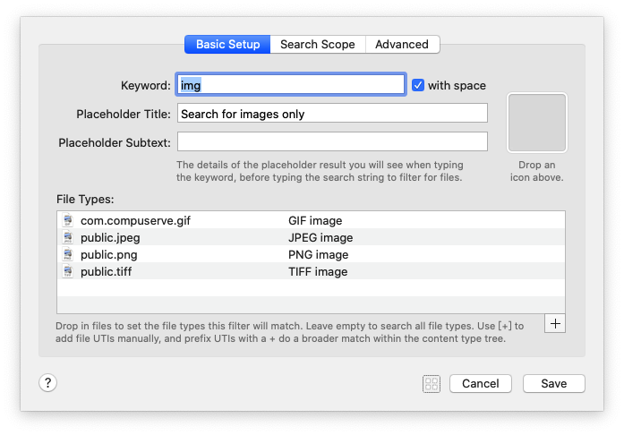


```plain
The details of the placeholder result you will see when typing the keyword, before typing the search string to filter for files.
键入关键字时，在键入搜索字符串以过滤文件之前，您将看到占位符结果的详细信息。

Drop in files to set the file types this filter will match. Leave empty to search all file types. Use [+] to add file UTIs manually, and prefix UTIs witha + do a broader match within the content type tree. 
放入文件以设置此过滤器将匹配的文件类型。 留空以搜索所有文件类型。 使用[+]手动添加文件UTI，并在内容类型树中使用+前缀添加UTI。
```

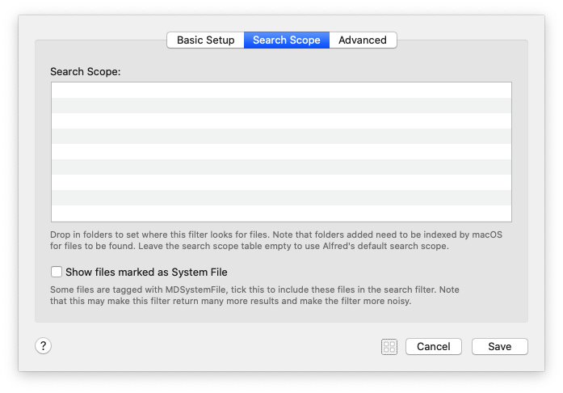

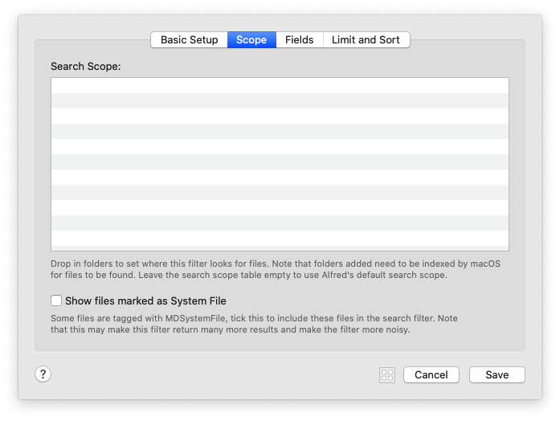


```plain
Drop in folders to set where this filter looks for files. Note that folders added need to be indexed by macOS for files to be found. Leave the search scope table empty to use Alfred's default search scope.
放入文件夹以设置此过滤器查找文件的位置。 请注意，添加的文件夹需要由macOS索引才能找到文件。 将搜索范围表留空以使用Alfred的默认搜索范围。

Some files are tagged with MDSystemFile, tick this to include these fils in the search filter. Note that this may make this filter return many more results and make the filter more noisy.
有些文件带有MDSystemFile标记，请勾选此项以将这些fils包含在搜索过滤器中。 请注意，这可能会使此滤镜返回更多结果，并使滤镜更嘈杂。
```


```plain
This is based on when the file was created or modified.
这基于创建或修改文件的时间。

'Words' searches word boundaries for this field (generally better), and 'Split' will separate each word typed into a separate parameter (useful for tags 1 content). Note that (query) values are OR'ed together, string constant values are AND'ed together.
“单词”在该字段中搜索单词边界（通常更好），“拆分”会将键入的每个单词分隔为单独的参数（对于标签1内容很有用）。 请注意，（查询）值进行“或”运算，字符串常量值进行“与”运算。

Anchor searches which are not word based
不是基于单词的锚搜索

Anchoring maintains accuracy and performance by searching from the first character. By unticking this, Alfred will prefix your query with a * wildcard. This only applies to fields which have 'words' unticked in the table above.
锚定通过从第一个字符开始搜索来保持准确性和性能。 通过取消选中此选项，Alfred将为您的查询添加*通配符。 这仅适用于上表中未选中“单词”的字段。
```


```plain
kMDItemDisplayName		显示名称
kMDItemFinderComment	评论
kMDItemUserTags				用户标签
kMDItemTextContent		文字内容
kMDItemTitle					标题
kMDItemAuthors				作者
kMDItemKind						相似
kMDItemWhereFroms			从哪里来
kMDItemOMUserTags			OMUserTags

'Words' searches word boundaries for this field (generally better), and 'Split' will separate each word typed into a separate parameter (useful for tags 1 content). 
“单词”在该字段中搜索单词边界（通常更好），“拆分”会将键入的每个单词分隔为单独的参数（对于标签1内容很有用）。

The value can be {query}, {var:varname} or constant strings. The constructed query is grouped by value type, for example: {query OR query} AND {var AND var} AND {const AND const}
该值可以是{query}，{var：varname}或常量字符串。 构造的查询按值类型分组，例如：{query OR query} AND {var AND var} AND {const AND const}

Anchor searches which are not word-based for accuracy
不是基于单词的锚点搜索，以确保准确性

Anchoring maintains accuracy and performance by searching from the first character. By unticking this, Alfred will prefix your query with a . wildcard. This only applies to fields which have 'words' unticked in the table above.
锚定通过从第一个字符开始搜索来保持准确性和性能。 通过取消选中此选项，Alfred将为您的查询添加前缀。 通配符。 这仅适用于上表中未选中“单词”的字段。
```


```plain
This is based on when the file was created or modified.
作者这基于创建或修改文件的时间。

Note: Setting a limit of 100 or more may cause performance issues.
注意：将限制设置为100或更高可能会导致性能问题。

Setting "Default" will use the shared limit set in Alfred's Features > File Search preferences.
设置“默认”将使用在Alfred的功能>文件搜索首选项中设置的共享限制。


When using Alfred's Knowledge, you will benefit from result ordering based on your usage, and Alfred's learning. By selecting a fixed order, the knowledge is ignored.

使用Alfred的知识时，您将受益于根据使用习惯和Alfred的学习而进行的结果排序。 通过选择固定顺序，知识将被忽略。
```


### Dictionary Filter


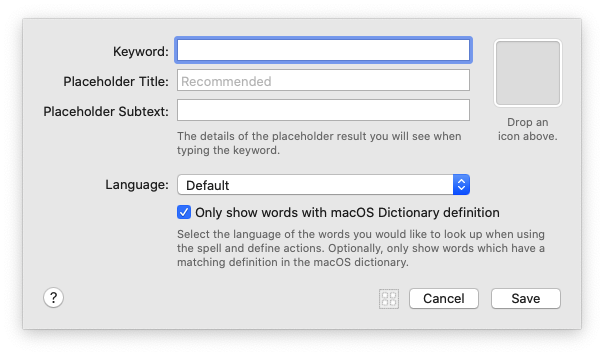


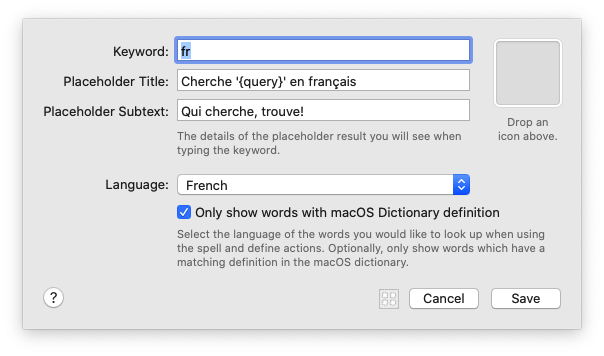


```plain
The details of the placeholder result you will see when typing the keyword.
键入关键字时，您将看到占位符结果的详细信息。

Select the language of the words you would like to look up when using
the spell and define actions. Optionally, only show words which have a
matching definition in the macOS dictionary.
选择使用拼写时要查找的单词的语言并定义动作。 （可选）仅显示在macOS词典中具有匹配定义的单词。
```


### [List Filter](https://www.alfredapp.com/help/workflows/inputs/list-filter/)


```plain
The details of the placeholder result you will see when typing the keyword.
键入关键字时，您将看到占位符结果的详细信息。

Leave the result image empty to inherit the object icon. If there is no object icon, results will inherit the workflow icon. The result arg is passed to connected objects when the user actions the result in Alfred.
将结果图像留空以继承对象图标。 如果没有对象图标，则结果将继承工作流程图标。 当用户在Alfred中操作结果时，结果arg将传递到连接的对象。

Alfred learns and will sort the result based on usage. Alternatively, you can keep the results in the same order regardless of usage.

Alfred将学习并根据使用情况对结果进行排序。 另外，您可以不考虑使用情况，将结果保持相同的顺序。
```


```plain
1. This object sets the keyword you use to start adding a new task to your to-do list. Type "todo" followed by your task (e.g. "todo bake a cake")
该对象设置用于开始向任务列表中添加新任务的关键字。 输入“ todo”，然后输入您的任务（例如“ todo烤蛋糕”）

2. The Arg/Var utility moves your task (the query) to a variable called "todo" until it's needed later in the green path.
Arg / Var实用程序将您的任务（查询）移动到一个名为“ todo”的变量，直到稍后在绿色路径中需要它为止。

3. The List Filter input lets you select (from the options you set in this object) which to-do list to add the task to. (Following the green path)
列表过滤器输入允许您（从在此对象中设置的选项）选择要添加任务的任务列表。 （沿着绿色路径）

4. Using "vtodo" keyword and selecting a list opens the specified to-do list instead. (Following the blue path as there is no "task" variable)
使用“ vtodo”关键字并选择一个列表将打开指定的待办事项列表。 （由于没有“任务”变量，因此遵循蓝色路径）

5. The Arg/Var utility moves the chosen to-do list to a variable called "filename" until it's needed later.
Arg / Var实用程序将选定的待办事项列表移动到一个名为“文件名”的变量，直到以后需要它为止。

6. The Conditional utility allows you to decide which path the workflow should take, based on whether the query should be appended, or the list opened.
Arg / Var实用程序将选定的待办事项列表移动到一个名为“文件名”的变量，直到以后需要它为止。...

7. The Append To File output appends the to-do text (moved into a variable called "todo" in the orange object) to the appropriate list.
“附加到文件”输出将待办事项文本（移动到橙色对象中的变量“ todo”中）附加到适当的列表。

8. The Post Notification output lets you know that the task has been added through the Notification Center.
发布通知输出使您知道该任务已通过通知中心添加。

9. The Open File action opens the list specified in the yellow List Filter object.
“打开文件”操作将打开在黄色“列表过滤器”对象中指定的列表。
```


### Script Filter


```plain
The details of the placeholder result you will see when typing the keyword. The "Please Wait" subtext will be shown while waiting for the script's initial results.

键入关键字时，您将看到占位符结果的详细信息。 等待脚本的初始结果时，将显示“ Please Wait”子文本。
```


```plain
Alfred queues up the execution of your script filter for every argument character
you type. When ready, the most relevant (recent) script is run and irrelevant ones
are discarded. These options allow you to tweak this behaviour.

Alfred会为您键入的每个参数字符将脚本过滤器的执行排队。 准备就绪后，将运行最相关的（最新）脚本，并丢弃不相关的脚本。 这些选项使您可以调整此行为。

By waiting until the previous script finishes, you more likely have results
shown in Alfred while the user is typing in an argument. For slow scripts, it
may be better to terminate the previous script and instead, wait for the
result for the most recently typed argument.

通过等到上一个脚本完成，您更有可能在用户输入自变量时在Alfred中显示结果。 对于慢速脚本，最好终止先前的脚本，而改为等待最后键入的参数的结果。

This allows you to modify when a script is queued with the typed argument.
Delaying a script until the user stops typing is beneficial if the script is
known to be slow to complete or there is an external limit imposed on the
script, e.g. a web API.

这使您可以修改脚本与类型化的参数排队的时间。 如果已知脚本执行速度较慢或脚本受到外部限制，例如将脚本延迟到用户停止键入，将是有益的。 网络API。
哦? 所以本地脚本可以是使用默认选项... 默认选项挺快的


By trimming irrelevant arg spaces, it prevents a script from being re-run if
you type multiple trailing spaces up to the point an additional character is
typed. This is the default Script Filter arg behaviour.
通过修剪不相关的arg空格，如果您键入多个尾随空格直至键入一个额外的字符，它可以防止脚本重新运行。 这是默认的脚本过滤器arg行为。

This option relates to argv mode only. When this option is unchecked, argv
is set to an empty string when the query is empty. 
此选项仅与argv模式有关。 如果未选中此选项，则查询为空时，argv设置为空字符串。
```


```plain
Select the match mode for when Alfred filters your script filter output.

Alfred will match against the JSON item title property by default. You can use the match property to override this, see help for more information.

选择Alfred过滤脚本过滤器输出时的匹配模式。

默认情况下，Alfred将与JSON项目标题属性匹配。 您可以使用match属性来覆盖此属性，有关更多信息，请参见帮助。
```

[帮助](https://www.alfredapp.com/help/workflows/inputs/script-filter/#alfred-filters-results)


---

## Actions

### Open File


```plain
This action will simply open the files passed into it from the workflow.
该操作将仅打开从工作流程传递到其中的文件。

The passed-in file will be opened
传入的文件将被打开

If the passed-in file has a relative path, Alfred first looks relative to the workflow's own folder.
如果传入的文件具有相对路径，则Alfred首先会相对于工作流自己的文件夹进行查找。
If not found, Alfred looks relative to the workflow's Workflow Data folder.
如果未找到，则Alfred看起来相对于工作流的“工作流数据”文件夹。

Drop a file above to set a static file to open instead of the passed-in files.
将文件放在上方以将静态文件设置为打开，而不是传入文件。

Drop an application in the box above to set the "Open with" application.
将应用程序拖放到上方的框中，以设置“打开方式”应用程序。
```


### Reveal File in Finder

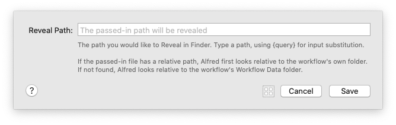

```plain
Reveal Path
显示路径

The passed-in path will be revealed
传递的路径将显示出来

The path you would like to Reveal in Finder. Type a path, using (query) for input substitution.
您想要在Finder中显示的路径。 键入路径，使用（查询）进行输入替换。

If the passed-in file has a relative path, Alfred first looks relative to the workflow's own folder.
如果传入的文件具有相对路径，则Alfred首先会相对于工作流自己的文件夹进行查找。

If not found, Alfred looks relative to the workflow's Workflow Data folder.
如果未找到，则Alfred看起来相对于工作流的“工作流数据”文件夹。
```


### Browse in Alfred


```plain
The path you would like to browse in Alfred. Type a path, using (query) for input substitution.
您想在Alfred中浏览的路径。 键入路径，使用（查询）进行输入替换。

If the passed-in file has a relative path, Alfred first looks relative to the workflow's own folder.
如果传入的文件具有相对路径，则Alfred首先会相对于工作流自己的文件夹进行查找。

If not found, Alfred looks relative to the workflow's Workflow Data folder.
如果未找到，则Alfred看起来相对于工作流的“工作流数据”文件夹。
```

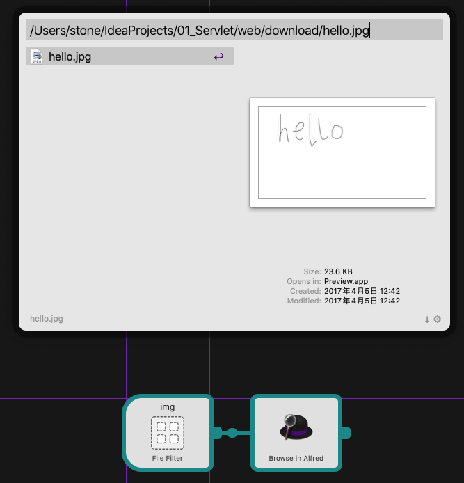


### Launch Apps / Files


```plain
Drop files above to add them, drag to reorder. Use 'Toggle Visibility' to
hide an app if it is the currently active app in macOS.
将文件拖放到上方以添加它们，然后拖动以重新排序。 如果应用程序是macOS中当前处于活动状态的应用程序，请使用“切换可见性”隐藏该应用程序。
```


### Default Web Search


```plain
Select the default web search you would like to use.
选择您要使用的默认网页搜索。

Optionally select the browser you would like this web search to open in.
（可选）选择您要打开此网络搜索的浏览器。
```

意思是: google网页用chrome打开...

其他的配合有 google网页用Safari打开


### Open URL


```plain
Enter the URL you would like to open. To discover a website's search URL, perform a search on the website and replace the resulting URL search term with (query] e.g. to search twitter, use https://twitter.com/search?q=(query)
输入您要打开的URL。 要发现网站的搜索URL，请在网站上执行搜索，然后将结果URL搜索项替换为（查询），例如，搜索Twitter，请使用https://twitter.com/search?q=(query）

Optionally select the browser you would like this web search to open in.
（可选）选择您要打开此网络搜索的浏览器。
```


### System Command

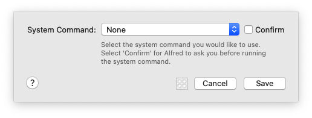

```plain
Select the system command you would like to use.
选择您要使用的系统命令。

Select 'Confirm' for Alfred to ask you before running the system command.
在运行系统命令之前，请Alfred选择'Confirm'询问您。
```


```plain
Screen Saver			屏幕保护
Sleep							睡觉
Sleep Displays		睡眠显示器
Show Trash				显示垃圾箱
Empty Trash				清空垃圾桶
Lock							锁
Restart						重新开始
Shut Down					关掉
Log Out						登出
Volume Up					提高音量
Volume Down				音量减小
Toggle Mute				切换静音
Quit All Apps			退出所有应用
Eject All					全部弹出
```


### iTunes Command

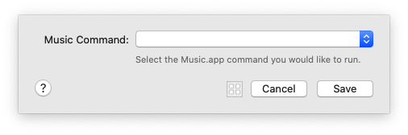

```plain
Select the Music.app command you would like to run.
选择您要运行的Music.app命令。
```


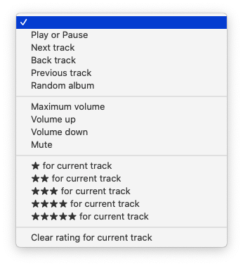

```plain
Play or Pause						播放或暂停
Next track							下一首
Back track							后退轨道
Previous track					上一曲
Random album						随机专辑
Maximum volume					最大音量
Volume up								提高音量
Volume down							音量减小
Mute										静音
★ for current track								★对于当前曲目
★★ for current track							★★用于当前曲目
★★★ for current track							★★★用于当前曲目
★★★★ for current track						★★★★用于当前曲目
★★★★★ for current track						★★★★★当前曲目
Clear rating for current track		清除当前曲目的评分
```


### Run Script

**运行脚本动作**

运行脚本操作使您可以直接在macOS中运行命令。输入可以作为*argv*传递，也可以将{query}替换为脚本。

建议您使用*argv*，因为您不必担心正确转义输入的查询。


脚本配置
选择您想用来运行脚本的语言。您可以从以下解释器中选择：

/ bin / bash /
/ bin / zsh /
/ user / bin / php
/ user / bin / ruby
/ user / bin / python
/usr/ bin / perl
/ user / bin / osascript（AppleScript）
/ user / bin / osascript（JavaScript）
您可以顺序运行脚本（脚本的后续实例将等到上一个脚本实例完成），也可以同时运行（每次都启动一个脚本的新实例，即使前一个实例尚未完成）。

外部脚本
如果选择语言作为“外部脚本”，则可以运行外部脚本。如果未指定绝对路径，则Alfred将相对于工作流程的文件夹进行查找。确保您已设置脚本的执行许可权。

环境变量
当脚本运行时，Alfred将填充许多有用的环境变量。

### [Run NSAppleScript](https://www.alfredapp.com/help/workflows/actions/run-nsapplescript/)


```plain
Please note that this workflow action uses NSAppleScript on Alfred's main thread. For background AppleScripts, use the Run Script action with /usr/bin/osascript.
请注意，此工作流程操作在Alfred的主线程上使用NSAppleScript。 对于后台AppleScript，请对/ usr / bin / osascript使用“运行脚本”操作。

Wrap scripts in on alfred, ,script(q) handler. Use 'Cache compiled script' for fastest possible performance but more memory usage.
将脚本包装在alfred脚本（q）处理程序上。 使用“缓存编译脚本”可实现最快的性能，但会占用更多内存。
```

### [Terminal Command](https://www.alfredapp.com/help/workflows/actions/terminal-command/)


```plain
This action opens Terminal with the typed command. To run a command without Terminal or to use a command's output in the workflow, use a Run Script action instead.
此操作将使用键入的命令打开终端。 要在没有终端的情况下运行命令或在工作流程中使用命令的输出，请改用“运行脚本”操作。

Note that any outputs connected to this action will receive the passed through {query}, and not the output from the Terminal.
请注意，与此操作相关的所有输出都将接收通过{query}传递的信息，而不是终端的输出。

Replace {query} in your script with the passed argument, escaping as selected.
用传递的参数替换{query}脚本中的（转义为所选）。

Escaping:				转义：
	Spaces					空格
	Backquotes			反引号 	``
	Double Quotes		双引号 	""
	Backslashes			反斜杠 	/
	Brackets				括号		{}
	Semicolons			分号		,
	Dollars 				美元		$
```

### Browse in Terminal


```plain
The path you would like to browse in Terminal.app (or your custom configured Terminal app).
您要在Terminal.app（或您自定义配置的终端应用）中浏览的路径。

Type a path, using (query) for input substitution.
键入路径，使用（查询）进行输入替换。

If the passed-in file has a relative path, Alfred first looks relative to the workflow's own folder.
如果传入的文件具有相对路径，则Alfred首先会相对于工作流自己的文件夹进行查找。

If not found, Alfred looks relative to the workflow's Workflow Data folder.
如果未找到，则Alfred看起来相对于工作流的“工作流数据”文件夹。
```


---

## Utilities
### [Arg and Vars](https://www.alfredapp.com/help/workflows/utilities/argument/)


```plain
Modify the passed-through argument.
修改传递的参数。

Create or modify variables for use in connected objects.
创建或修改变量以用于连接的对象。

For the argument and all values, occurences of {query} will be substituted with the input. Substitute upstream variables using {var:varname}. You can also use the Snippet placeholders for {time}, {date} and {clipboard}.
对于参数和所有值，{query}的出现将替换为输入。 使用{var：varname}替换上游变量。 您还可以将代码段占位符用于{time}，{date}和{clipboard}。
```


### Split Arg to Vars

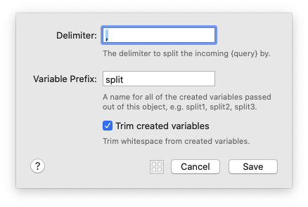

```plain
The delimiter to split the incoming {query} by.
用于分隔传入的{query}的定界符。

A name for all of the created variables passed out of this object, e.g. split1, split2, split3.
从该对象传递的所有已创建变量的名称，例如 split1，split2，split3

Trim whitespace from created variables.
从创建的变量中修剪空格。
```


### [Junction](https://www.alfredapp.com/help/workflows/utilities/junction/)

**连接工具**

联结实用程序是一个非常简单的工作流对象，它本身不执行任何操作，但是允许您整理工作流连接。

它可以用于清理具有大量连接的工作流，或者用作稍后将添加的工作流对象的占位符。

**使用Junction实用程序**

在工作流中有多个输入或输出连接的任何位置添加连接。

这是使用联结之前具有两个输入和四个动作的工作流的样子。它比较混乱，涉及许多交叉连接。


这是使用结点作为工作流的中央连接点的同一工作流；遵循连接不仅更整齐，更容易，而且还可以确保，例如，如果您需要替换关键字，则只需添加一个新连接即可，而不是四个。


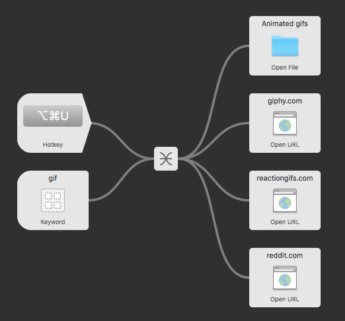

在更大的工作流程中，连接的好处更大！

```plain

```


### Conditional

### Filter


```plain
Legacy Object: We recommend using the Conditional Utility for filtering and branching workflow streams.
旧版对象：我们建议使用条件工具来过滤和分支工作流。

If left empty, the input is evaluated.
如果保留为空，则评估输入。

Regexes evaluate according to ICUv3.
正则表达式根据ICUv3进行评估。
```


### Delay

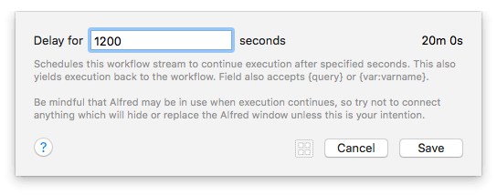


```plain
Schedules this workflow stream to continue execution after specified seconds. This also yields execution back to the workflow. Field also accepts {query} or {var:varname}.
安排此工作流流在指定的秒数后继续执行。 这也使执行返回到工作流。 字段还接受{query}或{var：varname}。

Be mindful that Alfred may be in use when execution continues, so try not to connect anything which will hide or replace the Alfred window unless this is your intention.
请注意，继续执行时可能会使用Alfred，因此除非您有此意图，否则请不要连接任何会隐藏或替换Alfred窗口的内容。
```

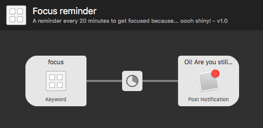


注意：只要Alfred正在运行，Delay实用程序就应该运行，但是如果您重新启动Alfred或Mac上发生其他中断，则工作流程可能无法完成。


**延迟效用**

使用此实用程序，您可以添加延迟（以秒为单位），然后再继续进行工作流流中的下一个对象。


### Transform


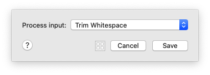

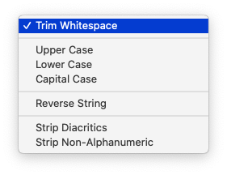

```plain
Trim Whitespace				修剪空白
Upper Case						大写
Lower Case						小写
Capital Case					大写案例
Reverse String				反向字符串
Strip Diacritics			带变音符号
Strip Non-Alphanumeric		带状非字母数字
```


**转换工具**

这个方便的实用程序可帮助您处理输入文本并设置其格式以适合您的需要，从而整理数据格式。


### Replace

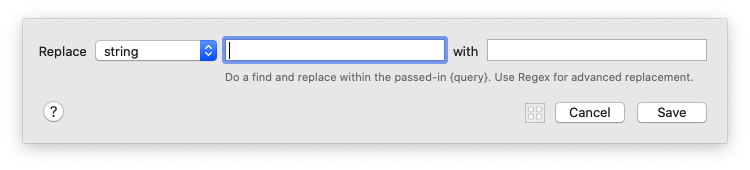

```plain
Do a find and replace within the passed-in {query}. Use Regex for advanced replacement.
在传入的{query}中进行查找和替换。 使用Regex进行高级替换。
```


### Random


```plain
A comma (or newline) separated list of words.
以逗号（或换行符）分隔的单词列表。

This can also contain the input {query} and {var:varname} variables.
它还可以包含输入{query} 和{var:varname}变量。
```


### [Hide Alfred](https://www.alfredapp.com/help/workflows/utilities/hide-alfred/)

**Hide Alfred实用程序**

防止Alfred隐藏在连接中时，此实用工具对象为您提供了更多控制权。

```plain
使用Hide Alfred实用程序
默认情况下，当您对结果进行操作（例如，按Return键执行所需的操作）时，Alfred将隐藏其窗口。

但是，在某些情况下，您可能会寻找不同的行为。例如，当链接输入对象时，可以在“ 连接的替代操作”配置中将窗口行为设置为“不关闭” 。

然后，您可能需要手动告诉Alfred在相关情况下隐藏；这是这个方便的小工具的来源。
```


### Show Alfred


```plain
Optional argument text to be shown in Alfred's text field. Use {query} to insert input.
可选参数文本将显示在Alfred的文本字段中。 使用{query}插入输入。
```


### JSON Config

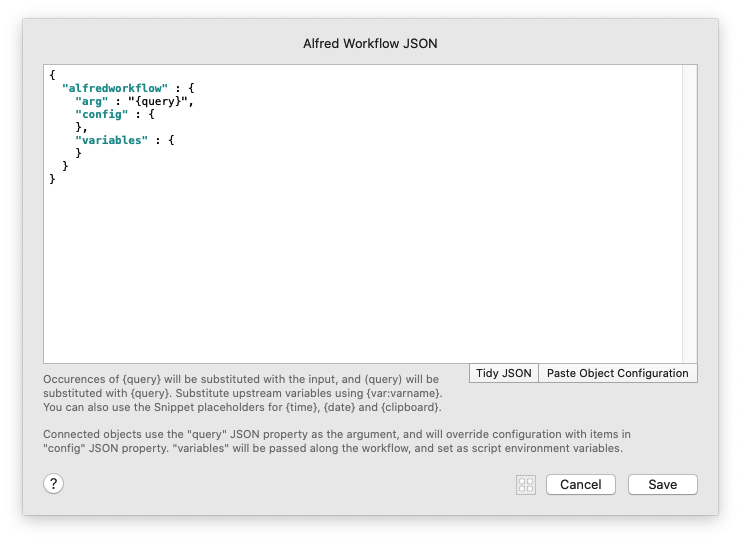


```plain
Occurences of {query} will be substituted with the input, and {query} will be substituted with {query}. Substitute upstream variables using {var:varname}.You can also use the Snippet placeholders for {time}, {date} and {clipboard}.
{query}的出现将被输入替换，而{query}将会被{query}替换。 使用{var：varname}替换上游变量。您还可以将代码段占位符用于{time}，{date}和{clipboard}。

Connected objects use the "query" JSON property as the argument, and will override configuration with items in "config" JSON property. "variables" will be passed along the workflow, and set as script environment variables.
连接的对象使用“查询” JSON属性作为参数，并将使用“ config” JSON属性中的项目覆盖配置。 “变量”将沿工作流传递，并设置为脚本环境变量。

TidyJSON 整齐的

Paste Object Configuration 粘贴对象配置
```

**JSON工具**

使用JSON对象通过Alfred工作流程修改数据/变量流，并动态修改附加对象的配置。

**JSON格式**

JSON格式应的内括`alfredworkflow`对象，和包含的组合`arg`，`config`或`variables`。

```json
{
  "alfredworkflow" : {
    "arg" : "{query}",
    "config" : {
    },
    "variables" : {
    }
  }
}
```


"arg"

该`arg`字符串设置了从JSON Utility中传递的参数，该参数用作对附加对象的查询。省略`arg`字符串将清除查询，而设置`arg`为`{query}`将通过查询。

"config"

通过该`config`对象，可以对连接到JSON Utility输出的工作流对象进行动态（并覆盖）配置。

找出对象可用的配置字段的最简单方法是从画布上所选工作流对象的右键单击弹出菜单中复制对象配置。例如，以下是“打开URL”工作流对象的复制配置：

```json
{
  "alfredworkflow" : {
    "config" : {
      "browser" : "",
      "spaces" : "",
      "url" : "{query}",
      "utf8" : true
    }
  }
}
```

仅包括的字段将被覆盖，从而允许对工作流程对象进行部分动态配置。

这些字段通常是不言自明的，但是如果您在识别字段时遇到困难，请在对象的配置表中将其设置为唯一值，然后再次复制配置。您将看到您设置的值。


"variables"

该`variables`对象允许设置新变量，并覆盖流变量。


包括动态占位符

JSON中的字段可以使用动态占位符。查看“ [动态占位符”页面](https://www.alfredapp.com/help/features/clipboard/dynamic-placeholders/)以了解更多详细信息。

**进阶JSON**

您是否知道可以通过[脚本操作](https://www.alfredapp.com/help/workflows/actions/run-script/)而不是JSON Utility 输出上述JSON ？

您在上面看到的JSON是通过Alfred工作流在内部传递的数据的本机，因此，通过在脚本中创建并输出它，您可以完全控制通过[Script Action](https://www.alfredapp.com/help/workflows/actions/run-script/)传递和传递的参数，配置和变量。


### Debug


```plain
Writes the specified text to the workflow debugger. Occurences of {query} will be substituted with the input. You can also substitute variables using {var:varname}, and dump all variables in the current stream with {allvars}. Use {config} do show overridden configuration.
将指定的文本写入工作流调试器。 {query}的出现将替换为输入。 您也可以使用{var：varname}替换变量，并使用{allvars}转储当前流中的所有变量。 使用{config}可以显示覆盖的配置。

Clear debugger text for this Workflow
清除此工作流程的调试器文本

If debugging, clear out text in Alfred's debug for this workflow. This is useful to select for a debug object at the beginning of a workflow.
如果进行调试，请为此工作流程清除Alfred调试中的文本。 在工作流开始时选择调试对象很有用。
```


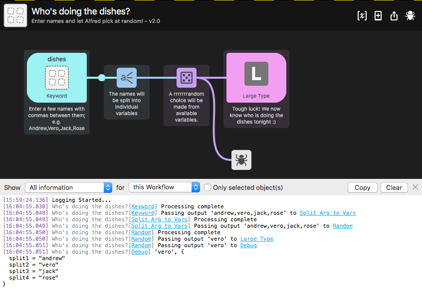

**调试器实用程序**

调试工作流对象可以连接到工作流中的任何其他对象。与[Debug Viewer](https://www.alfredapp.com/help/workflows/advanced/debugger/)一起使用，它可以帮助您解决工作流输出中的问题。

单击超链接的对象将在工作流画布中突出显示该对象，从而轻松可视化如何将输出从一个对象传递到下一个对象。

**使用调试器实用程序**

从实用程序对象中添加一个调试对象，并将其附加到要分析的对象之后。

接下来，单击工作流程右上方的错误图标，以切换工作流程底部的调试查看器。通过显示此查看器，您现在可以看到连接到调试对象的对象正在输出什么。

在Alfred 4中，您将看到所有工作流程中的并发调试，并过滤到各个工作流程和对象。alfredpreferences：用于突出显示的链接的URL方案意味着您可以在外部复制和使用这些链接。

在工作流之间切换并从“工作流”选项卡切换时，调试器保持启用状态，从而使您更轻松地继续工作，而不会失去思路。


**使用调试器的示例**

在第一个示例中，我将Debug实用程序附加到了紫色的[Random](https://www.alfredapp.com/help/workflows/utilities/random/)对象上，以在底部的调试查看器中查看它的输出。我可以将它附加到任何对象上

您可以通过选择从下拉菜单中记录“ *有趣的信息”*或“ *所有信息* ”，以及显示所有对象或仅针对选定对象的调试信息来修改视图，从而在需要时获得更精确的结果。


### [Conditional](https://www.alfredapp.com/help/workflows/utilities/conditional/)

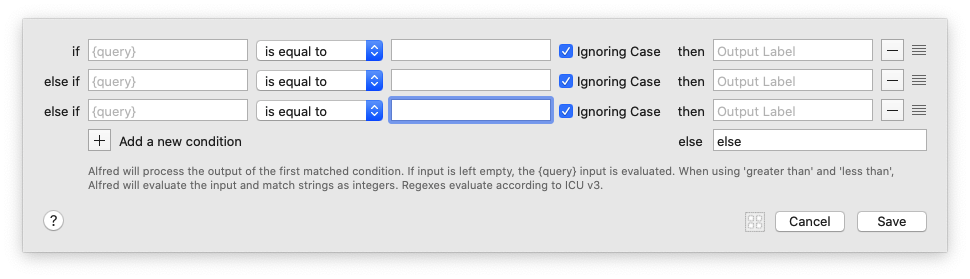

```plain
Alfred will process the output of the first matched condition. If input is left empty, the (query] input is evaluated. When using 'greater than' and 'less than',
Alfred will evaluate the input and match strings as integers. Regexes evaluate according to ICU v3.
Alfred将处理第一个匹配条件的输出。 如果输入为空，则将对（查询）输入进行评估。当使用“大于”和“小于”时，Alfred将评估输入并将字符串匹配为整数。正则表达式根据ICU v3评估。
```


注: Output Label 只是起到 注释的作用, 关键走哪个结果是按照连线决定的, fuck!!!

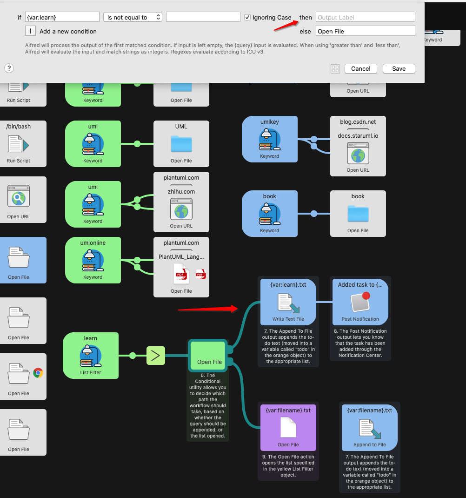


---

## Outputs
### [Post Notification](https://www.alfredapp.com/help/workflows/outputs/post-notification/)


```plain
The title and text you would like to output. Occurences of (query) will be substituted with the input. You can also substitute upstream variables into the output using (var:varname).

您要输出的标题和文本。 （query）的出现将替换为输入。 您还可以使用（var：varname）将上游变量替换为输出。

Only show this notification if the input isn't empty.
仅在输入不为空时显示此通知。

You can do basic filename based modifications to the input. Use Last path component to remove the file path, and Remove extension to remove the file type.
您可以对输入进行基本的基于文件名的修改。 使用“最后一个路径”组件删除文件路径，然后使用“删除扩展名”删除文件类型。
附加配置
如果对象的输入不为空，则可以选择仅显示“发布通知”。

如果您只想显示包含完整路径的输入中的文件名，请选中“最后路径组件”和/或“删除扩展名”复选框。

例如，〜/ Documents / myfiles / thisfile.txt的输入将显示为thisfile，而在Post Notification中没有路径或扩展名。
```


### [Large Type](https://www.alfredapp.com/help/workflows/outputs/large-type/)


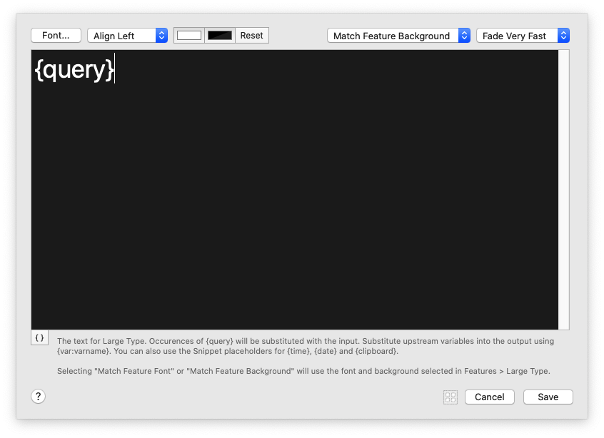


```plain
Match Feature Background 匹配特征背景
Fill the Screen  填满屏幕
Fit Background to Text  将背景与文本相匹配


The text for Large Type. Occurences of {query} will be substituted with the input. Substitute upstream variables into the output using {var:varname}. You can also use the Snippet placeholders for {time}, {date} and {clipboard}.
大字体的文本。 {query}的出现将替换为输入。 使用{var：varname}将上游变量替换为输出。 您还可以将代码段占位符用于{time}，{date}和{clipboard}。

Selecting "Match Feature Font" or "Match Feature Background" will use the font and background selected in Features > Large Type.
选择“匹配功能字体”或“匹配功能背景”将使用在“功能”>“大字体”中选择的字体和背景。
```


### Copy to Clipboard

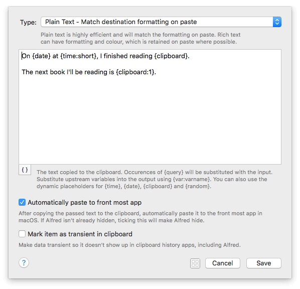


```plain
Plain Text - Match destination formatting on paste
纯文本-粘贴时匹配目标格式
Rich Text - Retain formatting on paste where possible
富文本格式-保留粘贴时的格式


Plain text is highly efficient and will match the formatting on paste. Rich text can have formatting and colour, which is retained on paste where possible.
纯文本非常高效，并且会与粘贴时的格式匹配。 富文本可以具有格式和颜色，并尽可能保留在粘贴中。

The text copied to the clipboard. Occurences of {query} will be substituted with the input. Substitute upstream variables into the output using {var:varname}. You can also use the dynamic placeholders for {time}, {date}, {clipboard} and {random}.
文本复制到剪贴板。 {query}的出现将替换为输入。 使用{var：varname}将上游变量替换为输出。 您还可以将动态占位符用于{time}，{date}，{clipboard}和{random}。

After copying the passed text to the clipboard, automatically paste it to the front most app in macOS. lf Alfred isn't already hidden, ticking this will make Alfred hide.
将传递的文本复制到剪贴板后，将其自动粘贴到macOS中最靠前的应用程序中。 如果Alfred尚未隐藏，请勾选此项将Alfred隐藏。

Make data transient so it doesn't show up in clipboard history apps, including Alfred.
使数据成为临时数据，这样它就不会出现在剪贴板历史记录应用程序（包括Alfred）中。
```


### Write Text File


```plain
Prefix the path with ~/ to write within the home folder, or specify an absolute file path. The resolved path is outputted from this object.

用〜/前缀路径以在主文件夹中写入，或指定绝对文件路径。 从该对象输出已解析的路径。

一句话: 写相对路径也行, 写绝对路径也行...
```


```plain
Adding a UUID is useful if you are creating a unique temporary file in /tmp. You can also, if necessary, create any non-existent parent folders before creating file.

如果要在/tmp中创建唯一的临时文件，则添加UUID很有用。 如果需要，您还可以在创建文件之前创建任何不存在的父文件夹。

Add UUID to filename 选项, 生成文件的时候会在, 给定的文件名后面写随机生成的UUID

像这样: alfred20200622-A90BCAA3-4044-4F6A-A19D-42AB54BAADD9.txt
```


```plain
Create intermediate folders if they don't exist

创建中间文件夹（如果不存在）
```

```
If the path is relative, e.g. 'output.txt', select where the file should be written. If using the workflow data folder, it's best to set the workflow Bundle ld to write to a unique folder.
如果路径是相对的，例如 'output.txt'，选择文件应写入的位置。 如果使用工作流数据文件夹，则最好将工作流Bundle ld设置为写入唯一的文件夹。


workflow's data folder 路径(这个是固定的)
~/Library/Application Support/Alfred 3/Workflow Data/com.stone.A-A-AAAAA/alfred20200622.txt
workflow's data folder 路径(这个是固定的) Alfred 4
~/Library/Application Support/Alfred/Workflow Data

workflow's folder 路径 (这个可以改)
~/soft/cloud_files/Alfred.alfredpreferences/workflows/user.workflow.6FBD66BB-51BD-4BFF-B635-443018963118/alfred20200622.txt
```

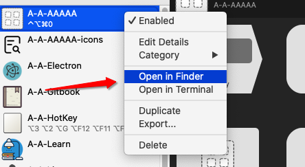

**一般推荐使用 workflow's folder 选项吧, 分享出的时候方便些…**

模板内容

```plain
The input text for writing to the file. Occurences of {query} will be substituted 用于写入文件的输入文本。 {query}的出现将被替换
with the input. Substitute upstream variables into the output using {var:varname}. 与输入。 使用{var：varname}将上游变量替换为输出
You can also use the Snippet placeholders for {time}, {date} and {clipboard}. 您还可以将代码段占位符用于{time}，{date}和{clipboard}
```

```plain
//                              /* {date:short} {time} */        
/************************************************************************************/ 
query = {query}
datetime = {datetime}
datetime:full = {datetime:full}
datetime:long = {datetime:long}
datetime:medium = {datetime:medium}
datetime:short = {datetime:short}
date = {date}
date:full = {date:full}
date:long = {date:long}
date:medium = {date:medium}
date:short = {date:short}
time = {time}
time:full = {time:full}
time:long = {time:long}
time:medium = {time:medium}
time:short = {time:short}

1 minute from now = {datetime +1m} 
1 hour from now = {datetime +1h} 
1 day from now = {datetime +1d} 
1 month from now = {datetime +1M} 
1 year from now = {datetime +1y} 
1 minute ago = {datetime -1m} 
1 hour ago = {datetime -1h} 
1 day ago = {datetime -1d} 
1 month ago = {datetime -1M} 
1 year ago = {datetime -1y} 
Tomorrow's date = {date +1d} 
Yesterday's full date = {date -1d:full} 
Tomorrow's day = {date +1d:EEEE} 
The year, 10 years ago = {date -10y:yyy} 
The day in 2 years, 3 months and a day = {date +2y +3M +1d:EEEE} 
The date and time in 1337 hours = {datetime +1337h} 
 
Clipboard Content = {clipboard}
Clipboard Content Lowercased = {clipboard:lowercase}
Clipboard Content Uppercased = {clipboard:uppercase}
Clipboard Content Capital Cased = {clipboard:capitals}
First Clipboard History ltem = {clipboard:0}
Next Clipboard History ltem = {clipboard:1}
10th Clipboard History ltem = {clipboard:10}
```


### [Play Sound](https://www.alfredapp.com/help/workflows/outputs/play-sound/)

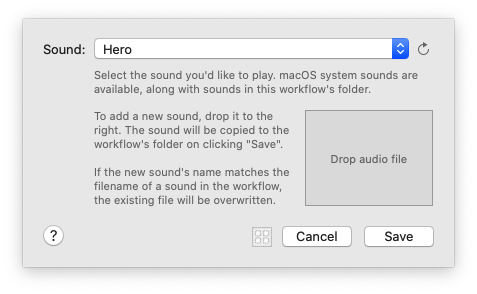


```plain
Select the sound you'd like to play. macOS system sounds are available, along with sounds in this workflow's folder.
选择您想要播放的声音。 macOS系统声音以及此工作流程文件夹中的声音均可用。

To add a new sound, drop it to the right. The sound will be copied to the workflow's folder on clicking "Save".
要添加新声音，请将其拖放到右侧。 单击“保存”后，声音将被复制到工作流程的文件夹中。

If the new sound's name matches the filename of a sound in the workflow, the existing file will be overwritten.
如果新声音的名称与工作流程中声音的文件名匹配，则现有文件将被覆盖。
```


想要一些很棒的自定义声音来帮助您入门吗？在[Alfred Labs](https://www.alfredapp.com/labs/)上免费下载Alfred Sound Bank，以获得32种独特声音的集合。:)


### Dispatch Key Combo


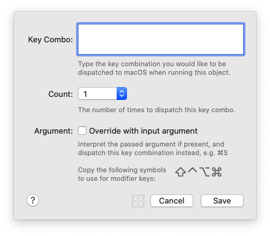


```plain
Type the key combination you would like to be dispatched to macOS when running this object.
输入运行此对象时要分派给macOS的组合键。

The number of times to dispatch this key combo.
分派此键组合的次数。

Interpret the passed argument if present, and dispatch this key combination instead, e.g. ⌘S
解释传递的参数（如果存在），然后分派此组合键，例如 ⌘s

Copy the following symbols to use for modifier keys: ⇧⌃⌥⌘
复制以下符号以用于修饰键：⇧⌃⌥⌘
```


**调度键组合输出**

使用此输出对象将按键组合分配给macOS。这对于在Mac上的特定应用程序中自动执行操作很有用。

在对象的配置面板中设置热键，然后单击“保存”。

您还可以设置要重复几次击键，例如连续三下按Tab键。


### [Call External Trigger](https://www.alfredapp.com/help/workflows/outputs/call-external-trigger/)

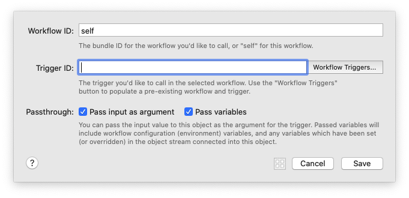


```plain
The bundle ID for the workflow you'd like to call, or "self" for this workflow.
您要调用的工作流程的捆绑ID，或此工作流程的“self”。

The trigger you'd like to call in the selected workflow. Use the "Workflow Triggers " button to populate a pre-existing workflow and trigger.
您要在所选工作流程中调用的触发器。 使用“工作流程触发器”按钮来填充预先存在的工作流程和触发器。

Pass input as argument  将输入作为参数传递
Pass variables  传递变量

You can pass the input value to this object as the argument for the trigger. Passed variables will include workflow configuration {environment} variables, and any variables which have been set (or overridden) in the object stream connected into this object.
您可以将输入值作为触发器的参数传递给此对象。 传递的变量将包括工作流配置{environment}变量，以及已在连接到该对象的对象流中设置（或覆盖）的任何变量。
```


**调用外部触发输出**

**为什么使用“呼叫外部触发器”？**

与以前使用AppleScript调用外部触发器的方式相比，它具有多个优点。

1. 通过不使用AppleScript，Alfred应用程序名称或版本没有外部依赖性。
2. 可以将“调用外部触发器”配置为在“自身”上调用外部触发器，这意味着不依赖当前的工作流程包ID。
3. 输入参数不仅可以传递给外部触发器，还可以传递给所有当前流变量。
4. 由于这些调用是根据任何其他工作流程流连接在内部直接进行的，因此性能显着提高。


---

## Paste

## Zoom In

## Zoom Out

---
## Options
### Show Configuration Sheet for Newly Added Objects
### Show Object Alignment Guides