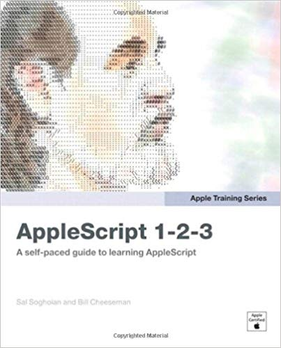

@(工作笔记)

# Applescript-record

[TOC]

---



```
/hello world/
---
```

---

## 删除引号
https://macscripter.net/viewtopic.php?id=33345

```applescript
Open this Scriplet in your Editor:
on run
   tell application "Microsoft Entourage"
       set contactList to the contacts
       repeat with nextContact in contactList
           my RemoveQuotesFromContact(nextContact)
       end repeat
   end tell
end run

on RemoveQuotesFromContact(someContact)
   tell application "Microsoft Entourage"
       set allEmailAddresses to every email address of someContact
       tell someContact
           -- remove double quotes
           set first name to my SearchReplace(first name, "\"", "")
           set last name to my SearchReplace(last name, "\"", "")
           set title to my SearchReplace(title, "\"", "")
           set nickname to my SearchReplace(nickname, "\"", "")
           repeat with thisContactEmail in allEmailAddresses
               --display dialog (first name & " " & last name & return & (contents of thisContactEmail)) as string
               --display dialog (my SearchReplace((contents of thisContactEmail) as string, "\"", ""))
               set newContactEmail to (my SearchReplace((contents of thisContactEmail) as string, "\"", "")) as string
               set contents of thisContactEmail to newContactEmail
           end repeat
           -- remove single quotes
           set first name to my SearchReplace(first name, "'", "")
           set last name to my SearchReplace(last name, "'", "")
           set title to my SearchReplace(title, "'", "")
           set nickname to my SearchReplace(nickname, "'", "")
       end tell
   end tell
end RemoveQuotesFromContact

on SearchReplace(sourceStr, searchString, replaceString)
   -- replace <searchString> with <replaceString> in <sourceStr>
   set searchStr to (searchString as text)
   set replaceStr to (replaceString as text)
   set sourceStr to (sourceStr as text)
   set saveDelims to AppleScript's text item delimiters
   set AppleScript's text item delimiters to (searchString)
   set theList to (every text item of sourceStr)
   set AppleScript's text item delimiters to (replaceString)
   set theString to theList as string
   set AppleScript's text item delimiters to saveDelims
   return theString
end SearchReplace
```

## 获取chrome 所有标签

```applescript
set titleString to ""
tell application "Google Chrome"
  set window_list to every window # get the windows
  repeat with the_window in window_list # for every window
    set tab_list to every tab in the_window # get the tabs

    repeat with the_tab in tab_list # for every tab
      set the_url to the URL of the_tab # grab the URL
      set the_title to the title of the_tab # grab the title
      set titleString to titleString & the_url & "@@" # concatenate
    end repeat
  end repeat

  set the_url to the URL of active tab of front window # grab the URL
  set the_title to the URL of active tab of front window # grab the title
  --  set titleString to titleString & "Active: " & the_url & " - " & the_title & "\n" # concatenate
  set titleString to titleString & the_url & "@@" # concatenate

  return titleString

end tell
```

---

##  Open many images in Preview from Terminal 
http://hints.macworld.com/article.php?story=20040514133013713

改良脚本, 直接使用applescript原生路径打开有权限问题...
参考: https://apple.stackexchange.com/questions/132544/mavericks-tell-application-preview-open-pdf-strange-permission-issue

```bash
#!/usr/local/bin/bash

if [[ -z "$*" ]]; then
    echo "使用方法: $0 [FILE(S)]"
    echo "example: $0 *.jpg"
    echo "example: $0 *.png"
    exit
fi

for file in $*; do
    if [[ -n "$FILES" ]]; then
        FILES="$FILES & POSIX file \"$PWD/$file\""
    else
        FILES="POSIX file \"$PWD/$file\""
    fi
done;

## 权限问题解决方法
#此问题是由Apple的预览沙盒（以及其他应用程序）引起的。如果您只是将字符串传递给打开，则预览不会获得访问PDF的权利。来自Apple的发行说明：
#
#兼容性说明
#
#将命令发送到沙盒应用程序（例如OS X Mountain Lion中的TextEdit）时，引用文件的参数必须是明确的类文件类型而不是裸字符串，否则目标应用程序将无法访问该文件。例如，文件“Macintosh HD：Users：me：sample.txt”，POSIX文件“/Users/me/sample.txt”或选择文件的结果都可以接受，但是字符串“/ Users / me / sample.txt“不会。
#
#为什么这适用于Downloads文件夹中的文件？当您手动打开文件时，应用程序将保留打开它的权利（例如，在“最近”中）。因此，如果您尝试已经打开的任何文件，可能会有效，但它不适用于新文件。
#
#要修复，请将代码更改为：
#
#tell application "Preview"
#activate
#open POSIX file "/Users/me/Desktop/test.pdf"
#end tell


#cat << EOF
#tell application "Preview"
#  activate
#  open $FILES
#end tell
#EOF

osascript << EOF
tell application "Preview"
  activate
  open ${FILES}
end tell
EOF
```