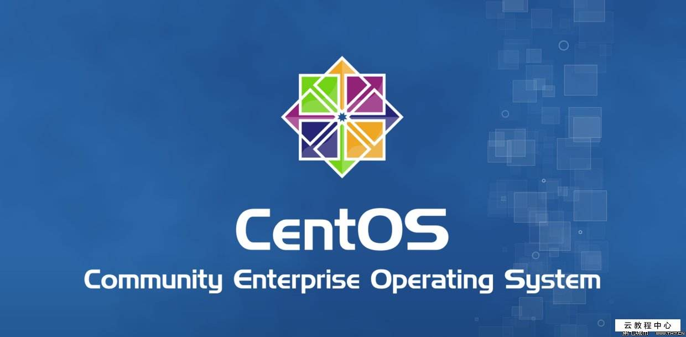
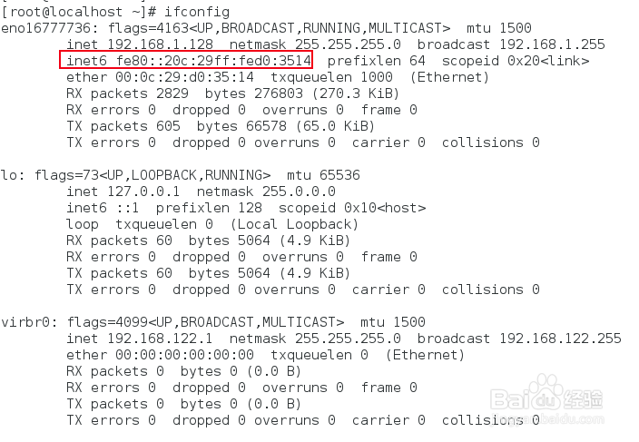
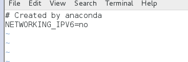
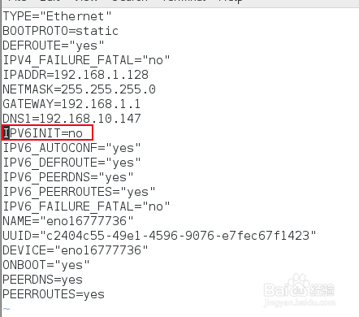
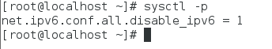
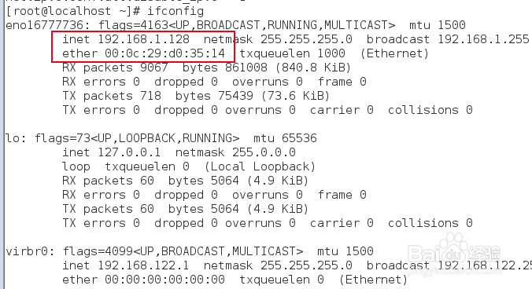
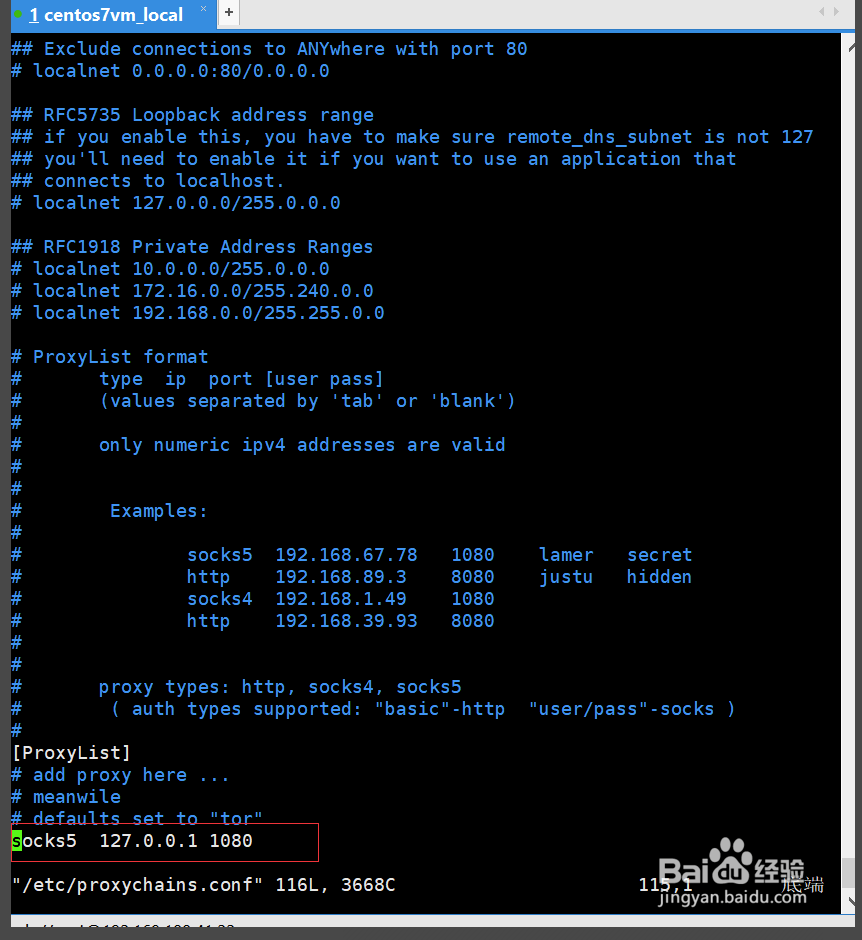

@(工作笔记)

# CentOS-record

[TOC]

---



---


## VMware下安装CentOS7无法上网解决办法
 
VMware虚拟机安装CentOS 7，使用NAT模式，CentOS不能连接到网络。

原因是Centos 7默认是不启用有线网卡的，需要手动开启。

操作步骤如下：

首先，打开终端。


```
cd /etc/sysconfig/network-scripts/  
```
ls 查看一下ifcfg-ens后面对应的数字是什么，以ens32为例

```
vi ifcfg-ens32  
```
编辑该文件
设置`ONBOOT=yes`
即开启自动启用网络连接
:wq 保存退出
service network restart   重启网络
这样CentOS就可以上网了！

---

## 安装wget

```bash
yum -y install wget
```

## CentOS 7 使用NVM管理nodejs

###1. 安装nvm

```bash
wget -qO- https://raw.githubusercontent.com/creationix/nvm/v0.34.0/install.sh | bash
```

会输出如下：
```
=> Downloading nvm as script to '/root/.nvm'

=> Appending nvm source string to /root/.bashrc
=> Appending bash_completion source string to /root/.bashrc
=> Close and reopen your terminal to start using nvm or run the following to use it now:

export NVM_DIR="$HOME/.nvm"
[ -s "$NVM_DIR/nvm.sh" ] && \. "$NVM_DIR/nvm.sh"  # This loads nvm
[ -s "$NVM_DIR/bash_completion" ] && \. "$NVM_DIR/bash_completion"  # This loads nvm bash_completion
```
提示信息可以看出，设置了环境变量， 需要刷新环境变量

```
source /root/.bashrc
```

验证环境变量是否生效

```
echo $NVM_DIR
```

输出了/root/.nvm说明已经OK
验证nvm安装是否成功

```
nvm --version
```

输出版本号说明nvm安装Ok

###2. 使用nvm安装nodejs

1. 安装nvm

```bash
wget -qO- https://raw.githubusercontent.com/creationix/nvm/v0.34.0/install.sh | bash

# 需重新打开一个终端
# 输入 nvm
# 看到版本信息就表示安装成功了
```

2. nvm 安装node

```bash
nvm install v8.15.0

nvm use v8.15.0
nvm alias default v8.15.0
node -v
```

3. 安装pm2

```bash
npm --registry=https://registry.npm.taobao.org install -g pm2
```

4. 制作cnpm

```bash
vim ~/.bashrc

alias cnpm="npm --registry=https://registry.npm.taobao.org \
--cache=$HOME/.npm/.cache/cnpm \
--disturl=https://npm.taobao.org/dist \
--userconfig=$HOME/.cnpmrc"
```
---

## 修改CentOS默认yum源为mirrors.aliyun.com

1、首先备份系统自带yum源配置文件/etc/yum.repos.d/CentOS-Base.repo

```
[root@localhost ~]# mv /etc/yum.repos.d/CentOS-Base.repo /etc/yum.repos.d/CentOS-Base.repo.backup
```

2、下载ailiyun的yum源配置文件到/etc/yum.repos.d/
CentOS7

```
[root@localhost ~]# wget -O /etc/yum.repos.d/CentOS-Base.repo http://mirrors.aliyun.com/repo/Centos-7.repo
```

CentOS6

```
[root@localhost ~]# wget -O /etc/yum.repos.d/CentOS-Base.repo http://mirrors.aliyun.com/repo/Centos-6.repo
```

CentOS5
```
[root@localhost ~]# wget -O /etc/yum.repos.d/CentOS-Base.repo http://mirrors.aliyun.com/repo/Centos-5.repo
```

3、运行yum makecache生成缓存
```
[root@localhost ~]# yum makecache
```

4、这时候再更新系统就会看到以下mirrors.aliyun.com信息
```
[root@localhost ~]# yum -y update
已加载插件：fastestmirror, refresh-packagekit, security
设置更新进程Loading mirror speeds from cached hostfile
* base: mirrors.aliyun.com
* extras: mirrors.aliyun.com
* updates: mirrors.aliyun.com
```


## centos7如何关闭ipv6

centos7上开启ipv6往往有些不太方便，有时走ipv4协议有时走ipv6协议，出现问题了将会很难排查。

而且还是内网机器，地址往往是够用的，没必要使用到ipv6。所以有时我们需要关闭机器的ipv6

1. 使用ifconfig命令查看网卡信息，如果出现inet6 fe80::20c:29ff:fed0:3514，说明机器开启了ipv6



2. 编辑/etc/sysctl.conf配置，增加net.ipv6.conf.all.disable_ipv6=1


3. 编辑/etc/sysconfig/network配置，增加 NETWORKING_IPV6=no，保存并退出



4. 编辑/etc/sysconfig/network-scripts/ifcfg-eno16777736，确保IPV6INIT=no，ifcfg-eno16777736是根据自己机器的
实际网卡信息来看，不是固定的



5. 关闭防火墙的开机自启动


```
systemctl disable ip6tables.service # 我这运行不了 什么鬼...
```

6. 执行sysctl -p或者reboot重启命令




7. 再次使用ifconfig进行验证，只剩下ipv4，ipv6消失了，关闭成功



---

## centos7 安装使用proxychains4

https://jingyan.baidu.com/article/148a1921f5c5fe4d71c3b105.html

简单记录下安装proxychains4的过程

安装git执行yum install git

安装make环境yum -y install gcc automake autoconf libtool make

下载proxychains4执行git clone https://github.com/rofl0r/proxychains-ng.git

生产配置文件

```
cd proxychains-ng  然后

./configure
```


编译安装make && sudo make install

提取配置文件cp ./src/proxychains.conf /etc/proxychains.conf

请理安装包cd .. && rm -rf proxychains-ng

编辑配置文件vim /etc/proxychains.conf



最后测试，测试成功


---

## CentOS 7安装配置Shadowsocks客户端

https://lamjack.github.io/2018/06/08/centos7-setup-shadownsocks-and-proxychains/

安装epel扩展源和pip

```
sudo yum -y install epel-release
sudo yum -y install python-pip
```

安装Shadowsocks客户端

```
pip install shadowsocks
```

配置Shadowsocks客户端
```
vi /etc/shadowsocks.json
```

添加如下配置：
```
{
	"server":"c15s3.jamjams.net",
	"server_port":20508,
	"local_address":"127.0.0.1",
	"local_port":1080,
	"password":"xxxxxx",
	"timeout":300,
	"method":"aes-256-cfb",
	"workers":1
}
```

参数说明：

```
server：Shadowsocks服务器地址
server_port：Shadowsocks服务器端口
local_address：本地IP
local_port：本地端口
password：Shadowsocks连接密码
timeout：等待超时时间
method：加密方式
workers:工作线程数
fast_open：true或false。开启fast_open以降低延迟，但要求Linux内核在3.7+。
```

开启方法:

```
echo 3 > /proc/sys/net/ipv4/tcp_fastopen
```

配置自启动

① 新建启动脚本文件/etc/systemd/system/shadowsocks.service，内容如下：
```
[Unit]
Description=Shadowsocks
[Service]
TimeoutStartSec=0
ExecStart=/usr/bin/sslocal -c /etc/shadowsocks/shadowsocks.json
[Install]
WantedBy=multi-user.target
```


② 启动Shadowsocks客户端
```
systemctl enable shadowsocks.service
systemctl start shadowsocks.service
systemctl status shadowsocks.service
```

关闭方法简单粗暴...
```
pkill sslocal
```

验证Shadowsocks客户端是否正常运行：

```
curl --socks5 127.0.0.1:1080 http://httpbin.org/ip
```

若Shadowsock客户端已正常运行，则结果如下：
```
{
  "origin": "10.10.10.10"       #你的Shadowsock服务器IP
}
```

---

## centos7中提升用户权限

```
提升用户权限我看网上资源有两种方法，一种是修改/etc/sudoers/文件将新增的用户权限提升为和root一样的权限，这种方法不知道怎么回事我没用应用成功，这里我介绍第二种方法，第二种方法是更改/etc/passwd/文件，修改方法如下：
```


将用户权限改为0就可以获得root权限

---

## centos7 防火墙关闭
```
//临时关闭
systemctl stop firewalld
//禁止开机启动
systemctl disable firewalld
```

## Centos系统如何设置固定IP
https://jingyan.baidu.com/article/6c67b1d65127692787bb1ef3.html

---

## Centos7 安装与卸载

```
 yum localinstall xxx.rpm

```

```
rpm -qpi google-chrome-stable_current_x86_64.rpm 

 yum remove google-chrome-stable
```

```
cloudera-manager-agent-5.1.0-1.cm510.p0.75.el6.x86_64.rpm is a filename. RPM files contain packages and you can query the details from the file by using rpm -qpi cloudera-manager-agent-5.1.0-1.cm510.p0.75.el6.x86_64.rpm and from that it tells you the package name and it's that that you need to tell yum to remove. In this case yum remove cloudera-manager-agent looks hopeful
```

---

## centos7 安装python3和pip3

centos7默认是安装的python2.7以及对于的pip

如果要使用python3并且保留python2请看以下步骤

sudo yum -y install epel-release

sudo yum install python34

下载好了python34，输入python3即可使用

安装pip3

sudo yum install python34-pip

输入pip3即可使用

---

## CentOS 7 安装 JAVA环境（JDK 1.8）
https://www.cnblogs.com/stulzq/p/9286878.html

---

## Linux系统查看系统是32位还是64位方法总结
https://www.cnblogs.com/kerrycode/p/3785768.html

## 在CentOS英文版中安装中文支持
https://ywnz.com/linuxjc/2382.html


## Ubuntu修改终端下的语言（中文或英文）
https://blog.csdn.net/BobYuan888/article/details/88662779

---

## centos7修改系统语言为简体中文
https://www.cnblogs.com/li5206610/p/7828618.html