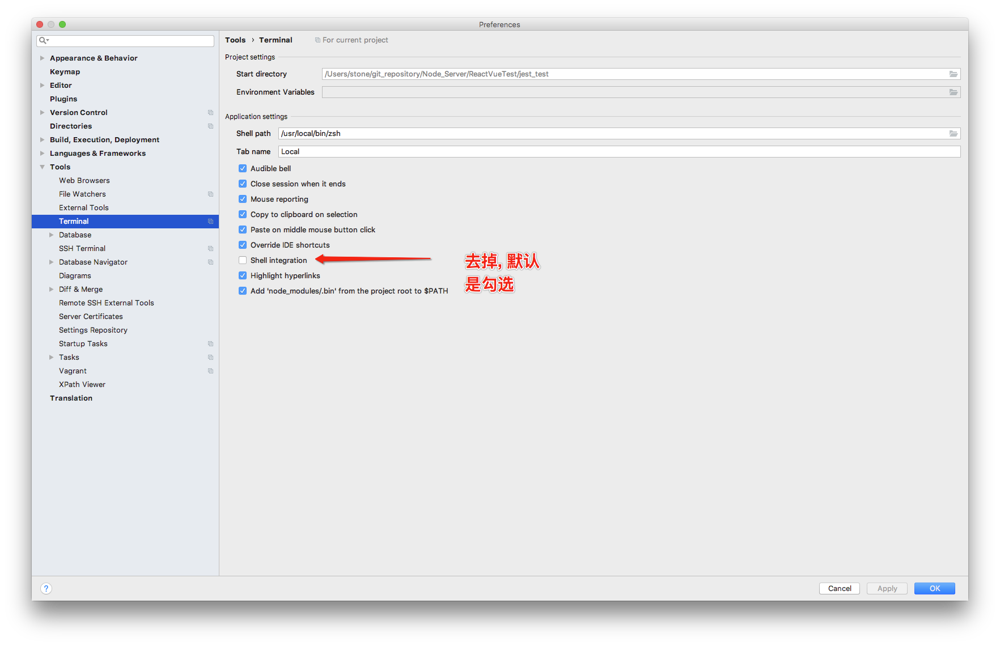
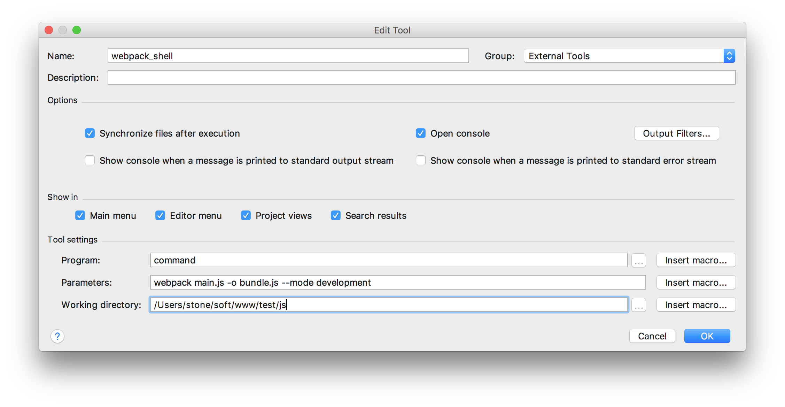
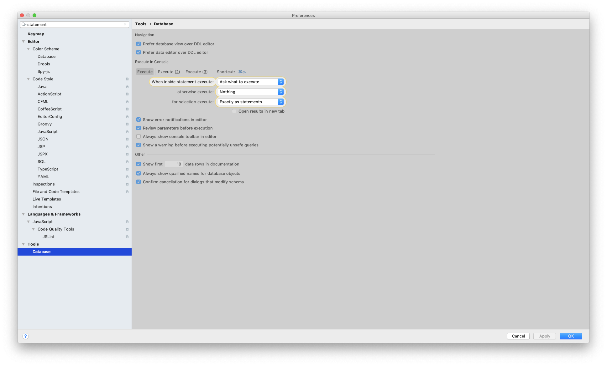
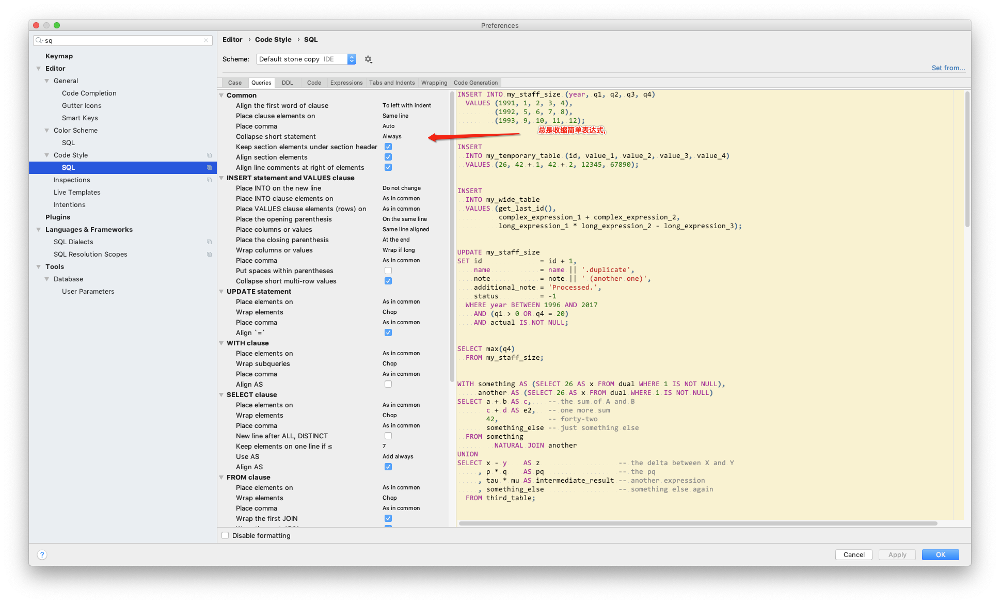
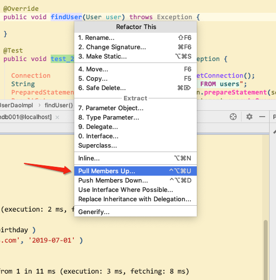
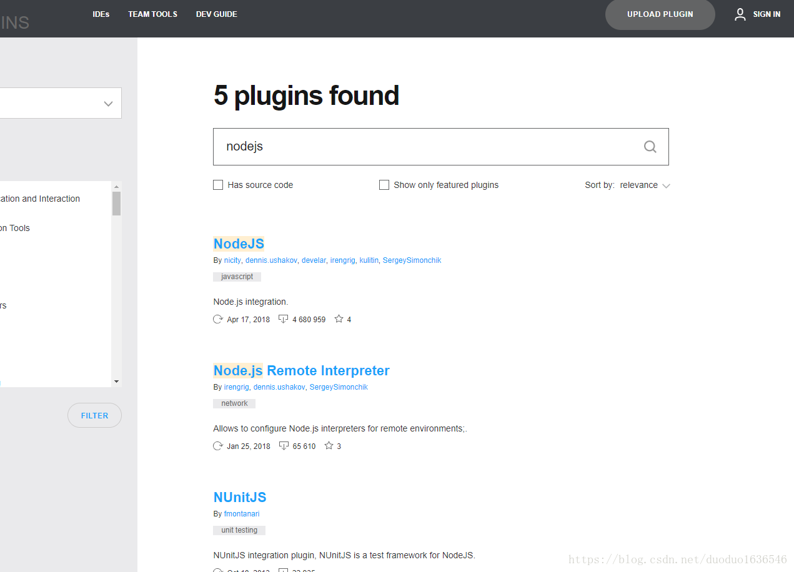
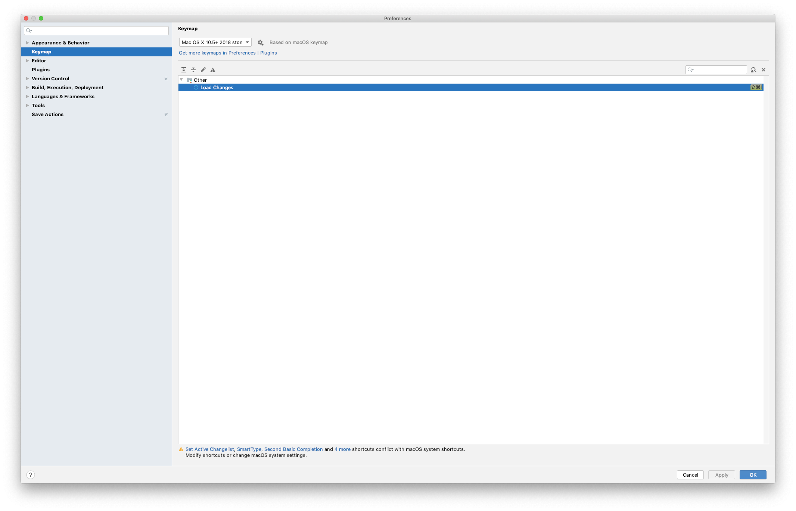
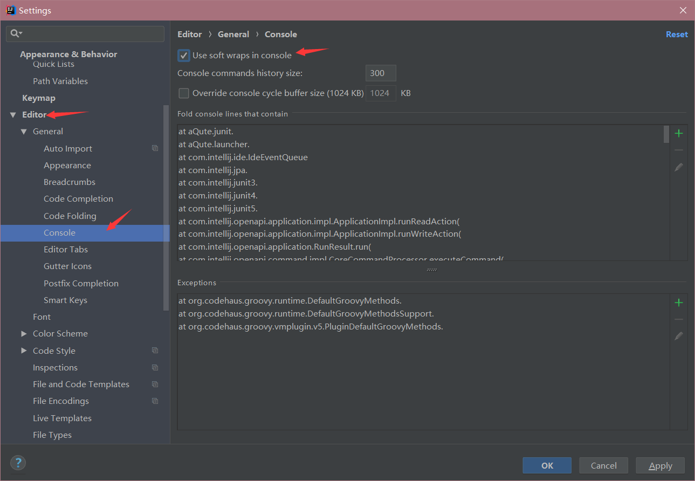
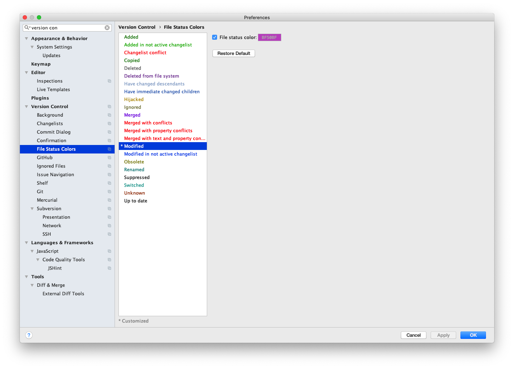

@(工作笔记)

# IntelliJ_IDEA-record

[TOC]

---

## 调整文本编辑器


## .zshrc未在Intellij中加载的tmux中找到
https://stackoverrun.com/cn/q/12802000



## IDEA 显示allocated heap size在哪里啊
https://segmentfault.com/q/1010000007260515


## webstorm使用stylus语法换行自动缩进


不知道其他代码是否会有影响

---

## ⌘+⇧+L outline 快速定位


---

## 激活2018版

https://blog.csdn.net/qq_35246620/article/details/79050895


## Before launch使用
参考:
https://stackoverflow.com/questions/15203498/intellij-idea-running-a-shell-script-as-a-run-debug-configuration


### 直接运行命令


### 运行shell脚本


---


## webstorm 去掉编辑区的白线

https://jingyan.baidu.com/article/e75057f2c3a2efebc91a8921.html


---
##
https://blog.csdn.net/kimbing/article/details/52829736

---

## webstorm什么快捷键可以选中多个相同的字符串？

https://segmentfault.com/q/1010000009886236


## Webstorm 设置 自动换行

https://blog.csdn.net/web_sunjing/article/details/77062285


---

## 开启自动上传


---

## 取消idea双击shift时出现的全局搜索
来回切换中英文输入法的时候，idea会弹出来一个搜索框，像下图那样，很不方便，现在要把那个弹出框禁用掉


 1、按ctrl+shift+a，弹出如下图的搜索框( mac 是 cmd+option+a)
 

 2、输入registry，然后按回车


3、找到“ide.suppress.double.click.handler”，将后面的复选框勾上
 

4、勾选上复选框后直接点击close，然后双击shift的时候就不会再出现全局搜索框了

该方法同样适用于WebStorm和GoLand

---

## 修改是否询问之后再执行



## SQL 关键


---

## SQL format

- Common 普遍的, 常见的
	- Align the first word of clause  从句的第一个词对齐
	- place clause elements on 将子句元素放在
	- place comma 逗号位置
	- collapse short statement 塌陷(무너짐)短语句
	- keep section elements under section header 将section元素保存在section标题下
	- align section elements 对齐section元素

- INSERT statement and VALUES clause 插入语句和值子句
	- Place INTO on the new line  将INTO放在新行上
	- Place INTO clause elements on 放置INTO子句元素
	- Place VALUES clause elements (rows) on  放置VALUES子句元素(在行上)
	- Place the opening parenthesis 放置左括号
	- Place columns or values 放置列或值
	- Place the closing parenthesis 放置右括号
	- Wrap columns or values 包裹列或值
	- Place comma 放置逗号
	- Put spaces within parentheses 在括号内加上空格
	- Collapse short multi-row values 折叠短多行值

---

## 类JavaLaunchHelper在两个地方实现

由于“此消息无害”（请参阅@ CrazyCoder的回答），一个简单而安全的解决方法是您可以通过IntelliJ IDEA设置在控制台中折叠此嗡嗡声消息：

【首选项】 - 【编辑】 - 【常规】 - 【控制台】 - 【包含控制台的折叠线】
当然，您可以使用【查找操作...】（cmd+shift+A在Mac上）并键入Fold console lines that contain以便更有效地导航。
加 Class JavaLaunchHelper is implemented in both


事实证明，在我的电脑上:( LGTM：b）


你可以展开消息再次检查它：


---

## 2019.1.3 
https://zhile.io/2018/08/17/jetbrains-license-server-crack.html

---

## 解决mysql java.sql.SQLException: The server time zone value‘XXXXXX' is unrecognized or represents...
解决java.sql.SQLException: The server time zone value ‘XXXXXX’ is unrecognized or represents more than one time zone.###

1.报错截图


使用的数据库是MySQL，驱动是6.0.3，这是由于数据库和系统时区差异所造成的，在jdbc连接的url后面加上serverTimezone=GMT即可解决问题，如果需要使用gmt+8时区，需要写成GMT%2B8，否则会被解析为空。再一个解决办法就是使用低版本的MySQL jdbc驱动，5.1.28不会存在时区的问题。

---

## idea中 在接口中如何直接跳转到该接口的是实现类中？


例如，我想跳转到UserInfoDao 这个接口的实现类中，操作如下：

把鼠标放到这个接口UserInfoDao 上面，右键，选择 GO To ，然后选择 Implementations,就可以直接跳转到 接口实现类中，或者直接把鼠标放到 接口上面，然后输入快捷键：Ctrl+Alt+B ，也可以跳转到实现类中。

---

## impl 中写的方法 , 快捷方式挪到接口中...


---

## idea安装插件plugin(主要针对网络连接不上的情况)

http://plugins.jetbrains.com/


敲重点！敲重点！敲重点！

选中你需要下载的版本，这边注意，可能与idea有版本兼容问题，建议下载最新版的idea

下载位置：idea解压文件夹下的plugins,我的目录:  E:\soft\IntelliJ IDEA 2018.1.2\plugins

下载之后无需解压！不要解压！


---

## 制作替身快捷键


---

## 数据库默认选择


---

## 解决phpstrom 启动卡的问题 和index索引加载慢的问题
https://www.cnblogs.com/zyyweb/p/9616092.html

第一，解决启动卡的问题

只要修改两个Java虚拟机参数，就彻底解决了卡的问题了。

操作步骤如下：

找到C:\Program Files\JetBrains\PhpStorm 2018.2.2\bin    安装目录下

1.找到phpstorm64.exe.vmoptions文件和phpstorm.exe.vmoptions文件，使用记事本打开。

2.添加以下两行代码：

```
-Dawt.usesystemAAFontSettings=lcd 
-Dawt.java2d.opengl=true 
```

3.保存退出。

思路：

phpstorm是使用JAVA开发的。由于IDE提供源文件关键字渲染功能，我们对文件的任何编辑或移动鼠标，都会触发渲染操作。而phpstorm默认的JAVA环境并没有利用机器的硬件加速技术去实现实时渲染，因此当然会让系统卡死。而只要在JAVA环境中让系统默认使用硬件加速，就可以解决占用系统资源过大，让phpstorm卡的问题了。

现在又可以使用回phpstorm的熟悉环境了。

 

第二解决索引问题：

哪个项目文件夹加载慢 就在哪个文件夹右键------>找到Mark Directory As---->Excluded（排除）这样索引加载就好些了

---

## 最新版 maven 自动导入包的选项没了...




以前的

现在


---

## DEA控制台换行



这个时候不需要重启，但是我们发现窗口还没有什么变化，只需要关掉console的窗口，重新开一个就可以看到换行的效果了

| 语法      |     说明 |
| :-------- | --------:|
| ${变量名#匹配规则}    |   从变量开头进行规则匹配 |


## MAC版本的IDEA，自己下载的插件都在哪个目录？
https://www.zhihu.com/question/265365107

## 破解 Markdown Navigator
https://github.com/CrazyBunQnQ/multimarkdown

---

## 使用 external tools 打开文件

https://www.jetbrains.com/help/idea/configuring-third-party-tools.html

1. Open IntelliJ IDEA -> Preferences
2. Select Tools -> External Tools
3. Enter a name and description for your tool.
4. Leave all fields default except for Parameters.


## intellij idea 如何安装本地插件
https://jingyan.baidu.com/article/3d69c5513e5953f0cf02d7b4.html

## 在 IDEA 中添加使用外部工具打开所选文件
https://www.dazhuanlan.com/2019/12/14/5df3c0b3f3faa/


## Windows Server 2003 R2 标准版/企业版永久激活序列号密钥
https://www.nocang.com/windows-server-2003-r2/

---


---

## IDEA控制台换行


---

## 版本控制修改颜色




---

## Surround with Live Template


---

## 展开imports , 不要缩


---


## **Tuning PhpStorm performance by editing custom VM options**

<https://riptutorial.com/phpstorm/example/17786/tuning-phpstorm-performance-by-editing-custom-vm-options>

#### phpstorm使用OpenGL提高速度

PhpStorm在执行大量检查时在大文件中可能会非常慢。加快PhpStorm的一种快速简便的方法是使用OpenGL进行渲染。以前在5000行文件中，在更改为刻度（或红色/黄色框）之前，会在右上角长时间显示“眼睛”符号。OpenGL之后，它几乎立即执行此操作。

**要启用OpenGL：**

打开： `path-to-phpstorm\bin\PhpStorm64.exe.vmoptions`

然后将这两行添加到其他行下面：

```
-Dawt.useSystemAAFontSettings=lcd 
-Dawt.java2d.opengl=true
```


---

## 插件路径

$HOME/Library/Application Support/JetBrains/IntelliJIdea2020.1/plugins


## sql注入 表报错问题


SQL Resolution  Scopes


## sql执行块 是否询问, 大块, 小块


---


mybatis中的 @Param 是什么意思??

```java
@Select("SELECT name,options FROM tb_spec WHERE template_id IN ( SELECT template_id FROM tb_category WHERE name = #{categoryName} )")
List<Map> findSpecListByCategoryName(@Param("categoryName") String categoryName);
```


spring中的 @RequestParam @PathVariable @RequestBody


```
@ControllerAdvice 又是个什么东西?
```

```
import org.springframework.web.bind.annotation.ControllerAdvice;
```


```
/**
 * 统一异常处理类
 */
@ControllerAdvice
public class BaseExceptionHandler {
	
    @ExceptionHandler(value = Exception.class)
    @ResponseBody
    public Result error(Exception e){
        e.printStackTrace();        
        return new Result(false, StatusCode.ERROR, "执行出错");
    }
}

```


---


## 选中变量 背景色 变粗 设置


<https://stackoverflow.com/questions/26352197/how-to-change-usage-highlight-color-in-intellij-idea>


---

## External Tools


---

jetbrains 付费插件破解 https://www.fuocu.cn/archives/jetbrains-crack/