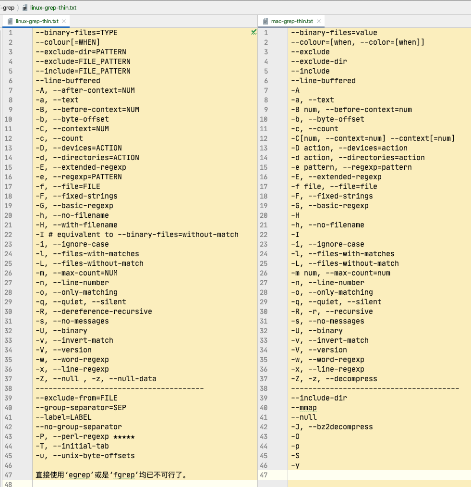
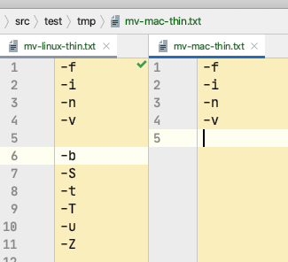

@(工作笔记)

# Linux-commands-record


[TOC]


---

## xargs 命令

[xargs 命令教程](https://www.ruanyifeng.com/blog/2019/08/xargs-tutorial.html)

[linux命令--xargs命令](https://www.cnblogs.com/kongzhongqijing/articles/5251838.html)


### -0
```
用法, 应用场景: 文件名中带有空格和特殊符号的时候, bash 默认用空格切割, 文件名会乱套
```

```bash
find . -iname "*.mp4" -print0 | xargs -0 -I @ echo "@"
```


### -E

```
# -E
# 设置xargs读入参数时的结束标识，以逗号结束。这里要注意结束标志必须要是单独的字段，即以空格或者换行符分隔的字段。
# -e flag ，注意有的时候可能会是-E，flag必须是一个以空格分隔的标志，当xargs分析到含有flag这个标志的时候就停止。
# (空格, tab)分割完之后 遇到指定的元素就会结束
```

```bash
echo "aaa   bbb ccc     ddd" | xargs -E 'bbb' echo
```


### -I

```plain
-i 或者是-I，这得看linux支持了，将xargs的每项名称，一般是一行一行赋值给{}，可以用{}代替。
#注意，-I 必须指定替换字符　－i 是否指定替换字符-可选
#find . | xargs -I {} cp {} $D_PATH
#与
#find . | xargs -i cp {} $D_PATH
#
#注意：cshell和tcshell中，需要将{}用单引号、双引号或反斜杠，否则不认识。bash可以不用。
#find /shell -maxdepth 2 -name a -print | xargs -t -i sed -i '1 i\111' ‘{}‘
```

```bash
find . -iname "*.mp4" -print0 | xargs -0 -I @ echo "@"
```


### -L

```plain
-L  从标准输入一次读取num行送给Command命令 ，-l和-L功能一样
```


```bash
content=`cat << EOF
当你老了，头发花白，睡意沉沉，
倦坐在炉边，取下这本书来，
慢慢读着，追梦当年的眼神
你那柔美的神采与深幽的晕影。4行结束
多少人爱过你昙花一现的身影，
爱过你的美貌，以虚伪或真情，
惟独一人曾爱你那朝圣者的心，
爱你哀戚的脸上岁月的留痕。8行结束
在炉罩边低眉弯腰，
忧戚沉思，喃喃而语，
爱情是怎样逝去，又怎样步上群山，
怎样在繁星之间藏住了脸。12行结束
EOF`

echo "${content}" | xargs -L 4 echo
```


### -n

```
# -n num 后面加次数，表示命令在执行的时候一次用的argument的个数，默认是用所有的。
```

```bash
echo "${content}" | xargs -n 4 echo "读取4个参数就打印:"
```


### -p

```plain
-p 操作具有可交互性，每次执行comand都交互式提示用户选择，当每次执行一个argument的时候询问一次用户, 
能当debug来用...再符合条件的地方就等待了...
```

```bash
echo "${content}" | xargs -p -L 4 echo "4行打印: "
```

### -P

```
-P 修改最大的进程数，默认是1，为0时候为as many as it can 。
```


### -s

```plain
# -s num xargs后面那个命令的最大命令行字符数(含空格) | 没什么软用
```

```bash
echo "${content}" | gxargs -s 4096 echo
```


### -x

```
-x exit的意思，如果有任何 Command 行大于 -s Size 标志指定的字节数，停止运行 xargs 命令，-L -I -n 默认打开-x参数，主要是配合-s使用
```


### -t

```plain
-t 表示先打印命令，然后再执行。
能用来做DEBUG
```


```bash
echo "${content}" | xargs -t -n 4 echo "读取4个参数就打印:"
```


---

**以上mac和linux的xargs都有的参数**


### mac参数

### -J

```plain
BSD 版 xargs 与 GNU 版有一个显著的不同——它支持-J选项。

比如说，你使用 find 命令得到了一个文件列表。你要将它们传递给一个叫concat_files的程序来处理后生成一个指定的新文件，比如：

concat_files file1 file2 file3 output
而且，这个命令不像 cp 或者 mv 那样，有个-t参数来把目标文件放到不定长的文件列表之前。总之呢，你不得不构建一行命令，它的中间部分是你会从管道传过去的文件列表。而 GNU xargs 要么全给你放末尾（默认），要么每项执行一次命令（指定-I时）。而 BSD xargs 则可以用-J选项指定一个占位符，使用这个占位符指明参数插入的位置：

find ... | xargs -J % concat_files % output
```


### -o

### -R


### linux参数

### -r

```plain
-r  no-run-if-empty 如果没有要处理的参数传递给xargs, xargs 默认是带 空参数运行一次，如果你希望无参数时，停止 xargs，直接退出，使用 -r 选项即可，其可以防止xargs 后面命令带空参数运行报错。
```
### -a 
```plain
-a file 从文件中读入作为sdtin
```

```bash
gxargs -a test.txt echo
```


### -d

```plain
-d delim 分隔符，默认的xargs分隔符是回车，argument的分隔符是空格，这里修改的是xargs的分隔符
```

```bash
echo "aaa@ bbb ccc@ ddd" | gxargs -d '@' -t echo
```


### -e [END], --eof[=END] | 和-E一样

### -i 或者是-I，这得看linux支持了，将xargs的每项名称，一般是一行一行赋值给{}，可以用{}代替。

### -l 和 -L功能一样


### --show-limits

<https://unix.stackexchange.com/questions/279742/what-is-the-meaning-of-xargs-show-limits-output>

```plain
上面写着：“我们可以实际使用的最大命令长度”是可能的最大命令行长度，这取决于xargs运行平台的限制以及环境所占用的空间。该值仅取决于平台配置和环境。“我们实际上正在使用的命令缓冲区的大小”是此调用xargs正在使用的大小。它不能大于最大值，但可以小于最大值。默认情况下，xargs不使用最大值，而是在编译时确定并由平台限制（通常为128 kB）限制的“合理”默认值。可以使用该-s选项更改实际使用的大小。
```


###  --process-slot-var

```
# --process-slot-var= 环境变量名称在每个正在运行的子进程中
# 将环境变量环境变量名称设置为唯一值。每个值都是一个十进制整数。一旦子进程退出，值将被重用。例如，这可以用于基本的负载分配方案。 
```

```bash
#   echo {1..9} | gxargs -n2 -P2 --process-slot-var=index bash -c 'echo "$index" "$@" "$$"'
#   echo {1..9} | gxargs -t -n2 -P2 --process-slot-var=index bash -c 'echo "$index" "$@" "$$"'
echo {1..9} | gxargs -n2 -P2 --process-slot-var=index bash ./sub.sh "${index}"
```


---


## col 命令

```plain
Linux col命令用于过滤控制字符。

在许多UNIX说明文件里，都有RLF控制字符。当我们运用shell特殊字符">"和">>"，把说明文件的内容输出成纯文本文件时，控制字符会变成乱码，col指令则能有效滤除这些控制字符。
```


看文档可能方便些...


**参数**：

- -b 过滤掉所有的控制字符，包括RLF和HRLF。
- -f 滤除RLF字符，但允许将HRLF字符呈现出来。
- -x 以多个空格字符来表示跳格字符。
- -l<缓冲区列数> 预设的内存缓冲区有128列，您可以自行指定缓冲区的大小。


```bash
#!/usr/bin/env bash

function entry {
    #  man $1 | col -x

    if [[ ! -n "$1" ]]; then
      echo -e "\033[0;31;1m请传入command\033[0m"
    else
      d_path="~/Desktop/$1.txt"
      man $1 | col -b > "${d_path}"
      open "${d_path}"
    fi
}

function main {
    entry "$@"
#    entry "col"
}

main "$@"
```


---

## comm 命令

```plain
Linux comm 命令用于比较两个已排过序的文件。

这项指令会一列列地比较两个已排序文件的差异，并将其结果显示出来，如果没有指定任何参数，则会把结果分成 3 列显示：第 1 列仅是在第 1 个文件中出现过的列，第 2 列是仅在第 2 个文件中出现过的列，第 3 列则是在第 1 与第 2 个文件里都出现过的列。若给予的文件名称为 - ，则 comm 指令会从标准输入设备读取数据。
```

**参数**：

- -1 不显示只在第 1 个文件里出现过的列。
- -2 不显示只在第 2 个文件里出现过的列。
- -3 不显示只在第 1 和第 2 个文件里出现过的列。
- --help 在线帮助。
- --version 显示版本信息。


文件比较, 找出重复的时候用


```bash
comm -12 aaa.txt bbb.txt
```

```plain
# 输出的第一列只包含在 aaa.txt 中出现的列，第二列包含在 bbb.txt 中出现的列，第三列包含在 aaa.txt 和 bbb.txt 中都包含的列。各列是以制表符 \t 作为定界符。
```


## csplit 命令

```plain
用法：csplit [选项]... 文件 格式...
按照指定的格式将文件分块为"xx00"、"xx01"...并输出。
同时每个分块文件的字节数也将被输出到标准输出。


长选项必须使用的参数对于短选项时也是必需使用的。
  -b, --suffix-format=格式	使用sprintf 格式代替%02d
  -f, --prefix=前缀		使用指定前缀代替"xx"
  -k, --keep-files		不移除错误的输出文件
  -n, --digits=数位		使用指定的进制数位代替二进制
  -s, --quiet, --silent	不显示输出文件的尺寸计数
  -z, --elide-empty-files	删除空的输出文件
      --help		显示此帮助信息并退出
      --version		显示版本信息并退出


如果文件为"-"，则读取标准输入。每个"格式"可以是：


  整数			不包括指定的行，并以其为文件分块边界
  /表达式/[偏移量]	不包括匹配到的行，并以其为文件分块边界
  %表达式%[偏移量]	预先跳过匹配的行数，以其为文件分块边界
  {整数}		将之前指定的模式重复指定的次数
  {*}			将之前指定的模式重复尽可能多的次数。


一个行的偏移量需要在正整数值之后声明"+" 或 "-"。
```

example:
```bahs
#!/usr/bin/env bash

csplit testfile.txt /free/5

echo -e "\033[0;32;1m=============================================\033[0m"

cat xx00

echo -e "\033[0;32;1m=============================================\033[0m"

cat xx01
```


---

## grep 命令




## [grep 中文手册](https://blog.csdn.net/nixawk/article/details/24235239)


### --binary-files

```plain
# --binary-files
# --binary-files=value参数来进行控制，value可选值及含义为：
#
# binary(默认参数): 对二进制文件进行匹配但是不输出结果；
# without-match: 不对二进制文件进行匹配；
# text: 将所有文件当作文本文件进行匹配，这与-a参数的控制行为一致。
# -a, --text         相当于---binary-files=text
# mac
# Controls searching and printing of binary files.  Options are
#	     binary, the default: search binary files but do not print them;
#	     without-match: do not search binary files; and text: treat all
#	     files as text.
# 控制二进制文件的搜索和打印。
# binary(默认): 搜索二进制文件，但不打印它们；
# without-match：不要搜索二进制文件; 将所有文件视为文本。
# text(Linux独有,Mac没有): 将所有文件当作文本文件进行匹配，这与-a参数的控制行为一致。
# --binary-files=without-match 和 -I 一样
```

example:

```bash
grep -a '巫妖王' ${file} # 二进制
grep -a 0 abc.mp3 # 二进制文件也看成 text文件 并且打印出来
grep --binary-files=without-match 0 abc.mp3
grep -I 0 abc.mp3
```


### --color[=WHEN] 或者 --colour[=WHEN]

 

```plain
使用标记突出显示匹配的字符串；
```

```bash
grep -I --color=always '巫妖王' ${file} # 二进制
echo -e "\033[0;32;1m=============================================\033[0m"
grep -I --colour=always '巫妖王' ${file} # 二进制
```


### --exclude

```plain
跳过匹配FILE_PATTERN的文件和目录
```

example

```bash
    grep "hello" -rIin --exclude="*shell-record.md" \
    --exclude="*Swift-record.md" \
    --exclude="*ECMAScript_6-record.md" \
    --exclude="*python-record.md" \
    --exclude="*React-record.md" \
    --exclude="*Objective-C-record.md" \
    --exclude="*vue-record.md" \
    --exclude="*Linux-commands-record.md" \
    --exclude="*Applescript-record.md" \
    --exclude="*BigData-record.md" \
    ${dir}
```


### --exclude-dir 与PATTERN匹配的目录将被跳过。

```bash
   grep "hello" -rIin \
    --exclude-dir="shell-record" \
    --exclude-dir="Swift-record" \
    --exclude-dir="ECMAScript_6-record" \
    --exclude-dir="python-record" \
    --exclude-dir="React-record" \
    --exclude-dir="Objective-C" \
    --exclude-dir="vue-record" \
    ${dir}
```


### --include=FILE_PATTERN  只搜索与FILE_PATTERN匹配的文件

```bash
grep "hello" -rIin \
--include="*shell-record.md" \
--include="*Objective-C-record.md" \
${dir}
```


### --line-buffered
```plain
# --line-buffered       每行输出清空
# --line-buffered       Force output to be line buffered.	By default, output is line buffered when standard output is a terminal and block buffered otherwise.
# --line-buffered       强制输出进行行缓冲。 默认情况下，当标准输出为端子时，输出为行缓冲，否则为块缓冲
# --line-buffered选项导致grep使用行缓冲区，这意味着每次看到换行符时就写入输出，而不是等待默认情况下达到4096字节。但是在这种情况下，您根本不需要grep，只需使用tail+ sed：
# tail -f <file> | sed '/string/s/stuff//g' >> output.txt
```


### -A

```
# -A, --after-context=NUM   打印以文本结尾的NUM 行
# -A num, --after-context=num
#       Print num lines of trailing context after each match.  See also the -B and -C options.
```

```bash
#   grep --color=always -A 10 "天气" ./abc.txt # 从匹配到的行开始往后再打印10行
#   grep --color=always -B 10 "天气" ./abc.txt # 从匹配到的行开始往前再打印10行
   grep --color=always -C 10 "天气" ./abc.txt # 从匹配到的行开始前后再打印10行
```


### -a, --text        搜索的文件全都视为 文本文件
### -b, --byte-offset 输出的同时打印字节偏移
### -c, --count 匹配到几个


```bash
   grep --color=always -c "天气" ./abc.txt # 匹配到几个
   grep --color=always -a "天气" ./abc.txt # 搜索的文件全都视为 文本文件
   echo -e "\033[0;32;1m=============================================\033[0m"
   grep --color=always -b "天气" ./abc.txt # 输出的同时打印字节偏移
```


###  -D

```plain
# -D, --devices=ACTION      how to handle devices, FIFOs and sockets;  如何处理设备、FIFO和套接字
# ACTION is 'read' or 'skip'
```


### -d

```plain

# -d, --directories=ACTION  how to handle directories;  如何处理目录；
#                            ACTION is 'read', 'recurse', or 'skip'
# -d action, --directories=action
# Specify the demanded action for directories.
# It is `read' by default, which means that the directories are read in the same manner as normal files.
# Other possible values are `skip' to silently ignore the directories,
# and `recurse' to read them recursively, which has the same effect as the -R and -r option.
#
# 指定目录所需的操作。 默认情况下是`读取的，这意味着目录的读取方式与正常文件相同。 其他可能的值`是跳过“以忽略目录，并`递归”以递归读取它们，这与-R和-r选项具有相同的效果。

```

```bash
    # grep "hello" -d recurse -Iin  ${dir} # 通递归 效果相同
    # grep "hello" -rIin  ${dir}
    path=/Users/stone/git_repository/snbook_edit/*
    grep 'console' -d skip -Iin  $path # 这路径写通配符的时候 不能使用双引号和单引号???
    # 这样可以在一级目录上搜索了..., -r 得无线递归...话说 grep 没有控制 层数的参数吗?
    #    grep -d skip '/root:/bin/bash' /etc/*
```


---


### -E 和 -e

```plain
# -E, --extended-regexp     PATTERN 是一个可扩展的正则表达式(缩写为 ERE)
# -e, --regexp=PATTERN      用 PATTERN 来进行匹配操作
#   基本与扩展正则表达式
#   在基本的正则表达式的元字符?，+，{，|，(，和)失去了特殊的意义; 改用反斜杠的版本\?，\+，\{， \|，\(，和\)。
#   传统脚本egrep不支持{ 元字符，而某些 egrep 实现则支持它\{，因此可移植脚本应避免{使用 grep -E模式，并[{]应用于匹配文字{。
#   GNU grep -E尝试通过假设{ 不特殊（如果它是无效间隔规范的开始）来支持传统用法。
#   例如，该命令 grep -E '{1' 搜索两个字符的字符串， {1 而不是在正则表达式中报告语法错误。POSIX.2允许将此行为作为扩展，但可移植脚本应避免这种情况。
#
#   手册页中有关{元字符的部分虽然专门讨论了您所看到的差异。
#
#   grep -e "[0-9]{3}-[0-9]{3}-[0-9]{4}"
#   无法正常工作，因为它没有{按预期方式对待角色。鉴于
#
#   grep -E "[0-9]{3}-[0-9]{3}-[0-9]{4}"
#   这样做是因为这是扩展的grep版本-或egrep例如版本。
```

```bash
	 # grep -E --color=always "解决方法" -rIin ${dir}
   # grep -E --color=always "(?<!安全)解决方法(?!是)" -rIin ${dir}
   ggrep -P --color=always "(?<!安全)解决方法(?!是)" -rIin ${dir} # Linux有perl 正则... 真好
```


### -f, --file=FILE           从 FILE 中取得 PATTERN

```bash
   grep -E --color=always -f ./regex.txt -rIin ${dir} # 
   ggrep -P --color=always -f ./零宽断言.txt -rIin ${dir} # Linux有perl 正则... 真好
```


### -F, --fixed-strings       PATTERN 是一组由断行符分隔的定长字符串。 失去正则功能, 原样输出, 找特殊符号的时候方便些

```bash
grep -F --color=always "***" -rIin ${dir}
```


### -G, --basic-regexp        PATTERN 是一个基本正则表达式(缩写为 BRE)

```bash
grep -G --color=always "[0-9]\{2,3\}" -rIin ${dir}
```


### -H 和-h

```plain
#  -H, --with-filename       为每一匹配项打印文件名
#  -h, --no-filename         输出时不显示文件名前缀
#  -H  Always print filename headers with output lines. #  总是用输出行打印文件名头。
#  -h, --no-filename Never print filename headers (i.e. filenames) with output lines.
```

```bash
   grep -G -h --color=always "[0-9]\{2,3\}" -rIi ${dir}
   echo -e "\033[0;32;1m=============================================\033[0m"
   grep -G -H --color=always "[0-9]\{2,3\}" -rIi ${dir}
```


### -I 和 -i

```plain
# -I # equivalent to --binary-files=without-match , 跳过二进制文件
# -i, --ignore-case , 忽略大小写
```

```bash
grep --color=always "hello" -rIi ${dir}
```


### -L 和 -l

```plain
# -L, --files-without-match print only names of FILEs containing no match ,跳过二进制
# -l, --files-with-matches  print only names of FILEs containing matches , 二进制也包括?
#      -L, --files-without-match
#	     Only the names of files not containing selected lines are written to standard output.  Pathnames are listed once per file searched. If the standard input is searched, the string ``(standard input)'' is written.
# 只有不包含选定行的文件名被写入标准输出。 每个搜索的文件列出一次路径名。 如果搜索标准输入，则写入字符串``(标准输入。
#
#     -l, --files-with-matches
#	     Only the names of files containing selected lines are written to standard output.  grep will only search a file until a match has been found, making searches potentially less expensive.  Path- names are listed once per file searched.  If the standard input is searched, the string ``(standard input)'' is written.
#  只有包含选定行的文件名被写入标准输出。 Grep只会搜索一个文件，直到找到匹配，这使得搜索可能不那么昂贵。 每个文件搜索一次列出路径名称。 如果搜索标准输入，则写入字符串``(标准输入。
```

```bash
grep -L 0 -r  . # 找没有匹配的文件 输出文件名
   grep -l 0 -r  . # 找匹配到的文件 输出文件名
```


### -m 和 -n 

```
# -m, --max-count=NUM       NUM 次匹配后停止
# -n, --line-number         输出的同时打印行号
```


```bash
   grep hello -r -m 10  .
   echo -e "\033[0;32;1m=============================================\033[0m"
   grep hello -rn  .
```


### -o 和 -q

```plain
#   -o, --only-matching
#   -q, --quiet, --silent
#   -o, --only-matching       show only the part of a line matching PATTERN  只显示匹配PATTERN的行的部分
#   -q, --quiet, --silent     suppress all normal output  抑制所有正常输出	
```

```bash
grep --color=always -rIi -H -o "hello.*" ${dir}
grep --color=always -rIi -H -o -q "hello.*" ${dir} # -q 是为了$? 这个而存在的吗?
```


### -s, --no-messages suppress error messages  抑制错误消息

```bash
grep --color=always "hello" -HIinsr  $dir
```


### -v 和 -w 和 -x

```
# -v, --invert-match 反向匹配, 即过不匹配
# -w, --word-regexp         强制 PATTERN 仅完全匹配字词
# -x, --line-regexp         强制 PATTERN 仅完全匹配一行
```

```bash
#   grep --color=always -v "hello" -HIinsr  ${dir}
#   grep --color=always -w "option" -HIinsr  ${dir} # 一次词表示 前后要有空格?
#   grep --color=always -x ".*option.*{$" -HIinsr  ${dir} # 一行匹配需要写完整
```


### -Z 没看懂… 一个 0 字节的数据行，但不是空行


## linux独有 grep 参数


### --exclude-from=FILE

```plain
--exclude-from=FILE skip files matching any file pattern from FILE #  跳过与文件模式匹配的文件
```

```bash
ggrep 'hello' -HIrin --exclude-from="Alfred-record"  ${dir} # 必须存在且不能模糊匹配, 这有个屁用
```

### --group-separator=SEP

```plain
# --group-separator
# --group-separator=string 使用'-A','-B','-C'参数时，使用string代替默认的'--'分割线
# --group-separator=$'■■■'
```

```bash
ggrep -C10 --color=always --group-separator=$'■■■' '天气' abc.txt
```


### --label=LABEL

```plain
# --label=LABEL         将LABEL 作为标准输入文件名前缀
```

```bash
cat a.txt | ggrep --label=hello -H .
```

### --no-group-separator

```plain
--no-group-separator  use empty string as a group separator  使用空字符串作为组分隔符
```

```bash
ggrep -C10 --color=always --no-group-separator '天气' abc.txt
```

### -P, --perl-regexp ★★★★★ perl 正则表达式 , 这个真牛逼

### # -T, --initial-tab        

```plain
 make tabs line up (if needed)  使标签对齐（如果需要的话）
```

```bash
ggrep --color=always "console" -HIrin -T ${dir} # 文件名和行号之间多了个 \t -0 - awk 分割的时候可能有用吧
```


### -u, --unix-byte-offsets


## mac独有grep参数

### --include-dir(没有例子蛋疼)

```plain
# --include-dir
# If -R is specified, only directories matching the given filename pattern are searched.  Note that --exclude-dir patterns take priority over --include-dir patterns.
# 如果指定-R，则仅搜索与给定文件名模式匹配的目录。 请注意，--exclude-dir模式优先于--include-dir模式
```

### --mmap

### --null
### -J, --bz2decompress

### -O
### -p
### -S
### -y


---

## zip命令

```plain
# -q 表示不显示压缩进度状态
#
# -r 表示子目录子文件全部压缩为zip  //这部比较重要，不然的话只有something这个文件夹被压缩，里面的没有被压缩进去
#
# -e 表示你的压缩文件需要加密，终端会提示你输入密码的
#
# // 还有种加密方法，这种是直接在命令行里做的，比如zip -r -P Password01! modudu.zip SomeDir, 就直接用Password01!来加密modudu.zip了。
#
# -m 表示压缩完删除原文件
#
# -o 表示设置所有被压缩文件的最后修改时间为当前压缩时间
#
#
#
# 当跨目录的时候是这么操作的
# zip -q -r  -m -o '\user\someone\someDir\someFile.zip' '\users\someDir'
```

```bash
zip -ro -m 'src.zip' '/Users/stone/Documents/test_directory/src'
```


## unzip命令

```
# unzip命令
#       语法：unzip [选项] 压缩文件名.zip
#
#       各选项的含义分别为：
#
# -x 文件列表 解压缩文件，但不包括指定的file文件。
#
# -v 查看压缩文件目录，但不解压。
#
# -t 测试文件有无损坏，但不解压。
#
# -d 目录 把压缩文件解到指定目录下。
#
# -z 只显示压缩文件的注解。
#
# -n 不覆盖已经存在的文件。
#
# -o 覆盖已存在的文件且不要求用户确认。
#
# -j 不重建文档的目录结构，把所有文件解压到同一目录下。
```

```bash
unzip -jo src.zip -d aaa
```


## mv命令



### -f

```plain
-f                  覆盖前不询问
```


### -i

```
-i           覆盖前询问
```


### -n

```
-n            不覆盖已存在文件
```


### -v

```
-v               解释正在做什么
```