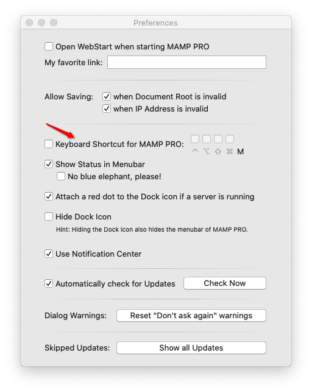
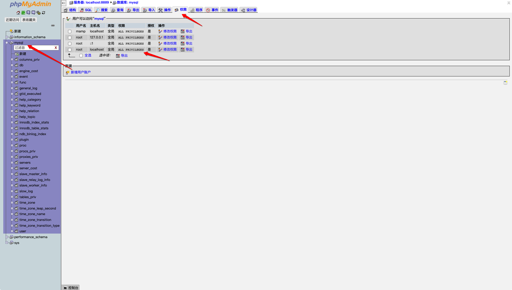
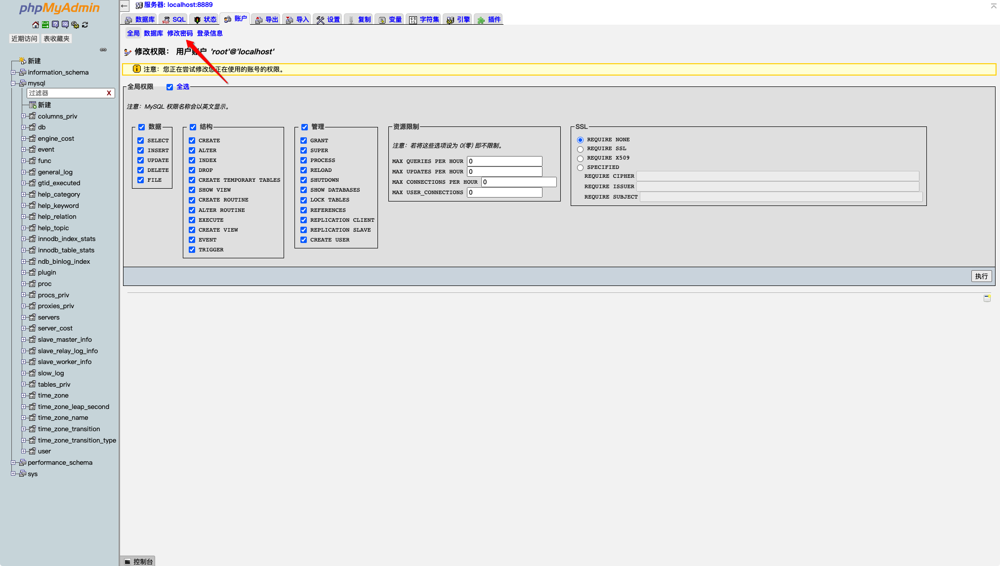
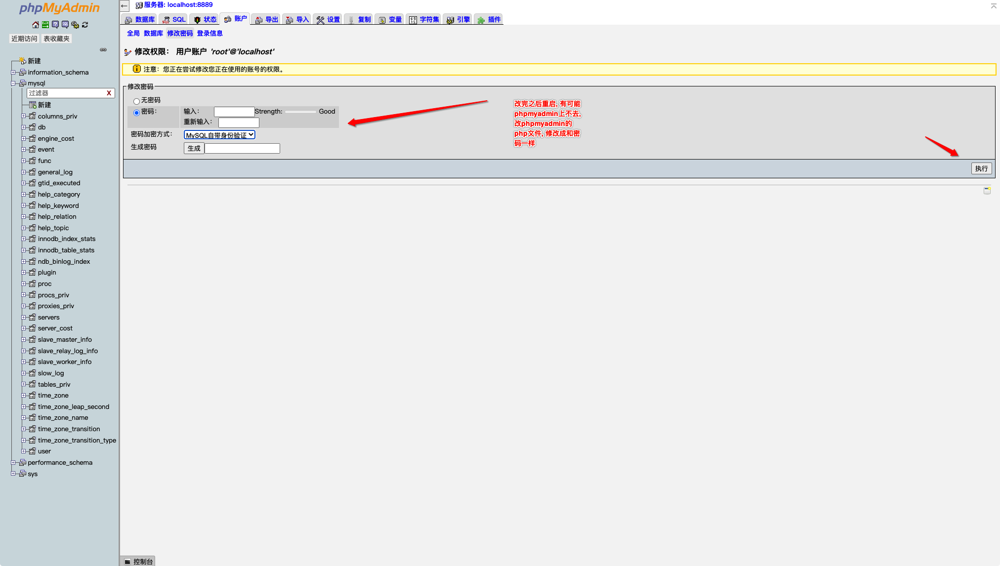
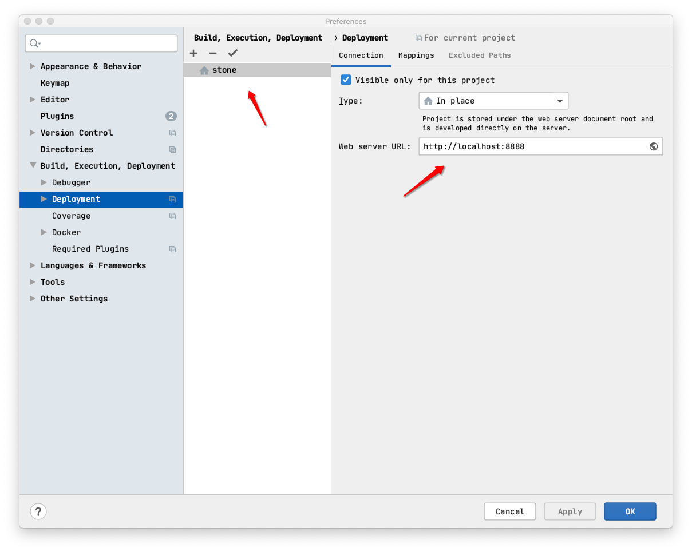
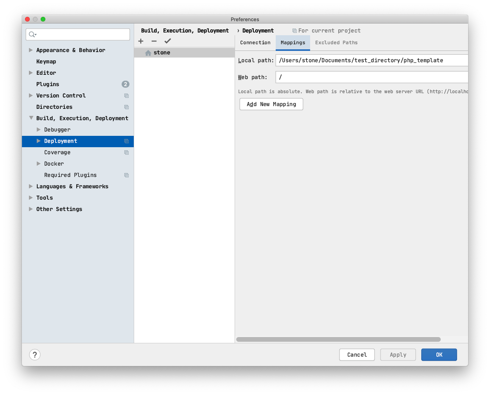
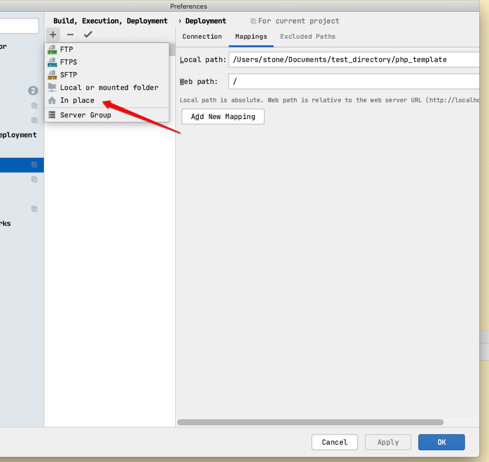
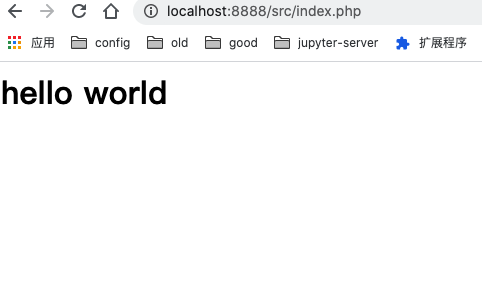

@(工作笔记)

# MAMP-record
# MAMP-record
# MAMP-record


[TOC]

---



有快捷键


---


mysqladmin: connect to server at 'localhost' failed
error: 'Access denied for user 'root'@'localhost' (using password: NO)'

<https://www.youtube.com/watch?v=LKE1G4sinBM>


```bash
/Applications/MAMP/tmp/mysql
```

```bash
subl my.cnf
```


在[mysqld] 下面添加 skip-grant-tables









phpmyadmin 修改密码

<https://mycyberuniverse.com/mamp-phpmyadmin-mysql-root-password.html>

1. If the MAMP app is running, click the `Stop Servers` button and quit the app.

2. In the Finder, go to the folder `Applications` → `MAMP` → `bin` → `phpMyAdmin`.

3. Open the file `config.inc.php` in a text editor. As a text editor, I use the [TextEdit](https://support.apple.com/en-gb/guide/textedit/welcome/mac) app, but you can use any other editor. The contents of the file may seem complicated in understanding, but do not worry, we will not change a lot of things.

4. Use the search to find the line below. In my case, this line was 87th.

   ```
   $cfg['Servers'][$i]['password']      = 'root';          // MySQL password (only needed
   ```

5. Replace `'root'` with an actual password of the MySQL root user.

6. Save the changes and close the file `config.inc.php`.

7. Launch MAMP and click the `Start Servers` button.

8. Try to access the phpMyAdmin web page through the Safari browser.

   > The phpMyAdmin web page located at `localhost/phpMyAdmin/index.php`.


---

MAMP的要跑起来 , 需要它的apache









---

## brew 安装 apapche

```plain
» brew reinstall httpd                                                                                                                                                                                         stone@StoneParkMac
==> Downloading https://mirrors.ustc.edu.cn/homebrew-bottles/bottles/httpd-2.4.43.catalina.bottle.tar.gz
######################################################################## 100.0%
==> Reinstalling httpd
==> Pouring httpd-2.4.43.catalina.bottle.tar.gz
==> Caveats
DocumentRoot is /usr/local/var/www.

The default ports have been set in /usr/local/etc/httpd/httpd.conf to 8080 and in
/usr/local/etc/httpd/extra/httpd-ssl.conf to 8443 so that httpd can run without sudo.

To have launchd start httpd now and restart at login:
  brew services start httpd
Or, if you don't want/need a background service you can just run:
  apachectl start
==> Summary
🍺  /usr/local/Cellar/httpd/2.4.43: 1,658 files, 27.9MB
```


---


# MAMP 中文文件夹乱码解决方案

1、打开注释：

\# Fancy directory listings
\#Include /Applications/MAMP/conf/apache/extra/httpd-autoindex.conf
Include /Applications/MAMP/conf/apache/extra/httpd-autoindex.conf


2、修改文件： /Applications/MAMP/conf/apache/extra/httpd-autoindex.conf

\#
\# IndexOptions: Controls the appearance of server-generated directory
\# listings.
\#
\#IndexOptions FancyIndexing HTMLTable VersionSort
IndexOptions FancyIndexing HTMLTable FoldersFirst Charset=UTF-8 NameWidth=*