@(工作笔记)

# Objective-C-record

[TOC]

## UITableView的 beginUpdates 和 endUpdates
https://www.jianshu.com/p/6efc5cf5c569

---

## 大话设计模式之oc实现23种模式
https://www.jianshu.com/p/df92bb0cef51

---

##  RN填坑-----tabBarIOS的icon和selectedIcon设置后无效

https://blog.csdn.net/chevins/article/details/51488363


---

## [0.45.0] third-party: 'config.h' file not found #14382

```plain
Running into the same issue here after upgrading from 0.44. None of the above solutions or clearing caches did the trick for me. Here's what I did to get things working again:

In the Terminal, navigate to the react-native/third-party/glog folder inside node_modules (for me, this was cd node_modules/react-native/third-party/glog-0.3.4)
Once actively in this folder, run ../../scripts/ios-configure-glog.sh
Glog is configured and the required config.h header file is created for Xcode to find
```


## RN获取静态资源图片的原始大小

https://github.com/facebook/react-native/issues/5603
```
import resolveAssetSource from 'resolveAssetSource';
import image from './images/goat.png';
const {width, height} = resolveAssetSource(image);
```

获取动态资源图片的原始大小
```
Image.getSize('./myimage.png', (width, height) => {
      console.log(width)
 });
```


## RN 手动拖动完图片资源还得安装一次, 才能认识资源...坑爹

---

## RN加载xcode中的图片
```
// IOS引用
<Image source={{uri: 图片名称'}} style={{width: 40, height: 40}} />
```

---

## flex justifyContent

space-evenly

 items are distributed so that the spacing between any two items (and the space to the edges) is equal.
项的分布使得任意两个项之间的间距(以及到边的空间)相等。

---


## 电脑术语install和setup有什么不同？貌似一样，好像又不同。

```
都是一些软件的安装程序，大型软件一般用setup，需要设置环境或参数的一般用setup，install往往是在运行的时候带某些参数，但是在某些软件里面混淆了它的概念
setup可以设置变量、环境、参数
install可以在加载的时候不设置环境、变量、参数（比如在config.sys里面加载的时候）
```

## enforce，perform，execute有什么区别
```
enforce

vt.强迫服从; 强行实施，强制执行（法律、规定等）

perform

vt.& vi.执行; 履行; 表演; 扮演vt.工作; 做; 进行; 完成vi.运行，表现; （驯兽）玩把戏

execute

vt.执行; 处死，处决; 履行; 完成

perform： 指完成困难较大、较复杂的任务。较正式用词。

execute： 指需专门技术熟练技巧去完成某种复杂的任务或表演等，也指用行动把计划或打算付诸实施或执行某项命令。
```

## Wrapping and Braces
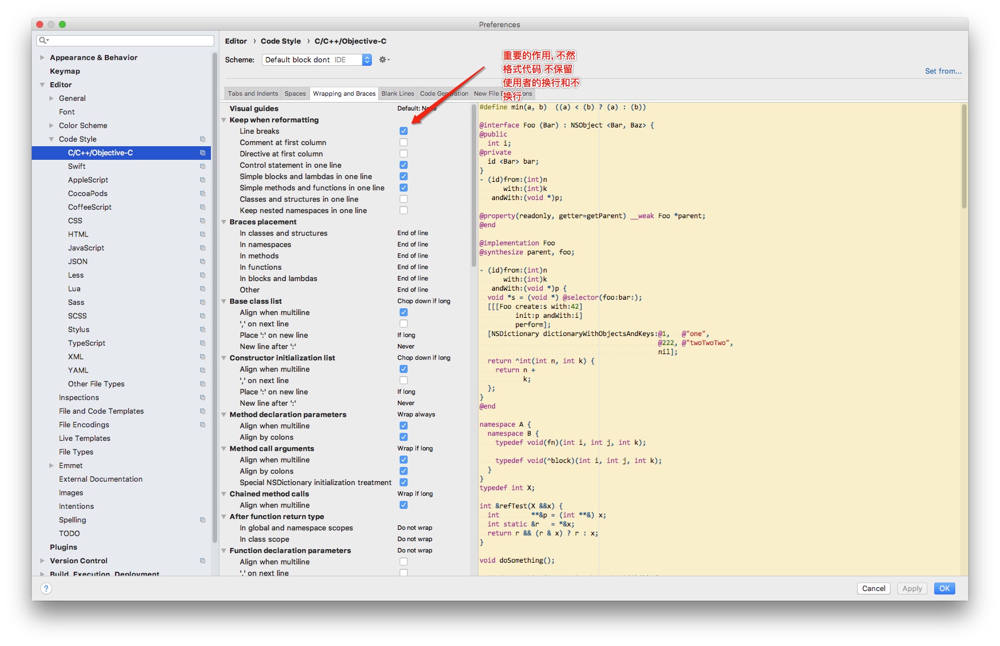


## 结构体 使用大括号初始化
http://blog.sina.com.cn/s/blog_72605ba50102xyiz.html

---

## 运行时简单调用


## node-formidable 限制上传大小问题 取消上传

https://blog.csdn.net/charlene0824/article/details/51234394

https://cnodejs.org/topic/53d68746da454a10712752f7

https://stackoverflow.com/questions/20553575/how-to-cancel-user-upload-in-formidable-node-js


## 设定printf在终端输出字体的颜色
http://www.cnblogs.com/yirenyang/p/4653661.html

```
终端字符的颜色是用转义序列进行控制，是文本模式下的系统显示功能，和具体的语言无关。
转义序列是以 ESC 开头,可以用 \033 完成相同的工作（ESC 的 ASCII 码用十进制表示就是 27， = 用八进制表示的 33）。

一）格式是：

          \033[显示方式;前景色;背景色m

      1）显示方式：0（默认值）、1（高亮）、22（非粗体）、4（下划线）、24（非下划线）、5（闪烁）、25（非闪烁）、7（反显）、27（非反显）
      2）前景色：30（黑色）、31（红色）、32（绿色）、 33（黄色）、34（蓝色）、35（洋红）、36（青色）、37（白色）
      3）背景色：40（黑色）、41（红色）、42（绿色）、 43（黄色）、44（蓝色）、45（洋红）、46（青色）、47（白色）

二）例子：

　　1）默认颜色：\033[0m
　　2）绿色：\033[1;32;40m
　　3）红色：\033[1;31;40m

　　4）printf( "\033[1;31;40m 输出红色字符 \033[0m" )
```

---

## xcode html 无法使用 文件夹下的图片, 只能使用 .html文件同级目录的图片坑爹啊...
https://stackoverflow.com/questions/11404193/xcode-webview-local-html-with-images

## NSURLSessionConfiguration详解

```
NSURLSessionConfiguration

NSURLSessionConfiguration对象用于初始化NSURLSession对象。

展开请求级别中与NSMutableURLRequest相关的可供选择的方案，我们可以看到NSURLSessionConfiguration对于会话如何产生请求，提供了相当多的控制和灵活性。从网络访问性能，到cookie，安全性，缓存策略，自定义协议，启动事件设置，以及用于移动设备优化的几个新属性，你会发现你一直在寻找的，正是NSURLSessionConfiguration。

会话在初始化时复制它们的配置，NSURLSession有一个只读的配置属性，使得该配置对象上的变化对这个会话的政策无效。配置在初始化时被读取一次，之后都是不会变化的。

－构造方法

NSURLSessionConfiguration有三个类构造函数，这很好地说明了NSURLSession是为不同的用例而设计的。

+ "defaultSessionConfiguration"返回标准配置，这实际上与NSURLConnection的网络协议栈是一样的，具有相同的共享NSHTTPCookieStorage，共享NSURLCache和共享NSURLCredentialStorage。
+ "ephemeralSessionConfiguration"返回一个预设配置，没有持久性存储的缓存，Cookie或证书。这对于实现像"秘密浏览"功能的功能来说，是很理想的。
+ "backgroundSessionConfiguration"：独特之处在于，它会创建一个后台会话。后台会话不同于常规的，普通的会话，它甚至可以在应用程序挂起，退出，崩溃的情况下运行上传和下载任务。初始化时指定的标识符，被用于向任何可能在进程外恢复后台传输的守护进程提供上下文。

想要查看更多关于后台会话的信息，可以查看WWDC Session 204: “What’s New with Multitasking”

－NSURLSessionConfiguration的属性

NSURLSessionConfiguration拥有20个属性。熟练掌握这些属性的用处，将使应用程序充分利用其网络环境。

最重要的属性：
# 替代 request 中的 forHTTPHeaderField 告诉服务器有关客户端的附加信息
"HTTPAdditionalHeaders"指定了一组默认的可以设置出站请求的数据头。这对于跨会话共享信息，如内容类型，语言，用户代理，身份认证，是很有用的。

# WebDav的身份验证
NSString *userPasswordString = [NSString stringWithFormat:@"%@:%@", user, password];
NSData * userPasswordData = [userPasswordString dataUsingEncoding:NSUTF8StringEncoding];
NSString *base64EncodedCredential = [userPasswordData base64EncodedStringWithOptions:0];
NSString *authString = [NSString stringWithFormat:@"Basic: %@", base64EncodedCredential];

# 设置客户端类型
NSString *userAgentString = @"iPhone AppleWebKit";

configuration.HTTPAdditionalHeaders = @{@"Accept": @"application/json",
                                        @"Accept-Language": @"en",
                                        @"Authorization": authString,
                                        @"User-Agent": userAgentString};

"networkServiceType（网络服务类型）"对标准的网络流量，网络电话，语音，视频，以及由一个后台进程使用的流量进行了区分。大多数应用程序都不需要设置这个

"allowsCellularAccess（允许蜂窝访问）"和"discretionary（自行决定）"被用于节省通过蜂窝连接的带宽。建议在使用后台传输的时候，使用discretionary属性，而不是allowsCellularAccess属性，因为它会把WiFi和电源可用性考虑在内

"timeoutIntervalForRequest"和"timeoutIntervalForResource"指定了请求以及该资源的超时时间间隔。许多开发人员试图使用timeoutInterval去限制发送请求的总时间，但这误会了timeoutInterval的意思：报文之间的时间。timeoutIntervalForResource实际上提供了整体超时的特性，这应该只用于后台传输，而不是用户实际上可能想要等待的任何东西

"HTTPMaximumConnectionsPerHost"是 Foundation 框架中URL加载系统的一个新的配置选项。它曾经被用于NSURLConnection管理私人连接池。现在有了NSURLSession，开发者可以在需要时限制连接到特定主机的数量

"HTTPShouldUsePipelining"也出现在NSMutableURLRequest，它可以被用于开启HTTP管道，这可以显着降低请求的加载时间，但是由于没有被服务器广泛支持，默认是禁用的

"sessionSendsLaunchEvents" 是另一个新的属性，该属性指定该会话是否应该从后台启动

"connectionProxyDictionary"指定了会话连接中的代理服务器。同样地，大多数面向消费者的应用程序都不需要代理，所以基本上不需要配置这个属性
关于连接代理的更多信息可以在 CFProxySupport Reference 找到。

"Cookie Policies"
－"HTTPCookieStorage" 是被会话使用的cookie存储。默认情况下，NSHTTPCookieShorage的 + sharedHTTPCookieStorage会被使用，这与NSURLConnection是相同的
－"HTTPCookieAcceptPolicy" 决定了该会话应该接受从服务器发出的cookie的条件
－"HTTPShouldSetCookies" 指定了请求是否应该使用会话HTTPCookieStorage的cookie

"Security Policies"
　　URLCredentialStorage 是会话使用的证书存储。默认情况下，NSURLCredentialStorage 的+ sharedCredentialStorage 会被使用使用，这与NSURLConnection是相同的

"TLSMaximumSupportedProtocol" 和 "TLSMinimumSupportedProtocol" 确定是否支持SSLProtocol版本的会话

"Caching Policies"
URLCache 是会话使用的缓存。默认情况下，NSURLCache 的 + sharedURLCache 会被使用，这与NSURLConnection是相同的
requestCachePolicy 指定了一个请求的缓存响应应该在什么时候返回。这相当于NSURLRequest 的-cachePolicy方法

"Custom Protocols"
protocolClasses是注册NSURLProtocol类的特定会话数组
```

---

## 后台下载
https://www.jianshu.com/p/1211cf99dfc3

## NSURLSessionTask的Suspend does not work 日 这么大的坑 (时好时坏)
https://stackoverflow.com/questions/40662007/nsurlsessiontask-suspend-does-not-work

```
NSURLSession的暂停和恢复支持并非真正用于实现用户级“暂停传输”功能。相反，它允许您暂时禁用回调作为某种并发控制系统的一部分。那是因为，正如您所注意到的，暂停的任务仍然可以在线路上激活; 暂停所做的就是阻止它在内部取得进展，发出回调等等。

如果您正在实施用户级暂停功能，我的建议如下：

对于下载，您应该打电话-cancelByProducingResumeData:然后继续-downloadTaskWithResumeData:。大多数服务器都支持此功能。

对于上传，事情变得更加棘手。您的服务器是否明确支持停止和恢复上传的功能？

分享和享受
- 
奎因“爱斯基摩人！” 
Apple Developer Relations，开发人员技术支持，核心操作系统/硬件
let myEmail = "eskimo" + "1" + "@apple.com"
```


## AppCode 懒加载块数生成

https://gist.github.com/olegam/8997427

```
This template let's you easily implement a property getter like this:

- (UIView *)myView {
	if (!_myView) {
		_myView = [UIView new];
	}
	return _myView;
}
When you have declared a property like this:

@property(nonatomic, strong) UIView *myView;
You just change the OC Property Getter Body code template of AppCode to:

if (!$IVAR) {
#if ($RETURN_TYPE.endsWith("*"))
  #set($VAR_CLASS = $RETURN_TYPE.substring(0, $RETURN_TYPE.lastIndexOf("*")).trim())
#else
  #set($VAR_CLASS = $RETURN_TYPE)
#end
$IVAR = [$VAR_CLASS new];
}
return $IVAR;
This solution was given to my by Dmitry Semeniouta from Jetbrains after I asked the question on their issue tracker: http://youtrack.jetbrains.com/issue/OC-9126
```

```
It's not meant as a 'Live Template' but a 'Code Template' so you should not need to add $ and edit variables. Open Preferences->File and Code Templates->Code->OC Property Getter Body.
```

使用 ctrol+o 快捷键重写get方法时 才能起作用...


---

## AppCode get 模板重写, 备份原件
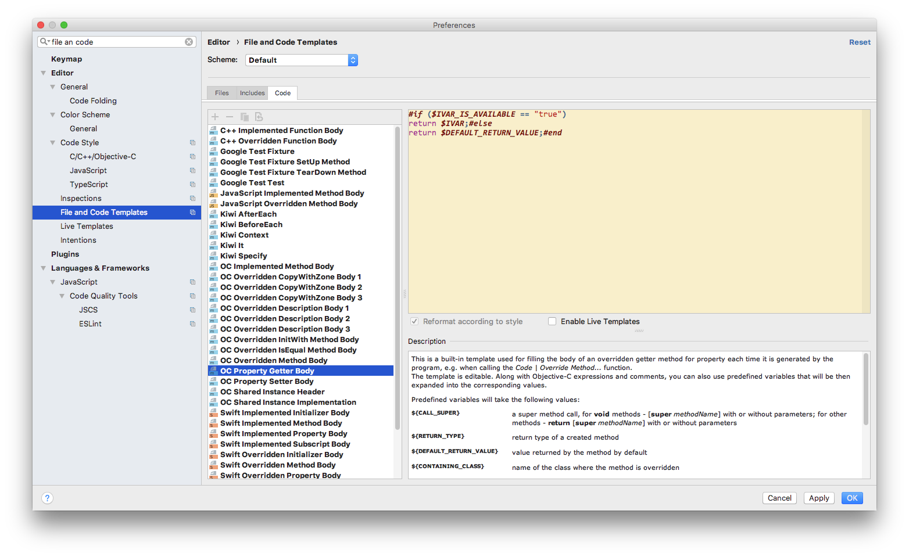

```
#if ($IVAR_IS_AVAILABLE == "true")
return $IVAR;#else
return $DEFAULT_RETURN_VALUE;#end
```

## GDataXMLNode配置方式
https://www.jianshu.com/p/7404ea214f43


---


## Runloop
https://blog.csdn.net/u014795020/article/details/72084735
https://blog.ibireme.com/2015/05/18/runloop/


## symbolic 妙用...
创建 symbolic 断点 写 -[UIResponder touchesBegan:withEvent:]  之后 写 touch 方法 ,  程序会挂起,  lldb中输入 register read r14  , 或者 register read r13 , 返回一个地址 , po 这个地址 , 能找得到点击的是哪个view

## OC中的宏定义

https://blog.csdn.net/wangjiangang_/article/details/46301453

## 字符串拼接宏
https://blog.csdn.net/yanchen_ing/article/details/51734664

## RunLoop 总结：RunLoop的应用场景（一）

https://blog.csdn.net/u011619283/article/details/53433243

## 深入剖析 iOS 性能优化

https://www.jianshu.com/p/c58001ae3da5


## shell md5加密


## 截取扩展名...
http://blog.sina.com.cn/s/blog_9cd1705d0101mvk0.html

## 栅栏函数不能使用全局并发队列
```
  // 栅栏函数不能使用全局并发队列FileHandleViewController
  // dispatch_queue_t queue    = dispatch_get_global_queue(DISPATCH_QUEUE_PRIORITY_DEFAULT, 0);
  dispatch_queue_t queue = dispatch_queue_create("com.stone.download", DISPATCH_QUEUE_CONCURRENT);
```

## SDWebImageOption 0是性能最高的, 没有特殊要求时 就传0


## 全局变量

https://blog.csdn.net/mango_ios/article/details/52686892


## 从xib加载的view, 用代码增加约束时在updateViewConstraints方法中写, 不要再viewDidLoad中写...
```
通过代码为xib或sb中view增加约束时，尽量避免在viewDidLoad中执行，最好放在updateViewConstraints[UIViewController]或者updateConstraints[UIView]中，记得调用[super updateViewConstraints]或者[super updateConstraints];

- (void)updateViewConstraints
{
    // 在这里为你的view添加约束，请确保该view的translatesAutoresizingMaskIntoConstraints属性已设置为NO
    [super updateViewConstraints];
}
如果你真的写在viewDidLoad里了，那么可能会遇到这种崩溃错误

Terminating app due to uncaught exception "NSInternalInconsistencyException"
```

## 使用autolayout自定义动态高度的cell (masonry)
https://www.jianshu.com/p/f2ef93a3dbb5

## layer.contents 详解
https://www.jianshu.com/p/76d6b8e6fca7
https://www.jianshu.com/p/494036d1bb06

---

## block做为属性时 注意循环引用, 其他情况少...
在开始之前我们需要明确一点：是不是所有的block，使用self都会出现循环引用？其实不然，系统和第三方框架的block绝大部分不会出现循环引用，只有少数block以及我们自定义的block会出现循环引用。而我们只要抓住本质原因就可以了


## 追求Masonry

http://ios.jobbole.com/83384/

---


## edgesForExtendedLayout浅淡
https://www.jianshu.com/p/ca3c5a94c32b

---

## CAShapeLayer
https://www.jianshu.com/p/139f4fbe7b6b

---


## CALayer子类详解

https://www.jianshu.com/p/98ff8012362a
https://www.jianshu.com/p/b3e5444c9746

##  CATransform3DMakeRotation 与KVO transform 区别, 有坑...
```
self.layer.transform = CATransform3DMakeRotation(kDegreesToRadian(des), 0, 0, 1);

[self.layer setValue:@(kDegreesToRadian(des)) forKeyPath:@"transform.rotation.z"];
```

KVO 好像记录了起点... 超过180度之后 逆时针了...

---
## CATextLayer绘制文本字符串

https://blog.csdn.net/potato512/article/details/56290428

---

## [iOS diary]CABasicAnimation KeyPath大全与使用事例
https://blog.csdn.net/majiakun1/article/details/46426727


---


## 32bit设备上关于NSNumber的一个大坑以及OBJC_ASSOCIATION_ASSIGN可能引起的Crash
https://www.jianshu.com/p/d417e3038a04

将OBJC_ASSOCIATION_ASSIGN改为OBJC_ASSOCIATION_RETAIN，这样在本对象有一个强引用，这个被关联的对象也就不会释放，生命周期也和本对象相同了。我认为既然关联对象传入的都是对象，那么其实绝大多时候用的都应该是是OBJC_ASSOCIATION_RETAIN，在我们项目中传入的对象很多是NSNumber类型（包装的bool或则int）的时候都是用的OBJC_ASSOCIATION_ASSIGN，以前没暴露问题也是误打误撞错进错出。所以除了一些需要破解循环引用的场景，关联对象的内存操作修饰符建议都用OBJC_ASSOCIATION_RETAIN。

---


## 默认appcode 配置

```
-Xss2m
-Xms2048m
-Xmx4096m
-XX:NewSize=128m
-XX:MaxNewSize=128m
-XX:ReservedCodeCacheSize=240m
-XX:+UseCompressedOops
-Dfile.encoding=UTF-8
-XX:+UseConcMarkSweepGC
-XX:SoftRefLRUPolicyMSPerMB=50
-ea
-Dsun.io.useCanonCaches=false
-Djava.net.preferIPv4Stack=true
-XX:+HeapDumpOnOutOfMemoryError
-XX:-OmitStackTraceInFastThrow
-Xverify:none

-XX:ErrorFile=$USER_HOME/java_error_in_appcode_%p.log
-XX:HeapDumpPath=$USER_HOME/java_error_in_appcode.hprof

-javaagent:/Library/JetbrainsLicense/JetbrainsCrack-2.8-release-enc.jar
```

---

## CGContext图形上下文详解

https://www.jianshu.com/p/ad8eed568ff4
https://blog.csdn.net/dick_china/article/details/7950701
---


## IOS 11 下适配UITableView
https://www.cnblogs.com/spider-pei/p/7592906.html

---

## NSUserDefaults详解
https://cdn2.jianshu.io/p/b68a98f9eeff?utm_campaign=maleskine&utm_content=note&utm_medium=seo_notes&utm_source=recommendation

```
NSUserDefaultsSizeLimitExceededNotification

当用户默认数据中存储更多数据时

NSUbiquitousUserDefaultsNoCloudAccountNotification

当设置了云默认时，但没有登录iCloud用户

NSUbiquitousUserDefaultsDidChangeAccountsNotification

当用户更改主iCloud帐户时

NSUbiquitousUserDefaultsCompletedInitialSyncNotification

发布时，默认完成下载数据，无论是第一次设备连接到一个iCloud帐户，或当用户切换他们的主要iCloud帐户

NSUserDefaultsDidChangeNotification

在当前进程中更改用户默认值时发布

```

---

## iOS 路径Documents、Library、tmp和string类的路径的常用操作
https://www.jianshu.com/p/8f14cad10398

---

## NSSearchPathDomainMask 详解
https://blog.csdn.net/czcdms/article/details/44461349

## 沙盒结构分析


## key写法


https://blog.csdn.net/caryaliu/article/details/49284185

```
[self mutableArrayValueForKey:NSStringFromSelector(@selector(students))];
```

##  NSArray,NSMutableArray的KVO操作
https://blog.csdn.net/tyrant_800/article/details/49382829
https://blog.csdn.net/caryaliu/article/details/49284185

---

## Object-C中的黑魔法
https://www.jianshu.com/p/b3a31eed945f

---


## static修饰全局变量

https://www.jianshu.com/p/3fa703e80720

static修饰全局变量
1.在全局变量前加static，全局变量就被定义成为一个全局静态变量（全局变量和静态全局变量的生命周期是一样的，都是在堆中的静态区，在整个工程执行期间内一直存在）
特点如下：
1）存储区：静态存储区没变（静态存储区在整个程序运行期间都存在）；
2）作用域：全局静态变量在声明他的文件之外是不可见的。准确地讲从定义之处开始到文件结尾。非静态全局 变量的作用域是整个源程序（多个源文件可以共同使用）； 而静态全局变量则限制了其作用域， 即只在定义该变量的源文件内有效， 在同一源程序的其它源文件中不能使用它。

 好处：   
1）不会被其他文件所访问，修改；
2）其他文件中可以使用相同名字的变量，不会发生冲突。

## ios中 padding


https://stackoverflow.com/questions/27459746/adding-space-padding-to-a-uilabel/39998301

Just use a UIButton, its already built in. Turn off all the extra button features and you have a label that you can set edge instets on.
```
let button = UIButton()
button.contentEdgeInsets = UIEdgeInsets(top: 5, left: 5, bottom: 5, right: 5)
button.setTitle("title", for: .normal)
button.tintColor = .white // this will be the textColor
button.isUserInteractionEnabled = false
shareimprove this answer
edited Sep 11 '17 at 6:06
```
mxcl
18.3k117488
answered Jul 28 '17 at 12:09

Steve M
61454
1
Hey this is a great tip! No extensions required! :-D – Felipe Ferri Aug 16 '17 at 14:35
1
Setting isUserInteractionEnabled = false is handy to disable it. – mxcl Sep 11 '17 at 5:56
Great tip... I'd rather do this than going for an extension. – Ross Jan 14 at 15:21


---

## 加载 Bundle 中图片的三种方法

第一种方法
```
NSString *path = [[NSBundle mainBundle] pathForResource:@"myBundle" ofType:@"bundle"];
NSBundle *bundle = [NSBundle bundleWithPath:path];
NSString *file = [bundle pathForResource:@"pic" ofType:@"png"];
UIImage *img = [UIImage imageWithContentsOfFile:file];
```

第二种方法
```
NSString *file2 = [[NSBundle mainBundle] pathForResource:@"myBundle.bundle/pic" ofType:@"png"];
UIImage *img2 = [UIImage imageWithContentsOfFile:file2];
```

第三种方法
```
UIImage *img3 = [UIImage imageNamed:@"myBundle.bundle/pic"];
```

---


## 坑爹的系统字体
https://stackoverflow.com/questions/32291105/line-spacing-for-uilabel-with-a-single-line-of-text

paragraphStyle.lineBreakMode = NSLineBreakByCharWrapping 
文本是多行时可以避免此问题。

使用fontName显式设置字体[UIFont fontWithName:@"PingFangSC-Regular" size:14]，而不是使用[UIFont systemFontOfSize:14]可以避免文本是单行时的问题。

希望这对你有所帮助！


## lineheight
http://www.cocoachina.com/ios/20180329/22838.html
https://github.com/alibaba/VirtualView-iOS

## 在iOS 11控制台输出这样的log，确实高度计算也有问题
https://github.com/forkingdog/UITableView-FDTemplateLayoutCell/issues/348

UITableView+FDTemplateLayoutCell.m文件中templateCell.contentView.translatesAutoresizingMaskIntoConstraints = NO;
改为YES


---

## UITableView+FDTemplateLayoutCell 自动计算cell高度
https://www.jianshu.com/p/b4ac41668ca4

---

## code completion backup
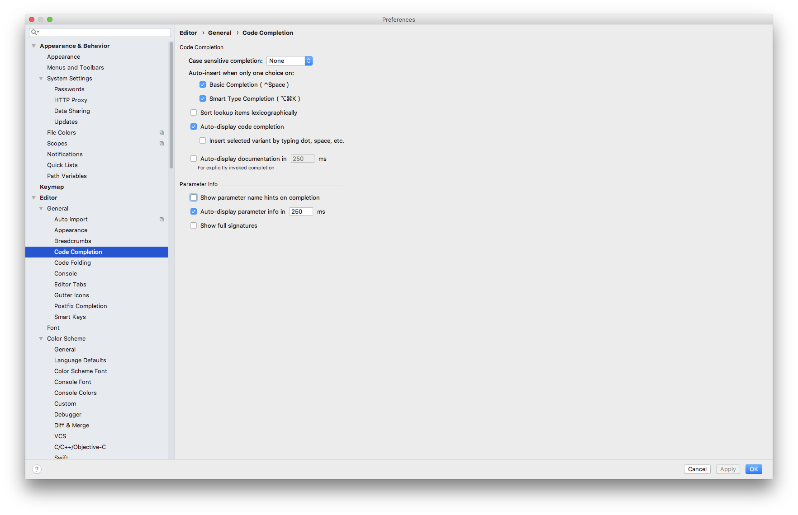


## 生成随机数三种方式 OC
https://blog.csdn.net/kingcodexl/article/details/50262729

---

## iOS 运行时获取类的所有属性
https://www.jianshu.com/p/2a71f0806f79


---


## iOS initWithFrame、initWithCoder、awakeFromNib的区别解析
https://www.cnblogs.com/yajunLi/p/6344023.html

---

## iOS开发-黑科技防止多次添加删除KVO出现的问题
https://blog.csdn.net/klabcxy36897/article/details/51680423

---

## add observer的两个用法
https://blog.csdn.net/jingqiu880905/article/details/50524016

---

## 对齐
https://intellij-support.jetbrains.com/hc/en-us/community/posts/205799789-Code-Style-Align-Consecutive-Assignments-

---

## GDataXMLNode 集成


---

## 显示或隐藏控制台: ⇧⌘Y

---

## kiwi 集成


**xcode添加kiwi模板**
https://github.com/kiwi-bdd/Kiwi.git
下载kiwi项目

进入 Xcode Templates文件夹下

```bash
bash ./install-templates.sh
```

之后就能使用 cmd+n来创建 kiwi模板代码了...


**kiwi 简单模板代码**
``` objectivec
describe(@"SimpleString", ^{
    context(@"when assigned to 'Hello world'", ^{
        NSString *greeting = @"Hello world";
        it(@"should exist", ^{
            [[greeting shouldNot] beNil];
        });

        it(@"should equal to 'Hello world'", ^{
            [[greeting should] equal:@"Hello world"];
        });
    });
});
```
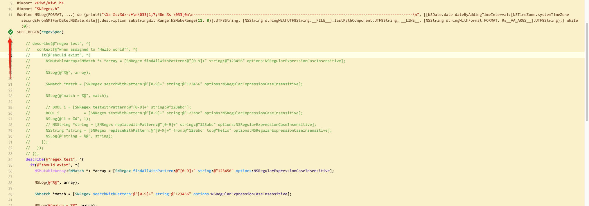

如果执行按钮不出现 , 需要 cmd+u 一下, 让 xcode 跑一次 test


## 关闭多余信息... 有些bug 可能需要打开...


Xcode8里边 Edit Scheme... -> Run -> Arguments, 在Environment Variables里边添加 `OS_ACTIVITY_MODE ＝ disable`

步骤1.


步骤2.


步骤3.
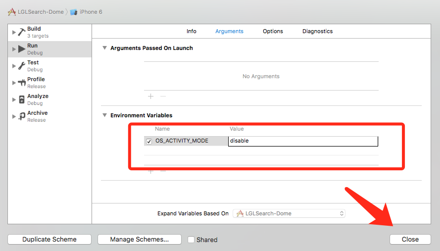


---

## 已有项目添加单元测试
http://www.cocoachina.com/ios/20151125/14415.html

## iOS 编程之使用Precompile Prefix Header
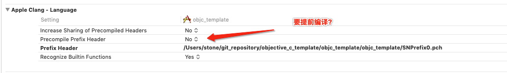
https://www.cnblogs.com/FightingLuoYin/p/4487291.html
```plain
一：为什么Xcode6没有自动创建Precompile Prefix Header

     我们在写项目的时候，大部分宏定义，头文件导入都在Precompile Prefix Header文件里面。在Xcode 4, 5的模板工程中可以看到Precompile Prefix Header，但是在Xcode 6被阉割掉了，原因可以参考下面的链接：

http://stackoverflow.com/questions/24158648/why-isnt-projectname-prefix-pch-created-automatically-in-xcode-6

　Xcode 6去掉Precompile Prefix Header的主要原因在于：

（1）去掉自动导入的系统框架类库的头文件，可以提高原文件的复用性，便于迁移。

（2）一个肥胖无比的Prefix Header会大大增加Build Time。

 

二：使用Precompile Prefix Header的好处

　　为了取代在Prefix Header中自动导入的框架，可以在每一个需要导入系统框架的文件中通过@import来手动导入。如果在Prefix Header中导入了，那么我们在工程的每一个文件中可以免费获得使用的权利，而无需手动在每一个.h/.m文件中导入。该文件确有其方便之处。

 

三：给工程中添加Precompile Prefix Header

　　如果一定要用到Precompile Prefix Header，可以参考Xcode 5的配置来手动设置。

（1）创建一个pch文件： Command+N，打开新建文件窗口：ios->other->PCH file

        

（2）给pch文件命名

　　在工程中增加一个pch文件，命名还是按照Xcode 5的模板比较好：工程名-Prefix.pch，例如a-Prefx.pch

　 　

（3）修改工程配置文件，将刚刚创建的PCH file的路径添加到building setting中的precompile header选项中去，注意debug和release两栏都要添加：

      

　　注意：

将Precompile Prefix Header为YES，预编译后的pch文件会被缓存起来，可以提高编译速度　　
修改pch文件路径按照如下格式：将building setting中的precompile header选项的路径添加“$(SRCROOT)/项目名称/pch文件名”（例如：$(SRCROOT)/自定义数字键盘/自定义数字键盘-Prefix.pch）

（4）向pch文件中添加文件

     

总结：Apple标都建议我们不用pch了，那么还是尽量少用吧。当然，如果一定要用，还是尽量减少pch文件中

　　  的内容，降低工程对pch文件的依赖性，便于日后的迁移和解耦。
```

## 懒加载改写

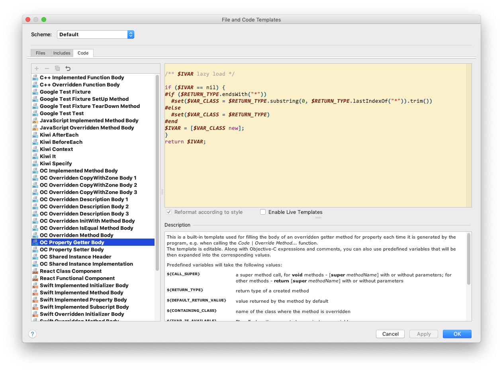

## appcode 代码大改 xocode 不报错的问题, 解决:
https://stackoverflow.com/questions/36686090/appcode-cant-resolve-local-variable-without-const-prefix


---

## framework 制作

**step 1:**
mach-o type 改成 static library

**step 2:**
>还有一处是这样的，如果你的framework里面需要添加一些分类，那么需要在Other Linker Flags 添加 -all_load（注意符号不要用中文写了，all_load它的作用是加载静态库中所有文件，all_load作用于所有的库）


**step 3:**
制作要分享的文件, 并选择public


**step 4: **
主头文件中 import 要暴露出去的文件, 没有提示...


**step 5:**
脚本生成 4个环境都能用的包
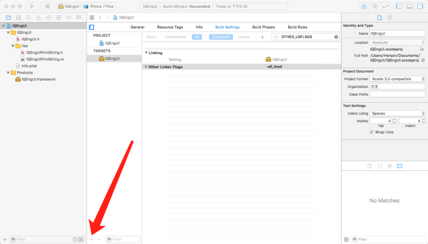
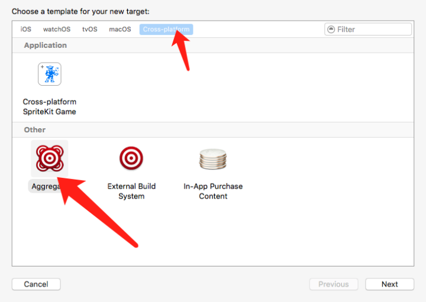
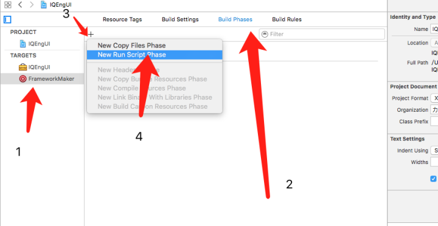

```bash
#xcodebuild -project hvui.xcodeproj -target FrameworkMaker_Release;rm -rf build;
productName="${PROJECT_NAME}"
target="${productName}"
tmpDir="${PROJECT_TEMP_DIR}/build"
rm -rf "${tmpDir}"#清除编译临时文件

# 有这段会报错, 暂时注释掉...可能是加载资源的
#编译bundle
# xcodebuild -target "${PROJECT_NAME}Bundle" -configuration "Release" -sdk "iphoneos" build SYMROOT="${tmpDir}" ONLY_ACTIVE_ARCH="NO" VALID_ARCHS="arm64 armv7 armv7s i386 x86_64"

function buildLibs(){
sdks=("iphonesimulator" "iphoneos")
configurations=("Debug" "Release")
for configuration in ${configurations[@]}
do
for sdk in ${sdks[@]}
do
# workspace 的时候可能使用 -target会有错误
xcodebuild -target "${target}" -configuration "${configuration}" -sdk "${sdk}" build SYMROOT="${tmpDir}" ONLY_ACTIVE_ARCH="NO" VALID_ARCHS="arm64 armv7 armv7s i386 x86_64"
done
done
}
function lipoLibs(){
#copy Release-iphoneos到 Frameworks 目录,然后 lipo -c 一份
ios_libs_dir="${SRCROOT}/../ios_libs"
frameworkDir="${ios_libs_dir}/Frameworks"
[ -d "${frameworkDir}" ] || mkdir -p "${frameworkDir}"
cp -r "${ios_libs_dir}/Release-iphoneos/${productName}.framework" "${frameworkDir}/"
#lipo -c ... -o ..
lipo -c "${ios_libs_dir}/Release-iphoneos/${productName}.framework/${productName}" "${ios_libs_dir}/Release-iphonesimulator/${productName}.framework/${productName}" -o "${frameworkDir}/${productName}.framework/${productName}"
rm -rf "${frameworkDir}/${productName}.framework/_CodeSignature"
}
function rmLibs(){
ios_libs_dir="${SRCROOT}/../ios_libs"
sdks=("iphonesimulator" "iphoneos")
configurations=("Release")
for configuration in ${configurations[@]}
do
for sdk in ${sdks[@]}
do
rm -rf "${ios_libs_dir}/${configuration}-${sdk}/${productName}.framework"
done
done
}
buildLibs
lipoLibs
#rmLibs
#cp to ios_libs
#cp -Rf "${SRCROOT}/ios_libs/Frameworks/${productName}.framework" "${SRCROOT}/../ios_libs/Frameworks/${productName}.framework"

```

**坑**
https://stackoverflow.com/questions/32687105/framework-not-found-in-xcode
有时候编译报错
去 build settings 里 搜索 Framework Search Path
碰一下 
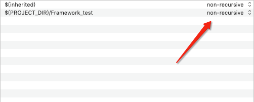
改成递归, 再改回来

**自定义的framework 报文件找不到**
关闭xcode 重开就好了, 草 什么玩意儿

## 坑啊


```
xcrun xcodebuild \                                                                                                                                                                                                        stone@bogon
  -scheme Framework_test \
  -workspace Framework_test.xcworkspace \
  -configuration Debug \
  -destination 'platform=iOS Simulator,name=iPhone 6 Plus,OS=9.1' \
  -derivedDataPath \
  build
```

## cocoapods 本地私有库创建
https://www.zybuluo.com/Sweetfish/note/836091
https://www.zybuluo.com/chenbinghua/note/695723
https://www.zybuluo.com/originxp/note/434479


```ruby
#
#  Be sure to run `pod spec lint SNLib.podspec' to ensure this is a
#  valid spec and to remove all comments including this before submitting the spec.
#
#  To learn more about Podspec attributes see https://docs.cocoapods.org/specification.html
#  To see working Podspecs in the CocoaPods repo see https://github.com/CocoaPods/Specs/
#

Pod::Spec.new do |spec|

  # ―――  Spec Metadata  ―――――――――――――――――――――――――――――――――――――――――――――――――――――――――― #
  #
  #  These will help people to find your library, and whilst it
  #  can feel like a chore to fill in it's definitely to your advantage. The
  #  summary should be tweet-length, and the description more in depth.
  #

  spec.name         = "SNLib"
  spec.version      = "0.0.2"
  spec.summary      = "A short description of SNLib."

  # This description is used to generate tags and improve search results.
  #   * Think: What does it do? Why did you write it? What is the focus?
  #   * Try to keep it short, snappy and to the point.
  #   * Write the description between the DESC delimiters below.
  #   * Finally, don't worry about the indent, CocoaPods strips it!
  spec.description  = "SNLib git test"

  spec.homepage     = "http://EXAMPLE/SNLib"
  # spec.screenshots  = "www.example.com/screenshots_1.gif", "www.example.com/screenshots_2.gif"


  # ―――  Spec License  ――――――――――――――――――――――――――――――――――――――――――――――――――――――――――― #
  #
  #  Licensing your code is important. See https://choosealicense.com for more info.
  #  CocoaPods will detect a license file if there is a named LICENSE*
  #  Popular ones are 'MIT', 'BSD' and 'Apache License, Version 2.0'.
  #

  spec.license      = "MIT"
  # spec.license      = { :type => "MIT", :file => "FILE_LICENSE" }


  # ――― Author Metadata  ――――――――――――――――――――――――――――――――――――――――――――――――――――――――― #
  #
  #  Specify the authors of the library, with email addresses. Email addresses
  #  of the authors are extracted from the SCM log. E.g. $ git log. CocoaPods also
  #  accepts just a name if you'd rather not provide an email address.
  #
  #  Specify a social_media_url where others can refer to, for example a twitter
  #  profile URL.
  #

  spec.author             = { "StonePark" => "blueone009@163.com" }
  # Or just: spec.author    = "StonePark"
  # spec.authors            = { "StonePark" => "blueone009@163.com" }
  # spec.social_media_url   = "https://twitter.com/StonePark"

  # ――― Platform Specifics ――――――――――――――――――――――――――――――――――――――――――――――――――――――― #
  #
  #  If this Pod runs only on iOS or OS X, then specify the platform and
  #  the deployment target. You can optionally include the target after the platform.
  #

  # spec.platform     = :ios
  spec.platform     = :ios, "9.0"

  #  When using multiple platforms
  # spec.ios.deployment_target = "5.0"
  # spec.osx.deployment_target = "10.7"
  # spec.watchos.deployment_target = "2.0"
  # spec.tvos.deployment_target = "9.0"


  # ――― Source Location ―――――――――――――――――――――――――――――――――――――――――――――――――――――――――― #
  #
  #  Specify the location from where the source should be retrieved.
  #  Supports git, hg, bzr, svn and HTTP.
  #

  spec.source       = { :git => "https://github.com/stone0117/SNLib.git", :tag => "#{spec.version}" }


  # ――― Source Code ―――――――――――――――――――――――――――――――――――――――――――――――――――――――――――――― #
  #
  #  CocoaPods is smart about how it includes source code. For source files
  #  giving a folder will include any swift, h, m, mm, c & cpp files.
  #  For header files it will include any header in the folder.
  #  Not including the public_header_files will make all headers public.
  #

  spec.source_files  = "SNLib", "SNLib/**/*.{h,m}"
  #spec.exclude_files = "Classes/Exclude"

  # spec.public_header_files = "Classes/**/*.h"


  # ――― Resources ―――――――――――――――――――――――――――――――――――――――――――――――――――――――――――――――― #
  #
  #  A list of resources included with the Pod. These are copied into the
  #  target bundle with a build phase script. Anything else will be cleaned.
  #  You can preserve files from being cleaned, please don't preserve
  #  non-essential files like tests, examples and documentation.
  #

  # spec.resource  = "icon.png"
  # spec.resources = "Resources/*.png"

  # spec.preserve_paths = "FilesToSave", "MoreFilesToSave"


  # ――― Project Linking ―――――――――――――――――――――――――――――――――――――――――――――――――――――――――― #
  #
  #  Link your library with frameworks, or libraries. Libraries do not include
  #  the lib prefix of their name.
  #

  # spec.framework  = "SomeFramework"
  # spec.frameworks = "SomeFramework", "AnotherFramework"

  # spec.library   = "iconv"
  # spec.libraries = "iconv", "xml2"


  # ――― Project Settings ――――――――――――――――――――――――――――――――――――――――――――――――――――――――― #
  #
  #  If your library depends on compiler flags you can set them in the xcconfig hash
  #  where they will only apply to your library. If you depend on other Podspecs
  #  you can include multiple dependencies to ensure it works.

  spec.requires_arc = true

  # spec.xcconfig = { "HEADER_SEARCH_PATHS" => "$(SDKROOT)/usr/include/libxml2" }
  spec.dependency "Masonry", "~> 1.1.0"
  spec.dependency "MBProgressHUD", "~> 1.1.0"
  spec.dependency "SSZipArchive", "~> 2.1.4"
  spec.dependency "SDWebImage", "~> 4.4.6"
  spec.dependency "AFNetworking", "~> 3.2.1"

end

```
framework中引用的三方库和 , spec文件中指定的版本可能要一致, 不然可能报错...

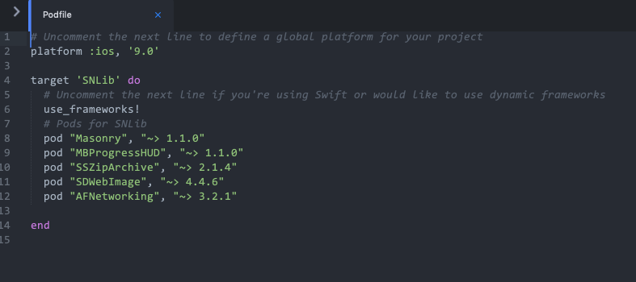

---

>部署您的库
所以你已经准备好了你的库。首先，您应该检查Podspec是否正确提示，因为您无法部署错误。这可以通过两种方法完成，pod lib lint并且pod spec lint。它们之间的区别在于pod lib lint不访问网络，而是pod spec lint检查外部仓库和相关标签。
如果您要将Open Source库部署到trunk，则不能发出CocoaPods警告。你可以有Xcode警告。您应该继续使用trunk指南开始向公众部署。
如果您要部署到私有Specs仓库，则需要添加该仓库。请参阅Private Specs Repos上的指南以进行设置。如果要部署到现有的私有仓库，请使用此命令进行部署：
pod repo push SPEC_REPO *.podspec --verbose

---

## 使用agvtool更改app version／build

https://segmentfault.com/a/1190000008570439
https://stackoverflow.com/questions/37864175/fastlane-there-does-not-seem-to-be-a-current-project-version-key-set-for-this-p

**step1:**
Build Settings 搜索 current 
Current Project Version 改成当前版本号 , e.g 1.0.0
Version System 改成 Apple Generic


Build Settings 搜索 Info.plist


把 $(SRCROOT) 删掉...

终端cd到 有 .xcodeproj 目录下 , 即 工程目录下

**查看当前版本**
```bash
# build
agvtool what-version
# version
agvtool what-marketing-version
# build
agvtool vers
# version
agvtool mvers
```

**自动增加版本号**
```bash
agvtool next-version -all
agvtool bump -all
```
>二者都是给build递增。version的话，没有递增的命令。-all 单元测试版本号也变

**设置新版本号**
```bash
# build
# 给苹果看的版本号 , 即 构建版本, test flight 版本号
agvtool new-version -all 1.0.0
# version
# 给用户看的版本号 , 即 app-store 产品上线的 能显示在历史版本记录的版本号
agvtool new-marketing-version 1.0.0
```

**help**
```bash
agvtool help
```

## 最新版 reveal 在越狱中的使用
https://www.jianshu.com/p/8e07735b6cc8
```
iOS 9，把RevealServer.framework/RevealServer 二进制文件重命名为libReveal.dylib，拷贝到设备的/Library/RHRevealLoader下，假如没有RHRevealLoader，自己创建一个。
iOS 10，把RevealServer.framework 动态库拷贝到设备的/Library/Frameworks/目录下，已存在同名文件，替换。
```
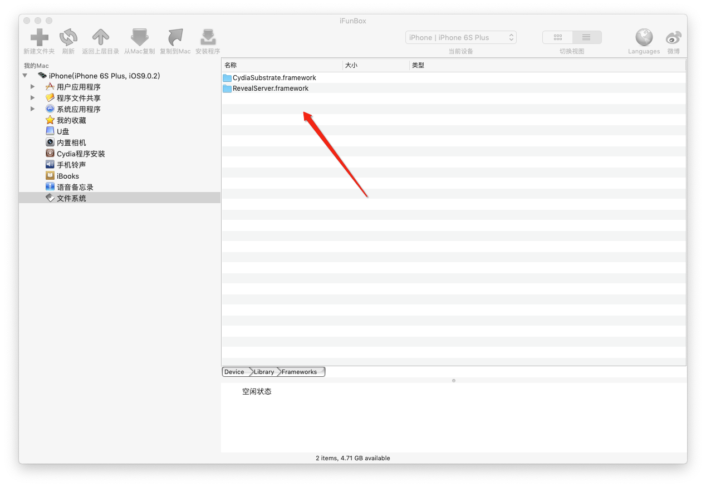
直接替换
给USB 连接用的


给wifi用

---

## `OC: nonnull、nullable、null_resettable、__null_unspecified`

https://www.jianshu.com/p/d4973ae64cb3

## collectionView section 置顶
https://github.com/Instagram/IGListKit/issues/1010

flow layout 的属性 sectionHeadersPinToVisibleBounds 能做到, 不过得9.0以后

## iOS 属性声明在@implementation里与extension里的区别

https://blog.csdn.net/zhongbeida_xue/article/details/51456858

当你新建一个类的时候， Xcode 会自动给你写上以下代码。

```objectivec
#import <Foundation/Foundation.h>
 
@interface Car : NSObject
 
@end
 
 
#import "Car.h"
 
@implementation Car
 
@end
```
Objective-C 编译器指令是以 @ 打头，它通常用来描述文件中的内容。.h 文件中 @interface 指令用来标识文件的接口代码的起始位置，而 @end 指令标示该段的结束位置。在 .m 文件中，@implementation 指令用来标识实现的起始位置，@end 标识结束位置

@interface 用于定义类的公共接口，通常，接口被称为 API（application programming interface）而真正使对象能够运行的代码，位于 @implementation 中。

当我们要给一个 Car 类声明一个发动机属性的时候，如果对外公开，则代码为

```objectivec
#import <Foundation/Foundation.h>
 
@interface Car : NSObject
 
@property (nonatomic, strong) Engine *engine;
 
@end
```
如果不对外公开，则在 .m 里的代码为

```objectivec
@interface Car ()
 
@property (nonatomic, strong) Engine *engine;
 
@end
```
@interface Car () 看起来和 .h 里的 @interface Car : NSObject 很像，其实 @interface Car () 是一个特殊的匿名 Category，即扩展（extension）。

类别（Category）是一种为现有的类添加新方法的方式。

利用 Objective-C 的动态运行时分配机制，Category 提供了一种比继承（inheritance）更为简洁的方法来对 class 进行扩展，无需创建对象类的子类就能为现有的类添加新方法，可以为任何已经存在的 class 添加方法，包括那些没有源代码的类（如某些框架类），申明的方法不需要在 @implementation 里实现。

但 Category 无法向类中添加新的实例变量，类别没有空间容纳实例变量。（也有一些技术可以克服类别无法增加新实例变量的局限。例如，使用全局字典来存储对象与你想要关联的额外变量之间的映射。）

而 extension 可以添加新的实例变量

@property 是以 @ 开头，所以它也是 Objective—C 编译器指令，用于声明属性，并为它自动创建一个带下划线的实例变量，及实例变量的 setter 和 getter 方法。

而直接声明实例变量的写法，即
```objectivec
@interface Car () {
 
     Engine *_engine;
}
 
@end
```
和
```objectivec
@implementation Car {
 
    Engine *_engine;
}
 
@end
```
从语法上说它们等效。

如果只是声明一个 @implementation 里需要用到的全局变量，自然是放在 @implementation 里声明，但如果是声明一个不对外公开的属性呢，比如 engine，既然是属性，好像是需要在 extension 里声明，但如果我使用 _engine 来访问成员变量，则并不会用到它的 setter 和 getter 方法。如果我使用点语法来访问成员变量呢，点语法其实是调用了 getter 方法 [Car engine]，而这种默认的隐藏在代码中多了，会影响代码的阅读和维护。

但 engine 明明是 Car 的一个属性，却声明在 @implementation 里作为一个变量，其实实例变量也是这个对象的构成元素，和属性除了名字并没有涵义上的区别。所以在 @implementation 里声明的变量也是这个对象的属性，只是为了区分两种声明方式的叫法不同而已。


另一个用 @property 和 @implementation 声明属性的区别就是，@property 可以给属性添加属性标识符，即 assign，copy，weak，strong，nonatomic，但其实大部分的属性标识符都有对应的所有权修饰符，assign 对应 `__unsafe_unretained`，copy 对应 `__strong` 修饰符（但 copy 赋值的是被复制的对象），strong 对应 `__strong`，weak 对应 `__weak`。id 和对象类型在没有明确指定所有权修饰符时，默认为 `__strong` 修饰符，而 @property 声明属性的默认属性标识符为 readwrite，assign, atomic。atomic 的确没有对应的所有权修饰符，id 和对象类型自然是没有原子性的，在 iOS 开发，除非特殊需要，我们都会给属性标识符添加 nonatomic，所以在这点上，@property 和 @implementation 声明属性倒是没什么区别。


在 @interface 里使用 @property 声明属性的时候，如果属性类型为 NSString ，它的属性标识符是需要添加 copy 的，原因就在与，设置方法的新值有可能指向一个 NSMutableString 类的实例，那么设置完属性之后，字符串的值就可能会在对象不知情的情况下遭人更改，那在 @implementation 里声明一个 NSString 会不会有这个顾虑呢？copy 不是简单的赋值，对应的 __strong 并不会通过 copyWithZone: 方法复制赋值源所生产的对象，所以 @implementation 里声明的 NSString 没有 copy 作用的修饰符，但在 @implementation 里声明即这个属性是不对外公开的，即不会被其它对象直接修改这个属性，那你既然声明了一个 NSString 类型的属性，自然用意就是使用一个不可变的字符串，自然自己不会去修改它，如果你无意中修改了它，我只能说这是你的代码写错了。所以不需要使用 copy 作用的修饰符。同理，在 extension 里使用 @property 声明 NSString，也是不需要 copy 属性标识符的。所以 NSString 在 @implementation 里声明并不会有所影响。


总结
在 @implementation 里声明并没有缺点，但在 extension 里使用 @property 声明属性，会有不带来价值的隐藏代码，以及 _engine 比 self.engine 更简短易读，最后还有可以避免在 init 和 dealloc 中会去调用 self.engine。

---

## mac vim 查看图片二进制
https://www.cnblogs.com/weak/p/6232001.html
```
vi -b output.jpg
```

使用xxd转换为16进制 
```
:%!xxd  
```

简单粗暴的就 UltraEdit 拖进图片就行...

---


## 使用ImageMagick对图片进行全面压缩

```
convert input.jpg  output.jpg
```


## appcode 展开目录和收起目录... 这快捷键 真难找...
https://stackoverflow.com/questions/27334649/intellij-project-navigation-expand-all-folder-and-file-tree


⌥⬅️ 是自定义的 , 自定义的时候 注意,  会提示 是否删除 冲突的快捷键 , 选择 leave , 表示 两个快捷键 共存, 


---
##  ios framework中使用了 Category 的时候，调用app出现 "selector not recognized"解决方法

framework中使用了 Category 的时候，调用app出现  "selector not recognized" ，解决方法是 在调用的app的 Build Settings --> Linking->  Other Linker Flags 中加上 -ObjC 或者-all_load 

https://blog.csdn.net/canlanyangg/article/details/52316070

## Xcode other link flags 详解

https://juejin.im/entry/5948b87261ff4b006c046d84

## iOS构建设置其他链接器标志
https://stackoverflow.com/questions/37348790/ios-build-settings-other-linker-flags

## other link flags 官方介绍
https://developer.apple.com/library/archive/qa/qa1490/_index.html

>-ObjC用法:
Unix的标准静态库实现和Objective-C的动态特性之间有一些冲突：Objective-C没有为每个函数（或者方法）定义链接符号，它只为每个类创建链接符号。这样当在一个静态库中使用类别来扩展已有类的时候，链接器不知道如何把类原有的方法和类别中的方法整合起来，就会导致你调用类别中的方法时，出现”selector not recognized”，也就是找不到方法定义的错误。为了解决这个问题，引入了-ObjC标志，它的作用就是将静态库中所有的和对象相关的文件都加载进来


---

## node des | aes 加密  对应 iOS 加密 
https://www.jianshu.com/p/bb4ce4296612
https://www.jianshu.com/p/8896ed432dff


```javascript
var CryptoJS = require("crypto-js");

// 加密

var str = '12345';
// 密钥 16 位
var key = '1234567890123456';
// 初始向量 initial vector 16 位
var iv = '1234567890123456';
// key 和 iv 可以一致

key = CryptoJS.enc.Utf8.parse(key);
iv = CryptoJS.enc.Utf8.parse(iv);

var encrypted = CryptoJS.DES.encrypt(str, key, {
  iv: iv,
  mode: CryptoJS.mode.CBC,
  padding: CryptoJS.pad.AnsiX923
});

// 转换为字符串
encrypted = encrypted.toString();

console.log(encrypted);

// mode 支持 CBC、CFB、CTR、ECB、OFB, 默认 CBC
// padding 支持 Pkcs7、AnsiX923、Iso10126
// NoPadding、ZeroPadding, 默认 Pkcs7, 即 Pkcs5

// 解密
var decrypted = CryptoJS.DES.decrypt(encrypted, key, {
  iv: iv,
  mode: CryptoJS.mode.CBC,
  padding: CryptoJS.pad.AnsiX923
});

// 转换为 utf8 字符串
decrypted = CryptoJS.enc.Utf8.stringify(decrypted);

console.log(decrypted);

```

```objectivec
//
//  ViewController.m
//  CommonCrypto
//
//  Created by Harry_L on 2018/5/27.
//  Copyright © 2018年 Harry_L. All rights reserved.
//

#import "ViewController.h"
#import "NSData+CommomCryptor.h"
#import "NSData+CustomPadding.h"
@interface ViewController ()

@end

@implementation ViewController

- (void)viewDidLoad {
    [super viewDidLoad];
    //for example
    
    NSString *key = @"1234567890123456";
    NSString *iv = @"1234567890123456";
    NSString *source = @"12345";
    
    //String -> Data
    NSData *sourceData = [source dataUsingEncoding:NSUTF8StringEncoding];
    // Data -> AESEncrypt
    NSData *ansix923Data = [sourceData cc_encryptUsingAlgorithm:CcCryptoAlgorithmDES key:key InitializationVector:iv Mode:CcCryptorCBCMode Padding:CcCryptorANSIX923];
    NSString *ansix923String = [ansix923Data base64EncodedStringWithOptions:NSDataBase64Encoding64CharacterLineLength];
    NSLog(@"%@",ansix923String);
    
    // Data -> AESDecrypt
    NSData *decryptAnsix923Data = [ansix923Data cc_decryptUsingAlgorithm:CcCryptoAlgorithmDES key:key InitializationVector:iv Mode:CcCryptorCBCMode Padding:CcCryptorANSIX923];
    NSString *decryptString = [[NSString alloc] initWithData:decryptAnsix923Data  encoding:NSUTF8StringEncoding];
    NSLog(@"%@",decryptString);
    
    // Do any additional setup after loading the view, typically from a nib.
}


- (void)didReceiveMemoryWarning {
    [super didReceiveMemoryWarning];
    // Dispose of any resources that can be recreated.
}


@end

```

加密算法使用 DES , 填充使用 CcCryptorANSIX923 ,  node 和 iOS 得到相同结果, 成功...
填充使用 CcCryptorPKCS7Padding之后 iOS 返回空.... 带研究...

---

## IG重要更新方法
```
/**
 Perform an immediate reload of the data in the data source, discarding the old objects.

 @param completion The block to execute when the reload completes.

 @warning Do not use this method to update without animations as it can be very expensive to teardown and rebuild all
 section controllers. Use `-[IGListAdapter performUpdatesAnimated:completion]` instead.
 */
- (void)reloadDataWithCompletion:(nullable IGListUpdaterCompletion)completion;
```

---

## iOS自定义push样式的present动画
https://www.wangjiawen.com/ios/custom-present-animation-of-push-style
https://github.com/Monkshae/PushAnimation

## 类似present的push动画
https://www.jianshu.com/p/3aaa90ee3d21

## 关于自定义转场动画，我都告诉你
http://www.cocoachina.com/articles/12600


---

## 如何在调用applicationDidBecomeActive时告诉活动视图控制器？

https://stackoverflow.com/questions/10359186/how-to-tell-the-active-view-controller-when-applicationdidbecomeactive-is-called/10359277

```objectivec
[[NSNotificationCenter defaultCenter] addObserver:self selector:@selector(applicationDidBecomeActive) name:UIApplicationDidBecomeActiveNotification object:nil];
    [[NSNotificationCenter defaultCenter] addObserver:self selector:@selector(applicationDidEnterBackground) name:UIApplicationDidEnterBackgroundNotification object:nil];

// 这个步骤最关键 , 从后台返回到前台时 只有当前页面没被销毁 才会接收通知....
- (void)dealloc {
  NSLog(@"■■■■■■\t%@ is dead ☠☠☠\t■■■■■■", [self class]);

  @try {
    [[NSNotificationCenter defaultCenter] removeObserver:self name:UIApplicationDidBecomeActiveNotification object:nil];
    [[NSNotificationCenter defaultCenter] removeObserver:self name:UIApplicationDidEnterBackgroundNotification object:nil];
  }
  @catch (NSException *exception) {
    NSLog(@"Exception occurred: %@, %@", exception, [exception userInfo]);
  }
}
```

---

## iOS 【微信登录流程以及遇到的一些坑】
https://blog.csdn.net/felicity294250051/article/details/62416644/

最近公司中为了降低登录门槛，让用户不再每次都输入账号密码进行登录。所以引入了微信登录和QQ登录，让用户更加便捷的登录操作。大多数的第三方登录都是相仿的，按照集成文档一步步的集成就好了，仔细阅读文档一般没有太大问题。集成的步骤我不一一赘述，将我遇到的一些坑列举出来，供大家参考。

微信登录集成的主要流程：

授权微信三方登录，请求 code ——> 通过 code 获取 access_token 以及 openId ——> 拿到 openId 进行登录

再次请求 ——> access_token 未过期 ——> 直接拿到 openId 进行登录

或 再次请求 ——> access_token 过期 ——> 重新通过 refresh_token 进行刷新 access_token 和 openId ——> 再次拿到 openId 进行登录

或 再次请求 ——>  access_token 过期 && refresh_token 过期 ——> 重新进行授权请求

具体步骤大家可以参照这篇博客：http://www.jianshu.com/p/0c3df308bcb3

（code 相当于是一个兑换码，而 access_token 相当于是一个验证码，为了安全，才有这两个设定。而 openId 才是我们要的，因为他是用户的唯一标示符。这里注意，在同一个微信开发者账户下如果同时集成了 安卓 和 iOS 的程序，这在不同平台上的两个程序是完全不同的，我们用同一个 微信 或者 QQ 分别去登录安卓程序和iOS程序，得到的 openId 是完全不同的，这时需要开发者账户去发送一个邮件去数据打通，用于关联 iOS 和 安卓 两个程序，用于保证用同一第三方账号登录两个程序时返回的 openId 是一致的。申请方式如下图。）


上面集成流程一般用于只有第三方登录的 app，请求步骤完全交由第三方平台认证。我司 app 含自有账号密码进行登录，所以集成步骤并没有那么复杂。

我司集成步骤：

① 首先获取到微信的 openId，然后通过 openId 去后台数据库查询该微信的 openId 有没有绑定好的我司自有账号；

② 如果没有绑定我司自有账号，就跳转注册绑定界面，通过手机获取验证码，填写密码，最后绑定手机号（手机号作为我司自有账号）。然后就登录App。

③ 如果该微信用户 openId 已经绑定我司自有账号。 那么就通过 openId 和 authName（授权类型“weixin”或“QQ”）进行登录 或者 通过 我司自有账号 和 密码 进行登录。（也就是将 openId 和 authName 与 自有账号 和 密码 建立一对一的关系，随便二选一进行登录）

这样做的原因是降低了用户二次登录的门槛，不需要输入自有账号和密码进行登录。每次登录请求 openId，拿到 openId 进行登录。实质上是在我们自有账号和微信登录之间建立唯一桥梁罢了。方便了用户的操作。


遇到的一点坑：

① onResp 这个方法是在向微信请求授权之后回调的，但可能代码按照文档集成之后并没有来到这个方法。如果遇到这种情况应先检查 onResp 的位置，一般来说是在 AppDelegate.m 进行调用的，因为代理是在 AppDelegate.m 的方法中设置的，具体方法如下：

```objectivec
- (BOOL)application:(UIApplication *)application handleOpenURL:(NSURL *)url NS_DEPRECATED_IOS(2_0, 9_0, "Please use application:openURL:options:") __TVOS_PROHIBITED;
- (BOOL)application:(UIApplication *)application openURL:(NSURL *)url sourceApplication:(nullable NSString *)sourceApplication annotation:(id)annotation NS_DEPRECATED_IOS(4_2, 9_0, "Please use application:openURL:options:") __TVOS_PROHIBITED;
```

在文档中声明要同时集成上面两个方法，但是这两个方法只支持到 iOS 9，在方法中也提醒我们了：

```
"Please use application:openURL:options:"
```

所以说如今我们应该集成如下方法：

```objectivec
- (BOOL)application:(UIApplication *)app openURL:(NSURL *)url options:(NSDictionary<UIApplicationOpenURLOptionsKey, id> *)options NS_AVAILABLE_IOS(9_0); // no equiv. notification. return NO if the application can't open for some reason
```

建议大家将这三个方法同时集成，避免一些未知的麻烦。集成方法如下：

```objectivec
- (BOOL)application:(UIApplication *)application handleOpenURL:(NSURL *)url {
    if ([TencentOAuth HandleOpenURL:url]) {
        return [TencentOAuth HandleOpenURL:url];
    }
    return [WXApi handleOpenURL:url delegate:self];
}
 
- (BOOL)application:(UIApplication *)application openURL:(NSURL *)url sourceApplication:(NSString *)sourceApplication annotation:(id)annotation {
    if ([TencentOAuth HandleOpenURL:url]) {
        return [TencentOAuth HandleOpenURL:url];
    }
    return [WXApi handleOpenURL:url delegate:self];
}
 
- (BOOL)application:(UIApplication *)app openURL:(NSURL *)url options:(NSDictionary*)options {
    if ([TencentOAuth HandleOpenURL:url]) {
        return [TencentOAuth HandleOpenURL:url];
    }
    return [WXApi handleOpenURL:url delegate:self];
}
```

同时集成QQ和微信三方登录时要注意区分不同的第三方授权回调。

② 在 onResp 中，我们会拿到用于请求 access_token 和 openId 的 code，然后发送网络请求，如下代码：

```objectivec
/*
 * 发送一个sendReq后，收到微信的回应
 */
- (void)onResp:(BaseResp *)resp {
    NSLog(@"onResp");
    // 向微信请求授权后,得到响应结果
    if ([resp isKindOfClass:[SendAuthResp class]]) {
        SendAuthResp *authResp = (SendAuthResp *)resp;
        NSLog(@"code --- %@", authResp.code);
        if (authResp.code && authResp.code.length != 0) { // 微信取消授权后会再次调用这个方法，然后code为空，必须判断一下，不然崩掉。
            NSString *path = @"https://api.weixin.qq.com/sns/oauth2/access_token";
            NSDictionary *params = @{
                                     @"appid":@"412b********08w9",
                                     @"secret":@"dh32********g09l",
                                     @"code":authResp.code,
                                     @"grant_type":@"authorization_code",
                                     };
            AFHTTPSessionManager *manager = [AFHTTPSessionManager manager];
            manager.requestSerializer.timeoutInterval = 10;
            manager.responseSerializer.acceptableContentTypes = [NSSet setWithObjects:@"application/json", @"text/html", @"text/json", @"text/javascript", @"text/plain", nil];
            __weak typeof(self) weakSelf = self;
            [manager GET:path parameters:params progress:nil success:^(NSURLSessionDataTask * _Nonnull task, id  _Nullable responseObject) {
                NSLog(@"responseObject -- %@", responseObject);
                
                NSString *openId = responseObject[@"openid"];
                NSString *authName = @"weixin";
                NSString *access_token = responseObject[@"access_token"];
                
                if (access_token && [access_token length] != 0) { // 通过验证才可继续登录，如果只有 openId 是不行的，保险起见。
                    BPBLoginViewController *loginVc = [[BPBLoginViewController alloc] init];
                    weakSelf.window.rootViewController = [[UINavigationController alloc] initWithRootViewController:loginVc];
                    // 第三方登录
                    [loginVc thirdLoginWithOpenId:openId authName:authName];
                }
                
            } failure:^(NSURLSessionDataTask * _Nullable task, NSError * _Nonnull error) {
                [SVProgressHUD showErrorWithStatus:[NSString stringWithFormat:@"错误码：%ld", error.code]];
            }];
        
        } else {
            [SVProgressHUD showErrorWithStatus:@"您取消了微信登录授权！"];
        }
    }
}
```

上面有几处需要注意的地方：
① 获取 code 的对象应是 BaseResp 的子类。

```objectivec
SendAuthResp *authResp = (SendAuthResp *)resp;
```

② acceptableContentTypes 要设置上 @"text/plain" 和 @"text/html"，便于服务器端的解析。如果不设置，可能会返回如下乱码：

```plain
<7b226163 63657373 5f746f6b 656e223a 226d5965 725a3165 65484858 43396776 355a4933 35684146 34535f5a 2d632d79 6d724668 416e594e 774e704c 41776f6c 526d4b6b 70716b57 746f5748 394f6351 424f736e 58327947 4231756d 49447068 51395f50 33616252 7258772d 65445632 42526650 5f72366a 4f684834 222c2265 78706972 65735f69 6e223a37 3230302c 22726566 72657368 5f746f6b 656e223a 222d766f 5a7a4530 796d6a50 6a356455 59686a55 67555763 434c7659 30564b32 59365f2d 42547531 67373342 50796f55 65564363 4a7a674e 37724962 576a7678 4a327747 55466e71 61566b7a 4945334e 6f4f5834 576d4e51 7a49566c 49424f4b 67383851 31595a49 57444967 222c226f 70656e69 64223a22 6f324c34 56755074 77732d6b 4d71306f 63454b4e 66434f50 65797563 222c2273 636f7065 223a2273 6e736170 695f7573 6572696e 666f222c 22756e69 6f6e6964 223a226f 61686233 747a6659 43583143 4f4a6852 4f73326a 51526959 6a766722 7d>
```

**③ 要对 code 进行判空操作。**
**④ 要对 access_token 进行判空操作。**

---

## iOS字符串编码与解码方法的实现与调用(UrlEncode/UrlDecode)

特殊符号处理, 不然java 后台收不到... 真坑...
https://www.jianshu.com/p/af49d5c3e1f6

---

| 类型字符串 | 效果说明 | 关键字 | 方向 |
| :------:  | :------: | :------: | :------: |
| fade    |   交叉淡化过渡 |  YES  |
| push    |   新视图把旧视图推出去 |  YES  |
| moveIn    |   新视图移到旧视图上面 |  YES  |
| reveal    |   将旧视图移开,显示下面的新视图  |  YES  |
| cube    |  立方体翻滚效果 |
| oglFlip    |  上下左右翻转效果 |
| suckEffect    |  收缩效果，如一块布被抽走 |  | NO|
| rippleEffect    |  水滴效果 |  | NO|
| pageCurl    |  向上翻页效果 |  | |
| pageUnCurl    |  向下翻页效果 |  | |
| cameraIrisHollowOpen    |  相机镜头打开效果 |  | NO |
| cameraIrisHollowClose    |  相机镜头关闭效果 |  | NO |


---

## 长按UITableViewCell弹出UIMenuController
https://www.jianshu.com/p/63d0f769c88a