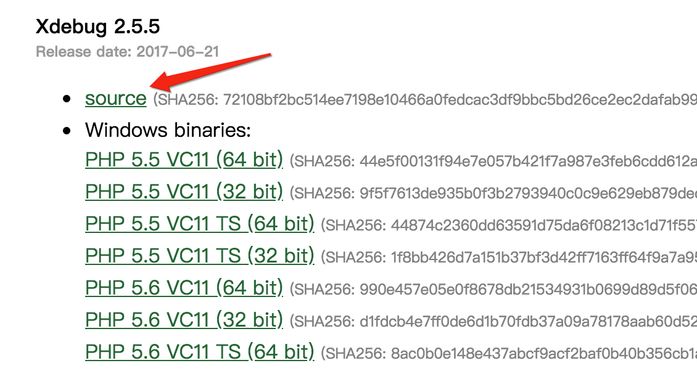
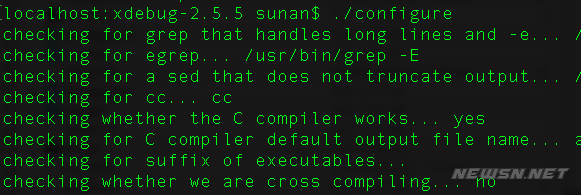
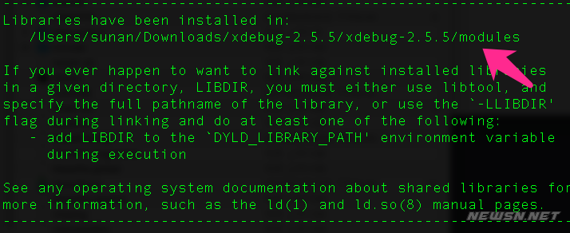
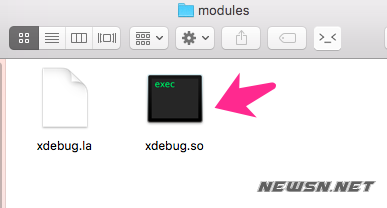

# PHP-record


---


```php
echo 'hello world'
```

## mac如何安装php扩展xdebug

### 第一步，下载xdebug源码，并解压
https://xdebug.org/download.php

mac 下载 source


### 第二步，在解压的目录里面执行phpize和make。
需要在有config.m4这个文件的这一级执行phpize，否则会报错，找不到config.m4的。


```bash
phpize 
./configure
make
```





---

在make的结果中，我们看到了最终的扩展文件的生成的模块位置。然后，我们就可以看到，这个千呼万唤始出来的xdebug.so文件了。



拷贝文件到指定目录

```bash
cp modules/xdebug.so /usr/local/Cellar/php@5.6/5.6.35_1/lib/php/extensions/xdebug/
```


配置xdebug
```bash
touch /usr/local/etc/php/5.6/conf.d/ext-xdebug.ini
```

**ext-xdebug.ini**
```
[xdebug]
; prefix => /usr/local/etc/php/5.4/
zend_extension=/usr/local/Cellar/php@5.6/5.6.35_1/lib/php/extensions/xdebug/xdebug.so

; prefix => /usr/local/etc/php/5.4/
; 该参数是要加载的 xdebug.so 模块，具体是 ext 可以到
; /usr/local/etc/php/5.4/ext 去查看详情，默认会有扩展的目录
; 该配置配置于：conf.d/ext-xdebug.ini
; zend_extension = ext/xdebug.so
; 远程是否可以用，必须
xdebug.remote_enable = on
; 远程的 host，默认本地，然后可以配置为 vagrant 的地址
xdebug.remote_host = 127.0.0.1
; 使用非 9000 默认端口，9000 端口我失败了，所以最好改动一下，避免 fuck
xdebug.remote_port = 9000
; 使用 dbgp 做 80 端口代理
xdebug.remote_handler = dbgp
; 这里的 的 key 必须和到时候 IDE 中的一致
xdebug.idekey = PHPSTORM
; 输出的日志文件，个人觉得很重要
xdebug.remote_log = /Users/stone/soft/XDEBUGSETUP/tmp/xdebug.log
```
**`重启Apache 重启Apache 重启Apache`**

---

## 通过Homebrew安装的内部Apache和Apache之间的冲突

mac apache /private/etc/apache2/httpd.conf vs /usr/local/etc/httpd/httpd.conf

https://apple.stackexchange.com/questions/312988/conflict-between-internal-apache-and-apache-installed-via-homebrew

## 教你如何开启/关闭ubuntu防火墙


---

## apache服务器下，显示目录文件列表

https://blog.csdn.net/Love_your_life/article/details/80257202


---


## Install failed, "zlib not available" on macOS Mojave

<https://github.com/pyenv/pyenv/issues/1219>


---


# Live Reloading PHP Applications With Nodemon

<https://sergeyzhuk.me/2019/09/16/live-reload-php-applications/>

```js
{
    "verbose": false,
    "ignore": [
        ".git",
        ".idea"
    ],
    "execMap": {
        "php": "php"
    },
    "restartable": "r",
    "ext": "php"
}
```

```bash
> nodemon server.php
> [nodemon] 1.19.1
> [nodemon] to restart at any time, enter `r`
> [nodemon] watching: *.*
> [nodemon] starting `php server.php`
> Listening on http://127.0.0.1:8000
```


```plain

几个 PHP 的“魔术常量”
名称	说明
__LINE__	文件中的当前行号。
__FILE__	文件的完整路径和文件名。如果用在被包含文件中，则返回被包含的文件名。自 PHP 4.0.2 起，__FILE__ 总是包含一个绝对路径（如果是符号连接，则是解析后的绝对路径），而在此之前的版本有时会包含一个相对路径。
__DIR__	文件所在的目录。如果用在被包括文件中，则返回被包括的文件所在的目录。它等价于 dirname(__FILE__)。除非是根目录，否则目录中名不包括末尾的斜杠。（PHP 5.3.0中新增） =
__FUNCTION__	函数名称（PHP 4.3.0 新加）。自 PHP 5 起本常量返回该函数被定义时的名字（区分大小写）。在 PHP 4 中该值总是小写字母的。
__CLASS__	类的名称（PHP 4.3.0 新加）。自 PHP 5 起本常量返回该类被定义时的名字（区分大小写）。在 PHP 4 中该值总是小写字母的。类名包括其被声明的作用区域（例如 Foo\Bar）。注意自 PHP 5.4 起 __CLASS__ 对 trait 也起作用。当用在 trait 方法中时，__CLASS__ 是调用 trait 方法的类的名字。
__TRAIT__	Trait 的名字（PHP 5.4.0 新加）。自 PHP 5.4 起此常量返回 trait 被定义时的名字（区分大小写）。Trait 名包括其被声明的作用区域（例如 Foo\Bar）。
__METHOD__	类的方法名（PHP 5.0.0 新加）。返回该方法被定义时的名字（区分大小写）。
__NAMESPACE__	当前命名空间的名称（区分大小写）。此常量是在编译时定义的（PHP 5.3.0 新增）。
```


---

# [解决Apache提示"You don't have permission to access..."错误](https://www.itbulu.com/permission-to-access.html)


---


## Apache通过配置端口访问不同目录

<https://www.jianshu.com/p/4f9d813513ab>