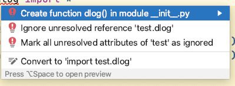
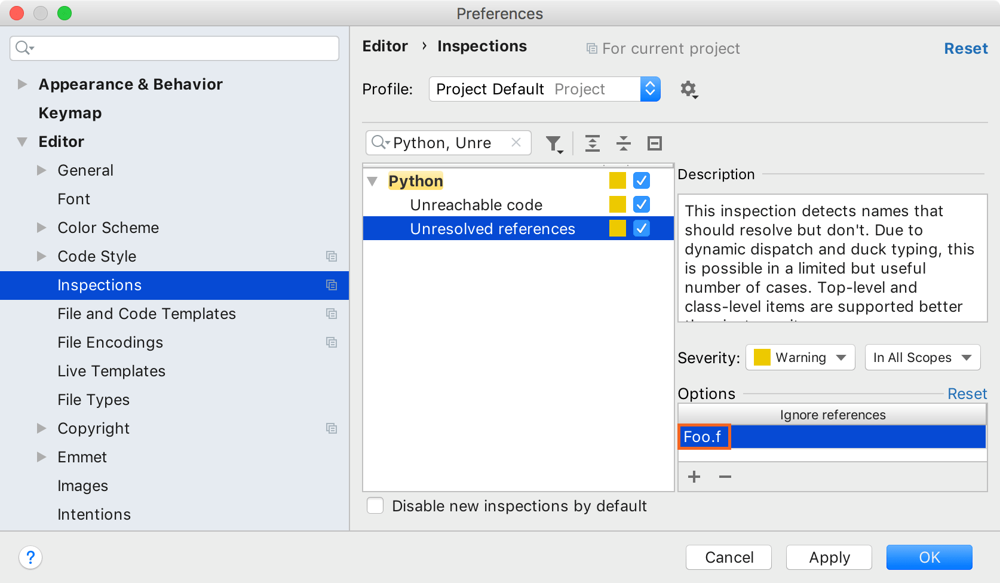
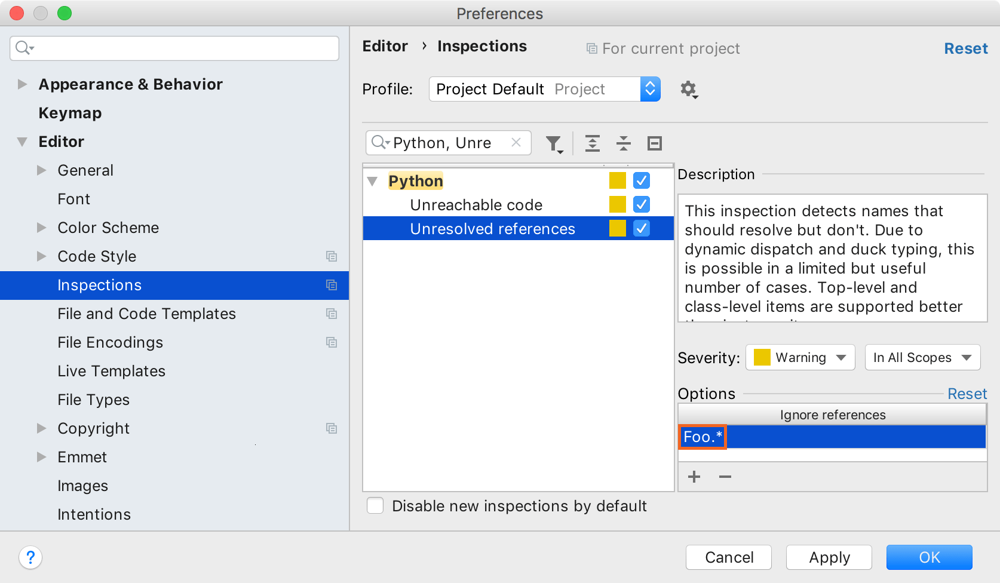
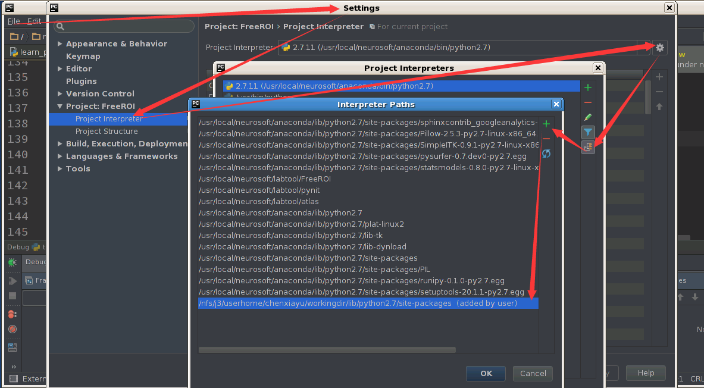
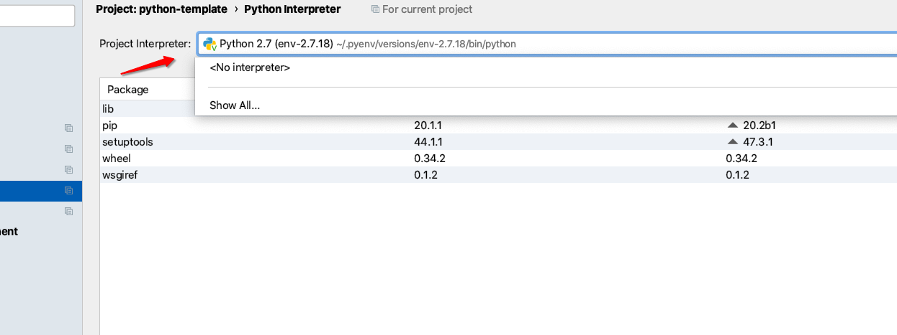
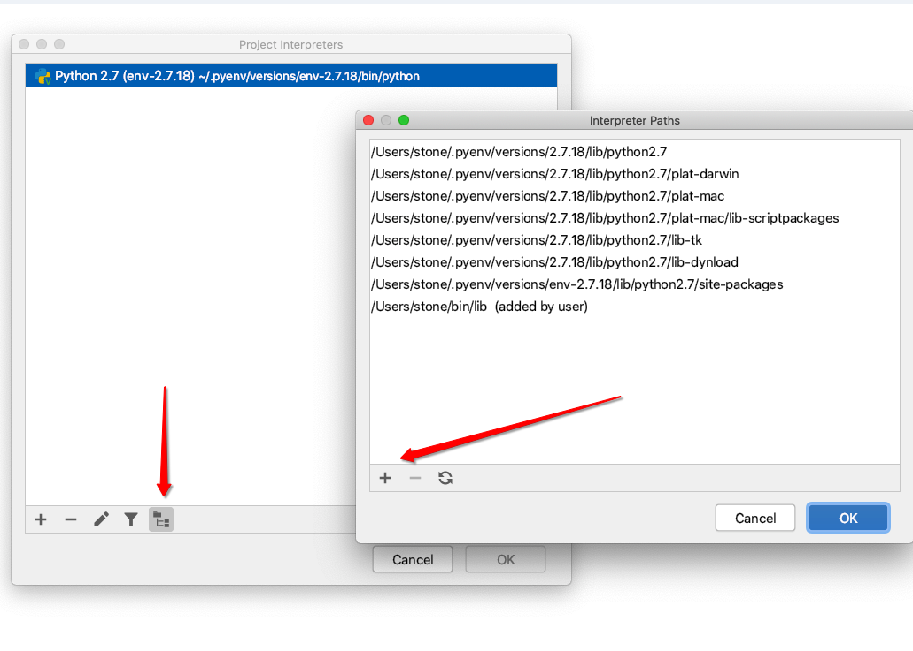

@(工作笔记)

# PyCharm-record

[TOC]

---

---

## Mark all attributes of <fully qualified type name> as ignored

https://www.jetbrains.com/help/pycharm/resolving-references.html

## 为pycharm设置搜索路径

为了能让python解释器找到我安装的python包的位置，我把该位置添加到了PYTHONPATH中，结果试了半天，pycharm中的解释器都没能检测到我那个包的存在，而在终端打开python的命令交互模式都是可以获取我在PYTHONPATH中设置的路径的。（气得我一口老血喷出来，哪位大神要是知道这是什么情况，敬请告知呀喵。感激不尽呦^_^）
好了，说正事了。pycharm这么气人怎么办呢？闹了半天终于找到解决办法了，废话不多说，一张图解释一切！
（第三个箭头指向的齿轮状按钮中选择more那一项，第四个箭头指向的按钮是show paths for the selected interpreter之类的意思）

