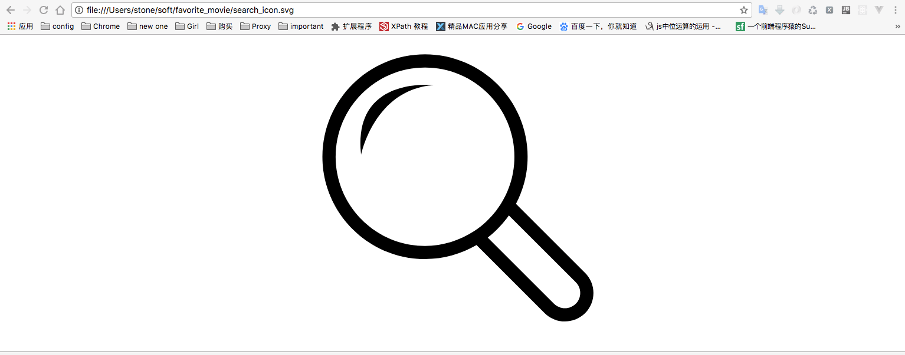
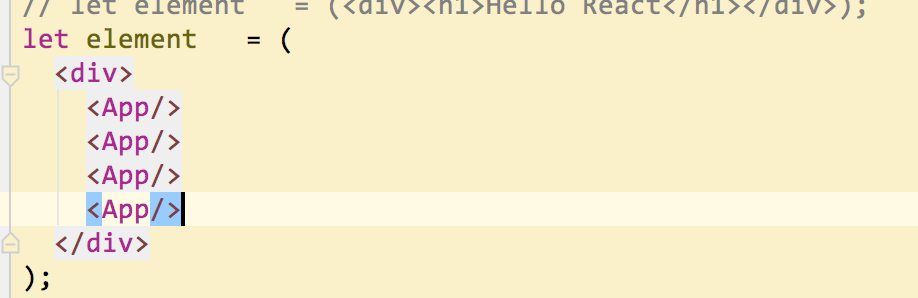

# React-record
trap-record


---


```vbscript-html
<App>hello world</App>
```

## create-react-app 使用 antd，按需加载
https://juejin.im/post/5bff60ab5188250f3e1d2933

---

## 验证三个数组都不为空

```javascript
arr1.length * arr2.length * arr3.length !== 0
```

## svg获取


扩展名改成 .svg 保存
拖动文件到浏览器 预览



## setState()

```
setState(updater, [callback])
```
setState() 排队更改组件的 state ，并通过更新 state 来告诉 React ，该组件及其子组件需要重新渲染。这是用于 响应事件处理程序 和 服务器响应 更新用户界面的主要方法。

记住 setState() 作为一个请求，而不是立即命令来更新组件。为了更好的感知性能，React 可能会延迟它，然后合并多个setState()更新多个组件。 React不保证 state 更新就立即应用(重新渲染)。

setState() 并不总是立即更新组件。它可能会 批量 或 延迟到后面更新。这使得在调用 setState() 之后立即读取 this.state 存在一个潜在的陷阱。 而使用 componentDidUpdate 或 setState 回调（setState(updater, callback)），在应用更新后，都将被保证触发。如果你需要根据先前的 state 设置 state，阅读下面的 updater 参数。

setState() 总是会导致重新渲染，除非 shouldComponentUpdate() 返回 false 。如果可变对象被使用，并且条件渲染逻辑不能在 shouldComponentUpdate() 中实现，只有当新 state 与先前 state 不同时调用 setState() 才能避免不必要的重新渲染。

在这个签名中，第一个参数是的一个 updater 函数：

```
(prevState, props) => stateChange
```

prevState 是对先前 state 的引用。 它不会直接突变。 相反，应该根据输入的 prevState 和 props 构建一个新的对象来表示更改。 例如，假设我们想通过 props.step 在 state 中增加一个值

```
this.setState((prevState, props) => {
  return {counter: prevState.counter + props.step};
});
```

updater 函数接收到的 prevState 和 props 保证都是最新的。updater 输出的与 prevState 的浅层合并。

传递给 setState() 的第二个参数是一个可选的回调函数，这个回调函数将在 setState 完成后执行，并且重新渲染组件。通常，这样的逻辑我们建议使用 componentDidUpdate() 。

您可以随意的传递 一个对象 作为 setState() 的第一个参数，而不是一个函数：

```
setState(stateChange, [callback])
```

这将执行 stateChange 的浅合并到新的 state ，例如，调整购物车物品数量：

```
this.setState({quantity: 2})
```

这种形式的 setState() 也是异步的，并且在同一周期内的多个调用可以被合并在一起执行批处理。例如，如果您尝试在同一周期内多次增加项目数量，这将导致的结果相当于：

```
Object.assign(
  previousState,
  {quantity: state.quantity + 1},
  {quantity: state.quantity + 1},
  ...
)
```

同一周期中，后续调用将覆盖先前调用的值，所以数量只会增加一次。如果下一个 state 取决于以前的 state ，我们推荐使用 updater 函数形式：

```
this.setState((prevState) => {
  return {counter: prevState.quantity + 1};
});
```

---

## react with JSX for {if…else…}
参考:<https://blog.csdn.net/wmzy1067111110/article/details/51538241>

在react中用jsx渲染dom的时候经常会遇到if条件判断，然而在jsx中竟是不允许if条件判断的。以下有几种判断方式，可以根据自己的应用场景，挑选适合的。

方案一：js域判断
```javascript
class HelloMessage extends React.Component {
  render() {
    let userMessage;
    if (this.props.loggedIn) {
      userMessage = (
        <span>
          <h2>{ `Welcome Back ${ this.props.name }` }</h2>
          <p>You can visit settings to reset your password</p>
        </span>
      );
    } else {
      userMessage = (
        <h2>Hey man! Sign in to see this section</h2>
      );
    }
    return (
      <div>
        <h1>My Super React App</h1>
        { userMessage }
      </div>
    );
  }
}
```

方案二：外置函数(得返回标签)
```javascript
class HelloMessage extends React.Component {

  renderUserMessage() {
    if (this.props.loggedIn) {
      return (
        <span>
          <h2>{ `Welcome Back ${ this.props.name }` }</h2>
          <p>You can visit settings to reset your password</p>
        </span>
      );
    } else {
      return (
        <h2>Hey man! Log in to see this section</h2>
      );
    }
  }

  render() {
    return (
      <div>
        <h1>My Super React App</h1>
        { this.renderUserMessage() }
      </div>
    );
  }
}
```

方案三：三元运算符
```javascript
class HelloMessage extends React.Component {
  render() {
    return (
      <div>
        <h1>
          { this.props.loggedIn ? 'You are logged In' : 'You are not logged In' }
        </h1>
      </div>
    );
  }
}
```

方案四：三元运算符
```javascript
class HelloMessage extends React.Component {
  render() {
    return (
      <div>
        <h1>My Super React App</h1>
        {
          this.props.loggedIn ? <span><h2>{ `Welcome Back ${ this.props.name }` }</h2><p>You can visit settings to reset your password</p></span> : <h2>Hey man! Log in to see this section</h2>
        }
      </div>
    );
  }
}
```
方案五：拆分成小函数
```javascript
// 拆分成小函数
class HelloMessage extends React.Component {
  renderLogin() { 
    // 如果这里有多行，推荐用这种方法
    const { loggedIn, name } = this.props;
    if (!loggedIn) {
      return;
    }

    return (<span>
      <h2>Welcome Back {name}</h2>
      <p>You can visit settings to reset your password</p>
    </span>);
  }

  render() {
    return (
      <div>
        <h1>My Super React App</h1>
        {this.renderLogin()}
      </div>
    );
  }
}
```
综上：短小的字段判断只能用三元表达式，如果是大块的元素都需要区分，就要利用变量了。

---

## error 记录
```
Module build failed: SyntaxError: Adjacent JSX elements must be wrapped in an enclosing tag (8:2)

模块构建失败：SyntaxError：相邻的JSX元素必须包装在一个封闭标签中(8：2)
```


## 约束性组件 & 非约束性组件
参考: <https://blog.csdn.net/function__/article/details/72357251>


---

## Build fails after eject: Cannot find module '@babel/plugin-transform-react-jsx' #6099

https://github.com/facebook/create-react-app/issues/6099
