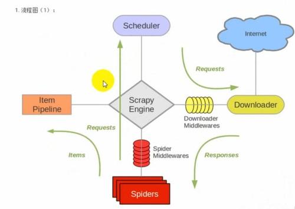
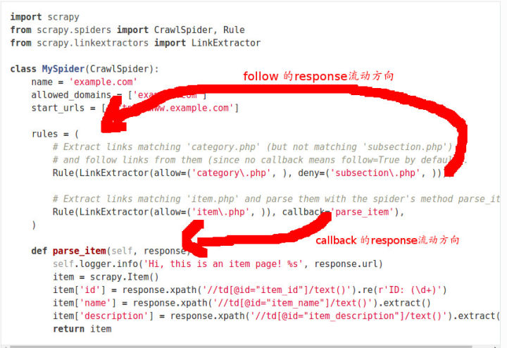

@(工作笔记)

# Scrapy-record




[TOC]

---

## 创建项目


```python
scrapy startproject scrapy_template
```

```plain
New Scrapy project 'scrapy_template', using template directory '/Users/stone/.pyenv/versions/env-3.8.3/lib/python3.8/site-packages/scrapy/templates/project', created in:
    /Users/stone/Documents/test_directory/scrapy_template

You can start your first spider with:
    cd scrapy_template
    scrapy genspider example example.com
```


## ROBOTSTXT_OBEY = False 粗解

爬虫协议，即 robots 协议，也叫机器人协议
 它用来限定爬虫程序可以爬取的内容范围
 通常写在 robots.txt 文件中

该文件保存在网站的服务器上
 爬虫程序访问网站时首先查看此文件

在 scrapy 项目的 `settings.py` 文件中
 默认 `ROBOTSTXT_OBEY = True` ，即遵守此协议
 当爬取内容不符合该协议且仍要爬取时
 设置 `ROBOTSTXT_OBEY = False` ，不遵守此协议


## [Scrapy Shell - How to change USER_AGENT](https://stackoverflow.com/questions/25429671/scrapy-shell-how-to-change-user-agent)

```bash
scrapy shell -s USER_AGENT='custom user agent' 'http://www.example.com'
```


---


There's a number of ways of doing this, but one of the simplest is to implement `parse_start_url` and then modify `start_urls`


```python
from scrapy.contrib.spiders import CrawlSpider, Rule
from scrapy.contrib.linkextractors.sgml import SgmlLinkExtractor
from scrapy.selector import HtmlXPathSelector

class DownloadSpider(CrawlSpider):
    name = 'downloader'
    allowed_domains = ['bnt-chemicals.de']
    start_urls = ["http://www.bnt-chemicals.de/tunnel/index.htm"]
    rules = (
        Rule(SgmlLinkExtractor(allow='prod'), callback='parse_item', follow=True),
        )
    fname = 1

    def parse_start_url(self, response):
        return self.parse_item(response)


    def parse_item(self, response):
        open(str(self.fname)+ '.txt', 'a').write(response.url)
        open(str(self.fname)+ '.txt', 'a').write(','+ str(response.meta['depth']))
        open(str(self.fname)+ '.txt', 'a').write('\n')
        open(str(self.fname)+ '.txt', 'a').write(response.body)
        open(str(self.fname)+ '.txt', 'a').write('\n')
        self.fname = self.fname + 1
```


---

# [How to give URL to scrapy for crawling?](https://stackoverflow.com/questions/9681114/how-to-give-url-to-scrapy-for-crawling)

```python
class MySpider(BaseSpider):

    name = 'my_spider'    

    def __init__(self, *args, **kwargs): 
      super(MySpider, self).__init__(*args, **kwargs) 

      self.start_urls = [kwargs.get('start_url')] 
```


## [Scrapy框架get() 、getall() 、extract() 、extract_first()的区别](https://segmentfault.com/a/1190000018559454)

**开篇明义：get() 、getall() 是新版本的方法，extract() 、extract_first()是旧版本的方法。**

**前者更好用，取不到就返回None，后者取不到就raise一个错误。**

**推荐使用新方法，官方文档中也都改用前者了**


---

[*XPATH*之*normalize-space*(.)和*normalize-space*(text())区别](https://blog.csdn.net/weixin_30414155/article/details/95519362)


## Scrapy中如何向Spider传入参数

<https://blog.csdn.net/pengjunlee/article/details/90604736>


```python
# -*- coding: utf-8 -*-
import scrapy
 
class TiebaSpider(scrapy.Spider):
    name = 'tieba'  # 贴吧爬虫
    allowed_domains = ['tieba.baidu.com']  # 允许爬取的范围
    start_urls = []  # 爬虫起始地址
 
    # 命令格式： scrapy crawl tieba -a tiebaName=放置奇兵 -a pn=250
    def __init__(self, tiebaName=None, pn=None, *args, **kwargs):
        print('< 贴吧名称 >： ' + tiebaName)
        super(eval(self.__class__.__name__), self).__init__(*args, **kwargs)
        self.start_urls = ['https://tieba.baidu.com/f?kw=%s&ie=utf-8&pn=%s' % (tiebaName,pn)]
 
    def parse(self, response):
        print(response.request.url) # 结果：https://tieba.baidu.com/f?kw=%E6%94%BE%E7%BD%AE%E5%A5%87%E5%85%B5&ie=utf-8&pn=250
```


## 别再滥用scrapy CrawlSpider中的follow=True

<https://zhuanlan.zhihu.com/p/25650763>

其实源代码中还解释了文档中提到的关于rules顺序的问题:

> Each Rule defines a certain behaviour for crawling the site. Rules objects are described below. If multiple rules match the same link, the first one will be used, according to the order they’re defined in this attribute.

多个Rule匹配同一个链接, 只有第一个Rule会被使用, 用源代码来解释就是我们匹配到了链接已经添加到set中去重了, 所以之后的匹配都无法添加. 所以我们在使用rules时, 如果两个Rule有交集, 要注意顺序.

