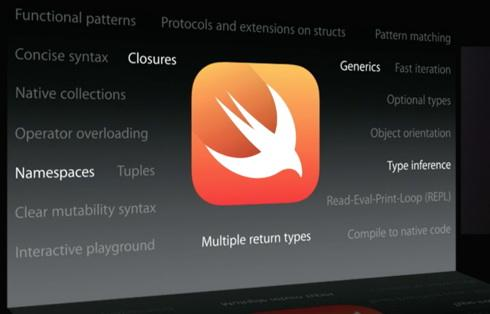
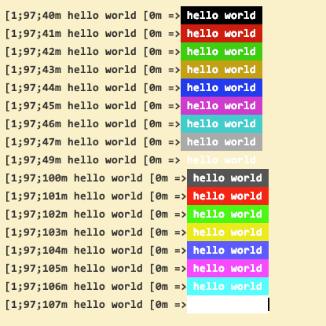
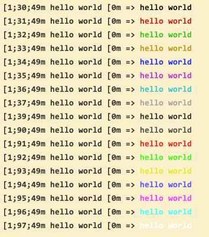

@(工作笔记)

# Swift-record

[TOC]

---



---

## 背景色


```plain
[1;97;40m hello world [0m => hello world 
[1;97;41m hello world [0m => hello world 
[1;97;42m hello world [0m => hello world 
[1;97;43m hello world [0m => hello world 
[1;97;44m hello world [0m => hello world 
[1;97;45m hello world [0m => hello world 
[1;97;46m hello world [0m => hello world 
[1;97;47m hello world [0m => hello world 
[1;97;49m hello world [0m => hello world 
[1;97;100m hello world [0m => hello world 
[1;97;101m hello world [0m => hello world 
[1;97;102m hello world [0m => hello world 
[1;97;103m hello world [0m => hello world 
[1;97;104m hello world [0m => hello world 
[1;97;105m hello world [0m => hello world 
[1;97;106m hello world [0m => hello world 
[1;97;107m hello world [0m => hello world 
```

## 前景色


```plain
[1;30;49m hello world [0m => hello world 
[1;31;49m hello world [0m => hello world 
[1;32;49m hello world [0m => hello world 
[1;33;49m hello world [0m => hello world 
[1;34;49m hello world [0m => hello world 
[1;35;49m hello world [0m => hello world 
[1;36;49m hello world [0m => hello world 
[1;37;49m hello world [0m => hello world 
[1;39;49m hello world [0m => hello world 
[1;90;49m hello world [0m => hello world 
[1;91;49m hello world [0m => hello world 
[1;92;49m hello world [0m => hello world 
[1;93;49m hello world [0m => hello world 
[1;94;49m hello world [0m => hello world 
[1;95;49m hello world [0m => hello world 
[1;96;49m hello world [0m => hello world 
[1;97;49m hello world [0m => hello world 
```

```swift
// i 范围
    // { "Default", "0" },
    // { "Bold", "1" },
    // { "Dim", "2" },
    // { "Underlined", "3" },
    // { "Blink", "5" },
    // { "Reverse", "7" },
    // { "Hidden", "8" }
    let iList = [0, 1, 2, 3, 5, 7, 8]
    // j 前景色
    // { "Default", "39" },
    // { "Black", "30" },
    // { "Red", "31" },
    // { "Green", "32" },
    // { "Yellow", "33" },
    // { "Blue", "34" },
    // { "Magenta", "35" },
    // { "Cyan", "36" },
    // { "Light Gray", "37" },
    // { "Dark Gray", "90" },
    // { "Light Red", "91" },
    // { "Light Green", "92" },
    // { "Light Yellow", "93" },
    // { "Light Blue", "94" },
    // { "Light Magenta", "95" },
    // { "Light Cyan", "96" },
    // { "White", "97" }
    let jList = [30, 31, 32, 33, 34, 35, 36, 37, 39, 90, 91, 92, 93, 94, 95, 96, 97]
    // k 背景色
    // { "Default", "49" },
    // { "Black", "40" },
    // { "Red", "41" },
    // { "Green", "42" },
    // { "Yellow", "43" },
    // { "Blue", "44" },
    // { "Megenta", "45" },
    // { "Cyan", "46" },
    // { "Light Gray", "47" },
    // { "Dark Gray", "100" },
    // { "Light Red", "101" },
    // { "Light Green", "102" },
    // { "Light Yellow", "103" },
    // { "Light Blue", "104" },
    // { "Light Magenta", "105" },
    // { "Light Cyan", "106" },
    // { "White", "107" }

    let kList = [40, 41, 42, 43, 44, 45, 46, 47, 49, 100, 101, 102, 103, 104, 105, 106, 107]
    // 结束符
    // { "All", "0" },
    // { "Bold", "21" },
    // { "Dim", "22" },
    // { "Underlined", "24" },
    // { "Blink", "25" },
    // { "Reverse", "27" },
    // { "Hidden", "28" }
    let eList = [0, 21, 22, 24, 25, 27, 28]
```

## swift extension 增加属性

https://stackoverflow.com/questions/25426780/how-to-have-stored-properties-in-swift-the-same-way-i-had-on-objective-c
