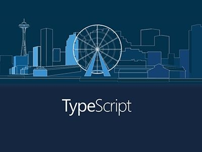

# Typescript-record


---



```
/hello world/
```

---

## Unknown compiler option 'exclude'

Actually, files, include, etc. are top level fields
```typescript
{
  "compilerOptions": {},
  "exclude": []
}
```


## TS2538: Type 'symbol' cannot be used as an index type.

```typescript
let sym = Symbol();

let obj = {

[sym]: "value"

};

console.log(obj[sym]); 
```


当我运行typescript官方文档上这段代码时出现报错信息如下


根本原因是因为Symbol本身定义的是唯一且不可以改变的, 所以用let不合适，将上边代码中的let改为const就可以了!  正确运行代码如下

```typescript
const sym = Symbol();

let obj = {

  [sym]: "value"

};

console.log(obj[sym]); 
```


---


发现一个很好的工具dts-gen，
https://github.com/Microsoft/dts-gen

# [给JS包写TypeScript用的类型申明文件](https://www.cnblogs.com/wtang/p/8910889.html)


---


# TypeScript类型定义文件（*.d.ts）生成工具

```plain
原文：https://www.cnblogs.com/chenjinxinlove/p/9778609.html
在开发ts时，有时会遇到没有d.ts文件的库，同时在老项目迁移到ts项目时也会遇到一些文件需要自己编写声明文件，但是在需要的声明文件比较多的情况，就需要自动生产声明文件。用过几个库。今天简单记录一下。自己怎么编写有很多教程和文档，那里就不介绍了。

1、为整个包添加声明文件

使用微软的dts-gen

简单使用

npm install -g dts-gen   // 先全局安装dts-gen
npm install -g yargs     // 然后在全局安装你需要生产声明文件的库
dts-gen -m yargs         // 执行命令生成文件
在你执行的文件的路径下（一般是项目的根目录）生成了yargs.d.ts

其他参数和功能自行参考文档

2、为单个文件生产声明文件

使用dtsmake

简单使用

npm i dtsmake -g   // 先全局安装dtsmake
 
dtsmake -s ./path/to/sourcefile.js  // 在对应的文件生产文件
说明：

生成的文件一般都会有一些问题，需要自己稍微修改一下，如果不想写类型直接用any
执行的时候可能会报错tern没有按装，就需要在安装一下,在项目目录 npm i tern --save-dev
其他参数和功能自行参考文档

其他

dtsgenerator - d.ts file generator tool, for only JSON Schema files.
js2tsd - d.ts file generator tool, no type inferrence.
JS2TSD d.ts file generator GUI tool app. Not CLI.
```

