@(工作笔记)

# Ubantu16.04.3-record

[TOC]

---


---

## 安装中文包
**ubuntu16.04在英文状态下安装中文语言包的过程(法一：图形界面的方式) 以及 安装中文语言包后无法选择汉语问题的解决**

 1. 笔记本安装的ubuntu是桌面的，安装语言包非常方便，桌面版本选择 齿轮 --> System --> System Settings... --> Language Support 再选择中文语言包安装。如下下图所示：
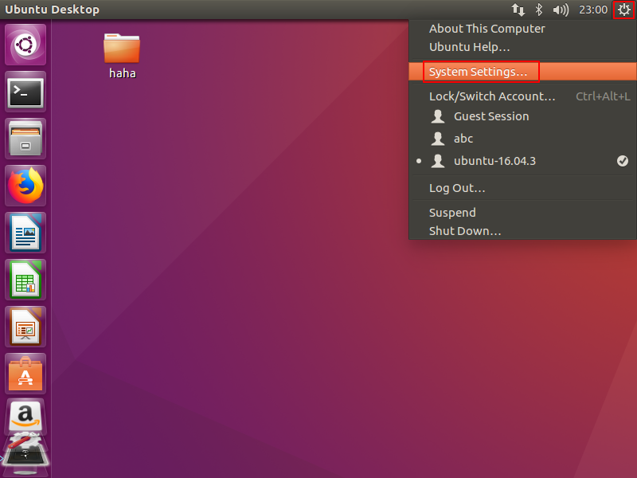


 2. 完成设置后点击【Install/Remove Language】，在弹出的窗口找到【Chinese(simplified)】，最后点击【Apply】。如下图所示：
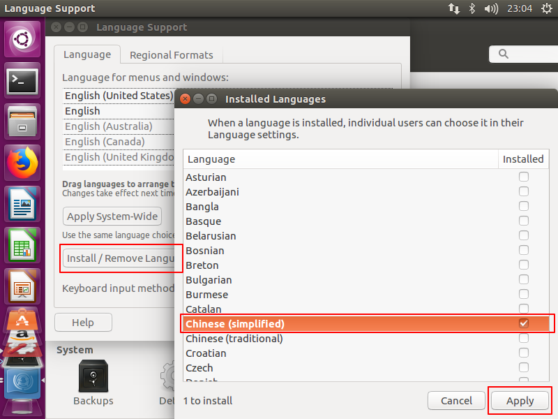 

3. 安装Ubuntu语言包过程中可能要输入密码，输入后确定即可。如下图所示：
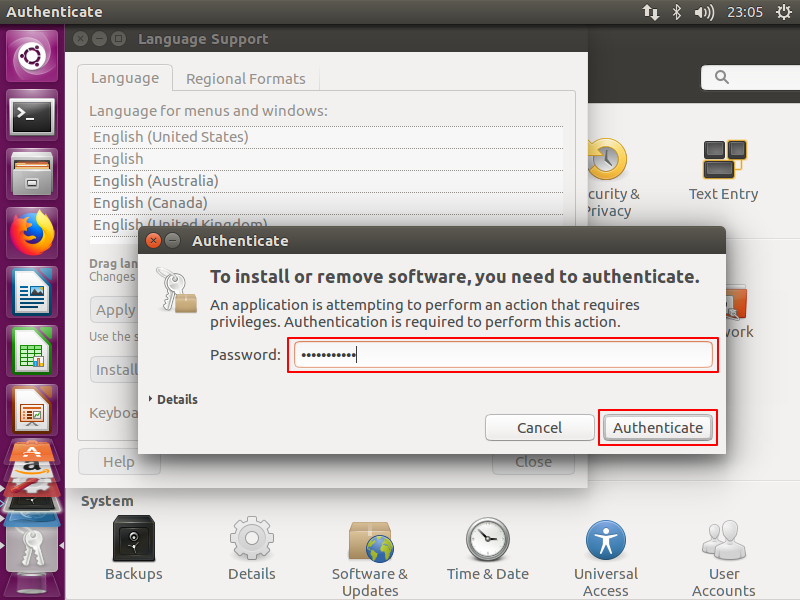

4. 安装完中文语言包后，虽然里面有了汉语(中国)，但是是灰色的。会发现安装的语言包后无法选择汉语。如下图所示：
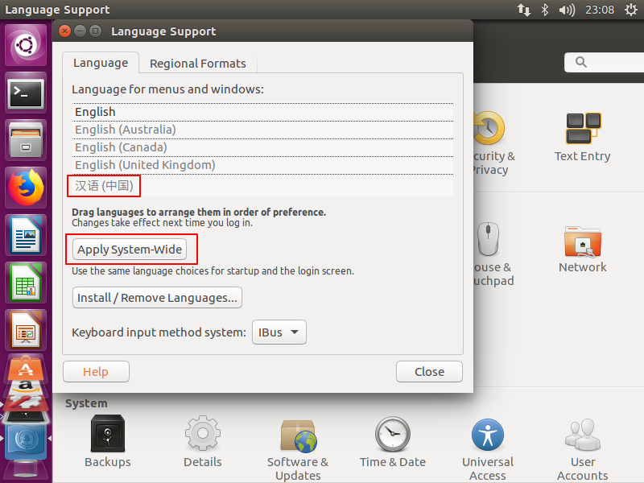

5. 解决方法：用鼠标点中“汉语(中国)”，将其拖动到顶端即可。这时汉语就高亮了，如果拖到顶端无效果，重启即可。
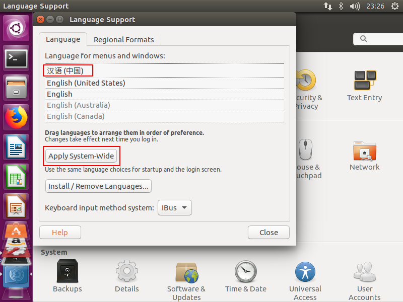
6. 安装Ubuntu语言包过程中可能要输入密码，输入后确定即可。如下图所示：
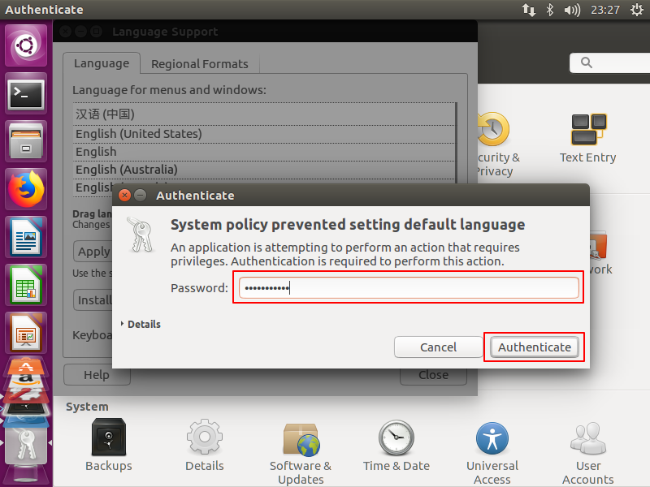
7. 稍等片刻即可。若等待时间比较长，请退出并重启系统即可。知道此法可行，要改就改的彻底，将语言的地区格式也改为汉语(中国)，并应用到整个系统，如下图所示：

8. 更改完毕后，重启即可。
>整个安装过程的几点说明：
`1.Ubuntu设置中文语言后，需要关闭ubuntu，重启打开之后才会生效为中文。`
2.安装Ubuntu中文语言包过程中可能要输入密码，输入后确定即可。
3.由于第四步操作需要下载中文语言包，因此安装Ubuntu语言必须联网。

---

## Ubantu的默认root密码是多少，修改root密码

https://www.cnblogs.com/mmdln/p/9071525.html

1. Ubuntu的
默认root密码是随机的，即每次开机都有一个新的root密码。我们可以在终端输入命令 sudo passwd，然后输入当前用户的密码，enter，

2. 终端会提示我们输入新的密码并确认，此时的密码就是root新密码。修改成功后，输入命令 su root，再输入新的密码就ok了。

---

## Ubuntu上开启SSH服务
https://blog.csdn.net/md521/article/details/52597398

1. 更新源列表
打开"终端窗口"，输入"sudo apt-get update"-->回车-->"输入当前登录用户的管理员密码"-->回车,就可以了。


2. 安装openssh-server
在终端中输入: 
```bash
sudo apt-get install openssh-server
```


3. 查看查看ssh服务是否启动
打开"终端窗口"，输入"sudo ps -e |grep ssh"-->回车-->有sshd,说明ssh服务已经启动，如果没有启动，输入"sudo service ssh start"-->回车-->ssh服务就会启动。

```bash
## 查看 是否启动
sudo ps -e | grep ssh

## 启动 ssh 服务
sudo service ssh start


```


没有找到ssh服务。
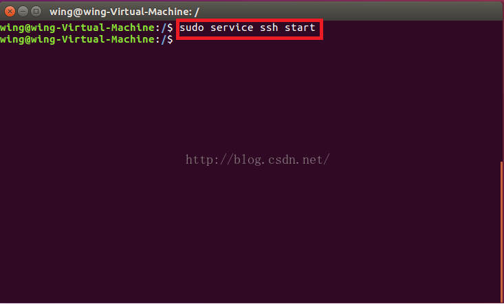

然后再输入上述命令，查询ssh服务。
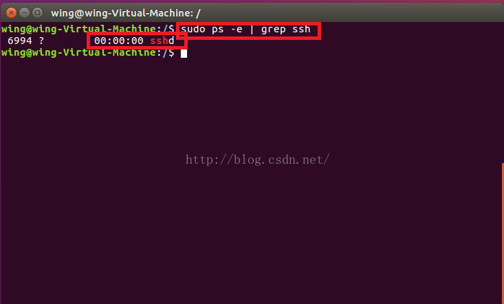

4. 查看Ubuntu IP地址。
输入：sudo ifconfig


---

## 关闭自动锁屏
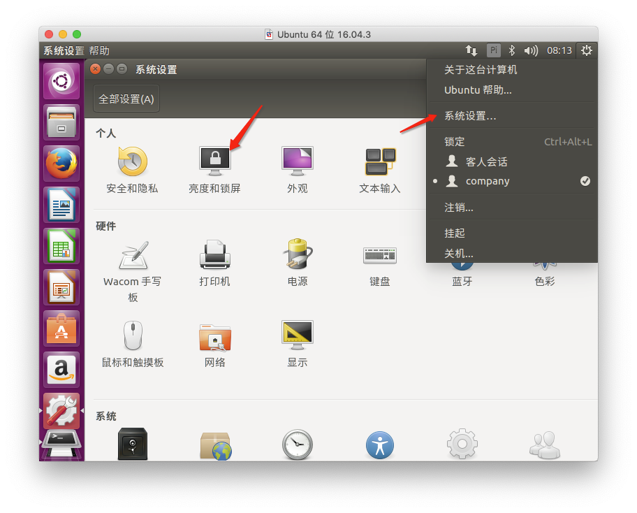
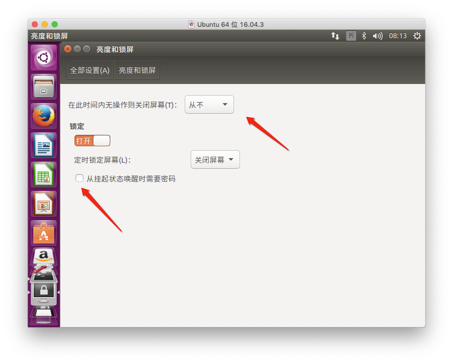

---

## 网络独立出去


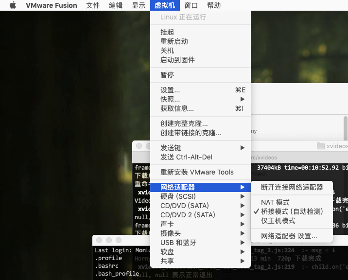

---

## Linux root用户不能通过SSH连接的问题

1. 安装vim

```bash
sudo apt-get install vim
```

2. 需要修改配置文件
```bash
sudo vim /etc/ssh/sshd_config
```


3. 重启 ssh 服务
```bash
sudo service ssh restart
```

4. 使用ssh 连接
```
ssh root@192.168.1.109
```

---

## nvm 安装

1. 安装git
```bash
sudo apt-get install git
```

2.  安装nvm

```bash
wget -qO- https://raw.githubusercontent.com/creationix/nvm/v0.34.0/install.sh | bash

# 需重新打开一个终端
输入 nvm
看到版本信息就表示安装成功了
```

3. nvm 安装node

```bash
nvm install v8.15.0

nvm use v8.15.0
nvm alias default v8.15.0
node -v
```

4. 安装pm2

```bash
npm --registry=https://registry.npm.taobao.org install -g pm2

pm2 start app.js

## 列出 所有服务
pm2 list

## 查看摸个服务信息
pm2 show app

## 查看log
pm2 logs
```

5. 制作cnpm 

```bash
vim ~/.bashrc
```

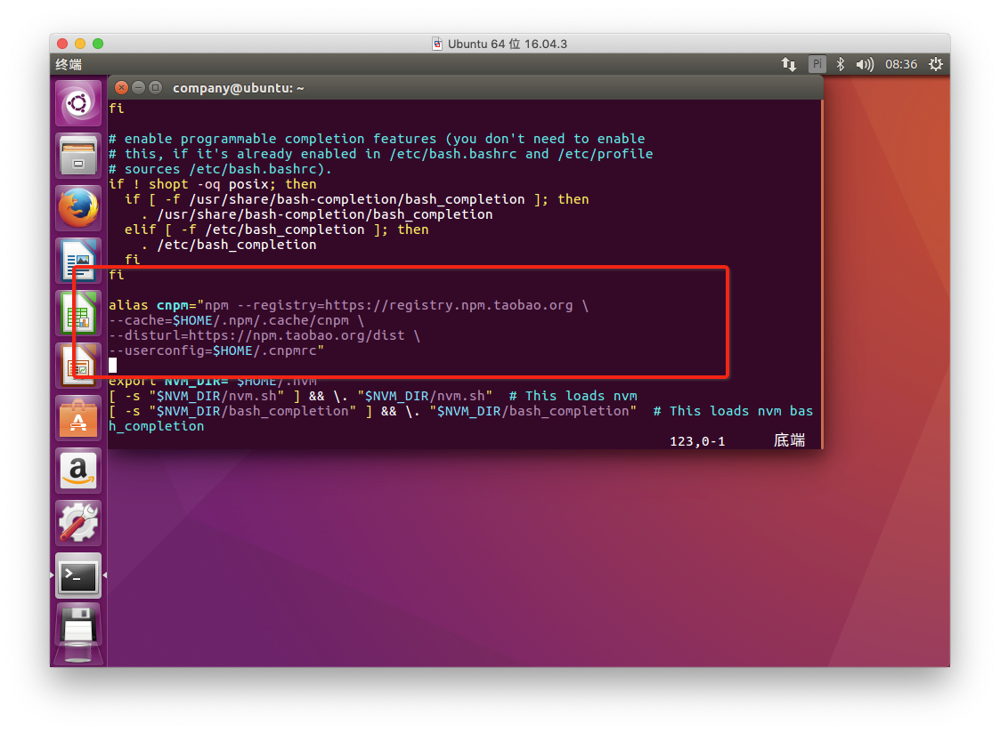

```bash
alias cnpm="npm --registry=https://registry.npm.taobao.org \
--cache=$HOME/.npm/.cache/cnpm \
--disturl=https://npm.taobao.org/dist \
--userconfig=$HOME/.cnpmrc"
```

6. 生效
```bash
source ~/.bashrc
```

---

## 关闭防火墙, 如果是新装的默认是关闭的

```bash
# 命令查看开启防火墙后的状态为active 说明防火墙开启成功。
sudo ufw status
```

```bash
# 关闭ubuntu的防火墙
sudo ufw disable

# 开启防火墙
sudo ufw enable
```

## 安装Nginx

```bash
sudo apt-get install nginx
```

```bash
cd /etc/nginx/conf.d
```

```bash
sudo vim stonemovie-8080.conf
```

```
upstream imooc {
    server 127.0.0.1:8080;
}

server {
    listen 80;
    server_name 192.168.1.104;
    location / {
        proxy_set_header X-Real-IP $remote_addr;
        proxy_set_header X-Forward-For $proxy_add_x_forwarded_for;
        proxy_set_header Host $http_host;
        proxy_set_header X-Nginx-Proxy true;

        proxy_pass http://imooc;
        proxy_redirect off;

    }
}
```

```bash
# 检测代码是否正确
sudo nginx -t
sudo nginx -s reload
```

**写个demo 测试nginx**

```javascript
var http = require('http');

http.createServer(function (request, response) {

    // 发送 HTTP 头部 
    // HTTP 状态值: 200 : OK
    // 内容类型: text/plain
    response.writeHead(200, {'Content-Type': 'text/plain'});

    // 发送响应数据 "Hello World"
    response.end('Hello World\n');
}).listen(8888);

// 终端打印如下信息
console.log('Server running at http://127.0.0.1:8888/');
```

---

## `解决 manpath: can't set the locale; make sure $LC_* and $LANG are correct`

```
sudo vi /etc/default/locale 改为如下
LANG=en_US.UTF-8
LC_ALL=en_US.UTF-8
```

---

## mongodb官方安装
https://docs.mongodb.com/manual/tutorial/install-mongodb-on-ubuntu/

---

## 更改mongodb 配置文件 远程能访问
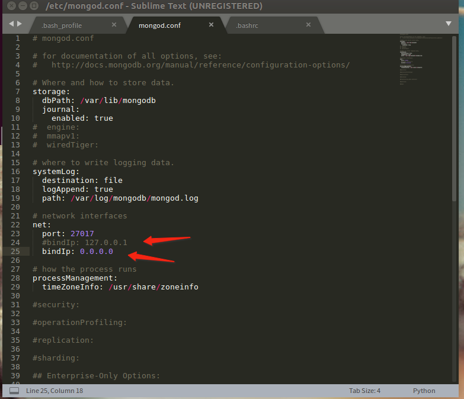

---

## 显示所有命令的别名

```bash
alias
```

---

##  无密码登录root

**ubantu端要做的事**
```bash
su
cd ~
mkdir -p ~/.ssh
cd ~/.ssh

vim authorized_keys
```

**其他要登录ubantu端要做的事**

创建RSA key
```bash
cd ~/.ssh

ssh-keygen -o -t rsa -b 4096 -C "email@example.com"
```

手动修改文件名


```bash
vim config
```

```bash
# ubantu
Host rootubantu
HostName 192.168.1.109
User root
PreferredAuthentications publickey
IdentityFile ~/.ssh/id_rsa.ubantu
```

```
cat ~/.ssh/id_rsa.ubantu.pub
拷贝内容 并复制到 , ubantu 文件 authorized_keys 中

之后使用 ssh rootubantu 就能无密码登录了...
```

---

## ubuntu 16.04 设置固定IP

```plain
配置固定IP
sudo vim /etc/network/interfaces
# 修改打开的文件 The primary network interface下的配置
auto enp0s3
# 设置静态方式
iface enp0s3 inet static
# 设置IP地址
address 192.168.0.88
# 设置子网掩码
netmask 255.255.255.0
# 设置网关地址
gateway 192.168.0.1

2.配置DNS

sudo vim /etc/resolvconf/resolv.conf.d/base
# 写入DNS配置 配置为你的DNS 保存退出
nameserver 8.8.8.8
nameserver 114.114.114.114

3.重启

reboot

```

---

```python
pip install --upgrade --force-reinstall <package>
When upgrading, reinstall all packages even if they are already up-to-date.

pip install -I <package>
pip install --ignore-installed <package>
Ignore the installed packages (reinstalling instead).
```

---

## Ubuntu修改时区和更新时间
先查看当前系统时间

root@ubuntu:/# date -R   
结果时区是：-0500
我需要的是东八区，这儿显示不是，所以需要设置一个时区
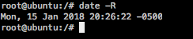

1.运行tzselect

root@ubuntu:/# tzselect
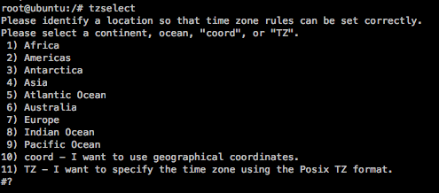


在这里我们选择亚洲 Asia，确认之后选择中国（China)，最后选择北京(Beijing)


2.复制文件到/etc目录下

root@ubuntu:/# cp /usr/share/zoneinfo/Asia/Shanghai  /etc/localtime
3.再次查看时间date -R，已经修改为北京时间


 

 

改时间
修改时间

sudo date -s MM/DD/YY //修改日期
sudo date -s hh:mm:ss //修改时间
在修改时间以后，修改硬件CMOS的时间

sudo hwclock --systohc //非常重要，如果没有这一步的话，后面时间还是不准

---

## Ubuntu下必不可少的编程字体Consolas

Consolas是一套等宽的字体，属无衬线字体，由Lucas de Groot设计。这个字体使用了微软的ClearType 字型平滑技术，并随同Windows Vista、Office 2007及Microsoft Visual Studio中发行，或可在微软的网站下载。

不说了上面的都是废话，哈哈。

**下载**
YaHei.Consolas (https://code.google.com/p/uigroupcode/downloads/list)

**安装**
将上面下载的字体包解压，并按如下操作：

```bash
sudo mkdir -p /usr/share/fonts/consolas
sudo cp YaHei.Consolas.1.12.ttf /usr/share/fonts/consolas/
sudo chmod 644 /usr/share/fonts/consolas/YaHei.Consolas.1.12.ttf
cd /usr/share/fonts/consolas
sudo mkfontscale && sudo mkfontdir && sudo fc-cache -fv
```

**题外话**
在这里再给两款编程常用的字体：(个人爱好罢了)
Monaco：https://github.com/cstrap/monaco-font

```bash
curl -kL https://raw.github.com/cstrap/monaco-font/master/install-font-ubuntu.sh | bash
```

Source Code Pro：https://github.com/adobe-fonts/source-code-pro

```bash
sudo mkdir -p /usr/share/fonts/adobe-fonts/source-code-pro
sudo git clone https://github.com/adobe-fonts/source-code-pro.git /usr/share/fonts/adobe-fonts/source-code-pro
sudo fc-cache -f -v /usr/share/fonts/adobe-fonts/source-code-pro
```


---


## Please check that your locale settings问题

<https://www.jianshu.com/p/32544edd7362>


## 解决 "manpath: can't set the locale; make sure $LC_* and $LANG are correct"

<https://gist.github.com/seafooler/7ab1b6b5676663b884318d3ba76513d9>

