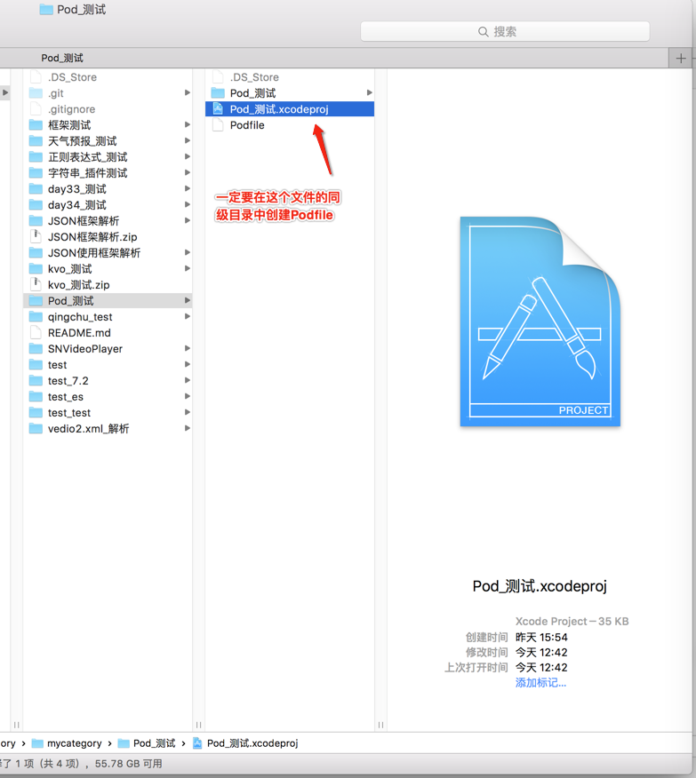
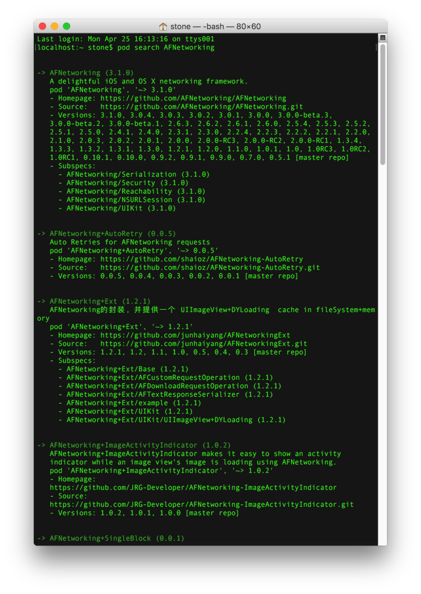

@(开发笔记)

#cocoapods-record


[TOC]

---

#官方
https://cocoapods.org/ 

#更换国内taobao镜像

```
$ gem sources -l

$ gem sources --remove https://rubygems.org/
$ gem sources -a https://gems.ruby-china.com/

$ gem sources -l
```
#CocoaPods安装
```
$ sudo gem install cocoapods
```
如果不行就
```
$ sudo gem install -n /usr/local/bin cocoapods
```

# 安装成功后，接着执行命令：
```
$ pod setup
```
如果卡在这里里很长时间的话 请看文档最下方...(判断是否掉线...)

>**这一步不是必须的**
>如果Ruby环境不够新，可能需要更新以下：
```
$ sudo gem update --system
```

#搜索第三方框架,看看成功安装与否...
```
$pod search AFNetworking
```

#创建Pod文件

**进入工程目录中...**
```
touch Podfile
open Podfile
```



```
platform :ios, "8.0"
pod "AFNetworking"
pod 'MJExtension', '~> 3.0.10'
```


**合起来的操作就是这样...**
进入工程目录文件夹下创建 Podfile


#搜索一个第三方类库：

$ pod search AFNetworking



#安装第三方框架

```
$ pod install (建议直接用pod install --verbose --no-repo-update)
```

>如果遇到pod install或者pod update长时间卡在Updating local specs repositories
>取消命令 control + c

**安装**
```
$ pod install --verbose --no-repo-update
```
**更新**
```
$ pod update --verbose --no-repo-update
```
---

#判断是否掉线...
还有一点需要注意，pod setup在执行时，会输出Setting up CocoaPods master repo，但是会等待比较久的时间。这步其实是 Cocoapods 在将它的信息下载到 ~/.cocoapods目录下，如果你等太久，可以试着 cd 到那个目录，用du -sh *来查看下载进度

```
cd ~/.cocoapods

du -sh *
```


