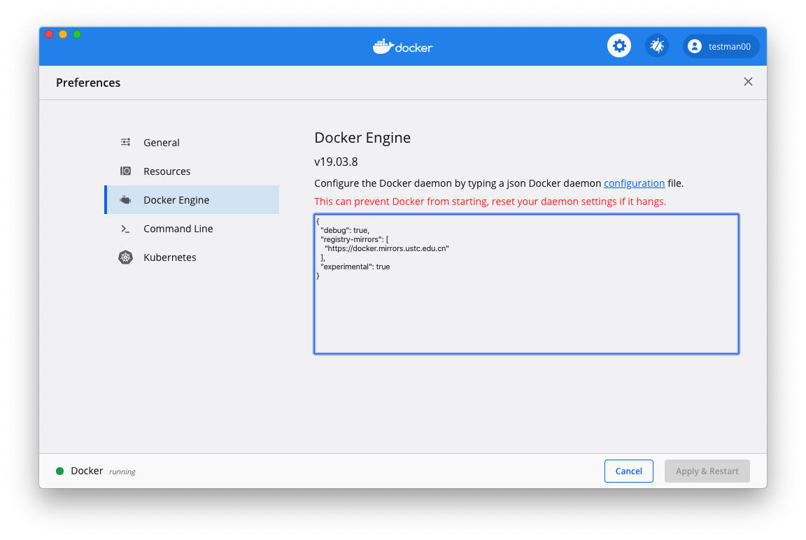
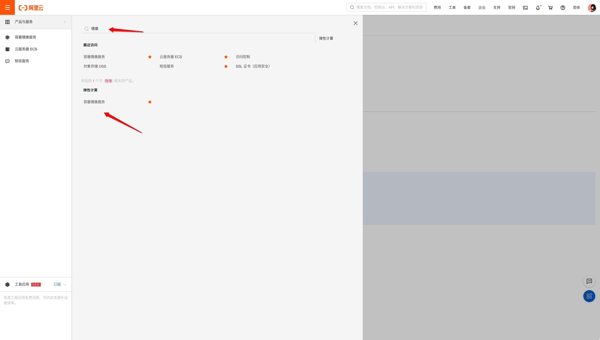
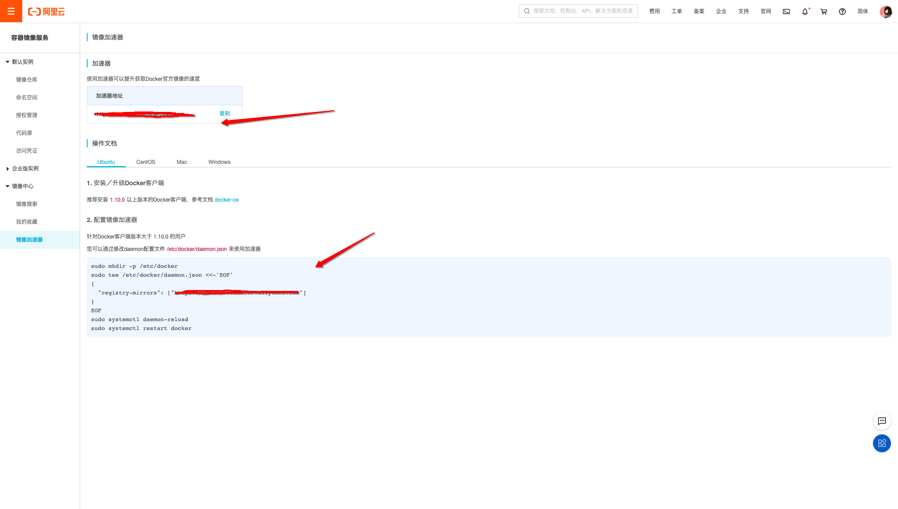

@(工作笔记)

# docker-record


[TOC]

---

## 原始配置










## How to uninstall Docker on your Mac

<https://nektony.com/how-to/uninstall-docker-mac#uninstall_docker_easily>

卸载不好卸载 蛋疼...


---


## docker安装centos后没有ifconfig命令解决办法

<https://blog.csdn.net/Magic_YH/article/details/51292095>

```bash
yum provides ifconfig
yum whatprovides ifconfig
yum install net-tools
```


安装which命令

```bash
yum -y install which
```


---

## 数据容器卷 关在的位置在哪???

OS: macOS High Sierra Version 10.13.2
Docker version: 17.09.1-ce, build 19e2cf6

I was following an example in a book to learn about how volumes work and came across this as well. On my version of docker, it is running from`~/Library/Containers/com.docker.docker` and you can run `screen ~/Library/Containers/com.docker.docker/Data/com.docker.driver.amd64-linux/tty` to get into the shell. Then you can run `ls /var/lib/docker/volumes`


```bash
cd ~/Library/Containers/com.docker.docker/Data/vms/0
screen ./tty

# 进入之后
ls /var/lib/docker/volumes
```


---

**什么是tty?**

TTY是电传打字机Teletypewriter的缩写，在上图中的那种带显示屏的视频终端出现之前，TTY是最流行的终端设备

**什么是 screen命令**

Linux screen命令用于多重视窗管理程序。

screen为多重视窗管理程序。此处所谓的视窗，是指一个全屏幕的文字模式画面。通常只有在使用telnet登入主机或是使用老式的终端机时，才有可能用到screen程序。

**tty文件能否保存包别的目录?**


**docker本地虚拟机有什么用?**


---

```bash
# connect to tty on Docker for Mac VM
screen ~/Library/Containers/com.docker.docker/Data/com.docker.driver.amd64-linux/tty

# disconnect that session but leave it open in background
# 断开该会话，但使其在后台保持打开状态
Ctrl-a d

# list that session that's still running in background
# 列出仍在后台运行的会话
screen -ls

# reconnect to that session (don't open a new one, that won't work and 2nd tty will give you garbled screen)
# 重新连接到该会话（不要打开一个新会话，它将无法正常工作，第二个tty会给您显示乱码）
screen -r

# kill this session (window) and exit
# 杀死该会话（窗口）并退出
Ctrl-a k

# other option to connect w/o screen
# 没有屏幕连接的其他选项
docker run -it --privileged --pid=host debian nsenter -t 1 -m -u -n -i sh
# Phil Estes says this does:
# it’s running a container (using the debian image..nothing special about it other than it apparently has `nsenter` installed)
# , with pid=host (so you are in the process space of the mini VM running Docker4Mac), and then nsenter says “whatever is pid 1, 
# use that as context, and enter all the namespaces of that, and run a shell there"
＃Phil Estes表示：
＃它正在运行一个容器（使用debian映像。除了已安装`nsenter`以外，没什么特别的）
＃，使用pid = host（因此您处于运行Docker4Mac的微型VM的进程空间中），然后nsenter说“无论是pid 1是什么，
＃将其用作上下文，并输入所有名称空间，然后在其中运行外壳程序”
# from Justin Cormack 来自Justin Cormack
# Personally I mostly use screen, but then I also use 
# 我个人主要使用屏幕，但后来我也使用
docker run --privileged --pid=host justincormack/nsenter1
# too. That's my minimal nsenter image
# 太。 那是我最小的nsenter形象
```


## macOS进入docker的宿主机VM

有时候为了排查问题，有可能会需要进入docker的宿主机VM，一般情况下用不到，但巧的是我遇到了…

进入虚拟机：

```bash
$ screen ~/Library/Containers/com.docker.docker/Data/vms/0/tty
```

Copy

有时候screen退出时没正常操作，导致再次进入时发生乱码？ 解决方法是退出`quit`之前attach的session，然后再attach一次：

```bash
# Shell Command
screen -ls # 列出session
There are screens on:
 58401.ttys004.xxx    (Detached)
 58127.ttys004.xxx    (Detached)
2 Sockets in /var/folders/b4/s0qbv9653p98fkgl7hp92l9m0000gn/T/.screen.
screen -S 58401.ttys004.xxx -X quit
```

Copy

有用的screen控制命令：

`Ctrl-a d`: dettach session `Ctrl-a Ctrl-\`: quit session

Ctrl-a Ctrl-\

Ctrl-a Ctrl-\

Ctrl-a Ctrl-\

---

所以tty只是为了操作数据, 数据还是会保存在


指定的目录中…Docker.qcow2 该文件中...


## 关于macos：Mac OS X上的/var /lib/docker在哪里

<https://www.codenong.com/38532483/>


使用Docker for Mac Application时，似乎容器存储在位于以下位置的VM中：

> ~/Library/Containers/com.docker.docker/Data/com.docker.driver.amd64-linux/Docker.qcow2


---

私有仓库中的镜像

```
http://0.0.0.0:5000/v2/_catalog
```

私有仓库中的镜像版本

```
http://0.0.0.0:5000/v2/<name>/tags/list
```


麻蛋 不能单独删除 删除就删除整个 私有仓库 可真蛋疼


进入 仓库融 只能用 sh 好蛋疼...

```bash
docker exec -it registry sh
```


<https://stackoverflow.com/questions/25436742/how-to-delete-images-from-a-private-docker-registry>

This is really ugly but it works, text is tested on registry:2.5.1. I did not manage to get delete working smoothly even after updating configuration to enable delete. The ID was really difficult to retrieve, had to login to get it, maybe some misunderstanding. Anyway, the following works:

1. Login to the container

   ```
   docker exec -it registry sh
   ```

2. Define variables matching your container and container version:

   ```
   export NAME="google/cadvisor"
   export VERSION="v0.24.1"
   ```

3. Move to the the registry directory:

   ```
   cd /var/lib/registry/docker/registry/v2
   ```

4. Delete files related to your hash:

   ```
   find . | grep `ls ./repositories/$NAME/_manifests/tags/$VERSION/index/sha256`| xargs rm -rf $1
   ```

5. Delete manifests:

   ```
   rm -rf ./repositories/$NAME/_manifests/tags/$VERSION
   ```

6. Logout

   ```
   exit
   ```

7. Run the GC:

   ```
   docker exec -it registry  bin/registry garbage-collect  /etc/docker/registry/config.yml
   ```

8. If all was done properly some information about deleted blobs is shown.


---


## 通过Docker构建FastDFS文件系统

<https://www.jianshu.com/p/bd99730f90d2>


```bash
docker image pull delron/fastdfs
docker run -d --network=host --name tracker delron/fastdfs tracker
docker run -d --network=host --name storage -e TRACKER_SERVER=192.168.1.188:22122 -e GROUP_NAME=group1 delron/fastdfs storage
docker exec -it storage bash
/usr/bin/fdfs_upload_file /etc/fdfs/client.conf hello.txt # 测试上传
# 开全局模式翻墙 上传不成功... fuck 以为是配置有问题呢
```

