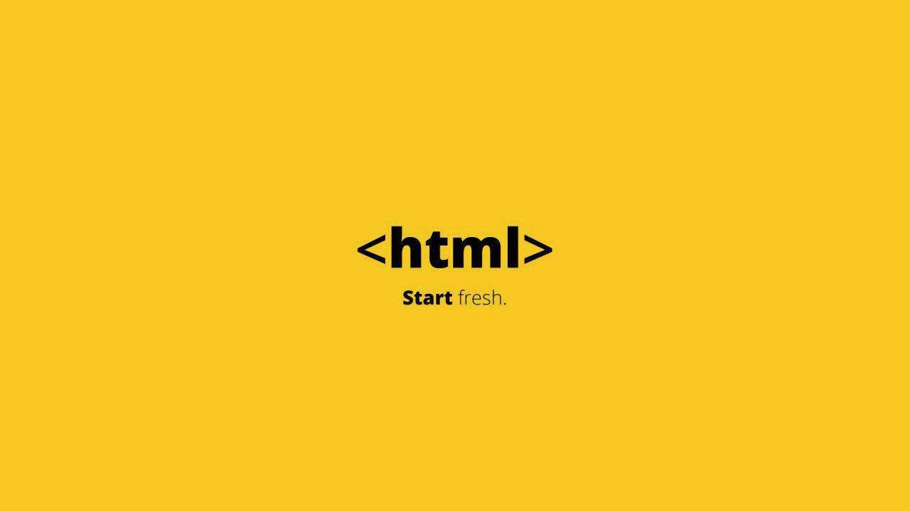
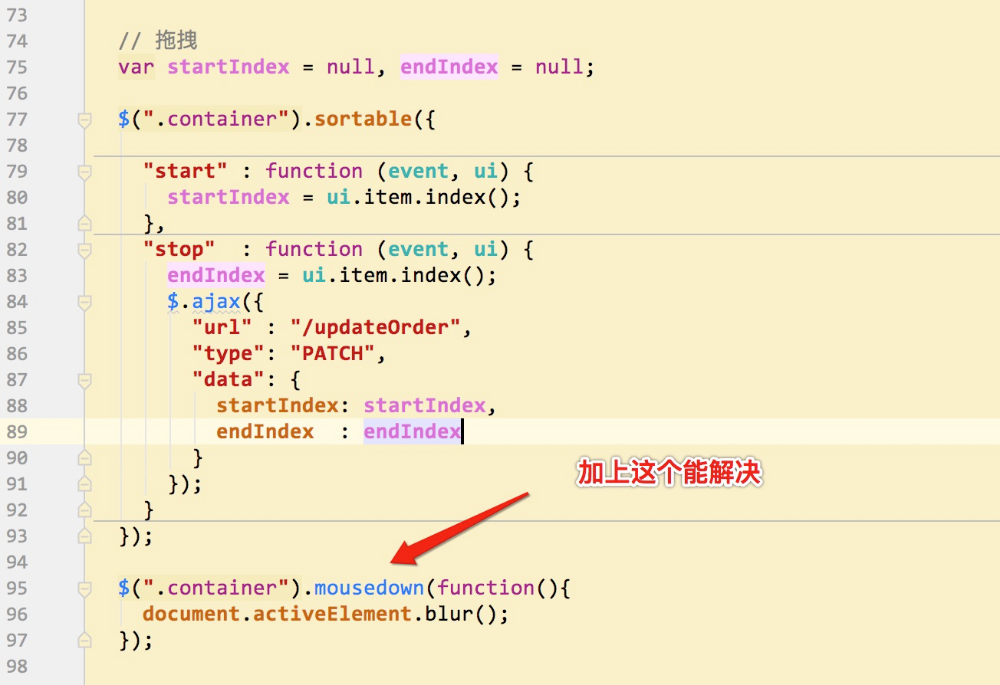

# html-record


---



```vbscript-html
<p>hello world</p>
```

## NodeList和HTMLCollection区别
参考: https://stackoverflow.com/questions/15763358/difference-between-htmlcollection-nodelists-and-arrays-of-objects

首先，我将解释之间的差异NodeList和HTMLCollection。

两个接口是集合 DOM节点。它们在提供的方法和它们可以包含的节点类型方面有所不同。虽然a NodeList可以包含任何节点类型，但HTMLCollection应该只包含Element节点。
An HTMLCollection提供了与a相同的方法NodeList，另外还提供了一个称为的方法namedItem。

当访问必须提供给多个节点时，总是使用集合，例如，大多数选择器方法（例如getElementsByTagName）返回多个节点或获取对所有子节点的引用（element.childNodes）。

有关更多信息，请查看DOM4规范 - 集合。

**`document.getElementsByTagName("td")和之间有什么区别$("td")？`**

getElementsByTagName是DOM接口的方法。它接受一个标签名称作为输入并返回一个HTMLCollection（参见DOM4规范）。

$("td")推测是jQuery。它接受任何有效的CSS / jQuery选择器并返回一个jQuery对象。

**`标准DOM集合和jQuery选择之间最大的区别在于，DOM集合通常是活动的（不是所有的方法都会返回实时集合），也就是说，如果受到影响，DOM中的【任何更改都会反映在集合中】。它们就像DOM树上的视图，而jQuery选择是在函数被调用的瞬间DOM树的【快照】。`**

为什么console.log还显示旁边的DOM元素数组，它们不是对象而不是数组？

jQuery对象是类似数组的对象，即它们具有数值属性和length属性（请记住，数组本身就是对象）。浏览器倾向于以特殊的方式显示数组和类似数组的对象，比如[ ... , ... , ... ]。

什么是难以捉摸的“NodeLists”全部，我如何选择一个？

看到我答案的第一部分。你不能选择 NodeList s，它们是选择的结果。

据我所知，甚至没有一种方法可以用NodeList编程方式创建s（即创建一个空的并在稍后添加节点），它们只能由一些DOM方法/属性返回。

---

## jQuery-ui 拖拽事件和 blur事件有冲突(已解决)
参考: <https://stackoverflow.com/questions/8869708/click-on-jquery-sortable-list-does-not-blur-input>



---

