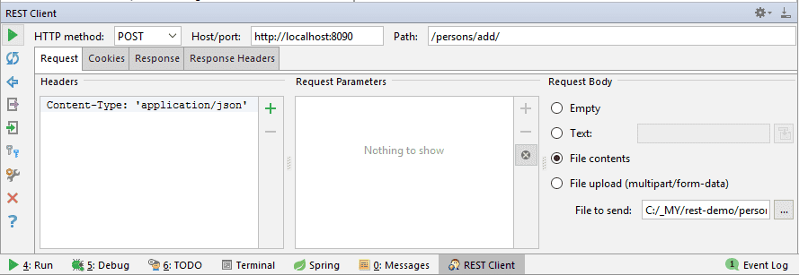

@(工作笔记)

# http-client-record




[TOC]

---


## application/x-www-form-urlencoded

```plain
GET http://192.168.1.100:5000/index
Accept: */*
Cache-Control: no-cache
Content-Type: application/x-www-form-urlencoded
Connection: keep-alive
Accept-Encoding: gzip, deflate, br
User-Agent: Mozilla/5.0 (Macintosh; Intel Mac OS X 10_15_5) AppleWebKit/537.36 (KHTML, like Gecko) Chrome/83.0.4103.116 Safari/537.36

name=stone&age=29
```


## GET

```
GET http://192.168.1.100:5000/index?name=python&age=29
```

