@(工作笔记)

# java-record

[TOC]

---

## 如何在mac终端操作javadoc命令
1、首先我们要知道你的文件所在路径，可以选择显示简介


2、选中“位置”后边的路径，复制


3、打开终端：

例如我的是在桌面的xinjian 这个文件夹里：我们可以通过cd命令进入文件夹


（输入pwd可以查看当前所在位置 通过cd空格 文件夹地址，可以进入文件夹）

4、javac 文件名.java

5、javadoc 文件名.java


6、前提是已经配置好了环境变量哦。如果没有配置，先配置环境变量。


---

## sql 过滤数据...

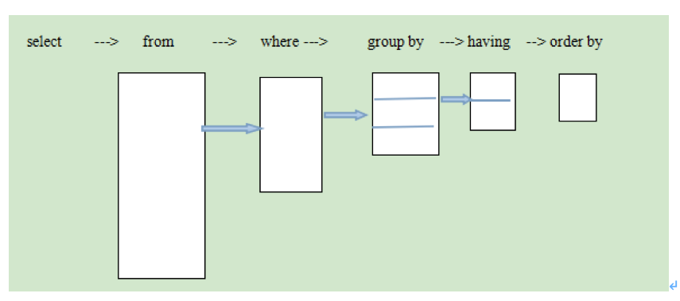


## mac tomcat8.5 下载
https://www.cnblogs.com/ostrich-sunshine/p/8414691.html


---

## Jrebel最新激活破解方式
https://blog.csdn.net/xingbaozhen1210/article/details/81093041

 1 . 打开jrebel 激活面板  . 选择Connect to online licensing service . 

在上面的框中输入激活的url地址(文章末尾持续更新),过段时间可能会失效,我会在这篇文章中一直更新.

下面的框中输入邮箱地址 , 可随意填 . 然后点击右下角的激活按钮即可


2 . 重要!正常完成第一步之后 , jrebel就能正常使用了 . 但很多人往往用不到几天就提示激活失败, 无法使用了 . 

jrebel激活之后默认是联网使用的 , 在该模式下 , jrebel会一直联网监测激活信息 . 所以要调为离线使用的

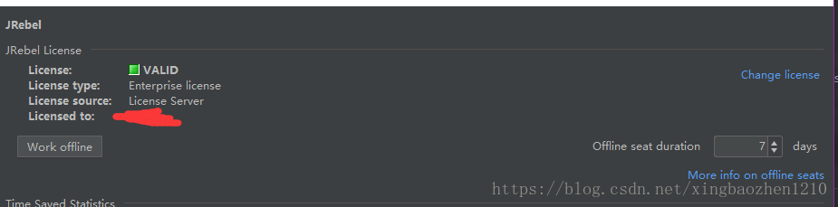

操作方法就是点击Work offile 按钮即可 . 


2019-06-07 端午节最新激活地址 : 

如果出现激活过期的情况下 , 可以重新生成一下GUID , 替换原来的GUID即可 .  

[在线生成GUID1](http://www.ofmonkey.com/transfer/guid)
[在线生成GUID2](https://www.guidgen.com/)

---

## Intellij IDEA 4种配置热部署的方法

热部署可以使的修改代码后，无须重启服务器，就可以加载更改的代码。

第1种：修改服务器配置，使得IDEA窗口失去焦点时，更新类和资源

菜单Run -> EditConfiguration , 然后配置指定服务器下，右侧server标签下on frame deactivation = Update classes and resource。

优点：简单

缺点：基于JVM提供的热加载仅支持方法块内代码修改，只有debug模式下，并且是在idea失去焦点时才会出发热加载，相对加载速度缓慢

第2种：使用springloaded jar包

a. 下载jar包，github：https://github.com/spring-projects/spring-loaded
b. 启动应用时添加VM启动参数：-javaagent:/home/lkqm/.m2/repository/org/springframework/springloaded/1.2.7.RELEASE/springloaded-1.2.7.RELEASE.jar -noverify

优点：对Spring系列框架支持好（不含Spring boot）, 支持 成员级别的修改（增删改方法、字段、注解），支持对枚举值集。

缺点：与优点相对

第3种：使用spring-boot-devtools提供的开发者工具

spring-boot项目中引入如下依赖

```xml
<dependency>
        <groupId>org.springframework.boot</groupId>
        <artifactId>spring-boot-devtools</artifactId>
 </dependency>
```
优点：简单，支持Spring-boot项目，支持成员级别的修改热部署。

缺点：只支持spring-boot项目。

第4种：使用Jrebel插件实现热部署(该插件14天免费试用)

在线安装：菜单File -> Setting -> Plugin, 点击右侧底部 Browse repositories, 弹出框顶部输入:JReble for Intellij， 选中安装即可。

优点：强大，对各类框架支持，并且提供IDE插件的方式。

最后3种方法是基于类加载机制来实现热加载的，因此你修改完成代码后必须重新编译当前代码，才能触发热部署，Eclipse默认就支持了自动编译，而在Intellij IDEA中默认是关闭了自动编译的，可以按照如下2步设置开启：

IDEA开启项目自动编译，进入设置，Build,Execut, Deployment -> Compiler 勾选中左侧的Build Project automatically
IDEA开启项目运行时自动make, ctrl + shift + a搜索命令：registry -> 勾选compiler.automake.allow.when.app.running


---

## IntelliJ IDEA热加载自动更新（Update classes and resources ）
 IntelliJ IDEA默认文件是自动保存的，但是手头有个项目jsp文件改动后，在tomcat中不能立即响应变化。想要jsp文件改动后立刻看到变化，可以通过修改配置来实现。

在IDEA tomcat 中server的配置里，有个On frame deactivation，选择Update classes and resources。另外有个配置on update action，就是手动操作的时候采取什么动作，可以重启服务器，也可以像上面一样更新类和资源文件，我选的是Update classes and resources，也可以选择Redeploy。


On update action：当发现更新时的操作   选择Update classes and resources 
On frame deactivation：当IDEA 切换时的操作 （比如缩下去、打开网页等） 选择Update classes and resources
 
可是当前项目没有Update classes and resources这个选项，有个Hot Swap classes。这是由于服务器添加的Artifact类型问题，一般一个module对应两种类型的Artifact，一种是war，一种是war explored。war就是已war包形式发布，当前项目是这种形式，在这种形式下On frame deactivation配置没有Update classes and resources选项。war explored是发布文件目录，选择这种形式，On frame deactivation中就出现Update classes and resources选项了。
转自http://www.cnblogs.com/jeffen/p/6184299.html

---

## JRebel 之前的服务器如果挂了, 刚好又使用了 离线模式, 那悲剧了, 想换激活服务器都不行...以下是解决方法


官方提供的方式...

```bash
java -Drebel.license.url=http://your.server:9000/01234abcd01234abcd -jar jrebel.jar -delete-offline
```


服务器就填写这个...

可是这个 jrebel.jar 文件 鬼知道 在哪... 各种百度...google

~/Library/Application Support/IntelliJIdea2019.2/jr-ide-idea/lib/jrebel6/jrebel.jar

进到这个目录里 执行上面的命令 , 就能删除 离线模式 , 然后再填写 新的能激活的 服务器地址就能成功激活了...


---

## nodejs操作MySQL其实很简单
https://www.jianshu.com/p/10833e1fbf00

## IntelliJ IDEA配置Tomcat（完整版教程）
https://www.cnblogs.com/Miracle-Maker/articles/6476687.html


---

## idea设置package包展现方式
可以设置成和eclipse一样的方式。设置方式如下图：
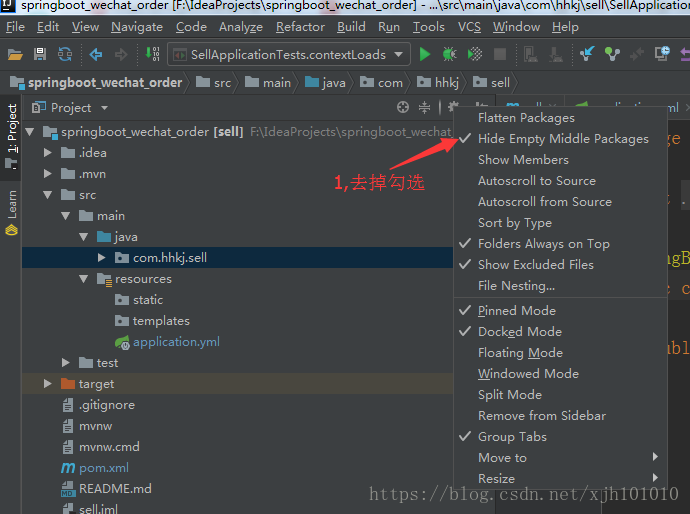
修改后就变成下图：
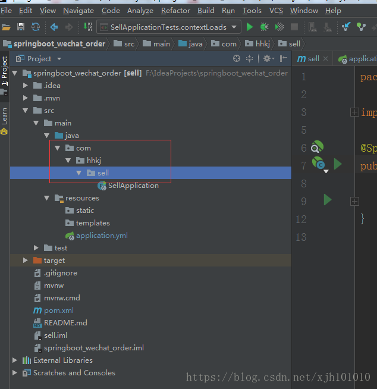

---


---

## groovy 安装

```bash
brew install groovy
```

---

## mac IDEA配置Groovy SDK
https://www.jianshu.com/p/e22113ff7dee

idea写.groovy文件，报需要配置Groovy SDK：

点击Configure Groovy SDK，若Use library找不到groovy的sdk的话，需要手动去Create配置。


这里要选择的目录位置是groovy/libexec的目录。
两种情况：

直接官网下的groovy的压缩包
直接解压，然后目录选择groovy/libexec。
brew安装的groovy
目录选择/usr/local/opt/groovy/libexec。

另外，在idea中无法切到/user目录下，mac按Cmd + Shift + G来切换目录。

---

##  idea 2019.1版本破解

https://blog.csdn.net/shuizhongyue_doujia/article/details/88884992


```plain
N757JE0KCT-eyJsaWNlbnNlSWQiOiJONzU3SkUwS0NUIiwibGljZW5zZWVOYW1lIjoid3UgYW5qdW4iLCJhc3NpZ25lZU5hbWUiOiIiLCJhc3NpZ25lZUVtYWlsIjoiIiwibGljZW5zZVJlc3RyaWN0aW9uIjoiRm9yIGVkdWNhdGlvbmFsIHVzZSBvbmx5IiwiY2hlY2tDb25jdXJyZW50VXNlIjpmYWxzZSwicHJvZHVjdHMiOlt7ImNvZGUiOiJJSSIsInBhaWRVcFRvIjoiMjAyMC0wMS0wNyJ9LHsiY29kZSI6IkFDIiwicGFpZFVwVG8iOiIyMDIwLTAxLTA3In0seyJjb2RlIjoiRFBOIiwicGFpZFVwVG8iOiIyMDIwLTAxLTA3In0seyJjb2RlIjoiUFMiLCJwYWlkVXBUbyI6IjIwMjAtMDEtMDcifSx7ImNvZGUiOiJHTyIsInBhaWRVcFRvIjoiMjAyMC0wMS0wNyJ9LHsiY29kZSI6IkRNIiwicGFpZFVwVG8iOiIyMDIwLTAxLTA3In0seyJjb2RlIjoiQ0wiLCJwYWlkVXBUbyI6IjIwMjAtMDEtMDcifSx7ImNvZGUiOiJSUzAiLCJwYWlkVXBUbyI6IjIwMjAtMDEtMDcifSx7ImNvZGUiOiJSQyIsInBhaWRVcFRvIjoiMjAyMC0wMS0wNyJ9LHsiY29kZSI6IlJEIiwicGFpZFVwVG8iOiIyMDIwLTAxLTA3In0seyJjb2RlIjoiUEMiLCJwYWlkVXBUbyI6IjIwMjAtMDEtMDcifSx7ImNvZGUiOiJSTSIsInBhaWRVcFRvIjoiMjAyMC0wMS0wNyJ9LHsiY29kZSI6IldTIiwicGFpZFVwVG8iOiIyMDIwLTAxLTA3In0seyJjb2RlIjoiREIiLCJwYWlkVXBUbyI6IjIwMjAtMDEtMDcifSx7ImNvZGUiOiJEQyIsInBhaWRVcFRvIjoiMjAyMC0wMS0wNyJ9LHsiY29kZSI6IlJTVSIsInBhaWRVcFRvIjoiMjAyMC0wMS0wNyJ9XSwiaGFzaCI6IjExNTE5OTc4LzAiLCJncmFjZVBlcmlvZERheXMiOjAsImF1dG9Qcm9sb25nYXRlZCI6ZmFsc2UsImlzQXV0b1Byb2xvbmdhdGVkIjpmYWxzZX0=-AE3x5sRpDellY4SmQVy2Pfc2IT7y1JjZFmDA5JtOv4K5gwVdJOLw5YGiOskZTuGu6JhOi50nnd0WaaNZIuVVVx3T5MlXrAuO3kb2qPtLtQ6/n3lp4fIv+6384D4ciEyRWijG7NA9exQx39Tjk7/xqaGk7ooKgq5yquIfIA+r4jlbW8j9gas1qy3uTGUuZQiPB4lv3P5OIpZzIoWXnFwWhy7s//mjOWRZdf/Du3RP518tMk74wizbTeDn84qxbM+giNAn+ovKQRMYHtLyxntBiP5ByzfAA9Baa5TUGW5wDiZrxFuvBAWTbLrRI0Kd7Nb/tB9n1V9uluB2WWIm7iMxDg==-MIIElTCCAn2gAwIBAgIBCTANBgkqhkiG9w0BAQsFADAYMRYwFAYDVQQDDA1KZXRQcm9maWxlIENBMB4XDTE4MTEwMTEyMjk0NloXDTIwMTEwMjEyMjk0NlowaDELMAkGA1UEBhMCQ1oxDjAMBgNVBAgMBU51c2xlMQ8wDQYDVQQHDAZQcmFndWUxGTAXBgNVBAoMEEpldEJyYWlucyBzLnIuby4xHTAbBgNVBAMMFHByb2QzeS1mcm9tLTIwMTgxMTAxMIIBIjANBgkqhkiG9w0BAQEFAAOCAQ8AMIIBCgKCAQEAxcQkq+zdxlR2mmRYBPzGbUNdMN6OaXiXzxIWtMEkrJMO/5oUfQJbLLuMSMK0QHFmaI37WShyxZcfRCidwXjot4zmNBKnlyHodDij/78TmVqFl8nOeD5+07B8VEaIu7c3E1N+e1doC6wht4I4+IEmtsPAdoaj5WCQVQbrI8KeT8M9VcBIWX7fD0fhexfg3ZRt0xqwMcXGNp3DdJHiO0rCdU+Itv7EmtnSVq9jBG1usMSFvMowR25mju2JcPFp1+I4ZI+FqgR8gyG8oiNDyNEoAbsR3lOpI7grUYSvkB/xVy/VoklPCK2h0f0GJxFjnye8NT1PAywoyl7RmiAVRE/EKwIDAQABo4GZMIGWMAkGA1UdEwQCMAAwHQYDVR0OBBYEFGEpG9oZGcfLMGNBkY7SgHiMGgTcMEgGA1UdIwRBMD+AFKOetkhnQhI2Qb1t4Lm0oFKLl/GzoRykGjAYMRYwFAYDVQQDDA1KZXRQcm9maWxlIENBggkA0myxg7KDeeEwEwYDVR0lBAwwCgYIKwYBBQUHAwEwCwYDVR0PBAQDAgWgMA0GCSqGSIb3DQEBCwUAA4ICAQAF8uc+YJOHHwOFcPzmbjcxNDuGoOUIP+2h1R75Lecswb7ru2LWWSUMtXVKQzChLNPn/72W0k+oI056tgiwuG7M49LXp4zQVlQnFmWU1wwGvVhq5R63Rpjx1zjGUhcXgayu7+9zMUW596Lbomsg8qVve6euqsrFicYkIIuUu4zYPndJwfe0YkS5nY72SHnNdbPhEnN8wcB2Kz+OIG0lih3yz5EqFhld03bGp222ZQCIghCTVL6QBNadGsiN/lWLl4JdR3lJkZzlpFdiHijoVRdWeSWqM4y0t23c92HXKrgppoSV18XMxrWVdoSM3nuMHwxGhFyde05OdDtLpCv+jlWf5REAHHA201pAU6bJSZINyHDUTB+Beo28rRXSwSh3OUIvYwKNVeoBY+KwOJ7WnuTCUq1meE6GkKc4D/cXmgpOyW/1SmBz3XjVIi/zprZ0zf3qH5mkphtg6ksjKgKjmx1cXfZAAX6wcDBNaCL+Ortep1Dh8xDUbqbBVNBL4jbiL3i3xsfNiyJgaZ5sX7i8tmStEpLbPwvHcByuf59qJhV/bZOl8KqJBETCDJcY6O2aqhTUy+9x93ThKs1GKrRPePrWPluud7ttlgtRveit/pcBrnQcXOl1rHq7ByB8CFAxNotRUYL9IF5n3wJOgkPojMy6jetQA5Ogc8Sm7RG6vg1yow==
```

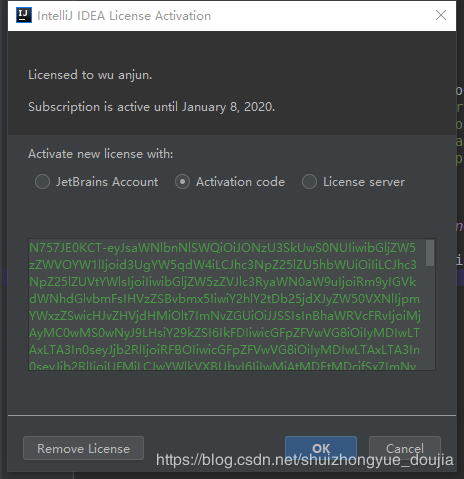


2.修改hosts文件进行破解


hosts文件的地址：‪C:\Windows\System32\drivers\etc\hosts

在文件的末尾添加下面两行代码：

0.0.0.0 account.jetbrains.com
0.0.0.0 www.jetbrains.com
然后重启idea就能直接进入了，不在需要注册码

注意：hosts文件只能用记事本打开，记事本还需要有管理员权限


---

## org.gradle.api.internal.tasks.compile.CompilationFailedException

https://www.jianshu.com/p/e83b2aa15965

AndroidStudio没有设置自动删除无用的包,所以打包的时候出现了这个问题,在这里也晒一下AndroidStudio的自动导包和自动删除包的设置


---

## 代码折叠


## 修改tomcat默认iso8859-1的编码编码方式

```
默认情况下，tomcat使用的是iso8859-1的编码编码方式

修改tomcat下的conf/server.xml文件

找到如下代码：    
<Connector port="8080" protocol="HTTP/1.1" connectionTimeout="20000" redirectPort="8443" />
这段代码规定了Tomcat监听HTTP请求的端口号等信息。

可以在这里添加一个属性：URIEncoding，将该属性值设置为UTF-8，即可让Tomcat（默认ISO-8859-1编码）以UTF-8的编码处理get请求。

更改后的代码如下所示： 
<Connector port="8080" URIEncoding="UTF-8" protocol="HTTP/1.1" connectionTimeout="20000" redirectPort="8443" />

 

此外

还可以增加属性useBodyEncodingForURI="true" 设置POST和GET使用相同编码

更改后的代码如下所示： 
<Connector port="8080"  useBodyEncodingForURI="true"  URIEncoding="UTF-8" protocol="HTTP/1.1" connectionTimeout="20000" redirectPort="8443" />
```

>tomcat8之前的默认编码是ISO-8859-1，而tomcat8的默认编码为utf-8。
相应的程序处理方式也应该是不一样的

---

## tomcat8之前的默认编码是ISO-8859-1，而tomcat8的默认编码为utf-8。相应的程序处理方式也应该是不一样的

file.encoding跟操作系统默认字符集有关，Windows下默认的是GBK，但我们程序一般IO流中字符编码一般都设置的是utf-8，这样会导致中文乱码。因此需要修改file.encoding为UTF-8.如果应用容器是tomcat，可参考如下修改方法。


1，windows

  修改catalina.bat

  tomcat7以下:

  `set JAVA_OPTS=%JAVA_OPTS% %LOGGING_CONFIG%的后面加上 -Dfile.encoding="UTF-8"`

  tomcat7:

  `set "JAVA_OPTS=%JAVA_OPTS% %LOGGING_CONFIG% -Dfile.encoding=UTF-8"`


2，Linux

  修改catalina.sh 

 ` JAVA_OPTS="-Dfile.encoding=UTF-8"`

---


## 在Intellij Idea中使用jstl标签库的方法

https://www.jb51.net/article/140687.htm

习惯了eclipse和myeclipse开发的我们总是依赖于系统的插件，而当我想当然的以为IntelliJ IDEA 的jstl 的使用应该和myeclispe一样，当时使用起来却到处碰壁，完全找不到思路，网上查阅资料也是缺少一部分，下面我来总结了Idea jstl标签的引入和使用的全过程：

如果直接用jstl标签会报错：

org.apache.jasper.JasperException: The absolute uri: http://java.sun.com/jsp/jstl/core cannot be resolved in either web.xml or the jar files deployed with this application

所以需要引入标签
一、从网上下载jakarta-taglibs-standard-1.1.2.zip解压并把standard.jar和jstl.jar加入到你的项目中，

1、下载JSTL标签库的DTD文件
下载地址: http://archive.apache.org/dist/jakarta/taglibs/standard/binaries/
拉到最下面，找到最新的那一个也就是 "jakarta-taglibs-standard-1.1.2.zip"，它下面的asc文件不用下载
或者直接点的下载地址:
http://archive.apache.org/dist/jakarta/taglibs/standard/binaries/jakarta-taglibs-standard-1.1.2.zip 

2、找到lib目录下的standard.jar和jstl.jar文件,复制文件，把它们粘贴到你的WEB_INF/lib目录下如图 

这里写图片描述
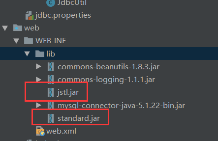


下载页面官方下载 jakarta-taglibs-standard-1.1.2.zip

第一步解决了：org.apache.jasper.JasperException: Unable to load class for JSP这个报错

二、第一步会让你能使用jstl标签，但是idea还是会报错，因为它不认识这个标签，所以需要在设置里进行添加。 
选择File—>Setting在Setting下找到languages&Frameworks—->Schemas and DTDs,在右边的External Schemas and DTDs框下点击+,然后在URI中填入http://java.sun.com/jsp/jstl/core 在explorer中找到解压文件的tld目录下的c.tld文件，并选择，到这里，你就可以结局idea不识别jstl的问题


 

三、在jsp页面头部加如下代码

<%@taglib prefix="c" uri="http://java.sun.com/jsp/jstl/core" %>
 

 

这时候再在jsp 使用是没有问题的


---

## 在IntelliJ IDEA的External Libraries下添加Tomcat的依赖包


---

## 坑爹的 tomcat8 nginx配置
nginx配置tomcat8反向代理出现 java.lang.IllegalArgumentException: The character [_] is never valid in a domai

https://blog.csdn.net/u010689849/article/details/84194376

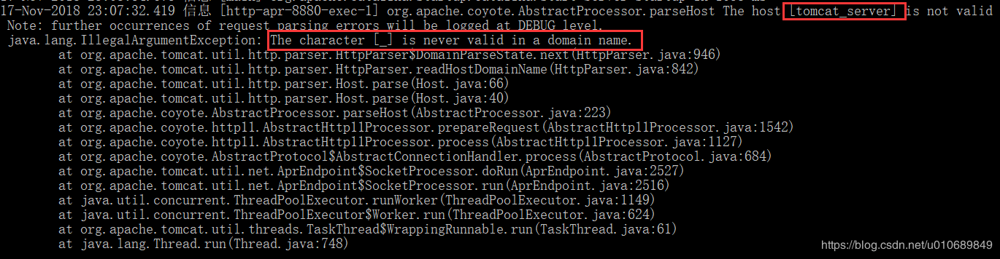

`原因是在nginx配置文件中配置upstream时用了“_”字符，如上用的tomcat_server，直接报错了。改成tomcatserver，即不使用“_”字符就好了。主要还是版本原因，tomcat7就不会有这个问题`

如果80端口 还是错误, 把端口上的应用干掉...
```bash
snkill 80
```

---

## 如何从maven资源库下载jar包
https://www.cnblogs.com/Marydon20170307/p/9149256.html

1.  需要安装并配置maven环境　　

```bash
$ which mvn                                                                                                             
/Users/stone/soft/apache-maven-3.5.2/bin/mvn
```

2. windows 脚本 & mac 脚本

windows
```bash
::使用dos命令执行mvn命令：将pom.xml文件所依赖的jar包从maven中央仓库拷贝到本地
call mvn -f pom.xml dependency:copy-dependencies
@pause
```
mac
```bash
#!/usr/bin/env bash
mvn -f pom.xml dependency:copy-dependencies
```


3.  制作pom.xml
下载 JSON Library » 2.4 为例

```xml
<?xml version="1.0" encoding="UTF-8"?>
<project xmlns="http://maven.apache.org/POM/4.0.0" xmlns:xsi="http://www.w3.org/2001/XMLSchema-instance" xsi:schemaLocation="http://maven.apache.org/POM/4.0.0 http://maven.apache.org/xsd/maven-4.0.0.xsd">
  <modelVersion>4.0.0</modelVersion>
  <groupId>temp.download</groupId>
  <artifactId>temp-download</artifactId>
  <version>1.0-SNAPSHOT</version>
  <dependencies>
    <!-- 将需要下载的jar包依赖关系粘贴到dependencies标签中 -->
    <!-- https://mvnrepository.com/artifact/net.sf.json-lib/json-lib -->
    <dependency>
      <groupId>net.sf.json-lib</groupId>
      <artifactId>json-lib</artifactId>
      <version>2.4</version>
      <!--classifier : 분류기 分类器-->
      <classifier>jdk15</classifier>
    </dependency>

  </dependencies>
</project>
```

`下载json-2.4jar包需要添加依赖，<classifier>jdk15</classifier>，否则下载失败。`

目录结构
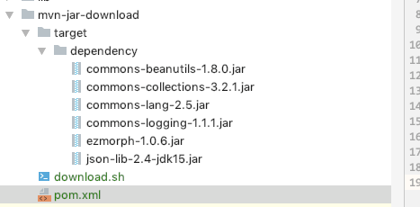

---

## tomcat关闭时 错误 , 虽然不影响 , 但是看着不爽... 寻找原因 竟然是VPN在搞鬼...
全局模式 这么牛逼么 - - , 普通模式就没问题...


http://tomcat.10.x6.nabble.com/Bug-62657-New-Protocol-handler-destroy-failed-td5077495.html
https://bz.apache.org/bugzilla/show_bug.cgi?id=62657

最后我发现它是由VPN软件造成的，但我不知道知道为什么tomcat8.0 
不受影响。 

---

## Servlet 常见的注解(@WebServlet,@WebListenert,@WebFilter)

https://blog.csdn.net/benxiaohai888/article/details/78208239

1、Serlvet中WebServlet注解

作用：用于将一个类声明为 Servlet
描述：该注解将会在部署时被容器处理，容器将根据具体的属性配置将相应的类部署为 Servlet。
属性详解：该注解具有下表给出的一些常用属性(以下所有属性均为可选属性，但是 vlaue 或者 urlPatterns 通常是必需的，且二者不能共存，如果同时指定，通常是忽略 value 的取值)


<table border="0" cellpadding="0" cellspacing="0" width="1033" style="color:rgb(0,0,0);line-height:26px;"><tbody><tr><td><span style="font-family:'Microsoft YaHei';font-size:18px;"><br>
属性名</span></td>
<td><span style="font-family:'Microsoft YaHei';font-size:18px;">类型</span></td>
<td><span style="font-family:'Microsoft YaHei';font-size:18px;">属性描述</span></td>
</tr><tr><td><span style="font-family:'Microsoft YaHei';font-size:18px;">name</span></td>
<td><span style="font-family:'Microsoft YaHei';font-size:18px;">String</span></td>
<td><span style="font-family:'Microsoft YaHei';font-size:18px;">指定servlet的name属性,等价于&lt;Servlet-name&gt;.如果没有显示指定，则该servlet的取值即为类的全限定名.</span></td>
</tr><tr><td><span style="font-family:'Microsoft YaHei';font-size:18px;">value</span></td>
<td><span style="font-family:'Microsoft YaHei';font-size:18px;">String[]</span></td>
<td><span style="font-family:'Microsoft YaHei';font-size:18px;">等价于urlPatterns,二者不能共存.</span></td>
</tr><tr><td><span style="font-family:'Microsoft YaHei';font-size:18px;">urlPatterns</span></td>
<td><span style="font-family:'Microsoft YaHei';font-size:18px;">String[]</span></td>
<td><span style="font-family:'Microsoft YaHei';font-size:18px;">指定一组servlet的url的匹配模式,等价于&lt;url-pattern&gt;标签.</span></td>
</tr><tr><td><span style="font-family:'Microsoft YaHei';font-size:18px;">loadOnStartup</span></td>
<td><span style="font-family:'Microsoft YaHei';font-size:18px;">int</span></td>
<td><span style="font-family:'Microsoft YaHei';font-size:18px;">指定servlet的加载顺序,等价于&lt;load-on-startup&gt;标签.</span></td>
</tr><tr><td><span style="font-family:'Microsoft YaHei';font-size:18px;">initParams</span></td>
<td><span style="font-family:'Microsoft YaHei';font-size:18px;">WebInitParam[]</span></td>
<td><span style="font-family:'Microsoft YaHei';font-size:18px;">指定一组初始化参数,等价于&lt;init-param&gt;标签.</span></td>
</tr><tr><td><span style="font-family:'Microsoft YaHei';font-size:18px;">asyncSupported</span></td>
<td><span style="font-family:'Microsoft YaHei';font-size:18px;">boolean</span></td>
<td><span style="font-family:'Microsoft YaHei';font-size:18px;">申明servlet是否支持异步操作模式,等价于&lt;async-supported&gt;标签.</span></td>
</tr><tr><td><span style="font-family:'Microsoft YaHei';font-size:18px;">displayName</span></td>
<td><span style="font-family:'Microsoft YaHei';font-size:18px;">String</span></td>
<td><span style="font-family:'Microsoft YaHei';font-size:18px;">servlet的显示名,等价于&lt;display-name&gt;标签.</span></td>
</tr><tr><td><span style="font-family:'Microsoft YaHei';font-size:18px;">description</span></td>
<td><span style="font-family:'Microsoft YaHei';font-size:18px;">String</span></td>
<td><span style="font-family:'Microsoft YaHei';font-size:18px;">servlet的描述信息,等价于&lt;description&gt;标签.</span></td>
</tr></tbody></table>


示例代码：

```java
package cn.sz.servlet;
 
import java.io.IOException;
 
import javax.servlet.ServletConfig;
import javax.servlet.ServletException;
import javax.servlet.annotation.WebInitParam;
import javax.servlet.annotation.WebServlet;
import javax.servlet.http.HttpServlet;
import javax.servlet.http.HttpServletRequest;
import javax.servlet.http.HttpServletResponse;
 
//注解配置  
@WebServlet(displayName = "UserServlet", // 描述
		name = "UserServlet", // servlet名称
		urlPatterns = { "/user" }, // url
		loadOnStartup = 1, // 启动项
		initParams = { @WebInitParam(name = "username", value = "张三") }) // 初始化参数
 
public class UserServlet extends HttpServlet {
 
	private String username;
 
	public UserServlet() {
		System.out.println("UserServlet...");
	}
 
	@Override
	public void init(ServletConfig config) throws ServletException {
		// 获取初始化信息：张三
		username = config.getInitParameter("username");
	}
 
	@Override
	protected void doPost(HttpServletRequest req, HttpServletResponse resp) throws ServletException, IOException {
		// 主要内容操作
	}
 
	@Override
	protected void doGet(HttpServletRequest req, HttpServletResponse resp) throws ServletException, IOException {
		// 主要内容操作
		System.out.println(username);
	}
}
```

2、@WebFilter注解配置Filter(过滤器)

Filter（过滤器）主要对请求到达前进行处理，也可以在请求结束后进行处理，类似于链式。一个请求可以被多个过滤器拦截到，会依次进入各个Filter中，放行后直至进入Servlet，Servlet处理请求结束后，回到各个Filter继续执行后面的代码，先执行的Filter后执行完。

常用到的地方：

用户权限过滤
记录日志
字符编码处理
@WebFilter常用属性

<table border="1" width="600" cellspacing="1" cellpadding="1" style="border-collapse:collapse;border-spacing:0px;color:rgb(69,69,69);line-height:24px;"><tbody><tr><th scope="col"><span style="font-family:'Microsoft YaHei';font-size:18px;font-weight:normal;">属性</span></th>
<th scope="col"><span style="font-family:'Microsoft YaHei';font-size:18px;font-weight:normal;">类型</span></th>
<th scope="col"><span style="font-family:'Microsoft YaHei';font-size:18px;font-weight:normal;">是否必需</span></th>
<th scope="col"><span style="font-family:'Microsoft YaHei';font-size:18px;font-weight:normal;">说明</span></th>
</tr></tbody><tbody><tr><td><span style="font-family:'Microsoft YaHei';font-size:18px;">asyncSupported</span></td>
<td><span style="font-family:'Microsoft YaHei';font-size:18px;">boolean</span></td>
<td><span style="font-family:'Microsoft YaHei';font-size:18px;">否</span></td>
<td><span style="font-family:'Microsoft YaHei';font-size:18px;">指定Filter是否支持异步模式</span></td>
</tr><tr><td><span style="font-family:'Microsoft YaHei';font-size:18px;">dispatcherTypes</span></td>
<td><span style="font-family:'Microsoft YaHei';font-size:18px;"><span></span>DispatcherType[]</span></td>
<td><span style="font-family:'Microsoft YaHei';font-size:18px;">否</span></td>
<td><span style="font-family:'Microsoft YaHei';font-size:18px;">指定Filter对哪种方式的请求进行过滤。<br>
支持的属性：ASYNC、ERROR、FORWARD、INCLUDE、REQUEST；<br>
默认过滤所有方式的请求</span></td>
</tr><tr><td><span style="font-family:'Microsoft YaHei';font-size:18px;">filterName</span></td>
<td><span style="font-family:'Microsoft YaHei';font-size:18px;">String</span></td>
<td><span style="font-family:'Microsoft YaHei';font-size:18px;">否</span></td>
<td><span style="font-family:'Microsoft YaHei';font-size:18px;">Filter名称</span></td>
</tr><tr><td><span style="font-family:'Microsoft YaHei';font-size:18px;">initParams</span></td>
<td><span style="font-family:'Microsoft YaHei';font-size:18px;">WebInitParam[]</span></td>
<td><span style="font-family:'Microsoft YaHei';font-size:18px;">否</span></td>
<td><span style="font-family:'Microsoft YaHei';font-size:18px;">配置参数</span></td>
</tr><tr><td><span style="font-family:'Microsoft YaHei';font-size:18px;">displayName</span></td>
<td><span style="font-family:'Microsoft YaHei';font-size:18px;">String</span></td>
<td><span style="font-family:'Microsoft YaHei';font-size:18px;">否</span></td>
<td><span style="font-family:'Microsoft YaHei';font-size:18px;">Filter显示名</span></td>
</tr><tr><td><span style="font-family:'Microsoft YaHei';font-size:18px;">servletNames</span></td>
<td><span style="font-family:'Microsoft YaHei';font-size:18px;">String[]</span></td>
<td><span style="font-family:'Microsoft YaHei';font-size:18px;">否</span></td>
<td><span style="font-family:'Microsoft YaHei';font-size:18px;">指定对哪些Servlet进行过滤</span></td>
</tr><tr><td><span style="font-family:'Microsoft YaHei';font-size:18px;">urlPatterns/value</span></td>
<td><span style="font-family:'Microsoft YaHei';font-size:18px;">String[]</span></td>
<td><span style="font-family:'Microsoft YaHei';font-size:18px;">否</span></td>
<td><span style="font-family:'Microsoft YaHei';font-size:18px;">两个属性作用相同，指定拦截的路径</span></td>
</tr></tbody></table>

用户权限过滤示例：

自定义过滤器，实现javax.servlet.Filter接口，通过注解方式配置。拦截所有的请求，放行登录页面、登录操作请求，其余请求需要在登录后才可访问。同时配置参数，指定要放行的路径和请求的字符集。

```java
package cn.sz.servlet;
 
import java.io.IOException;
 
import javax.servlet.Filter;
import javax.servlet.FilterChain;
import javax.servlet.FilterConfig;
import javax.servlet.ServletException;
import javax.servlet.ServletRequest;
import javax.servlet.ServletResponse;
import javax.servlet.annotation.WebFilter;
import javax.servlet.annotation.WebInitParam;
import javax.servlet.http.HttpServletRequest;
import javax.servlet.http.HttpServletResponse;
 
@WebFilter(filterName = "loginFilter", urlPatterns = "/*", initParams = {
		@WebInitParam(name = "loginUI", value = "/home/loginUI"),
		@WebInitParam(name = "loginProcess", value = "home/login"),
		@WebInitParam(name = "encoding", value = "utf-8") })
public class LoginFilter implements Filter {
	private FilterConfig config;
 
	@Override
	public void init(FilterConfig config) throws ServletException {
		this.config = config;
	}
 
	@Override
	public void doFilter(ServletRequest req, ServletResponse res, FilterChain chain)
			throws IOException, ServletException {
		// 获取配置参数
		String loginUI = config.getInitParameter("loginUI");
		String loginProcess = config.getInitParameter("loginProcess");
		String encoding = config.getInitParameter("encoding");
 
		HttpServletRequest request = (HttpServletRequest) req;
		HttpServletResponse response = (HttpServletResponse) res;
 
		// 设置请求的字符集（post请求方式有效）
		request.setCharacterEncoding(encoding);
 
		// 不带http://域名:端口的地址
		String uri = request.getRequestURI();
		if (uri.contains(loginUI) || uri.contains(loginProcess)) {
			// 请求的登录，放行
			chain.doFilter(request, response);
		} else {
			if (request.getSession().getAttribute("user") == null) {
				// 重定向到登录页面
				response.sendRedirect(request.getContextPath() + loginUI);
			} else {
				// 已经登录，放行
				chain.doFilter(request, response);
			}
		}
	}
 
	@Override
	public void destroy() {
		this.config = null;
	}
}
```

3、@WebListener注解标注监听器


```java
package cn.sz.servlet;
 
import javax.servlet.ServletRequestEvent;
import javax.servlet.ServletRequestListener;
import javax.servlet.annotation.WebListener;
 
@WebListener
public class Test implements ServletRequestListener {
 
    public Test() {
    }
 
	
    public void requestDestroyed(ServletRequestEvent arg0)  { 
    }
 
    public void requestInitialized(ServletRequestEvent arg0)  { 
    }
	
}
```


---

## Tomcat 8.5.29启动报TldScanner.scanJars错误问题解决办法

网上很多人都遇到，当时没有什么从根本上解决的办法。这里解决也仅仅是通过调整tocmat日志级别来控制日志输出信息。

在apache-tomcat-8.5.29\conf目录下找到logging.properties文件，对文件进行编辑，在最后一行加入：

org.apache.jasper.servlet.TldScanner.level = FINE
这样就不再显示错误信息了。

**警告是没了 - - 但更多的信息打印出来了 蛋疼...**

---

## org.apache.tomcat.util.descriptor.web.WebXml.setVersion Unknown version string [4.0]

https://blog.csdn.net/qq_32483145/article/details/80292463

错误： 
   在idea创建WEB项目之后，打印出的日志中总是出现： 
12-May-2018 15:52:30.692 警告 [RMI TCP Connection(3)-127.0.0.1] org.apache.tomcat.util.descriptor.web.WebXml.setVersion Unknown version string [4.0].Default version will be used. 
虽然只是警告不影响运行，看着总有些不爽，大概看了一下，当前Tomcat8.5不支持Web4.0版本，那要么降低Web版本，要么提高Tomcat版本就好了。这里我分别介绍了两种方法如下。
解决办法： 
Ⅰ.降低web版本为3.1

  1.修改web.xml文件头如下：
```xml
<web-app xmlns="http://xmlns.jcp.org/xml/ns/javaee"
         xmlns:xsi="http://www.w3.org/2001/XMLSchema-instance"
         xsi:schemaLocation="http://xmlns.jcp.org/xml/ns/javaee
         http://xmlns.jcp.org/xml/ns/javaee/web-app_3_1.xsd"
         version="3.1"><!--将web版本4.0修改为3.1，注意上一行约束文件也要修改-->
</web-app>
```

Ⅱ.提高Tomcat版本为9.0 
  1.点击Edit Configurations进入Tomcat配置界面 
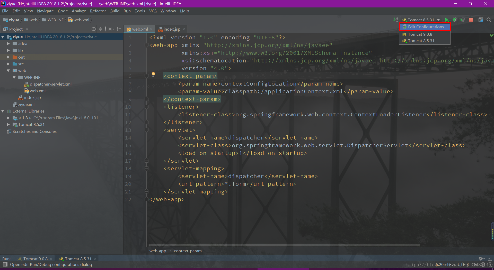

2.点击Defaults下滑找到Tomcat Server 

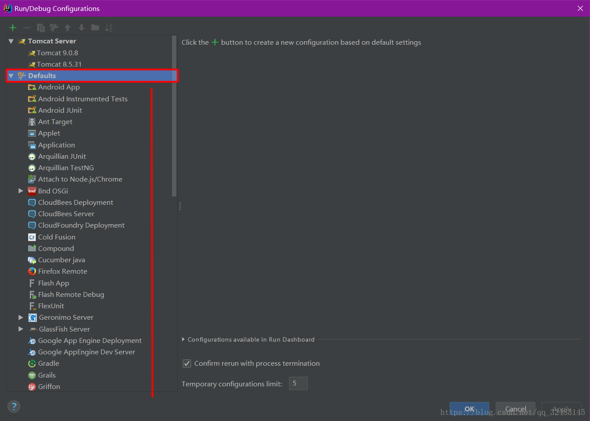

3.点击Local，按照如图界面创建一个Tomcat服务器，确认返回，在运行的时候选择刚创建的高版本的Tomcat9.0就可以消除这个警告了。 

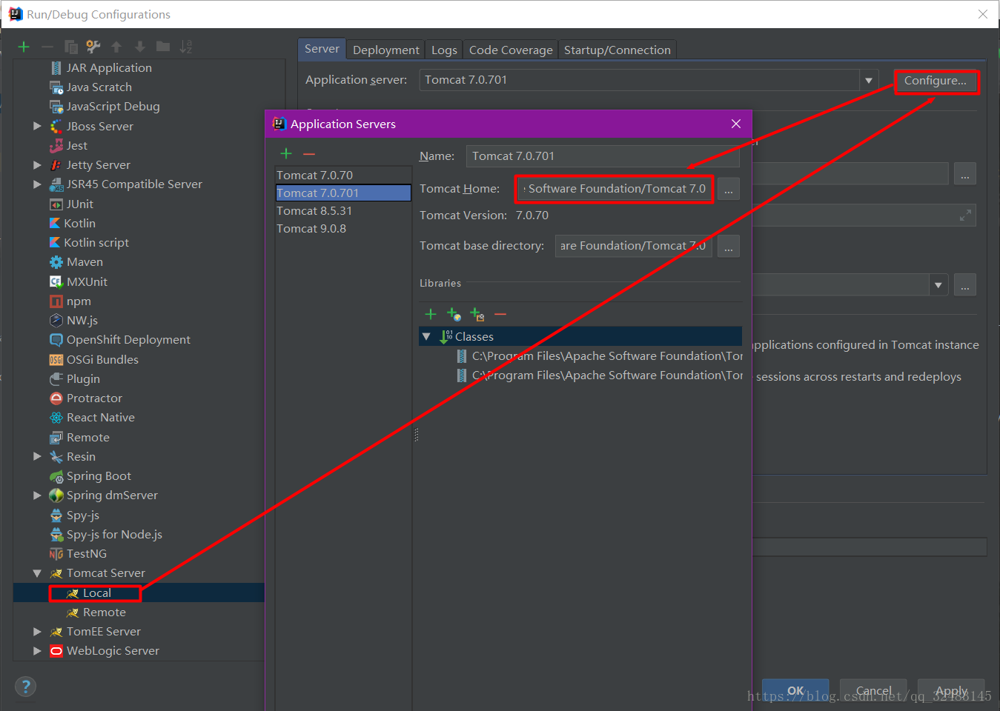

---

## Servlet 3.0 之@WebFilter怎么控制多个filter的执行顺序

https://www.cnblogs.com/tfgzs/p/4571137.html

之前我们控制多个filter的执行顺序是通过web.xml中控制filter的位置来控制的，放在上面的会比放在下面的先执行，如下“用户登录检查过滤器”会比“接口日志过滤器”先执行

```xml
<!-- 用户登录检测过滤器 -->
    <filter>
         <filter-name>UserLoginFilter</filter-name>
         <filter-class>net.tfgzs.demo.filter.UserLoginFilter</filter-class>
    </filter>
    <filter-mapping>
         <filter-name>UserLoginFilter</filter-name>
         <url-pattern>/*</url-pattern>
    </filter-mapping>
    <!--接口日志过滤器-->
    <filter>
        <filter-name>ApiLog</filter-name>
        <filter-class>net.tfgzs.demo.filter.ApiLog</filter-class>
    </filter>
    <filter-mapping>
        <filter-name>ApiLog</filter-name>
        <url-pattern>/*</url-pattern>
    </filter-mapping>
```

但是当我们使用@WebFilter注解的时候发现注解里面没有提供可以控制执行顺序的参数

@WebFilter 的属性

<table class="ibm-data-table" border="0" cellspacing="0" cellpadding="0">
<thead>
<tr><th><span style="font-size: 14px;"><strong>属性名</strong></span></th><th><span style="font-size: 14px;"><strong>类型</strong></span></th><th><span style="font-size: 14px;"><strong>描述</strong></span></th></tr>
</thead>
<tbody>
<tr>
<td><span style="font-size: 14px;">filterName</span></td>
<td><span style="font-size: 14px;">String</span></td>
<td><span style="font-size: 14px;">指定过滤器的 name 属性，等价于 &lt;filter-name&gt;</span></td>
</tr>
<tr>
<td><span style="font-size: 14px;">value</span></td>
<td><span style="font-size: 14px;">String[]</span></td>
<td><span style="font-size: 14px;">该属性等价于 urlPatterns 属性。但是两者不应该同时使用。</span></td>
</tr>
<tr>
<td><span style="font-size: 14px;">urlPatterns</span></td>
<td><span style="font-size: 14px;">String[]</span></td>
<td><span style="font-size: 14px;">指定一组过滤器的 URL 匹配模式。等价于 &lt;url-pattern&gt; 标签。</span></td>
</tr>
<tr>
<td><span style="font-size: 14px;">servletNames</span></td>
<td><span style="font-size: 14px;">String[]</span></td>
<td><span style="font-size: 14px;">指定过滤器将应用于哪些 Servlet。取值是 @WebServlet 中的 name 属性的取值，或者是 web.xml 中 &lt;servlet-name&gt; 的取值。</span></td>
</tr>
<tr>
<td><span style="font-size: 14px;">dispatcherTypes</span></td>
<td><span style="font-size: 14px;">DispatcherType</span></td>
<td><span style="font-size: 14px;">指定过滤器的转发模式。具体取值包括： ASYNC、ERROR、FORWARD、INCLUDE、REQUEST。</span></td>
</tr>
<tr>
<td><span style="font-size: 14px;">initParams</span></td>
<td><span style="font-size: 14px;">WebInitParam[]</span></td>
<td><span style="font-size: 14px;">指定一组过滤器初始化参数，等价于 &lt;init-param&gt; 标签。</span></td>
</tr>
<tr>
<td><span style="font-size: 14px;">asyncSupported</span></td>
<td><span style="font-size: 14px;">boolean</span></td>
<td><span style="font-size: 14px;">声明过滤器是否支持异步操作模式，等价于 &lt;async-supported&gt; 标签。</span></td>
</tr>
<tr>
<td><span style="font-size: 14px;">description</span></td>
<td><span style="font-size: 14px;">String</span></td>
<td><span style="font-size: 14px;">该过滤器的描述信息，等价于 &lt;description&gt; 标签。</span></td>
</tr>
<tr>
<td><span style="font-size: 14px;">displayName</span></td>
<td><span style="font-size: 14px;">String</span></td>
<td><span style="font-size: 14px;">该过滤器的显示名，通常配合工具使用，等价于 &lt;display-name&gt; 标签。</span></td>
</tr>
</tbody>
</table>


通过实践发现如果想要控制filer的执行顺序可以通过控制filter的文件名来控制

比如：

`UserLoginFilter.java 和 ApiLog.java 这两个文件里面分别是“用户登录检查过滤器”和“接口日志过滤器”，因为这两个文件的首字母A排U之前，导致每次执行的时候都是先执行“接口日志过滤器”再执行“用户登录检查过滤器”，所以我们现在修改两个文件的名称分别为`

Filter0_UserLogin.java

Filter1_ApiLog.java

这样就能先执行“用户登录检查过滤器”再执行“接口日志过滤器”

---

## 对齐 get set 方法


---

## web 中的 js 文件还有命名要求? 蛋疼... mock-min.js 这样写 404 , mock.min.js 写就没事, 好像是 tomcat8 不能解析 - 的原因吧...

---

## web.xml  param-value , struts2 修改默认路径
config - 要加载的以逗号分隔的XML配置文件列表。

https://stackoverflow.com/questions/30620190/change-default-location-of-struts-xml-in-struts2
https://stackoverflow.com/questions/870279/where-to-put-struts-xml


```xml
  <filter>
    <filter-name>struts2</filter-name>
    <filter-class>org.apache.struts2.dispatcher.ng.filter.StrutsPrepareAndExecuteFilter</filter-class>
    <init-param>
      <param-name>config</param-name>
      <param-value>
        struts-default.xml,
        struts-plugin.xml,
        /com/test/t045/struts.xml
      </param-value>
    </init-param>
  </filter>
```

```xml
我迟到了，我们可以在web应用程序的类路径中的任何目录中配置struts.xml，但是使用web.xml中的过滤器配置的“config”init参数提供位置，如下所示，如果我的struts .xml文件位于“/ com / resources /”目录中。

   <filter>
        <filter-name>action</filter-name>
        <filter-class>org.apache.struts2.dispatcher.ng.filter.StrutsPrepareAndExecuteFilter</filter-class>
         <init-param>
            <param-name>config</param-name>
            <param-value>struts-default.xml,struts-plugin.xml,/com/resources/struts.xml</param-value>
         </init-param>
    </filter>
```

```xml
  <!--——— struts2 ——— servlet 能做的 过滤器都能做, 并且多了个一个chain, 和express next一样——————————————-->
  <filter>
    <filter-name>struts2</filter-name>
    <filter-class>org.apache.struts2.dispatcher.ng.filter.StrutsPrepareAndExecuteFilter</filter-class>
    <init-param>
      <param-name>config</param-name>
      <param-value>
        struts-default.xml,
        struts-plugin.xml,
        /com/test/t045/struts.xml
      </param-value>
    </init-param>
  </filter>

  <filter-mapping>
    <filter-name>struts2</filter-name>
    <url-pattern>/*</url-pattern>
  </filter-mapping>
```

---

## Intellij idea 报错：Error : java 不支持发行版本5

https://blog.csdn.net/qq_22076345/article/details/82392236

在Intellij idea中新建了一个Maven项目，运行时报错如下：Error : java 不支持发行版本5


本地运行用的是JDK9，测试Java的Stream操作，报错应该是项目编译配置使用的Java版本不对，需要检查一下项目及环境使用的Java编译版本配置。

《1》在Intellij中点击“File” -->“Project Structure”，看一下“Project”和“Module”栏目中Java版本是否与本地一致：


 


如果不一致，改成本地使用的Java版本。

《2》点击“Settings”-->“Bulid, Execution,Deployment”-->“Java Compiler”，Target bytecode version设为本地Java版本。（可以在Default Settings中把Project bytecode version 一劳永逸地配置成本地Java版本）


Default Settings：


以上两步都配置好之后，重新运行应该就不会报上述错误了。

---

## 数据库默认选择


---

## spring 自定义 监听器不起作用解决办法


---

## exploded 能热部署


## maven 配置ali镜像

https://maven.aliyun.com/mvn/view

https://www.freesion.com/article/5979292418/

```
<mirror>
        <id>nexus-aliyun</id>
        <mirrorOf>*</mirrorOf>
        <name>Nexus aliyun</name>
        <url>http://maven.aliyun.com/nexus/content/groups/public</url>
    </mirror>
```

## idea打包发出警告Using platform encoding (UTF-8 actually) to copy filtered resources,解决方法
https://blog.csdn.net/qq_37554565/article/details/90713122

解决方法：
```xml

在<project>元素下面添加:

   <properties>     
    <project.build.sourceEncoding>UTF-8</project.build.sourceEncoding>     

   </properties> 
```

---

## 初学 dubbo-zookeeper踩过的坑：Unexpected exception parsing XML document from URL;Duplicate spring bean id ？

https://blog.csdn.net/weixin_43926139/article/details/100576425


## maven的setting配置文件中mirror和repository的区别 | mirrorOf设置
https://www.jianshu.com/p/274c363ffd7c


---

## 【Windows XP】下载地址及产品密钥
https://blog.csdn.net/Asher117/article/details/93716725?utm_medium=distribute.pc_relevant.none-task-blog-BlogCommendFromMachineLearnPai2-2.nonecase&depth_1-utm_source=distribute.pc_relevant.none-task-blog-BlogCommendFromMachineLearnPai2-2.nonecase

http://msdn.itellyou.cn/


---

## maven tomcat 用debug运行至少html页面是热更新的 囧...


---

## 【IDEA】IntelliJ IDEA和Eclipse解决dubbo.xsd找不到问题
https://blog.csdn.net/qq_30788845/article/details/80039307

## IDEA Error:java: Compilation failed: internal java compiler error
解决办法很简单：File-->Setting...-->Build,Execution,Deployment-->Compiler-->Java Compiler 设置相应Module的target bytecode version的合适版本（跟你jkd版本一致），这里我改成1.8版本的。

