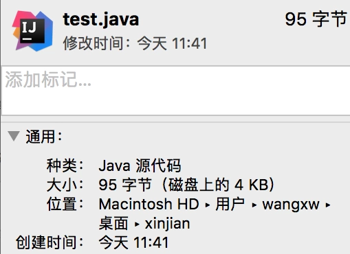

@(工作笔记)

# java-record

[TOC]

---

## 如何在mac终端操作javadoc命令
1、首先我们要知道你的文件所在路径，可以选择显示简介

2、选中“位置”后边的路径，复制

3、打开终端：

例如我的是在桌面的xinjian 这个文件夹里：我们可以通过cd命令进入文件夹

（输入pwd可以查看当前所在位置 通过cd空格 文件夹地址，可以进入文件夹）

4、javac 文件名.java

5、javadoc 文件名.java

6、前提是已经配置好了环境变量哦。如果没有配置，先配置环境变量。