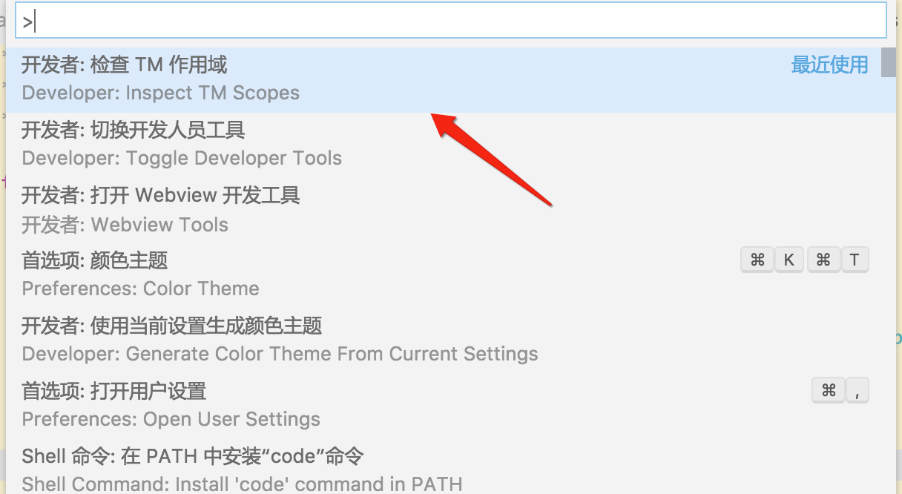
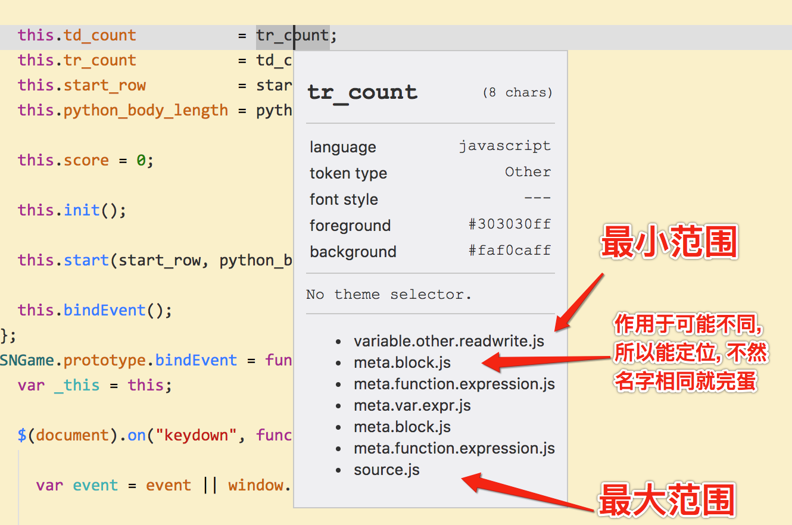

@(工作笔记)

# node-record

[TOC]

---

## node版爬虫...

https://github.com/GoogleChrome/puppeteer
踩坑
https://my.oschina.net/javazyw/blog/1585782

如果下载不了 浏览器 就手动下载 在代码中配置...

下载地址: https://download-chromium.appspot.com

参考: https://blog.csdn.net/u010142437/article/details/79126564

```
  const browser = await puppeteer.launch({
    executablePath:'/Applications/Chromium.app/Contents/MacOS/Chromium',
    args  : ['--no-sandbox'],
    dumpio: false,
  });
```


## 获取数组所有排列组合

https://github.com/N-ZOO/everycode/issues/8

```
var a = [1, 2, 3, 4];

function groupSplit(arr, size) {
    var maxSize = arr.length, groupArr = [];

    if(size >= 1 && size <= maxSize){
        getArr(arr, 0, []);
    }

    function each(arr, index, fn){
        for (var i = index; i < maxSize; i++) {
            fn(arr[i], i, arr);
        }
    }

    function getArr(arr, _size, _arr, index){
        if(_size === size){
            return;
        }

        var len = _size + 1;

        each(arr, index || 0, function(val, i, arr){

            _arr.splice(_size, 1, val);

            if(_size === size - 1){
                groupArr.push(_arr.slice());
            }

            getArr(arr, len, _arr, i + 1);
        });
    }

    return groupArr;
}

var ret = groupSplit(a, 2);
console.log(ret); // [[1, 2], [1, 3], [1, 4], [2, 3], [2, 4], [3, 4]]
```


## 静态文件跨域

https://segmentfault.com/q/1010000013603023?sort=created

---


```javascript
console.log('hello world')
```
---

## VueLoaderPlugin
官方没写 fuck!!!!!!!!!!
参考: <https://gist.github.com/yyx990803/e0f4f1275841f4ce756b8c1ac1db76e9>

## shelljs
官方API:<http://documentup.com/shelljs/shelljs#sedoptions-search_regex-replacement-file_array>
```
sed([options,] search_regex, replacement, file [, file ...])
sed([options,] search_regex, replacement, file_array)
Available options:

-i: Replace contents of file in-place. Note that no backups will be created!
Examples:

sed('-i', 'PROGRAM_VERSION', 'v0.1.3', 'source.js');
sed(/.*DELETE_THIS_LINE.*\n/, '', 'source.js');
Reads an input string from files, and performs a JavaScript replace() on the input
using the given search_regex and replacement string or function. Returns the new string after replacement.

Note:

Like unix sed, ShellJS sed supports capture groups. Capture groups are specified
using the $n syntax:

sed(/(\w+)\s(\w+)/, '$2, $1', 'file.txt');
```

sed使用 js replace实现 , 能跨平台...牛b

## global package

babel-cli
nrm
supervisor
webpack
webpack-cli
webpack-dev-server

---

## shell命令

**查看 npm全局路径**
```bash
## 查看 npm全局路径
npm -g root
```
**安装webpack**
```bash
cnpm install -g webpack
```

**webpack打包**

```bash
# 元命令
webpack main.js -o bundle.js --mode development

# 制作成常用脚本
#!/usr/bin/env bash
if [ "$3" == "r" ]; then
  webpack $1 -o $2 --mode production
else
  webpack $1 -o $2 --mode development
fi
```

---

## webpack配置文件


```bash
cnpm init -f
cnpm install babel-loader --save-dev
cnpm install babel-core --save-dev
cnpm install --save-dev babel-preset-react 
cnpm install babel-preset-es2015 --save-dev
cnpm install babel-plugin-transform-object-rest-spread --save-dev

cnpm install --save react react-dom

touch webpack.config.js

printf "  //内置path模块：获取到绝对路径
var path       = require('path');
//暴露一个对象
module.exports = {
  //设置入口文件
  entry : './app/main.js',
  //设置打包文件的文件夹、文件的名字
  output: {
    //设置你的打包的文件的文件夹的名字
    path    : path.resolve(__dirname, 'dist'),
    //设置你的打包的文件的名字
    filename: 'bundle.js'
  },
  //当你的js文件发生变化的时候，你在重新的保存的时候，会自动的再一次的打包
  watch : true,
  //其他模块的设置:翻译器（babel-loader）
  module: {
    //其他模块的规则
    rules: [
      {
        //①翻译的文件的尾缀什么(.js)
        test   : /\.jsx?$/,
        include: [
          path.resolve(__dirname, './app')
        ],
        exclude: [
          path.resolve(__dirname, './node_modules'),
          path.resolve(__dirname, './app/demo-files')
        ],
        //翻译器的设置
        loader : 'babel-loader',
        //其他的选项的设置：设置的预设值、插件
        options: {
          //预设值
          presets: ['es2015', 'react'],
          //插件
          plugins: ['transform-object-rest-spread']
        }
      }
    ]
  }
};" > webpack.config.js
```

---

## vscode 自定义颜色主题

在线编辑:
https://tmtheme-editor.herokuapp.com/#!/editor/local/Sydney

查看官方文档:
https://code.visualstudio.com/docs/extensions/themes-snippets-colorizers
````
您可以使用Command Palette（⇧⌘P）中的Developer：Inspect TM Scopes命令检查光标处的标记范围，并查看已应用哪个标记规则。
检查范围
```




查看Scope元素定位文档:
https://manual.macromates.com/en/scope_selectors


转
```
source.js meta.function.expression.js meta.block.js meta.function.js meta.block.js meta.var.expr.js variable.other.object.property.js
```


能起作用...

---

##  node定时任务
https://www.jianshu.com/p/d9797f1afdc8


---

## Node 核心模块之 child_process

<https://www.jianshu.com/p/692d9d2e77a5>


execFile
 语法：child_process.execFile(file[, args][, options][, callback])
 注意：
 1、与 exec 的不同是，命令的参数不能放在第一个参数，只能作为第二个参数传递；
 2、默认情况下不会衍生 shell，指定的可执行 file 直接作为新进程衍生，使其比 child_process.exec() 稍微更高效
 3、file 是要运行的可执行文件的名称或路径，如 node.exe，不能是 start.js 这种脚本文件


##  

## NodeJS中的多进程、集群

<https://juejin.im/post/5bbd83f5e51d450e894e4f3a>


---

```plain
<--- Last few GCs --->

[81312:0x10286a000]   787091 ms: Mark-sweep 1393.6 (1425.2) -> 1393.2 (1425.7) MB, 1294.4 / 0.0 ms  (average mu = 0.234, current mu = 0.048) allocation failure scavenge might not succeed
[81312:0x10286a000]   789143 ms: Mark-sweep 1393.8 (1425.7) -> 1393.5 (1425.2) MB, 2035.9 / 0.0 ms  (average mu = 0.121, current mu = 0.008) allocation failure scavenge might not succeed


<--- JS stacktrace --->

==== JS stack trace =========================================
```

<https://stackoverflow.com/questions/53230823/fatal-error-ineffective-mark-compacts-near-heap-limit-allocation-failed-javas>


就我而言，请安装NodeJs 12.10.0版来解决此问题


尝试在论坛上的旧消息中指出的解决方案：[https](https://forum.ionicframework.com/t/3-7-0-ios-build-with-prod-not-working/107061/24) : [//forum.ionicframework.com/t/3-7-0-ios-build-with-prod-not-working/107061/24](https://forum.ionicframework.com/t/3-7-0-ios-build-with-prod-not-working/107061/24)

打开 `node_modules/@ionic/app-scripts/bin/ionic-app-scripts.js`

将第一行从：

```js
#!/usr/bin/env node
```

至

```js
#!/usr/bin/env node --max-old-space-size=4096
```

尝试使用值1024和2048，但是对于相对较大的应用，您可能需要4096。


```sh
export NODE_OPTIONS="--max-old-space-size=5120" #increase to 5gb
export NODE_OPTIONS="--max-old-space-size=6144" #increase to 6gb
export NODE_OPTIONS="--max-old-space-size=7168" #increase to 7gb
export NODE_OPTIONS="--max-old-space-size=8192" #increase to 8gb

# and so on...

# formula:
export NODE_OPTIONS="--max-old-space-size=(X * 1024)" #increase to Xgb

# Note: it doesn't have to be multiples of 1024. 
# max-old-space-size can be any number of memory megabytes(MB) you have available.
```


```js
node --max-old-space-size=X node_modules/@angular/cli/bin/ng build --prod
```

---

gzip頁面

```javascript
const request  = require('request')
const zlib     = require('zlib')

function reqHtml(url) {
  return new Promise((resolve, reject) => {
    let options = {
      'url'   : url,
      'method': 'GET',
      encoding: null,
      headers : {
        'User-Agent'     : 'Mozilla/5.0 (Macintosh; Intel Mac OS X 10_15_5) AppleWebKit/537.36 (KHTML, like Gecko) Chrome/83.0.4103.116 Safari/537.36',
        // 'Referer'   : `http://video.eyny.com/video`,
        'Accept'         : 'text/html,application/xhtml+xml,application/xml;q=0.9,image/webp,image/apng,*/*;q=0.8,application/signed-exchange;v=b3;q=0.9',
        'Accept-Encoding': 'gzip',
      },
      proxy   : 'http://127.0.0.1:1087',
    }
    // console.log(options)
    request(options, async function (error, response, body) {
      if (!error && response.statusCode === 200) {
        // resolve(JSON.parse(body))
        zlib.unzip(body, function (err, buffer) {
          console.log(buffer.toString())
          resolve(buffer.toString())
        })
      } else {
        reject({ url, error, statusCode: response.statusCode })
      }
    })
  })
}
```

