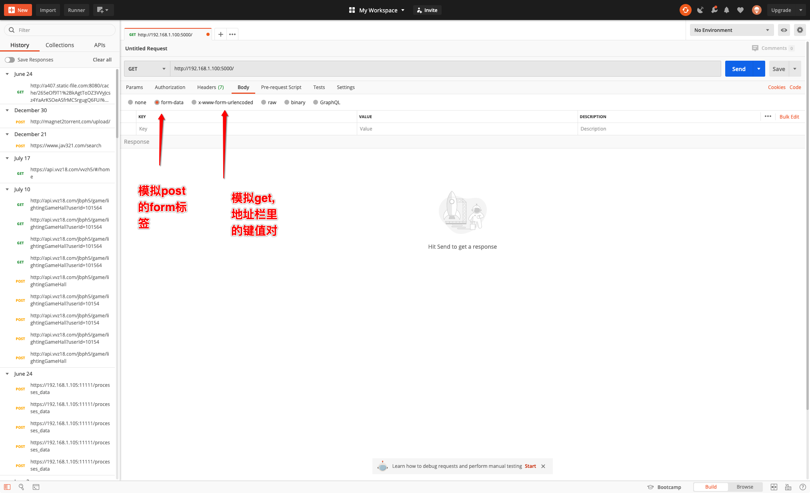
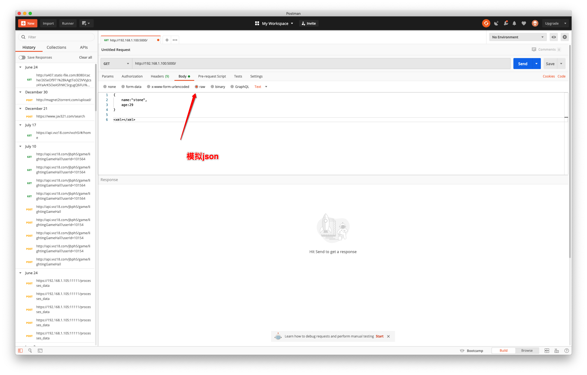
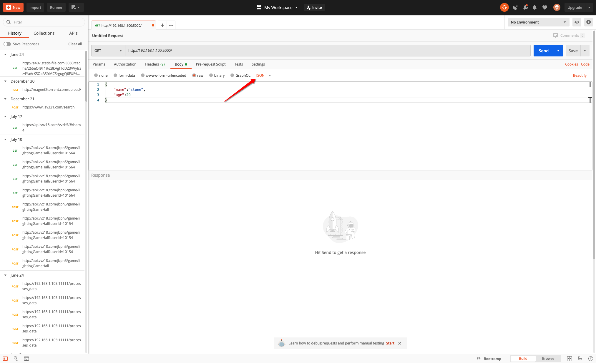
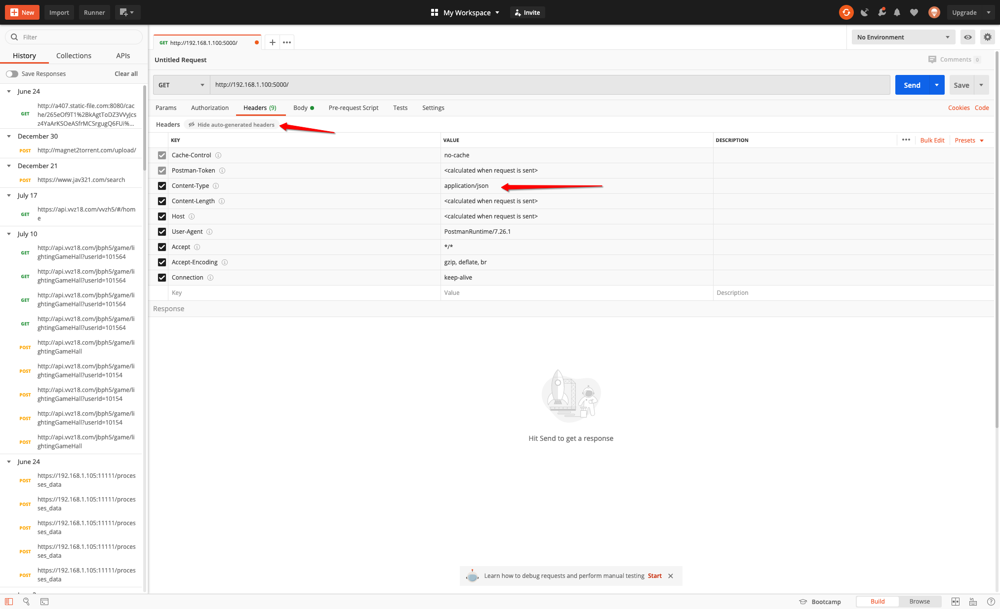
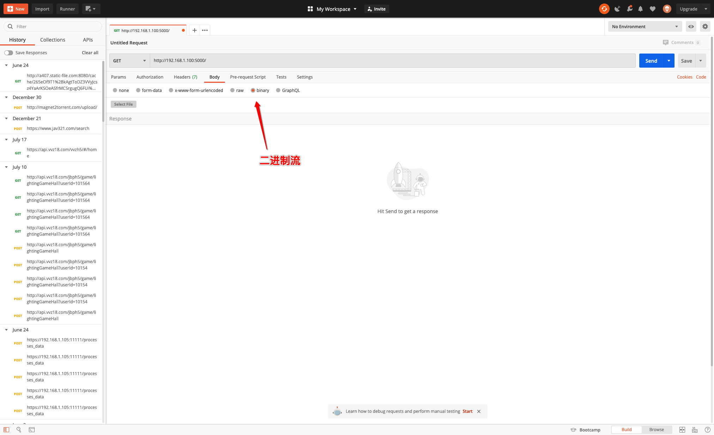

@(工作笔记)

# postman-record

[TOC]

---

**1、form-data:** 

​                   就是http请求中的**multipart/form-data**,它会将表单的数据处理为一条消息，以标签为单元，用分隔符分开。既可以上传键值对，也可以上传文件。当上传的字段是文件时，会有Content-Type来说明文件类型；content-disposition，用来说明字段的一些信息；

由于有boundary隔离，所以multipart/form-data既可以上传文件，也可以上传键值对，它采用了键值对的方式，所以可以上传多个文件，在springmvc中可以使用MultipartHttpServletRequest接收通过api根据"name"获取不同的键值，也可以通过MulTipartFile数组接收多个文件。

**2、x-www-form-urlencoded：**

​             就是**application/x-www-from-urlencoded**,会将表单内的数据转换为键值对，&分隔。
当form的action为get时，浏览器用x-www-form-urlencoded的编码方式，将表单数据编码为
(name1=value1&name2=value2…)，然后把这个字符串append到url后面，用?分隔，跳转
到这个新的url。
当form的action为post时，浏览器将form数据封装到http body中，然后发送到server。
这个格式不能提交文件。

**3、raw**

​            可以上传任意格式的文本，可以上传text、json、xml、html等

**4、binary**

​          相当于**Content-Type:application/octet-stream**,从字面意思得知，只可以上传二进制数据，通常用来上传文件，由于没有键值，所以，一次只能上传一个文件。

**multipart/form-data与x-www-form-urlencoded区别**

​               multipart/form-data：既可以上传文件等二进制数据，也可以上传表单键值对，只是最后会转化为一条信息；

​               x-www-form-urlencoded：只能上传键值对，并且键值对都是间隔分开的。

