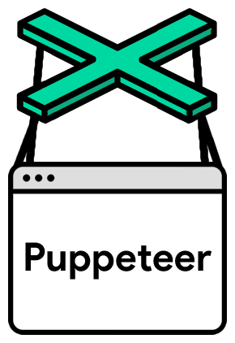

@(工作笔记)

# puppeteer-record




[TOC]

---


<https://blog.scrapinghub.com/how-to-use-a-proxy-in-puppeteer>

```javascript
'use strict';

const puppeteer = require('puppeteer');

(async() => {
  const browser = await puppeteer.launch({

     args: [ '--proxy-server=http://10.10.10.10:8000' ]

  });
  const page = await browser.newPage();
  await page.goto('http://toscrape.com');
  await browser.close();
})();
```

