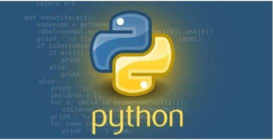
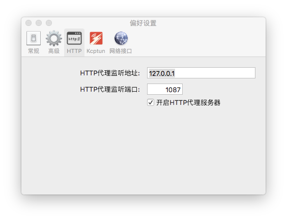
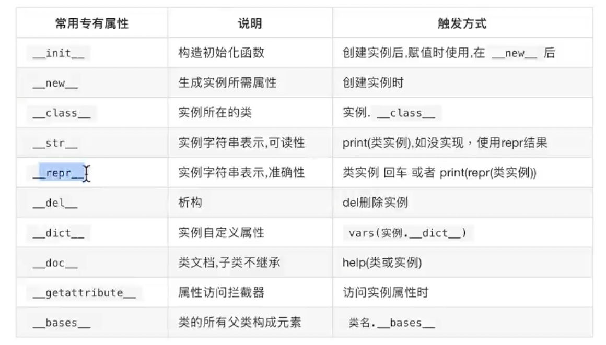
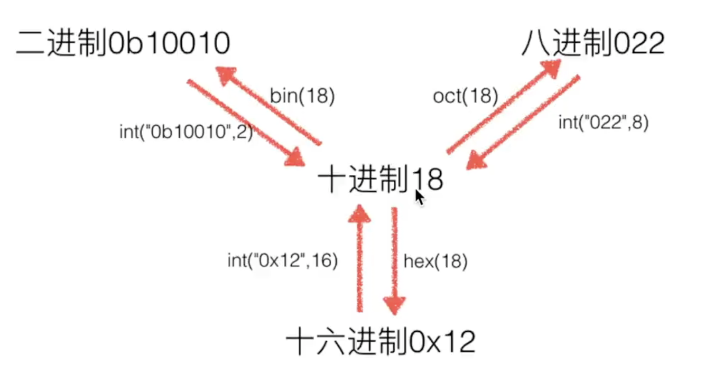
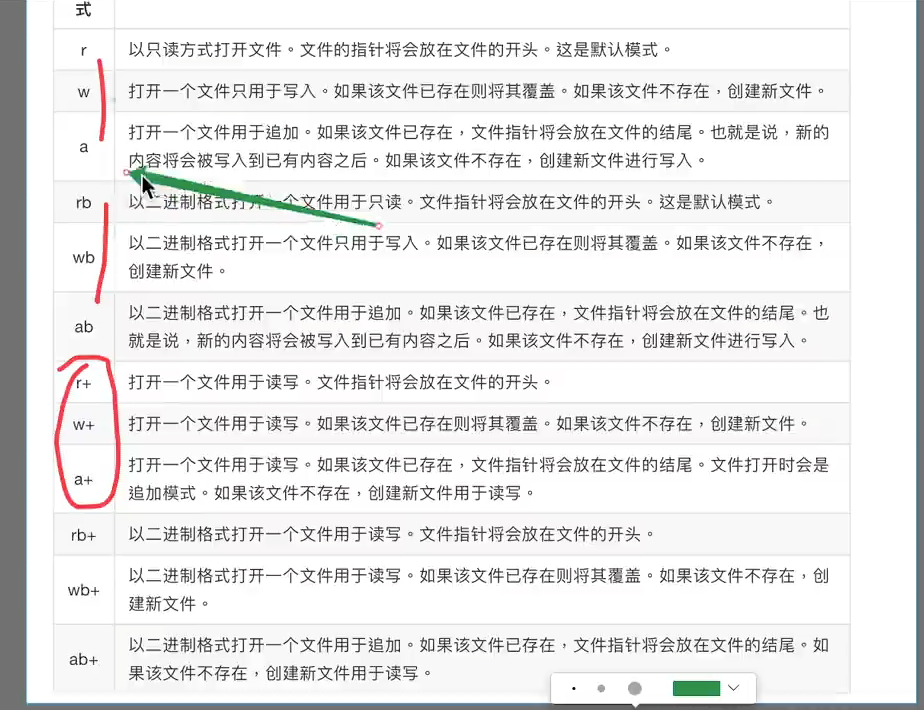
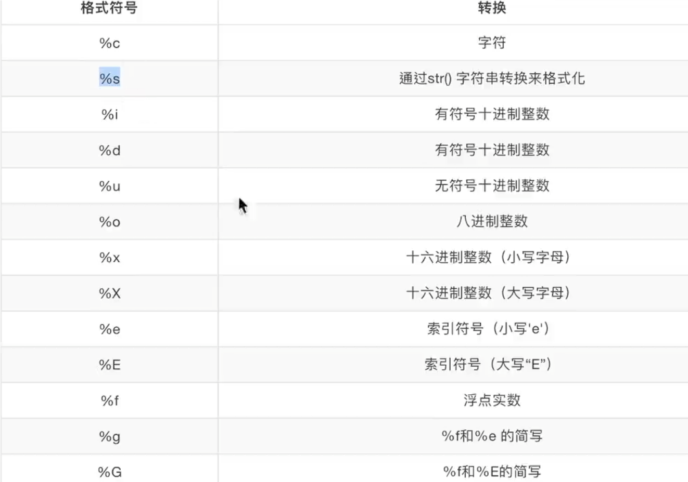
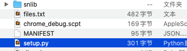

# python-record


---



```python
print('hello world')
```

## 
https://www.cnblogs.com/xueweihan/p/4981704.html

---

## python项目中requirements的巧用(一键导入所有安装包)

一个Python 项目中可能安装很多安装包, 再次创建虚拟环境是需要重新安装的话很麻烦也费时间, 或者项目部署的时候避免重装,

可以将现有项目的所有安装包记录在requirements.txt 文件, 再另一个环境下一键安装所有安装包.

requirements.txt 文件，用于记录所有依赖包及其精确的版本号，以便在新环境中进行部署操作。

使用以下命令将当前虚拟环境中的依赖包以版本号生成至文件中：
```bash
pip freeze > requirements.txt
```
当需要创建这个虚拟环境的完全副本，可以创建一个新的虚拟环境，并在其上运行以下命令：
```bash
pip install -r requirements.txt
```


## python虚拟环境配置

```bash
sudo pip install virtualenv # 安装虚拟环境
sudo pip install virtualenvwrapper # 安装虚拟环境扩展包

# 设置环境变量
在 .bashrc 或者 .bash_profile 中添加两行
export WORKON_HOME=$HOME/.virtualenvs
source /usr/local/bin/virtualenvwrapper.sh

# 执行
source .bashrc

# 创建虚拟环境命令
mkvirtualenv 虚拟环境名

# 如果要指定版本
mkvirtualenv -p python3 test00

# 退出虚拟环境
deactivate

# 删除虚拟环境
rmvirtualenv 虚拟环境名

```

```bash
# 虚拟环境安装 不要使用sudo , 使用了sudo 就安装到 本机的python上去了
pip install django==1.8.2 # 可以指定版本

# 查看虚拟环境中安装了哪些python包:
pip list
pip freeze

```


---

## Python 五个知识点搞定作用域
http://python.jobbole.com/86465/

1、块级作用域

想想此时运行下面的程序会有输出吗？执行会成功吗？

```
#块级作用域
 
if 1 == 1:
    name = "lzl"
 
print(name)
 
 
for i in range(10):
    age = i
 
print(age)
```

我们先看下执行结果

```plain
C:/Users/L/PycharmProjects/s14/preview/Day8/作用域/main.py
lzl
9
 
Process finished with exit code 0
```

代码执行成功，没有问题；在Java/C#中，执行上面的代码会提示name，age没有定义，而在Python中可以执行成功，这是因为在Python中是没有块级作用域的，代码块里的变量，外部可以调用，所以可运行成功；

---

## How do I make a primary key without auto-increment?
https://stackoverflow.com/questions/38798411/how-do-i-make-a-primary-key-without-auto-increment

```
只需在模型中显式创建id字段primary_key=True：

class SomeModel(models.Model):
    id = models.IntegerField(primary_key=True)
这样它就不会自动递增，但它仍然是主键。
```
---

## Python's requests “Missing dependencies for SOCKS support” when using SOCKS5 from Terminal
https://stackoverflow.com/questions/38794015/pythons-requests-missing-dependencies-for-socks-support-when-using-socks5-fro

```
pip install pysocks
```

## Django框架----命名URL和URL反向解析
https://www.cnblogs.com/jiangshanduojiao/p/8641763.html

---

## scrapy 结合 shadowsocks, socks5 协议转成http协议
http://ibloodline.com/articles/2017/12/30/scrapy-proxy.html
http://ibloodline.com/articles/2017/12/30/tor.html
https://javasgl.github.io/transfer_socks5_to_http_proxy/

- - 其实 shadowsocks 已经实现了 http代理... fuck!!!!!!!!!!!!! 浪费一下午

在偏好设置里查看 端口号, 全局模式


---

## running Scrapy but it error: No module named _util

https://stackoverflow.com/questions/50324329/running-scrapy-but-it-error-no-module-named-util


## 8个最高效的Python爬虫框架，你用过几个？
http://blog.51cto.com/13460911/2122398

---

## python2.7中报'\xb7'是什么意思

```
\0x：当输出的数转换为16进制只有1位时，在前面补0，如 0a，其它情况按照实际情况输出。
\x：按照输出数转换为16进制的实际位数输出。
此外，小写x和大写X也有点区别，小写的x输出小写符号的16进制，大写X则输出大写的（主要针对ABCDEF这六位）
str = '\xbe\xdc\xbe\xf8\xb7\xc3\xce\xca\xa1\xa3'
b = repr(str)
print unicode(eval(b),"gbk")
即可看到相应的汉字:拒绝访问
```

## centos 安装 pip
https://www.cnblogs.com/hengwei/p/5464678.html

## Centos6.5修改镜像为国内的阿里云源
https://blog.csdn.net/weixin_35852328/article/details/78677285?locationNum=5&fps=1

## redis | protected-mode no
protected-mode no
其他机器才能连接上
bind 127.0.0.1 注释掉

---

## Scrapy配合Selenium
https://www.cnblogs.com/cnkai/p/7570116.html
https://www.cnblogs.com/cnkai/p/7570219.html

---


## XPath提取多个标签下的text

https://www.jianshu.com/p/7041a7ba7fe0

---

## CrawlSpider、LinkExtractors、Rule及爬虫示例
https://blog.csdn.net/qq_33689414/article/details/78669514

```python
parse_start_url(response)

当start_url的请求返回时，该方法被调用。该方法分析最初的返回值并必须返回一个Item对象或一个Request对象或者一个可迭代的包含二者的对象
```

---

## Scrapy的log日志功能
https://www.cnblogs.com/shouzhong/p/7685822.html

---

## pycharm运行scrapy
https://www.cnblogs.com/cuzz/p/7623663.html

---

## Selenium+PhantomJS使用时报错原因及解决方案

https://blog.csdn.net/u010358168/article/details/79749149
https://developers.google.cn/web/updates/2017/04/headless-chrome


## 关于列表的扁平化

https://blog.csdn.net/jgywoshiyy/article/details/78178626

---

## XPATH的几个常用函数
https://www.cnblogs.com/longronglang/p/8001219.html

```python
1.contains ()： //div[contains(@id,'in')] ,表示选择id中包含有’in’的div节点
2.text()：由于一个节点的文本值不属于属性，比如“<a class=”baidu“ href=”http://www.baidu.com“>baidu</a>”,所以，用text()函数来匹配节点：//a[text()='baidu']
3.last()：前面已介绍
4.starts-with()： //div[starts-with(@id,'in')] ，表示选择以’in’开头的id属性的div节点
5.not()函数，表示否定，//input[@name=‘identity’ and not(contains(@class,‘a’))] ，表示匹配出name为identity并且class的值中不包含a的input节点。

not()函数通常与返回值为true or false的函数组合起来用，比如contains(),starts-with()等，但有一种特别情况请注意一下：我们要匹配出input节点含有id属性的，写法如下：//input[@id]，如果我们要匹配出input节点不含用id属性的，则为：//input[not(@id)]
```


## python requests通过shadowsock代理

https://blog.csdn.net/lk1991525/article/details/54943662

```
pip install PySocks
```


---

## Could not fetch URL https://pypi.python.org/simple/beautifulsoup/: There was a problem confirming the ssl certificate: [SSL: TLSV1_ALERT_PROTOCOL_VERSION] tlsv1 alert protocol version (_ssl.c:661) - skipping 解决

https://github.com/pypa/pip/issues/5226

```
For anybody who is still getting the same issue, upgrading pip manually works (in a venv, at least):

curl https://bootstrap.pypa.io/get-pip.py -o get-pip.py
python get-pip.py
```

---

## python 多线程使用的是 单核, 因为有GIL
因此 多进程效率比多线程高...多进程能使用所有核数
io频繁使用多线程: 例如拷贝文件等
计算频繁使用多进程: 比如破解密码


## python多进程和多线程谁更快
https://www.cnblogs.com/AsuraDong/p/threading_process.html

---

## mac python 多线程 queue.qsize() 正常

## mac python 多进程 queue.qsize() 异常, windows, Linux都没事, 有没有替代方案呢???


## python中put/get , put_nowait/get_nowait
https://blog.csdn.net/qq_32446743/article/details/80067013

---

## alias pserver="python -m SimpleHTTPServer 5000"
alias pserver3="python3 -m http.server 5000"
python本地服务器 无法播放 视频或者音频, 其他没毛病

替代方案: 使用node 服务器
https://stackoverflow.com/questions/12905426/what-is-a-faster-alternative-to-pythons-http-server-or-simplehttpserver

```
node.js的http-server非常方便，比Python的SimpleHTTPServer快得多。这主要是因为它使用异步IO来并发处理请求，而不是序列化请求。

安装
如果你还没有安装node.js。然后使用节点包管理器（npm）来安装包，使用-g全局安装选项。如果您在Windows上，则需要具有管理员权限的提示，并且在Linux / OSX上，您将需要sudo以下命令：

npm install http-server -g
这将下载任何所需的依赖项并安装http-server。

使用
现在，您可以从任何目录中键入：

http-server [path] [options]
路径是可选的，默认为./public是否存在，否则./。

选项是[默认值]：

-p 收听的端口号[8080]
-a 要绑定到[localhost]的主机地址
-i 显示目录索引页面[True]
-s或--silent静音模式不会登录到控制台
-h或--help显示帮助信息并退出
因此，要在端口8000上提供当前目录，请键入：

http-server -p 8000
分享改善这个答案
于2016年6月5日16:27编辑
在12月15日23:27 回答

德鲁诺克斯
176k的108507595
11
这太棒了！！谢谢你指出来。它非常适合测试流式音频/视频，这是python服务器似乎根本无法处理的东西。 -  gman 11年11月28日15:44
```

---

## python生成并处理uuid的方法
https://blog.csdn.net/yl416306434/article/details/80569688

---

## 常用内建属性


---

## python 装饰器 详解
https://www.cnblogs.com/alamZ/articles/7007945.html

---

## python2 解决 没有 nonlocal关键字的替代方案
https://stackoverflow.com/questions/3190706/nonlocal-keyword-in-python-2-x

```python
class Nonlocals(object):
    """ Helper class to implement nonlocal names in Python 2.x """
    def __init__(self, **kwargs):
        self.__dict__.update(kwargs)

def outer():
    nonlocals = Nonlocals(y=0)
    def inner():
        nonlocals.y += 1
        return nonlocals.y
    return inner

f = outer()
print(f(), f(), f()) # -> (1 2 3)

```

---

## 进制转换



## python yield 迭代器
https://blog.csdn.net/buaa_shang/article/details/8281559

---

## `__del__` 重写不自动释放
https://blog.csdn.net/hcj116/article/details/39481813

---

## file mode



## 格式输出



---

## python input 2.7 & 3.6 区别

```
在python2.7中，raw_input() 和 input() 函数都能从键盘输入数据，就输入的类型而言，基本一致。但是就字符串时候，raw_input() 函数不需要加引号，但是input() 需要加引号不然报错。但是在Python3.0以后的输入函数使用input 函数 ，使用方式就和raw_input 一样，不需要加引号

#!encoding:utf-8
a= raw_input("请输入") 
print a
b= input("b=") # 输入的时候 字符串需要自己加 引号
print b

```

---


##  Python之生成器详解
http://kissg.me/2016/04/09/python-generator-yield/

---

## 列表推导式  List comprehension; 

http://baijiahao.baidu.com/s?id=1585954833622101110&wfr=spider&for=pc

---

## python switch 实现
https://www.cnblogs.com/gerrydeng/p/7191927.html

---

## global与nonlocal关键字总结

```python
def out_foo():
    a = 25
    
    def inside_foo(param):
        nonlocal a
        a = a + 1
        return a * param * param
    
    return inside_foo


inside_foo = out_foo()

mlog(__file__, fm(), '''result = {}'''.format(inside_foo(10)))
mlog(__file__, fm(), '''result = {}'''.format(inside_foo(10)))
mlog(__file__, fm(), '''result = {}'''.format(inside_foo(10)))
```

```python
global适用于函数内部修改全局变量的值

nonlocal适用于嵌套函数中内部函数修改外部变量的值

如果没有使用以上关键字，对全局变量或者外部变量进行修改，python会默认将全局变量隐藏起来

例1:

def outside():
　　var = 5
　　def inside():
　　　　var = 3
　　　　print(var)

　　inside()
outside()

例2:

def outside():
　　var = 5
　　def inside():
　　　　print(var)  inside函数改变了var所以python将var隐藏了起来，这里的print找不到var因而报错。
　　　　var = 3

　　inside()
outside()

例1不会显示报错，但是例2会
```


## python3解决 json.dumps中文乱码

https://blog.csdn.net/qq_35277505/article/details/78953876

---

## python regex 模式匹配
https://blog.csdn.net/smilelance/article/details/6529950

---

## pycharm 使用shell 出错解决
http://softwaretester.info/pycharm-term-environment-variable-not-set/
https://teamtreehouse.com/community/term-environment-variable-not-set-pycharm


## Python包的相对导入时出现错误的解决方法

https://www.cnblogs.com/ArsenalfanInECNU/p/5346751.html

```
其实这两个错误的原因归根结底是一样的：在涉及到相对导入时，package所对应的文件夹必须正确的被python解释器视作package，而不是普通文件夹。否则由于不被视作package，无法利用package之间的嵌套关系实现python中包的相对导入。

　　文件夹被python解释器视作package需要满足两个条件：

　　1、文件夹中必须有__init__.py文件，该文件可以为空，但必须存在该文件。

　　2、不能作为顶层模块来执行该文件夹中的py文件（即不能作为主函数的入口）。
```

---

## python 二进制字符串和整数之间的装换
https://blog.csdn.net/huyoufu200920201078/article/details/54564932

---

## python 字符串格式化

https://www.cnblogs.com/benric/p/4965224.html
https://blog.csdn.net/alanguoo/article/details/78571260
http://www.runoob.com/python/att-string-format.html


## 详解 Python 中的下划线命名规则
https://www.cnblogs.com/MUMO/p/5718578.html

---

## python set
http://www.iplaypy.com/jichu/set.html
https://www.cnblogs.com/whatisfantasy/p/5956775.html

---

## python中字母与ascii码的相互转换
https://www.cnblogs.com/jingmu/p/7305040.html

```
字符->ascii
ord(c):参数是长度为1的字符串，简称字符。当参数为统一对象时（unicode object），返回能代表该字符的统一编码，当参数为8比特的字符串时，返回该字节的值。例如，ord('a')返回整形数值97，ord(u'\u2020')返回8224。

ascii->字符
chr(i)：返回一个字符，字符的ascii码等于参数中的整形数值。例如chr(97)返回字符'a'，该方法是ord()的反方法。参数必须是0-255的整形数值，否则会抛出valueError错误。
```

---

## python中双冒号(::)的用法
https://blog.csdn.net/fengzhizi76506/article/details/58232608

```
seq[start:end:step]

解释s[i:j:k]是，根据该“片第从i到j与第k步”。何时i和j缺席，整个序列是和s[::k]意思是“每k个项目”。 示例 首先，让我们来初始化一个列表：

```

---

## Python 列表和元组的区别是什么？
http://python.jobbole.com/86661/

```
比如你不能把列表当做字典的关键字，因为只有不可变的值才能进行哈希运算，因此只有不可变的值才能作为关键字。要使用列表做关键字，你需要把它转化为元组：

Python

>>> d = {}
>>> nums = [1, 2, 3]
>>> d[nums] = "hello"
Traceback (most recent call last):
  File "<stdin>", line 1, in <module>
TypeError: unhashable type: 'list'
>>> d[tuple(nums)] = "hello"
>>> d
{(1, 2, 3): 'hello'}

>>> d = {}
>>> nums = [1, 2, 3]
>>> d[nums] = "hello"
Traceback (most recent call last):
  File "<stdin>", line 1, in <module>
TypeError: unhashable type: 'list'
>>> d[tuple(nums)] = "hello"
>>> d
{(1, 2, 3): 'hello'}
```

---

## Python3 读写文件 中文乱码 错误TypeError: write() argument must be str, not bytes+
https://blog.csdn.net/zengxyuyu/article/details/53038763

---

## python3.*报“ImportError: No module named ‘MySQLdb'”
https://www.cnblogs.com/TaleG/p/6735099.html

```
MySQLdb只支持Python2.*，还不支持3.*
可以用PyMySQL代替。安装方法：pip install PyMySQL

然后在需要的项目中，把 __init__.py中添加两行：
import pymysql
pymysql.install_as_MySQLdb()
就可以用 import MySQLdb了。其他的方法与MySQLdb一样。
```


---

## python3.7 使用 django1.11有bug 官方未修复
https://stackoverflow.com/questions/48822571/syntaxerror-generator-expression-must-be-parenthezised-python-manage-py-migra

```
You’re not doing anything wrong; this is a problem between Django and Python 3.7. Django has a fix, but that fix hasn’t made it into a new version yet.

You can install the stable version of Python, Python 3.6, in the meantime.
```


## python3编码问题汇总
https://www.jb51.net/article/92006.htm
```
.Python3中的默认编码

Python3中默认是UTF-8，我们通过以下代码：

import sys
 
sys.getdefaultencoding()
可查看Python3的默认编码。
```

---

## Django在根据models生成数据库表时报 __init__() missing 1 required positional argument: 'on_delete'
https://www.cnblogs.com/phyger/p/8035253.html

```
原因：

在django2.0后，定义外键和一对一关系的时候需要加on_delete选项，此参数为了避免两个表里的数据不一致问题，不然会报错：
TypeError: __init__() missing 1 required positional argument: 'on_delete'


需要改成：
user=models.OneToOneField(User,on_delete=models.CASCADE) --在老版本这个参数（models.CASCADE）是默认值
owner=models.ForeignKey(UserProfile,on_delete=models.CASCADE) --在老版本这个参数（models.CASCADE）是默认值
```


---

## [Python2中input()、raw_input()和Python3中input()](https://www.cnblogs.com/gengcx/p/6707024.html)


---

## [Python 3's f-Strings: An Improved String Formatting Syntax (Guide)](https://realpython.com/python-f-strings/)


## python的import机制（解决pycharm中遇到的自己的模块找不到，红波浪线问题）

<https://blog.csdn.net/GentleCP/article/details/87395869>


## pyCharm中添加方法注释（Docstring format & Live Templates）

<https://blog.csdn.net/dkjkls/article/details/88933950>


## # python中的__doc__详解

<https://blog.csdn.net/ChenglinBen/article/details/93359851>


```plain
# main 中 无法使用 相对路径导包, 因为 __name__ 改变了成 __main__了, 导包是靠 __name__ 来找相对路径的
```

```plain
# from ....main import *  # 超过了顶级包了, 是个模块 就需要包, 相对路径 出了包就傻逼了
```


---

## python 全局变量 global

```python
global d
d = 2
```


## 模块是文件, 包是文件夹


相对导入 只能是 模块与模块之间才起作用, main.py 不能用 相对导入


## json.dump()与json_dumps()区别

<https://blog.csdn.net/lizhixin705/article/details/82344209>

json 模块提供了一种很简单的方式来编码和解码JSON数据。 其中两个主要的函数是 json.dumps() 和 json.loads()。

1.json.dumps将一个Python数据结构转换为JSON：

```python
import json
data = {
    'name' : 'myname',
    'age' : 100,
}

json_str = json.dumps(data)
```


2.json.loads将一个JSON编码的字符串转换回一个Python数据结构：

```python
data = json.loads(json_str)
```

3.json.dump() 和 json.load() 来编码和解码JSON数据,用于处理文件。

```python
with open('test.json', 'w') as f:
    json.dump(data, f)

with open('test.json', 'r') as f:
    data = json.load(f)
```


## Python读取相对路径文件

<https://blog.csdn.net/qq_35531549/article/details/89137350>

例如下图目录结构:


第一种情况：
1）xxx.py想要打开a.txt，使用相对路径，有如下两种方式：

思路：

xxx.py想打开的是b_file下的文件，XXX.py和b_file都在文件目录之下，两者是同级目录，因此操作就是在当前目录向下搜索，因此就可以很容易理解下面的意思了

特别提示：… \是错误的，打开的是上级目录

```python
with open(r"b_file\a.txt","r") as file:
with open(r".\b_file\a.txtx", "r") as file:
```

2）ab.py尝试打开b_file下的a.txt，应该怎么写：

思路，首先要定位到上级目录，在上级目录下找到b_file下的.TXT

```python
with open(r"..\b_file\aa.txt", "r") as f:
    print(f.read())
```
最后：如果想要使用绝对路径也很简单：

xxx.py打开b_file下的a.txt中，我们可以使用OS库，获取到xxx.py的当前路径，再然后通过组合的方式电子杂志到绝对路径。

当然还可以分成两部，使用os.path.join（路径，PATH1）进行两个路径的自动合并，去获取到完整的路径，也是可行的。

```python
import os
path = os.getcwd()#获取当前路径

with open(path+".\b_file\a.txt", "r") as file:
import os
path = os.getcwd()
a_path = os.path.join(path, "b_file/a.txt")
print(a_path)
```


从下级目录向上级目录合并，也是可以使用加入方法实现的

```python
os.path.abspath(os.path.join(path, ".."))
```


## python 全局变量引用与修改

<https://www.jianshu.com/p/3e5647fccc7c>


## Python 匿名函数lambda的高级用法

<https://www.jianshu.com/p/34cbef4e69b0>


## 类装饰器

<https://blog.csdn.net/xie_0723/article/details/79761313>


## [python装饰器的参数传递](https://www.cnblogs.com/serpent/p/9445592.html)

<https://www.cnblogs.com/serpent/p/9445592.html>


## python爬虫对于gb2312

对于刚刚接触python爬虫的人，常常会碰到一个比较烦的问题，

如果网页是GB2312编码格式，我们直接decode（’GB2312‘）一般python都会报错：

GB2312不能编码该页面。

这就比较奇怪了

```html
<meta http-equiv="Content-Type" content="text/html; charset=gb2312" />
```

网页的charset明明是GB2312，却出错了。

事实上微软将 gb2312 和 gbk 统一映射为 gb18030，这个问题也比较无语大家可以参考：


## Python3中urllib详细使用方法(header,代理,超时,认证,异常处理)

<https://blog.csdn.net/m_buddy/article/details/55193762>


## [Extract `src` attribute from `img` tag using BeautifulSoup](https://stackoverflow.com/questions/43982002/extract-src-attribute-from-img-tag-using-beautifulsoup)

```python
from BeautifulSoup import BeautifulSoup as BSHTML
import urllib2
page = urllib2.urlopen('http://www.youtube.com/')
soup = BSHTML(page)
images = soup.findAll('img')
for image in images:
    #print image source
    print image['src']
    #print alternate text
    print image['alt']
```

**For Texts with img tag**

```python
from BeautifulSoup import BeautifulSoup as BSHTML
htmlText = """ """
soup = BSHTML(htmlText)
images = soup.findAll('img')
for image in images:
    print image['src']
```


## python版本 puppeteer

<https://miyakogi.github.io/pyppeteer/>


## scrapy

## <https://scrapy.org/>


## Python repr() 函数

repr() 函数将对象转化为供解释器读取的形式。

和手动转字符串有啥区别??

>>>s = 'RUNOOB'
>>>repr(s)
>>>"'RUNOOB'"
>>>dict = {'runoob': 'runoob.com', 'google': 'google.com'};
>>>repr(dict)
>>>"{'google': 'google.com', 'runoob': 'runoob.com'}"


---


## 不要用 Pipenv , mac 有 pyenv 无需 pipenv, pipenv 听说坑很多

<https://zhuanlan.zhihu.com/p/80478490>


## [Python] logging not working

<https://dotblogs.com.tw/What_s_Note/2018/03/09/140243>


---


## 安装本地python 模块, 自己写的模块

```py
from distutils.core import setup

setup(name='credentials', version='1.0.0', packages=['credentials'])
```


setup.py内容

```python
from distutils.core import  setup

setup(name='snlib',version='1.0',author='stone',py_modules=['snlib.dlog'])
```

目录位置 和库文件同级



```bash
python setup.py install --record files.txt # 后面这一句是为了删除方便
```


```bash
rm $(cat files.txt) # 卸载命令

xargs rm -rf < files.txt
```


## 取字典数据

spider.settings.get("BOT_NAME",None) # 当空时 使用 None


---


## python生成并处理uuid的方法

<https://blog.csdn.net/yl416306434/article/details/80569688>

```plain
 UUID（Universally Unique Identifier）是通用唯一识别码，在许多领域用作标识，比如我们常用的数据库也可以用它来作为主键，原理上它是可以对任何东西进行唯一的编码的。作为新手一看到类似varchar(40)这样的主键就觉得有点蒙圈了，字符串型也不能自增啊，这里就应该应用UUID了。数据库一般都有自己的办法生成UUID，但虽然可以用，但这玩意考虑到可读性和有点坑的长度还是尽量不要用这玩意做主键···咳，有点跑题···
        下面就简单说明一下python是如何生成UUID的：
        python有一个模块叫做uuid，导入它就可以使用它的四个方法了。注意这四个方法依次是uuid1(),uuid3(),uuid4(),uuid5(),
然而并没有uuid2()。

# -*- coding:utf-8 -*-
import uuid
 
print uuid.uuid1()
#bf1dfacf-67d8-11e8-9a23-408d5c985711
print uuid.uuid3(uuid.NAMESPACE_DNS, 'yuanlin')
#ddb366f5-d4bc-3a20-ac68-e13c0560058f
print uuid.uuid4()
#144d622b-e83a-40ea-8ca1-66af8a86261c
print uuid.uuid5(uuid.NAMESPACE_DNS, 'yuanlin')
#4a47c18d-037a-5df6-9e12-20b643c334d3
        乍一看全都是36个字符，那么他们到底有什么不同呢，下面一一分析。

        uuid1()：这个是根据当前的时间戳和MAC地址生成的，最后的12个字符408d5c985711对应的就是MAC地址，因为是MAC地址，那么唯一性应该不用说了。但是生成后暴露了MAC地址这就很不好了。

        uuid3()：里面的namespace和具体的字符串都是我们指定的，然后呢···应该是通过MD5生成的，这个我们也很少用到，莫名其妙的感觉。

        uuid4()：这是基于随机数的uuid，既然是随机就有可能真的遇到相同的，但这就像中奖似的，几率超小，因为是随机而且使用还方便，所以使用这个的还是比较多的。

        uuid5()：这个看起来和uuid3()貌似并没有什么不同，写法一样，也是由用户来指定namespace和字符串，不过这里用的散列并不是MD5，而是SHA1.

        下面再来说一下简单的处理，UUID中间的'-'是个比较奇怪的字符，那么应该去掉它，这其实超简单：

uid = str(uuid.uuid4())
suid = ''.join(uid.split('-'))
```


---

## subprocess使用

```python
# shell=True 参数会bai让subprocess.call接受字符串类型的变du量作为命zhi令，并调用shell去执行这个字符串，
# shell=False 是，subprocess.call只接受数组变量作为命令，并将数组的第一个元素作为命令，剩下的全部作为该命令的参数。
subprocess.call("python 009_script.py runserver", shell = True)
```


### [Python的subprocess.call和subprocess.run有什么区别](https://stackoverflow.com/questions/40697583/whats-the-difference-between-pythons-subprocess-call-and-subprocess-run)

推荐使用 run, call 说是过期了要


## Python subprocess.Popen中communicate()和wait()区别

<https://blog.csdn.net/weixin_30877493/article/details/95519269?utm_medium=distribute.pc_relevant.none-task-blog-BlogCommendFromMachineLearnPai2-1.nonecase&depth_1-utm_source=distribute.pc_relevant.none-task-blog-BlogCommendFromMachineLearnPai2-1.nonecase>

结论：如果使用 `subprocess.Popen`，就不使用 `Popen.wait()`，而使用 `Popen.communicate()` 来等待外部程序执行结束。


## Python Template Languages

<https://www.jetbrains.com/help/idea/2017.1/python-template-languages.html>