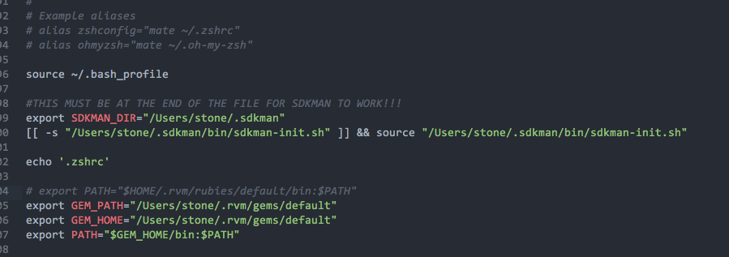

@(工作笔记)

# ruby-record

[TOC]

---


```ruby
p 'hello world'
```
---

## sed替换整行

```powershell
rails new $1 --skip-bundle

filepath="$1/Gemfile"
sed -i "" "1s/^.*$/source 'https:\/\/gems.ruby-china.com\/'/g" $filepath
```

---

## rvm complain of "PATH is not properly set up"

```
Removing rvm PATH line from /Users/stone/.mkshrc.
Adding rvm PATH line to /Users/stone/.profile /Users/stone/.mkshrc /Users/stone/.bashrc /Users/stone/.zshrc.
Adding rvm loading line to /Users/stone/.profile /Users/stone/.bash_profile /Users/stone/.zlogin.
```

```
/Users/stone/.mkshrc
/Users/stone/.profile
/Users/stone/.mkshrc
/Users/stone/.bashrc 
/Users/stone/.zshrc
/Users/stone/.profile
/Users/stone/.bash_profile
/Users/stone/.zlogin
```

```
Warning! PATH is not properly set up, /Users/stone/.rvm/gems/ruby-2.5.1/bin is not at first place.
```
https://qiita.com/900090009/items/779dd0b5317e24939489

恶心的警告

只要 .rvm/gems 不再第一个 就抱警告,
因此改写.zshrc

搞定

## ruby 继承关系


## ruby 中类变量是不好的做法

https://stackoverflow.com/questions/10594444/class-variables-in-ruby

```ruby
从来没有真正需要类变量。但原因并不是他们是共享国家。我的意思是，尽可能避免共享状态是好的，但这不是真正的问题。

他们被推荐反对的原因是，正如那篇文章所示，他们真的很混乱。特别是，类的类变量由其子类和子类的实例共享。例如：

class Parent
end

class Child1 < Parent
  @@class_var = "Child1's"
end

class Child2 < Parent
  @@class_var = "Child2's"
end
使用此代码，Child1及其实例将全部看到以@@class_var值"Child1's"和Child2 命名的类变量，并且其实例将全部看到@@class_var以该值命名的类变量"Child2's"。但是假设稍后我们重新打开Parent并写下这个：

class Parent
  @@class_var = "Parent's"
end
现在，Parent及其创建的实例将全部看到@@class_var以该值命名的类变量"Parent's"。但这不是全部。既然父类有这个变量，Child1和Child2突然共享变量，所以所有的@@class_vars都有值"Parent's"。如果你在Child1中重新分配变量，它仍然是共享的，所以所有类都会更新。多么令人困惑！

您可以只使用类的实例变量而不是类变量，如下所示：

class Parent
  @class_var = "Parent's"
  def self.class_var
    @class_var
  end
end

class Child1 < Parent
  @class_var = "Child1's"
end

class Child2 < Parent
  @class_var = "Child2's"
end
现在，Parent.class_var将返回“Parent's”，Child1.class_var将返回“Child1's”并Child2.class_var返回“Child2's” - 就像您期望的那样。
```

## @@ 类变量
https://stackoverflow.com/questions/5890118/what-does-variable-mean-in-ruby/5890234
https://stackoverflow.com/questions/2505067/class-self-idiom-in-ruby

---

## ruby-on-rails - 在 Rails 中，为了便于调试，如何打印对象的内容？

https://ask.helplib.com/ruby-on-rails/post_747804

---


## Ruby 2.3 new feature 之一: 多行字符串更优美的写法
https://ruby-china.org/topics/28501

---

## ruby log
https://stackoverflow.com/questions/19507477/how-to-get-current-file-and-line-number-in-ruby

---

## ruby IDE apache velocity 制作模板 转意 $ 方法

https://stackoverflow.com/questions/15547671/escaping-the-dollar-sign-in-velocity-using-backslash-not-working/15548413

```
One of the way is to use a fixed string variable i.e, setting a variable for the $ sign and then using it.

#set ( $d = "$")
xyz ${d}${d}foo
It gives the expected output

xyz $$foo
```


---

## [ruby关于require路径](https://www.cnblogs.com/ziyouchutuwenwu/p/4175841.html)

ruby里面的require说明

```
require './aaaa'
```

这种方式，包含的是系统路径

 

相对路径得用下面的

```
require_relative "./xxxx"
```

 

 或者使用这个傻瓜式gem

<https://github.com/jarmo/require_all>

```
#这个支持通配符
require_all 'lib/**/*.rb'

#这个支持相对路径
require_rel 'foobar'
```


---

```
Note you may need to manually remove /etc/rvmrc and ~/.rvmrc if they exist still.
Please check all .bashrc .bash_profile .profile and .zshrc for RVM source lines and delete or comment out if this was a Per-User installation.
Also make sure to remove `rvm` group if this was a system installation.
Finally it might help to relogin / restart if you want to have fresh environment (like for installing RVM again).
```


`.bashrc `

`.bash_profile `

`.profile `

`.zshrc`


```plain
Upgrading the RVM installation in /Users/stone/.rvm/
    Removing rvm PATH line from /Users/stone/.mkshrc.
    Adding rvm PATH line to /Users/stone/.profile /Users/stone/.mkshrc /Users/stone/.bashrc /Users/stone/.zshrc.
    Removing rvm loading line from /Users/stone/.profile.
    Adding rvm loading line to /Users/stone/.profile /Users/stone/.bash_profile /Users/stone/.zlogin.
Upgrade of RVM in /Users/stone/.rvm/ is complete.
```

/Users/stone/.profile

/Users/stone/.mkshrc

/Users/stone/.bashrc 

/Users/stone/.zshrc

/Users/stone/.bash_profile 

/Users/stone/.zlogin.

