@(工作笔记)

# ssr-record

[TOC]

---


```
/hello world/
---
```

---

https://suniceman.com/2019/04/10/install-shadowsocks-in-one-command/
https://lequ7.com/2019/02/21/richang/ke-xue-shang-wang-ss-fan-qiang-just-my-socks/

https://ssr.tools/194
SSR 添加多用户多端口教程（ShadowsocksR多用户）
https://ssr.tools/31
SSR一键安装脚本 (ShadowsocksR一键安装教程)

centos7 关闭防火墙
https://www.cnblogs.com/a1304908180/p/10164504.html

--- 

## 手把手教你基于Vultr搭建SS教程绝对干货

> 本文从零开始，手把手教你搭建自己的shadowsocks代理服务器实现科学上网。可用爬墙方法，史上最全的小白搭建ss教程。内容包括VPS购买，连接VPS，一键搭建shadowsocks，开启bbr加速，客户端配置shaodowsocks。

### 购买VPS
VPS（Virtual private server，虚拟专用服务器），个人用来搭建一些博客，跑跑脚本足够了。今天的教程就用VPS来搭建属于自己的shaodowsocks，一个人独占一条线路。

Vultr是美国的一个VPS服务商，全球有15个数据中心，可以一键部署服务器。采用小时计费策略，可以在任何时间新建或者摧毁VPS。价格低廉，最便宜的只要2.5一个月，支持支付宝。

### 新用户注册
Vultr官网链接：https://www.vultr.com/?ref=7225801

Vultr优惠注册链接：https://www.vultrblog.com/


填写邮箱、密码（至少10个字符，并且有一个大写字母&一个小写字母&一个数字），最后点击后面的Create Account即可。注册完会收到一封验证邮件，验证即可~

### 充值
Vultr实际上是折算成小时来计费的，比如服务器是5美元1个月，那么每小时收费为5/30/24=0.0069美元 会自动从账号中扣费，只要保证账号有钱即可~而费用计算是从你开通时开始计算的，不管你有没有使用都会扣费，即使你处于关机状态，唯一停止计费的方法是Destroy掉这个服务器！Vultr提供的服务器配置包括：

>2.5美元/月的服务器配置信息：单核 512M内存 20G SSD硬盘 100M带宽 500G流量/月 (现在不支持IPv4了请谨慎选择)
5美元/月的服务器配置信息：单核 1G内存 25G SSD硬盘 100M带宽 1000G流量/月
10美元/月的服务器配置信息：单核 2G内存 40G SSD硬盘 100M带宽 2000G流量/月
20美元/月的服务器配置信息：2cpu 4G内存 60G SSD硬盘 100M带宽 3000G流量/月
40美元/月的服务器配置信息：4cpu 8G内存 100G SSD硬盘 100M带宽 4000G流量/月

验证并登录后我们会跳转到充值界面，或者从Billing->Make Patment进入：


`支持支付宝~充值10刀，按小时扣费，只要保证账户有余额，你的服务器就会一直运行~`

### 新机器创建
选择右上角的蓝色+号按钮，进入Deploy页面，选择服务器配置：


由于2.5美元/每月的服务器改版了不支持IPv4 所以这里还是的选最低配置的5美元/月的那个了

推荐服务器使用日本或者新加坡的毕竟都是在亚洲离得比较近~

Server Type选择Ubuntu 16.04。这里演示是以Ubuntu 16.04为基础的所以这里就选了Ubuntu 16.04

其他都直接默认即可~最后点击右下角的Deploy Now开始新建~

### 获取VPS登录信息
选择Deploy后，过个几分钟，就可以看到自己的服务器信息了，具体位置在Servers->Instances，点击选择你新建的实例：

其中，红框选中的部分从上到下依次是IP，用户名和密码~
### 连接VPS
Windows连接VPS
1.下载Xsehll
直接在[百度软件中心](http://rj.baidu.com/soft/detail/15201.html?ald)下载，下载后正常安装即可~

2.连接linux
选择文件->新建：

在主机位置输入你的VPS IP：
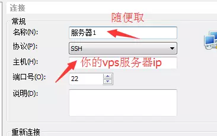
确定后会让你输入你的Linux用户名：

之后是Linux用户密码：
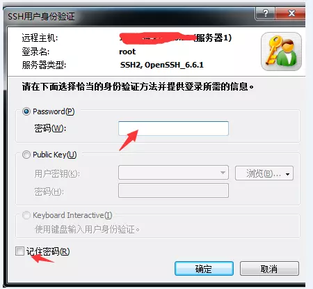
如果显示如下图所示就表示连接成功了（如果是Vultr，那么连接成功标志应该是root@vultr）：
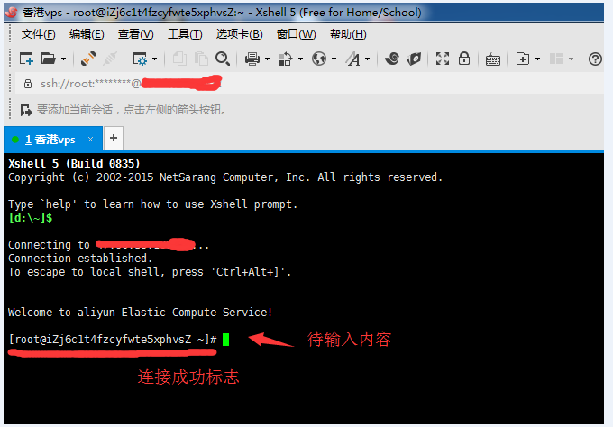
### Mac OS连接VPS
直接打开Terminal终端，输入：ssh root@43.45.43.21，之后输入你的密码就可以登录了（输入密码的时候屏幕上不会有显示）
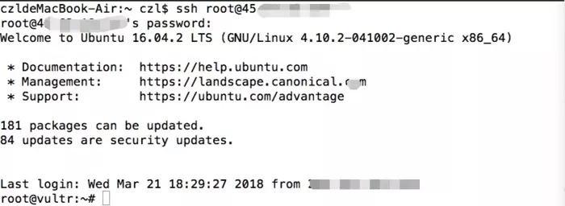
### 一键搭建shaodowsocks
1. 下载一键搭建ss脚本文件（直接复制这段代码运行即可）

```bash
git clone https://github.com/Flyzy2005/ss-fly
```
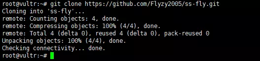
2. 运行搭建ss脚本代码
```bash
ss-fly/ss-fly.sh -i password 1024
```

其中password换成你要设置的shadowsocks的密码即可，密码最好只包含密码+数字，一些特殊字符可能会导致冲突。而第二个参数1024是端口号，也可以不加，不加默认是1024~（举个例子，脚本命令可以是ss-fly/ss-fly.sh -i qwerasd，也可以是ss-fly/ss-fly.sh -i qwerasd 8585，后者指定了服务器端口为8585，前者则是默认的端口号1024）。
出现如下界面就说明搭建好了~

注：如果需要改密码或者改端口，只需要重新再执行一次搭建ss脚本代码就可以了~

### 开启BBR加速
BBR是Google开源的一套内核加速算法，可以让你搭建的shadowsocks速度上一个台阶。

1. 检测Ubuntu内核版本

BBR支持4.9以上的，如果你的版本高于这个则会直接开启BBR加速，如果低于这个版本则会自动下载4.10的并重启，执行如下脚本命令：

```bash
ss-fly/ss-fly.sh -bbr
```
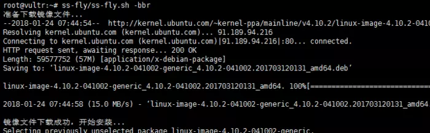

第一次会检测内核版本并自动更新，更新后会重启VPS，再根据连接VPS部分教程重新连接VPS即可。

2. 开启BBR加速

```bash
ss-fly/ss-fly.sh -bbr
```

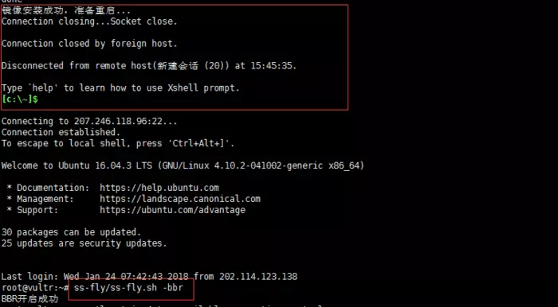
重新连接后，再次运行一次这个命令即可开启bbr加速。

### 本机配置shadowsocks
#### WIndows客户端配置
双击运行shadowsocks.exe，之后会在任务栏有一个小飞机图标，右击小飞机图标，选择服务器->编辑服务器：

在shadowsocks的windows客户端中，服务器IP指你购买的VPS的IP，服务器端口指你服务器的配置文件中的端口，密码指你服务器的配置文件中的密码，加密指你服务器的配置文件中的加密方式，代理端口默认为1080不需要改动。其他都可以默认。设置好后，点击添加按钮即可。
### Mac OS客户端配置
双击运行shadowsocksX-NG.app，之后会在任务栏有一个小飞机图标，右击小飞机图标，选择服务器->服务器设置：

在shadowsocks的Mac OS客户端中，地址指你购买的VPS的IP，冒号后面跟上配置文件中的端口，密码指你服务器的配置文件中的密码，加密指你服务器的配置文件中的加密方式。其他都可以默认。设置好后，点击确认即可。
### 安卓客户端配置
下载apk安装好后，打开影梭客户端，点击主界面左上角的编辑按钮（铅笔形状）：
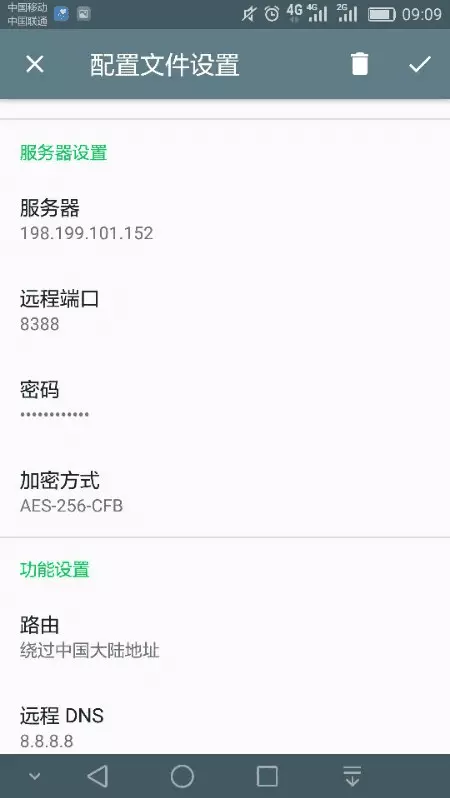
在shadowsocks安卓客户端的配置中填入相应配置信息，其中，功能设置中，路由改成如上图所示，其他都可以默认。

苹果客户端配置
shadowsocks苹果客户端经常会被App Store下架，可以在App Store搜索关键字shadowsock或者wingy，找到一个软件截图中包括填写ip，加密方式，密码的软件一般就是对的了（目前可以用的是FirstWingy）。当然，你也可以下载PP助手，之后在PP助手上下载Wingy（Wingy支持）或者shadowrocket（shadowrocket支持）。

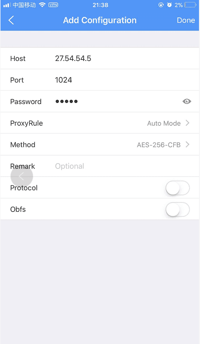
### 总结
如上就是Vultr手把手教你搭建SS的全部内容。在国内上外网是不允许的，所以还不如自己搭建ss，可以独享一个线路。


---

## 判断 IP 是否被墙及 VPS 无法连接的解决办法
http://coolaf.com/tool/port
https://www.vultrcn.com/4.html

当创建的服务器无法连接时，我们应该考虑服务器的 IP 地址是不是已经被屏蔽（也就是俗称的被墙了）。本文就简单介绍下如何进行判断以及后续的相应解决办法。


访问全国 Ping 测试网页：点我！点我！点我！，按照下图提示，我们首先在左侧方框内填写服务器的 IP 地址，然后只勾选中国和港澳台两项，最后点击 Ping 即可开始测试。
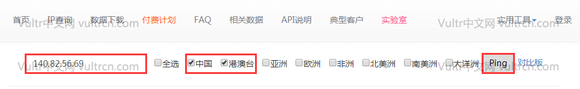


测试结果主要分为三种，大家首先根据实际的测试结果进行匹配，然后根据解决方法进行处理。

1、若中国的丢包率都是 100%、港澳台的丢包率不是 100%

当测试结果为下图所示界面类型，即中国不可 Ping 通、港澳台可 Ping 通时，可以确定的是服务器的 IP 已经被封禁，这时我们自然是不能成功连接上 VPS 的。


这种中国不可 Ping 通、港澳台可 Ping 通的情况在 15 个机房中日本东京出现的最频繁，也是最严重的结果。当服务器的 IP 地址被屏蔽后，我们需要重新创建一台服务器，然后再删除这台被屏蔽的服务器。如果创建出来的服务器的 IP 地址依旧是被屏蔽的，那么我们只能继续以上操作，直至刷到未被屏蔽的 IP 地址。刷可用 IP 一定要有耐心、要有耐心！

2、若中国和港澳台的丢包率都不是 100%

当测试结果为下图所示界面类型，即中国和港澳台都可 Ping 通时，可以确定的是服务器的 IP 未被封禁，同时导致 VPS 无法连接的原因估计是本地网络到服务器的网络连接不畅。


最新解决办法：[《Vultr 能 Ping 但是 SSH 无法连接的解决办法》](https://www.vultrcn.com/11.html)，请按照这个进行排查。

这种中国和港澳台都可 Ping 通但是又无法连接的情况往往出现在日本东京的服务器上，这个情况就说明日本东京的服务器并不适合你，解决办法只能是创建除日本东京以外的服务器，然后再尝试连接。如果还是无法连接，就请继续按照本文的方法进行测试，然后按照相应解决办法进行。

3、若中国和港澳台的丢包率都是 100%

当测试结果为下图所示界面类型，即中国和港澳台都不可 Ping 通时，服务器的 IP 是否被封禁判断不出来，但是 VPS 无法连接肯定是服务器并没有正常运行导致的。
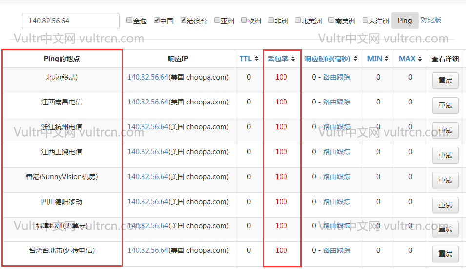

这种中国和港澳台都不可 Ping 通的情况我们几乎不会遇到。当出现这种情况时，通常是因为服务器所在的地区正在进行维护或者用户违规使用服务器（挖矿、滥发邮件等）被官方停机。相应的解决办法肯定是登录 vultr 的官方网站，然后判断是服务器所在地区正在维护还是违规使用服务器被官方停机导致的 VPS 无法连接。


---

## 在极路由上安装Shadowsocks插件


早期极路由有自带的官方插件，SSH，可以轻松通过该插件使用SSH梯子，后来SSH插件就下架了，仿佛极路由再也不能使用梯子了。

Shadowsocks的出现使其成为了新的梯子，聪明的极客们已经有方法可以在极路由上使用Shadowsocks了，网上亦能搜到很多相关的教程，但是看起来对一般人来说不是那么简单的事情，要开发者权限要root什么的，其实有更简单的方法可以使用上Shadowsocks插件，不需要开发者权限也不需要root。

所需要准备的东西就是一台极路由智能路由器，以及一个SS服务器。然后仅需要五步，即可安装好Shadowsocks插件。

### 第一步：打开极路由的插件管理，选择添加应用


### 第二步：随便点开一个你没有安装的应用
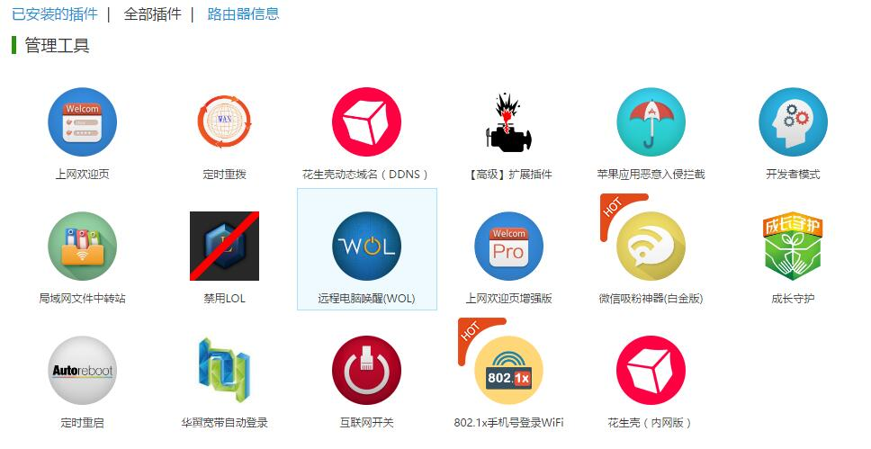


### 第三步：修改地址
打开一个未安装的应用后，它的地址应该是长下面这样的：

https://app.hiwifi.com/store.php?m=plugins&a=install&rid=rXXXXXXXXX&sid=XXXXXXXXX

其中前面rid的XXXXXXXXX几位数字不用管，不要改动，主要是sid的数字，把它改为163116535，然后访问。

### 第四步：点击免费安装，确定安装
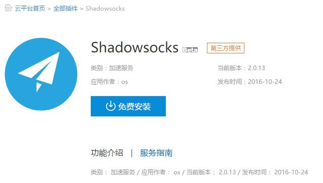
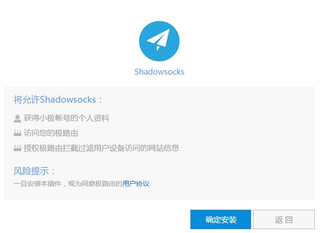


### 第五步：填写SS服务器信息
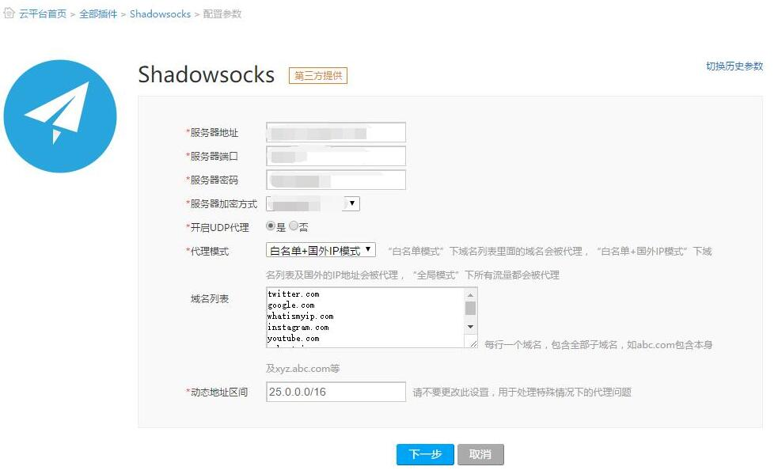


关于代理模式，笔者是只用白名单模式的，白名单域名列表可以搜GFWList或者在ShadowsocksR客户端中的pac文件中提取获得。当然也可以直接用白名单+国外IP模式，但是笔者没试过。

填好后按下一步，等待下载完成后会自动安装，并提醒安装成功。


### 完成
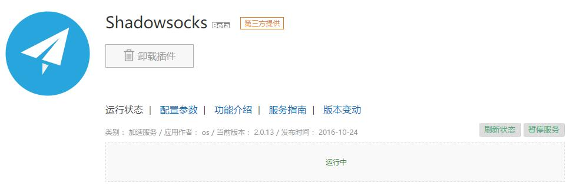


见到插件运行中就搞定了，这个时候就可以自由浏览网站了。你可以随时点下暂停服务暂时停止使用SS服务，也可以随时在配置参数中修改服务器信息和增删白名单。

---

## 极路由官方云端插件装配教程

当前极路由可以安装官方ss插件，并且不需要root权限。

使用体验还可以，虽然不如三流火插件（文章密码咨询相关人猿）那么强大，但毕竟方便了那些不会刷机的小白。

官方ss插件安装方法：

0.卸载掉ssh智能管道、世界通等一切代理插件，避免发生冲突，否则后期很麻烦。

1.用网页浏览器访问极路由后台，进入智能插件(云平台)市场页面。

2.进入随便点击进入一个插件，比如智能家居插件。

3.到浏览器的地址栏，把“sid=13”中的数字13改为其他数字，具体数字需私问相关人猿。

4.然后按回车即可安装。

5.填写帐号信息，设置域名列表。严重强调一下。必须使用本教程提供的完整的域名列表，否则不能用，下方会提供。

ss帐号填写方法：

服务器地址，即server

服务器端口，即server_port

服务器密码，即password

服务器加密方式，即method

开启UDP代理，选否，游戏联机用途也要选否，否则NAT类型3！

动态地址区间，默认即可

代理模式，建议白名单模式，每种模式的详细说明请看下文

域名列表，必须填写我提供的完整列表，下文有提供，不填写完整的域名列表则不好用...

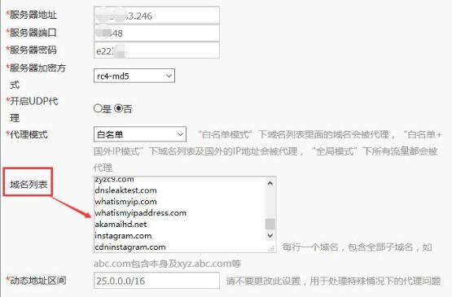

【域名列表】：

默认域名列表是空的（或不全），是不能用的。这里推荐一个比较不错的域名列表，你复制进去，然后点“应用”，想要及时生效则需要重启浏览器，域名列表[传送门(解压密码：123456)](http://www.johntitorblog.com/wp-content/uploads/2016/10/domain_list.zip)

.

【关于代理模式】：

A.普通上网、看视频用途，需要使用“白名单模式”。在这个模式下，只有出现在域名列表里面的网站才会走ss网络。域名列表必须使用本文提供的完整列表。

B.游戏联机加速用途，需要使用“白名单+国外IP模式”。在这个模式下，域名列表里的网站以及所有国外网站和国外流量，全部走ss网络。值得警惕的是，由于迅雷、BT、PT、磁力、旋风等P2P下载工具会产生国外的P2P流量，会走ss网络，特别容易出现盗版下载的问题，所以 严 禁 在这个模式下开这些下载。

C.“全局模式”的话，会造成国内网站的访问速度非常卡顿，几乎没有用处，因此不建议正常人使用。

.

插件显示“运行中”以后，只能说明这个插件是正常运行的，并不能说明ss功能是可用的。

那么，如何检测ss是否生效呢，请用下面的方法验证！！！！！！！！

【验证是否生效的方法】：

1.确保电脑的dns为自动获取，不会设置请自行百度。

2.确保完全关闭了浏览器，并且清理过dns缓存（如果不懂，直接重启电脑即可）

3.上述两点OK了，最终确保http://www.dnsleaktest.com 以及http://www.whatismyipaddress.com 可以显示ss服务器ip地址，说明ss生效！

顺带提一嘴，访问谷歌，最好使用http://www.google.com/ncr 这个网址，其他网址极有可能打不开。

顺带第二嘴，极路由上不要安装任何网络加速、代理、dns域名解析相关的插件，否则会有冲突，导致打不开国外网站。如果你不幸安装了，请把路由器恢复出厂设置后，重新部署安装ss插件...

https://www.boafanx123.com/search/%E5%A4%96%E7%BD%91/

## youtube教程
https://www.youtube.com/watch?v=y5THsYrXEYk

https://www.youtube.com/watch?v=rygSDVtnWak

---

# 极路由 使用 SSR


## 极路由刷SS/SSR插件 (适用于1S/2/3/4/B50/B70等机型)
https://github.com/uwtom/SSR-HiWifiOS

---

## 获取root权限之后登陆

```bash
ssh -p 1022 root@192.168.199.1

# 密码是 登陆路由器的密码
```

```bash
cd /tmp
echo "127.0.0.1 hiwifiss.ml" > /etc/hosts.d/aa;rm -f /tmp/install.sh;/etc/init.d/dnsmasq restart;curl -k https://raw.githubusercontent.com/uwtom/SSR-HiWifiOS/master/install.sh -o install.sh;chmod +x /tmp/install.sh && sh /tmp/install.sh
```

```bash
reboot
# 稍等1~2分钟 , 让路由器重启
```


##  购买搬瓦工 (49$/年 )
https://ssr.tools/208
##  顺便下载个 mac 用的SSR (不是必须的)
https://ssr.tools/164
## SSR一键安装脚本 (ShadowsocksR一键安装教程)
https://ssr.tools/31


---

## 修改 SSH 默认端口
https://jingyan.baidu.com/article/a3a3f81111e0f78da2eb8a04.html

## 改完之后要么关闭防火墙, 要么防火墙里设置 新的端口放行
注意:  临时关闭和 自启动关闭 都设置成关闭, 不然 重启之后登陆不了就傻逼了

## CentOS7查看和关闭防火墙
https://blog.csdn.net/ytangdigl/article/details/79796961


---

# v2ray

https://www.v2ray.com/

https://gitlab.com/Alvin9999/free/wikis/%E8%87%AA%E5%BB%BAv2ray%E6%9C%8D%E5%8A%A1%E5%99%A8%E6%95%99%E7%A8%8B

https://ssr.tools/308

https://www.rultr.com/tutorials/proxy/2268.html


