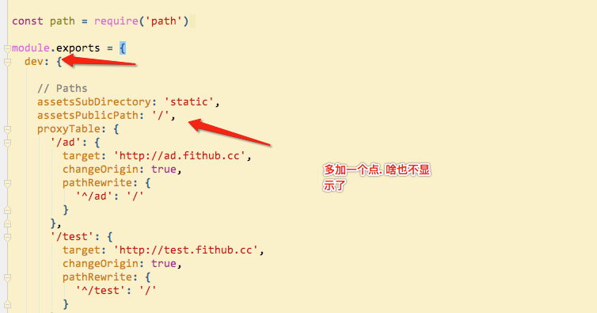
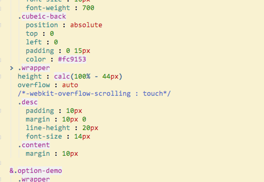
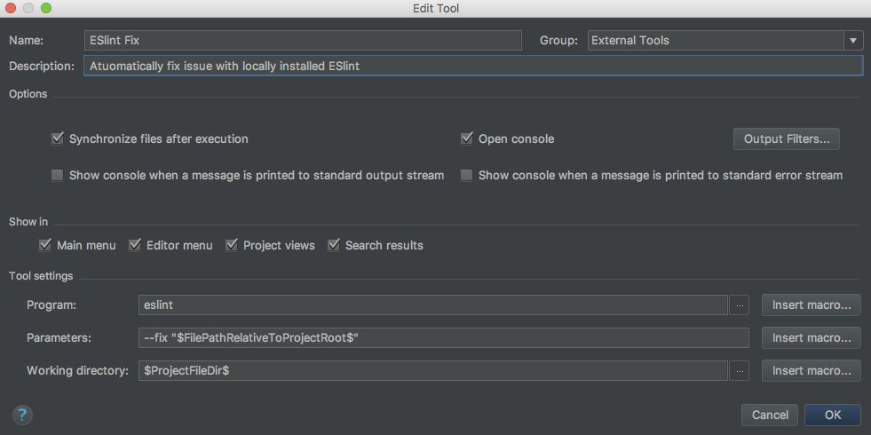
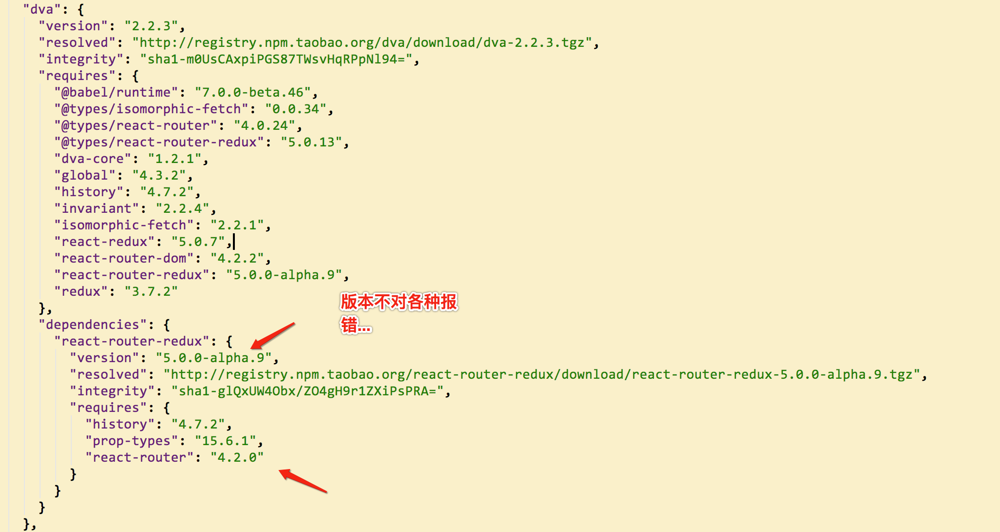

@(工作笔记)

# trap-record

[TOC]

---


---

## 重装mac 坑...

```
买了pro一年了，几乎不怎么用，操作上不习惯，预打算安装个Mac + Ubuntu双系统，刚使用系统自带的磁盘管理工具进行分区， Mac就不能用了，真是尴尬。使用Command + R， 格式话磁盘，选择恢复系统，直接报错未能创建于apfs安装的预启动宗卷。百度之， 没找到好的解决方案。后来直接致电Apple技术支持，才知道是格式化不干净的原因。

使用Command + Option + R+开机键，也可以先按开机， 再Command + Option + R， 出现地球后松手，此时会有十几分钟的时间，据技术支持的客服说是在下载工具。下载结束后进入到磁盘管理，选择显示->显示所有磁盘。


先抹掉最下面这个（名称是随意的， 可能不同），选择APFS格式（固态硬盘）， 抹掉后卸载。

然后选择第一项， 抹掉磁盘

抹掉成功后退出磁盘管理， 恢复系统。（网上有的说需要使用外网，其实正常网络就OK）

安装成功后务必制作启动盘，再怎么瞎折腾，都不怕啦。
```


## 配置坑



## -webkit-overflow-scrolling
坑爹的属性 , fixed 失效, 导致 导航栏 覆盖不了 , cube-page 使用时发现的, 注释掉... 目前还没遇到体验差的情况...


---


## fastclick 重复点击报错bug修复
https://github.com/ftlabs/fastclick/issues/36
修复之后的完整代码
https://github.com/stone0117/fastclick

---

## 选择性关闭ESLint
https://segmentfault.com/a/1190000008742240

---

## ESLint webstorm配置
https://blog.csdn.net/wk3368/article/details/50981767



使用本地的eslint , 不适用 全局的

## Intellij Idea：如何完全禁用错误提示
https://blog.csdn.net/u012814856/article/details/79044445

---

## 解决mac 外接显示器CPU爆涨的问题...
https://www.kawabangga.com/posts/2250
https://github.com/avibrazil/RDM
RDM在微云上
retain切换到非retain, GPU减轻压力, 立马飕飕的, 但是画面质感降低了, 不过搞开发的性能最重要, 高清见鬼去吧...

---

## 如何为WebStorm设置SASS的File Watchers？
**sass && scss**
http://geek100.com/2608.html

**less**
https://www.deboy.cn/use-less-unit-function-to-solve-the-ide-error-of-rpx.html

---

## 彻底解决高版本 mac Kernel_task占CPU问题
https://blog.csdn.net/liumx2007/article/details/77164795
就是将整个/System/Library/Extensions/IOPlatformPluginFamily.kext 移到其它目录然后重启计算机。（如有权限问题，请进入恢复模式打开命令行运行csrutil disable, 然后sudo mv该文件)
参考网页：https://hasin.me/2017/06/17/how-to-stop-kernel_task-from-fucking-the-cpu-in-your-mac/

---


## 解决html5 audio iphone,ipd，safari不能自动播放问题
https://www.cnblogs.com/interdrp/p/4211883.html

## vue 自定义指令坑 PHPStorm
This inspection checks for unbound namespace prefixes in XML.


## vue-loader 14版本和15版本 webpack配置不一样, 真坑

https://github.com/rails/webpacker/issues/1453

"vue-loader": "^14.2.2",
"vue-loader": "^15.0.0",

```javascript
const path     = require('path');
module.exports = {
  entry  : './www/app/main.js',
  output : {
    path      : path.resolve(__dirname, 'www/dist'),
    filename  : 'bundle.js',
    publicPath: '/dist/',
  },
  //当你的js文件发生变化的时候，你在重新的保存的时候，会自动的再一次的打包
  watch  : true,
  module : {
    rules: [
      {
        test   : /.vue?$/,
        include: [ path.resolve(__dirname, "www/app") ],
        exclude: [ path.resolve(__dirname, "node_modules") ],
        // vue loader中含有babel, 但是没有插件
        loader : "vue-loader",
      },
    ],
  },
  resolve: {
    alias: { 'vue$': 'vue/dist/vue.esm.js' },
  },
  devtool: "cheap-module-source-map",
  plugins: [],
};
```

---

```javascript
() => {
	console.log('hello world');
}
```
---

## dva 安装依赖还得点进去package.json查看依赖哪个版本...真坑...

比如 react-router-redux 版本



---

## 使用graphicsmagick时gm命令被占用
https://blog.csdn.net/revitalizing/article/details/50866013

使用mac时gm是git merge的别名 
1. 可以用which gm 看看从哪里来：gm: aliased to git merge 
2. unalias gm后再which gm 显示：/usr/local/bin/gm 
然后gm就可以正常使用了。

使用上面的方法只是在当前终端暂时取消掉了gm这个git的别名，打开新的终端窗口，gm还是git中定义的一个别名，需要修改git配置文件中别名的定义。我用的git是zsh的插件，这些别名都是zsh默认的，要修改的话到`~/.oh-my-zsh/plugins/git/git.plugin.zsh`这里来修改默认的配置即可。

---

