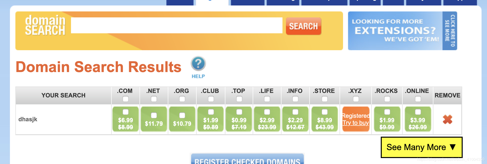
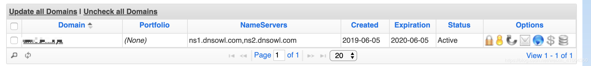
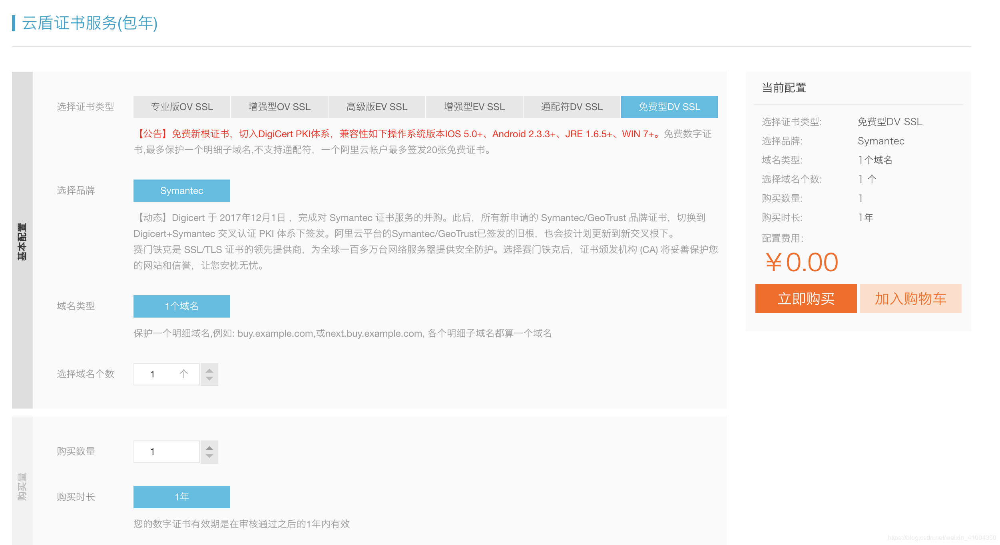
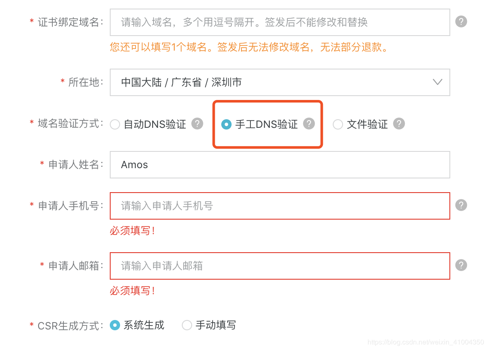
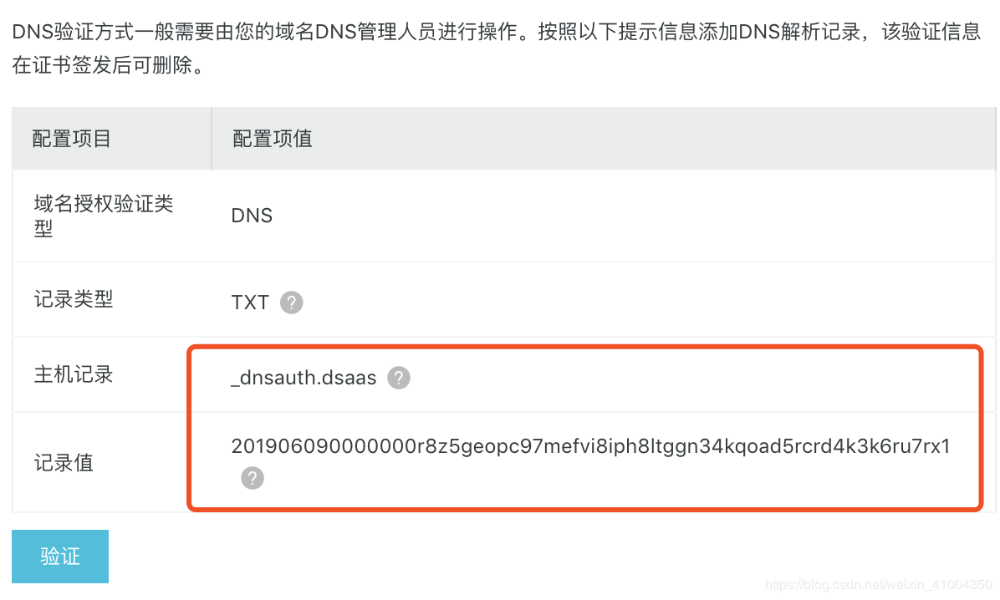
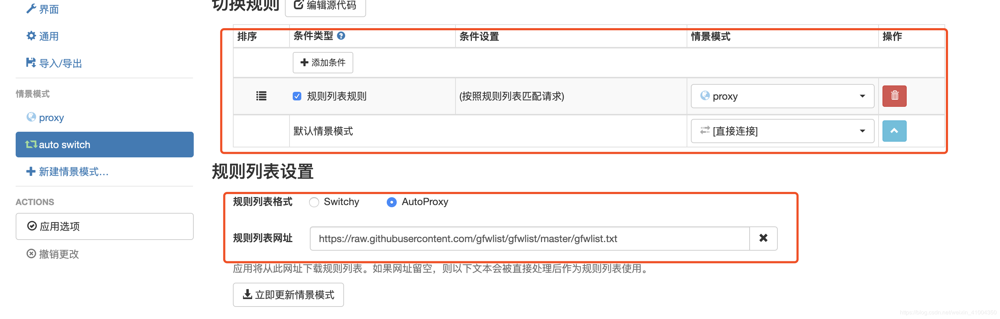

@(开发笔记)

# trojan-record


[TOC]

---

**github地址：** https://github.com/trojan-gfw/trojan

**官方文档：**https://trojan-gfw.github.io/trojan/

**环境：**

> Centos7
> trojan1.12.2

1.  准备服务器
    服务器，centos7，最低配，1核1G，有带宽。自行购买。国外的服务商还是很多的。购买服务器这里就不说了
    
2.  部署trojan服务端
下载最新安装包到服务器上，复制此连接地址到服务器上进行下载：


```bash
# github上下载最新版本压缩包
$ cd /opt
$ wget https://github.com/trojan-gfw/trojan/releases/download/v1.12.2/trojan-1.12.2-linux-amd64.tar.xz

# 解压
$ tar -xvf trojan-1.12.2-linux-amd64.tar.xz

# 复制服务端配置文件
$ cd trojan
$ cp examples/server.json-example ./server.json


# 默认的配置文件为config.json，此配置文件为客户端配置，上一步复制了服务端示例配置为server.json
# 修改服务端配置server.json
$ vim server.json

$ mkdir -p /opt/certs
```

```json
{
    "run_type": "server",
    "local_addr": "0.0.0.0",
    "local_port": 443,
    "remote_addr": "127.0.0.1",
    "remote_port": 80,
    "password": [
        # 密码，这里需要自己修改
        "yourpassword"
    ],
    "log_level": 1,
    "ssl": {
        # ssl证书路径，需要自己修改，只修改这两处，其他默认
        "cert": "/opt/certs/2314879_abcdefg.xyz.pem",
        "key": "/opt/certs/2314879_abcdefg.xyz.key",
        "key_password": "",
        "cipher": "ECDHE-ECDSA-AES256-GCM-SHA384:ECDHE-RSA-AES256-GCM-SHA384:ECDHE-ECDSA-CHACHA20-POLY1305:ECDHE-RSA-CHACHA20-POLY1305:ECDHE-ECDSA-AES128-GCM-SHA256:ECDHE-RSA-AES128-GCM-SHA256:ECDHE-ECDSA-AES256-SHA384:ECDHE-RSA-AES256-SHA384:ECDHE-ECDSA-AES128-SHA256:ECDHE-RSA-AES128-SHA256",
        "prefer_server_cipher": true,
        "alpn": [
            "http/1.1"
        ],
        "reuse_session": true,
        "session_ticket": false,
        "session_timeout": 600,
        "plain_http_response": "",
        "curves": "",
        "dhparam": ""
    },
    "tcp": {
        "prefer_ipv4": false,
        "no_delay": true,
        "keep_alive": true,
        "fast_open": false,
        "fast_open_qlen": 20
    },
    "mysql": {
        "enabled": false,
        "server_addr": "127.0.0.1",
        "server_port": 3306,
        "database": "trojan",
        "username": "trojan",
        "password": ""
    }
}
```

配置文件解释如下，以官方文档：https://trojan-gfw.github.io/trojan/config  为准。

run_type：运行特洛伊木马 server
local_addr：木马服务器将绑定到指定的接口。::如果您知道自己在做什么，请随意将此更改为其他地址。
local_port：木马服务器将绑定到此端口
remote_addr：遇到[其他协议](https://trojan-gfw.github.io/trojan/protocol#other-protocols)时木马服务器将连接到的端点地址
remote_port：遇到[其他协议](https://trojan-gfw.github.io/trojan/protocol#other-protocols)时木马服务器将连接的端点端口
password：用于验证的密码数组
log_level：转储多少日志。0：全部; 1：INFO; 2：警告; 3：错误; 4：致命; 5：关闭。
ssl：SSL具体配置
cert：服务器证书强烈建议由CA签名
key：用于加密的私钥文件
key_password：私钥文件的密码
cipher：要使用的密码列表
prefer_server_cipher：是否更喜欢连接中的服务器密码列表
alpn：ALPN要回复的协议列表
reuse_session：是否重用SSL会话
session_ticket：是否使用会话票证进行会话恢复
session_timeout：if reuse_session设置为true，指定SSL会话超时
plain_http_response：使用此文件响应普通的http请求（原始TCP）
curves：ECC使用的曲线
dhparam：如果留空，将使用默认（RFC 3526）dhparam，否则将使用指定的dhparam文件
tcp：TCP具体配置
prefer_ipv4：当存在域的IPv6和IPv4地址时是否连接到IPv4地址
no_delay：是否禁用Nagle的算法
keep_alive：是否启用TCP Keep Alive
fast_open：是否启用TCP Fast Open（需要内核支持）
fast_open_qlen：服务器对尚未完成三次握手的TFO请求队列大小的限制
mysql：见[Authenticator](https://trojan-gfw.github.io/trojan/authenticator)


3. 配置说明与准备

    上面我们配置了server.json服务端配置，大部分直接默认即可，只需要修改密码和ssl证书。这里对于不明白的小白，我要解释一下，ssl证书是web访问时的加密证书，我们用浏览器访问网页时，会发现有的地址是http开头，有的是https，https就是在http的基础上进行了ssl加密的访问，这个有什么用呢，就是可以在传输数据时，通过ssl证书将数据加密，加密后的数据传输就会更加安全，数据传输到网页的后台后通过对应的ssl证书进行解密。然后处理相对的http的连接传输数据是明文的，就是如果数据传输中途，被别人截获了，是可以清楚的看到你传输的数据的内容的，常见你的比如运营商劫持，就是你的电信运营商，在你浏览网页时，劫持你的浏览数据，然后在数据中添加广告什么的。国内很常见，因为国内网站很多都是http明文传输的，而国外如美国，是强制网站必须使用https进行传输的。

    ssl证书都是对应的一对，可以简单理解为一个加密一个解密，是一一对应的。而我们这次部署的trojan就是将流量伪装成https的流量，所以同样的需要使用ssl证书进行加解密，这样数据即使被中间截获了，也破译不出数据的内容，也可以诱骗别人认为是正常的https访问流量，以此来规避gfw，增加安全性，你懂的。

    那么ssl证书怎么来的呢，有两种方案，
    1：通过正规的方式，在ssl证书服务商处申请证书。使用这种正规的证书，网站在被浏览时，在浏览器上会显示一个安全的绿色的?的图案，显示此网站传输数据是安全的，正规的。我们平时浏览器访问的网站，大多是这样的。
    2: 自签证书。就是自己通过工具生成一对ssl证书，然后使用此证书进行加解密。功能是一样的，但是使用说的证书的网站，访问时浏览器会提醒证书不可信，不安全，会显示红色的?。

    那么这里我们要的ssl证书，应该用哪种呢，官方推荐是第一种，最好是正规的ssl证书，这样最安全。那么怎么申请ssl证书呢。申请证书需要哪些东西呢：

    ssl证书是与域名绑定的，所以在申请ssl证书之前，我们需要一个域名。 

域名的话，之前有免费域名可以申请：freenom.com。 但是现在这个网站越来越不太稳定，有点问题，总是申请不上。另外，申请域名不能在国内的服务商处进行申请，比如阿里云，腾讯云等，因为国内的域名需要备案(在政府那进行记录,审批)，然后才能使用，由于我们这用途，不可能去备案的，而且备案需要很长的时间。所以在国外的服务商处注册域名，因为国外的域名除了.cn的外，不需要备案，即买即用。这里我在最便宜的域名服务商处购买的域名，地址如下：https://www.namesilo.com/

虽然取个域名名称，搜索一下，然后找最便宜的进行购买，最便宜的一般是0.99美元一年，一般是.top或者.xyz为后缀的域名。如下:



选择一个然后进行购买，购买时需要注册用户，虽然填填信息注册就行了，注册完成购买完成后，就有了自己的域名。



然后，域名有了，我们就可以申请ssl证书了，直接在阿里云可以申请免费的ssl证书，用支付宝登录即可。购买界面如下：

https://common-buy.aliyun.com/?spm=5176.2020520163.cas.3.35de56a7EqmZwc&commodityCode=cas#/buy


https://yundun.console.aliyun.com/?spm=5176.12825654.1kquk9v2l.2.e9392c4a9qgOfq&p=cas&aly_as=micSkCO7#/overview/cn-hangzhou

购买完成后，点击申请，填入刚才购买的域名，注意这里要选择手工DNS验证：



申请完后后，会出现一个验证消息，这个是需要你在你的域名处，添加这个解析，然后通过验证后，才能证明这个域名是你的，才能成功申请到ssl证书。



然后进入域名，点击蓝色的小球，进入域名解析，添加一个txt的域名解析，将上面主机记录填入域名最前面，记录值填入，然后TTL填入3600，3600秒是这个网站最低的时间了，也就是最低3600秒后，这个解析就会生效。一般要不了那么久，几分钟就可以了。另外，域名最开始有很多默认的域名解析，全部都删除调，直接点下面红色的X，然后除了做这个ssl证书的验证解析外。我们再将你购买的服务器的外网ip地址，解析到此域名。新增A记录。如图我做了两个，一个空的A记录，还有一个www的A记录。都是解析到一样的服务器ip地址。


**A 的 ADDRESS 中 填写 CentOS7 的 服务器 IP地址**
**不会马上好 , 需要等 5~30分钟... 可以架设一个简单的网站 监控好没好**

好的。做完了这些之后，稍等几分钟，然后去阿里云ssl证书申请那里，点击验证，验证成功后，就可以拿到ssl证书了，然后在证书处选择下载：


下载完成后，将其上传到服务器上，解压后，保存到指定目录，然后就可以在配置文件中指定此目录啦。参考的我server.json的配置。ok，到此就算完成证书和域名的准备。然后呢官网文档还建议我们部署一个可用的http服务，用来欺骗gfw。


也就是说，我们可以随便在网上下载一个静态网站模版，然后启动web服务，这样当通过http访问我们域名的时候，就可以访问到这个静态网站，而通过https访问时，如果判断是trojan客户端的访问，那么就连接服务端，形成代理，如果不是，则返回http的网站页面给他。哈哈，是不是比较鸡贼。所以我们这里随便部署一个静态网页：

```bash
# 安装apache
$ yum install httpd
 
# 百度上随便找一个静态网站下载下载，解压
$ wget http://down.cssmoban.com/cssthemes5/cpts_1679_coq.zip
$ unzip cpts_1679_coq.zip
 
# 将解压后的文件，全部移动到/var/www/html下
$ mv cpts_1679_coq/* /var/www/html
 
# 开启apache服务
$ systemctl start httpd
$ systemctl enable httpd
 
# 防火墙默认是没开启的，这里就不做防火墙设置，如果有防火墙，就开放一下80，443的端口
```

如果是ubantu
```bash
apt-get install apache2

# /etc/init.d/apache2 [ start | stop | restart | status ]

/etc/init.d/apache2 start

```

然后，你访问一下你的域名，就能进入自己的部署的静态网站：


如果访问不了就
**CentOS 7下Apache（httpd）无法访问解决办法**
```bash
iptables -I INPUT -p TCP --dport 80 -j ACCEPT

#停止firewall
systemctl stop firewalld.service
#禁止firewall开机启动
systemctl disable firewalld.service
```

4. 启动trojan服务端

    ok，到此所有的准备都完成了，现在就可以启动trojan服务端了，trojan目前没有后台启动的选项，我这里通过nohup来实现后台启动，具体如下：

```bash
# 确保安装openssl依赖
$ yum install openssl
$ yum install net-tools
 
# 启动服务,指定server.json配置，启动服务端
$ cd /opt/trojan
$ nohup ./trojan -c server.json > server.log 2>&1 &
 
# 查看端口监听,可以看到443的端口监听。则启动成功
$ netstat -lnpt
tcp        0      0 0.0.0.0:443             0.0.0.0:*               LISTEN      5080/./trojan       
```

5. 客户端使用
服务端部署完成了，现在要进行客户端的部署。这里只说pc端，手机端的话，请查看此项目：https://github.com/trojan-gfw/igniter ，在这里下载最新的手机端apk来进行试用。
pc端的话，有windows和macos。由于我这里用的macos系统，所以就示范一下客户端的常规安装方式。
首先，下载安装包，同样github上，下载自己系统的二进制包。下载后，解压，然后修改config.json配置文件。

```json
{
    "run_type": "client",
    "local_addr": "127.0.0.1",
    "local_port": 1080,
    # 这里填上你的域名
    "remote_addr": "amos-x.xyz",
    "remote_port": 443,
    "password": [
        # 你在服务端上设置的密码
        "yourpassword"
    ],
    "log_level": 1,
    "ssl": {
        "verify": true,
        "verify_hostname": true,
        # ssl证书，更服务端的一样的ssl证书，用来加密数据的
        "cert": "/usr/local/etc/trojan/2314879_amos-x.xyz.pem",
        "cipher": "ECDHE-ECDSA-AES128-GCM-SHA256:ECDHE-RSA-AES128-GCM-SHA256:ECDHE-ECDSA-AES256-GCM-SHA384:ECDHE-RSA-AES256-GCM-SHA384:ECDHE-ECDSA-CHACHA20-POLY1305-SHA256:ECDHE-RSA-CHACHA20-POLY1305-SHA256:ECDHE-RSA-AES128-SHA:ECDHE-RSA-AES256-SHA:RSA-AES128-GCM-SHA256:RSA-AES256-GCM-SHA384:RSA-AES128-SHA:RSA-AES256-SHA:RSA-3DES-EDE-SHA",
        "sni": "",
        "alpn": [
            "h2",
            "http/1.1"
        ],
        "reuse_session": true,
        "session_ticket": false,
        "curves": ""
    },
    "tcp": {
        "no_delay": true,
        "keep_alive": true,
        "fast_open": false,
        "fast_open_qlen": 20
    }
}
```

>run_type：运行特洛伊木马 client
local_addr：SOCKS5服务器接口将绑定到指定的接口。随意将其更改为0.0.0.0，::1，::或其他地址，如果你知道自己在做什么。
local_port：一个SOCKS5接口将绑定到此端口
remote_addr：服务器地址（主机名）
remote_port： 服务器端口
password：用于验证的密码（仅使用阵列中的第一个密码）
log_level：转储多少日志。0：全部; 1：INFO; 2：警告; 3：错误; 4：致命; 5：关闭。
ssl：SSL具体配置
verify：是否验证SSL证书强烈推荐
verify_hostname：是否强烈建议验证SSL主机名（在sni字段中指定）
cert：如果verify设置为true，则CA可以提供服务器使用的相同证书或证书集合。如果将此字段留空，OpenSSL将尝试查找系统CA存储，并且可能会失败。
cipher：要发送和使用的密码列表
sni：SSL握手中的服务器名称指示字段。如果留空，则将其设置为remote_addr。
alpn：ALPN要发送的协议列表
reuse_session：是否重用SSL会话
session_ticket：是否使用会话票证进行会话恢复
curves：ECC曲线发送和使用
tcp：TCP具体配置
no_delay：是否禁用Nagle的算法
keep_alive：是否启用TCP Keep Alive
fast_open：是否启用TCP Fast Open（需要内核支持）
fast_open_qlen：服务器对尚未完成三次握手的TFO请求队列大小的限制

按我的配置配置后，启动trojan，由于trojan不是后台服务。只能在窗口启动，关闭窗口程序就终止了，所以不好使用，下面就介绍一下在windows和macos上，如何将其设为后台进程，并开启启动。

macos的话，可以通过brew来安装成系统服务。

---

## mac 配置
修改 config.json , 上面又模板...

```bash
# brew安装trojan
$ brew install trojan-gfw/trojan/trojan
$ brew install trojan
 
# 安装后，配置文件在/usr/local/etc/trojan/config.json
# 修改此配置文件后，使用此命令作为后台服务启动
# 后台启动
$ brew services start trojan
# 前台启动
$ trojan -c /usr/local/etc/trojan/config.json
 
# 启动后，查看端口监听，可以看到1080端口的监听，则为正常启动
# 且会自动开机启动，以后就不用操心了，安心使用即可
```

## windows 配置
以下操作是在win10上，如果是别的版本参考着应该也可以。windows的话，需要手动下载二进制包下来，解压后，在trojan目录中新建一个run_trojan.vbs文件。代码如下，复制进去，将trojan.exe的路径改为你自己的程序的绝对路径即可。


```
 DIM objShell 
 set objShell = wscript.createObject("wscript.shell") 
 iReturn = objShell.Run("cmd.exe /C C:\trojan\trojan.exe", 0, TRUE)
```

然后双击执行一下run_trojan.vbs，会发现窗口一闪而过，然后打开任务管理器，会发现进程中已经有了trojan.exe的进程正在运行。ok，然后需要将此vbs文件添加到启动项。首先，创建这个vbs文件的快捷方式，然后将快捷方式移动到如下目录：

C:\Users\Amos\AppData\Roaming\Microsoft\Windows\开始菜单(Start Menu)\程序(Programs)\启动(Startup) 。放入后，为确保正常可用，可以先杀掉进程中trojan.exe进程，然后双击运行一下这个快捷方式。如果正常启动程序则完成。然后就会发现任务管理器的启动一项中有了run_trojan.vbs这个启动项，启用即可。然后尝试重启，就会发现进程中已经自动启动了trojan.exe进程。

6. 使用SwitchyOmega实现智能代理
trojan客户端启动后，监听1080端口，直接在浏览器上设置代理，指定为本机的1080端口，然后访问一下google，你就会发现，可以正常访问了，协议要选择socks代理。
但是这样的话，通过浏览器的所有请求，都会经过代理，而我们都喜欢在访问国内网站时，不通过代理，访问国外网站时才通过代理，这样即提高了速度，又节省了流量。

这里使用chrome浏览器。如果又外网的，可以直接在chrome的应用中心搜索直接添加此插件。如果没有的，可以百度下载此插件，本地导入插件。

导入后，打开此查看选项，进行配置：


此配置是配置代理的地址，协议为socks5。然后配置auto switch智能代理模式，默认为直接连接，不实用代理，如果满足规则则使用代理，而规则则是gfw的墙的地址列表，此地址列表在github上维护的，地址为：https://github.com/gfwlist/gfwlist 。然后gfwlist的列表url地址为：https://raw.githubusercontent.com/gfwlist/gfwlist/master/gfwlist.txt。 将此地址填入下面的规则列表网址，点击更新列表，然后应用即可。



然后开启chrome浏览器的此插件，选择智能代理模式，然后就可以愉快的上网啦。


---

## iPhone 配置
QQ20191124-0.png

---

## 全系统支持，Trojan一键安装脚本，自动续签SSL证书，自动配置伪装网站，支持centos7+/debian9+/ubuntu16+

https://www.v2rayssr.com/trojan-1.html

https://www.youtube.com/watch?v=HytuSwW90rI


---

```bash
bash <(curl -s -L https://github.com/V2RaySSR/Trojan/raw/master/Trojan.sh)
```

<https://www.v2rayssr.com/trojan-1.html>