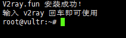

@(工作笔记)

# v2ray-record

[TOC]

---


```

/hello world/

```

## 233boy
https://github.com/ximliu/233boy

## 文档
https://www.v2ray.com/awesome/tools.html

## mac端 v2ray app
https://github.com/yanue/V2rayU


## 自建v2ray服务器教程
https://github.com/Alvin9999/new-pac/wiki/%E8%87%AA%E5%BB%BAv2ray%E6%9C%8D%E5%8A%A1%E5%99%A8%E6%95%99%E7%A8%8B


## 一键部署管理脚本

**安装脚本命令：**
```bash
wget -N --no-check-certificate https://raw.githubusercontent.com/KiriKira/v2ray.fun/kiriMod/install.sh && bash install.sh
```

**卸载脚本命令：**

```bash
wget -N --no-check-certificate https://raw.githubusercontent.com/KiriKira/v2ray.fun/kiriMod/uninstall.sh && bash uninstall.sh
```

**如果提示 wget: command not found 的错误，这是你的系统精简的太干净了，wget都没有安装，所以需要安装wget。**
```bash
# CentOS系统安装wget命令
yum install -y wget 

# Debian/Ubuntu系统安装wget命令:
apt-get install -y wget
```

---

复制上面的代码到VPS服务器里，复制代码用鼠标右键的复制，然后在vps里面右键粘贴进去，因为ctrl+c和ctrl+v无效。接着按回车键，脚本会自动安装。




如上图，输入快捷管理命令v2ray后，开始进行v2ray服务端配置。以后只需要运行这个快捷命令就可以出现下图的界面进行设置，快捷管理命令为：v2ray



如上图，输入数字2进行更改配置，共有6个子选项，包括：更改UUID、更改主端口、更改加密方式、更改传输方式、更改TLS设置（有域名才行）、更改广告拦截功能。（更改TLS设置和更改广告拦截功能不用设置）



如上图，输入数字1来更改新的UUID号，弹出提示后，输入字母y来确认。



修改UUID号，界面会回到v2ray主界面，重新输入2进入更改配置选项，在输入数字2来更改主端口，主端口范围40～65535，理论上可以任意设置，但不要以0开头！



重新进入更改配置选项，输入数字3来更改加密方式，加密方式有4种，最后1种为不加密。



接着，进行传输方式的设置，传输方式共有7种，这个配置对v2ray的速度起着很大的作用，具体哪个最适合你那里的网络环境，需要你自己来尝试。

注意：普通TCP、普通mKCP、mKCP伪装FaceTime通话、mKCP伪装BT下载流量、mKCP伪装微信视频流量可直接设置、不需要域名，HTTP伪装和WebSocket流量需要你有域名，且域名绑定了你的vps服务器ip。



进行了更改配置的设置后，输入数字3可以查看自己设置的v2ray信息。



最后一步很关键，那就是启动服务，进入主界面后，输入数字1，然后输入1启动v2ray服务。以后，每次你更改配置或重启vps服务器后都要进行启动服务


>因为一键搭建v2ray脚本是一个循环脚本，当你配置结束后不会自动退出快捷管理命令，如果你想退出界面进行其它操作，可以同时按下键盘上的ctrl键和字母z键。

---

## 一键加速VPS服务器

```bash
wget --no-check-certificate https://github.com/teddysun/across/raw/master/bbr.sh
```

```bash
chmod +x bbr.sh
```

```bash
./bbr.sh
```

把上面整个代码复制后粘贴进去，不动的时候按回车，然后耐心等待。最后输入reboot来重启服务器，确保加速生效，bbr加速脚本是开机自动启动，装一次就可以了。

演示开始，如图：

复制并粘贴代码后，按回车键确认


如下图提示，按任意键继续部署


整个部署过程需要2～5分钟，最后输入reboot来重启服务器，确保加速生效，bbr加速脚本是开机自动启动，装一次就可以了。

服务器重启成功并重新连接服务器后，输入命令lsmod | grep bbr 如果出现tcp_bbr字样表示bbr已安装并启动成功。如图：


注意：根据反馈，少部分人安装bbr脚本并重启后，几分钟过去了，发现xshell无法连接服务器且服务器ip无法ping通。解决方法是：开新服务器或者重装系统，然后先安装bbr脚本再安装v2ray脚本。或者换锐速加速。

重装系统方法，点击vultr服务器设置界面——“Server Reinstall”，如下图：


重装过程一般需要5～10分钟。

---


## 生成 Namesilo_key 
https://www.namesilo.com/account/api-manager


## 所有域名网站 书写方式
https://github.com/acmesh-official/acme.sh/wiki/dnsapi

## 教程
https://www.youtube.com/watch?v=RxYAPItx-5E


```bash
cd /root/.acme.sh

export Namesilo_Key="xxxxxxxxxxxxxxxxxxxxx"

./acme.sh --issue --dns dns_namesilo --dnssleep 900 -d example.com -d www.example.com
```


---


## V2RAY 基于 NGINX 的 VMESS+WS+TLS 一键安装脚本

链接：https://www.jianshu.com/p/073e37cfdfae


### 注意事项

- 如果你不了解脚本中各项设置的具体含义，除域名外，请使用脚本提供的默认值
- 使用本脚本需要你拥有 Linux 基础及使用经验，了解计算机网络部分知识，计算机基础操作
- 目前支持Debian 9+ / Ubuntu 18.04+ / Centos7+ ，部分Centos模板可能存在难以处理的编译问题，建议遇到编译问题时，请更换至其他系统模板
- 每周日的凌晨3点，Nginx 会自动重启以配合证书的签发定时任务进行，在此期间，节点无法正常连接，预计持续时间为若干秒至两分钟


更多内容请查看 CHANGELOG.md


## 2020-01-25

- 修复 curl依赖确实
- 添加 MT-proxy-go 安装代码，在此感谢 whunt1 的贡献
- 修复 测试签发成功，正式签发失败，后续重装导致的跳过证书签发问题

###  鸣谢

-  ~~本脚本的另一个分支版本（Use Host）地址： https://github.com/dylanbai8/V2Ray_ws-tls_Website_onekey 请根据需求进行选择~~ 该作者可能已停止维护
- 本脚本中 MTProxy-go TLS 版本项目引用 [https://github.com/whunt1/onekeymakemtg](https://links.jianshu.com/go?to=https%3A%2F%2Fgithub.com%2Fwhunt1%2Fonekeymakemtg) 在此感谢
- 本脚本中 锐速4合1脚本项目引用 [https://www.94ish.me/1635.html](https://links.jianshu.com/go?to=https%3A%2F%2Fwww.94ish.me%2F1635.html) 在此感谢

###  证书

> 如果你已经拥有了你所使用域名的证书文件，可以将 crt 和 key 文件命名为 v2ray.crt v2ray.key 放在 /data 目录下（若目录不存在请先建目录），请注意证书文件权限及证书有效期，自定义证书有效期过期后请自行续签

脚本支持自动生成 let’s encrypted 证书，有效期3个月，理论上自动生成的证书支持自动续签，自动续签功能有待检验

###  查看客户端配置

```
cat ~/v2ray_info.txt
```

###  V2RAY 简介

- V2Ray是一个优秀的开源网络代理工具，可以帮助你畅爽体验互联网，目前已经全平台支持Windows、Mac、Android、IOS、Linux等操作系统的使用。
-  ~~本脚本的另一个分支版本（Use Host）地址： https://github.com/dylanbai8/V2Ray_ws-tls_Website_onekey 请根据需求进行选择~~ 该作者可能已停止维护
- 本脚本为一键完全配置脚本，在所有流程正常运行完毕后，直接按照输出结果设置客户端即可使用
- 请注意：我们依然强烈建议你全方面的了解整个程序的工作流程及原理

###  建议单服务器仅搭建单个代理

- 本脚本默认安装最新版本的V2ray core
- V2ray core 目前最新版本为 4.21.3（同时请注意客户端 core 的同步更新，需要保证客户端内核版本 >= 服务端内核版本）
- 建议使用默认的443端口作为连接端口
- 伪装内容可自行替换。

###  V2RAY CORE 更新方式

执行： `bash <(curl -L -s https://install.direct/go.sh)`

（ 来源参考 ：[V2ray官方说明](https://links.jianshu.com/go?to=https%3A%2F%2Fwww.v2ray.com%2Fchapter_00%2Finstall.html)）

- 如果为最新版本，会输出提示并停止安装。否则会自动更新
- 未来会将相关内容集成到本脚本中并进行交互式操作更新

###  注意事项

- 推荐在纯净环境下使用本脚本，如果你是新手，请不要使用Centos系统。
- 在尝试本脚本确实可用之前，请不要将本程序应用于生产环境中。
- 该程序依赖 Nginx 实现相关功能，请使用 [LNMP](https://links.jianshu.com/go?to=https%3A%2F%2Flnmp.org%2F) 或其他类似携带 Nginx 脚本安装过 Nginx 的用户特别留意，使用本脚本可能会导致无法预知的错误（未测试，若存在，后续版本可能会处理本问题）。
- V2Ray 的部分功能依赖于系统时间，请确保您使用V2RAY程序的系统 UTC 时间误差在三分钟之内，时区无关。
- 本 bash 依赖于 [V2ray 官方安装脚本](https://links.jianshu.com/go?to=https%3A%2F%2Finstall.direct%2Fgo.sh) 及 [acme.sh](https://links.jianshu.com/go?to=https%3A%2F%2Fgithub.com%2FNeilpang%2Facme.sh) 工作。
- Centos 系统用户请预先在防火墙中放行程序相关端口（默认：80，443）

###  准备工作

- 准备一个域名，并将A记录添加好。
-  [V2ray官方说明](https://links.jianshu.com/go?to=https%3A%2F%2Fwww.v2ray.com%2F)，了解 TLS WebSocket 及 V2ray 相关信息
- 安装好 curl

###  安装/更新方式（H2 和 WS 版本已合并）

Vmess+websocket+TLS+Nginx+Website

```bash
wget -N --no-check-certificate -q -O install.sh "[https://raw.githubusercontent.com/wulabing/V2Ray_ws-tls_bash_onekey/master/install.sh](https://raw.githubusercontent.com/wulabing/V2Ray_ws-tls_bash_onekey/master/install.sh)" && chmod +x install.sh && bash install.sh
```

脚本有问题, 自己根据URL 手动下载

###  启动方式

启动 V2ray：`systemctl start v2ray`

停止 V2ray：`systemctl stop v2ray`

启动 Nginx：`systemctl start nginx`

停止 Nginx：`systemctl stop nginx`

###  相关目录

Web 目录：`/home/wwwroot/3DCEList`

V2ray 服务端配置：`/etc/v2ray/config.json`

V2ray 客户端配置: `~/v2ray_info.txt`

Nginx 目录： `/etc/nginx`

证书文件: `/data/v2ray.key 和 /data/v2ray.crt`

---

## V2RAY 基于 NGINX 的 VMESS+WS+TLS+Website 手工配置

https://briteming.blogspot.com/2019/01/v2ray-websocket-web-nginx.html

## 启用cloudflare cdn之后v2ray报403错误
https://www.4spaces.org/v2ray-cloudflare-cdn-403/
这是因为我增加了header伪装域名，去掉之后v2ray就能正常使用了。也就是cloudflare的cdn功能和v2ray的伪装功能不能同时使用。

---

## v2ray零基础综合教程——搭建v2ray不再求人 一键搭建v2ray百科全书

https://www.youtube.com/watch?v=zpgCJlEdlg8

https://www.iszyn.com/v2raywstls/

---

ping 查看IP时 匹配省内IP ???

解决办法, 修改 当前IP的 DNS解析 改成 114.114.114.114 或者 8.8.8.8

---

```bash
root@localhost:~# ps -ef | grep caddy
www-data 13977     1  0 04:10 ?        00:00:09 /usr/local/bin/caddy -log stdout -log-timestamps=false -agree=true -conf=/etc/caddy/Caddyfile -root=/var/tmp
root     14697 14623  0 05:42 pts/0    00:00:00 grep --color=auto caddy
root@localhost:~# cat /etc/caddy/Caddyfile
bbs.stonehongkong.xyz {
    gzip
timeouts none
    proxy / https://www.guokr.com/ {
        except /guokr
    }
    proxy /guokr 127.0.0.1:30363 {
        without /guokr
        websocket
    }
}
import sites/*
```


---


```bash
bash <(curl -s -L https://git.io/v2ray.sh)
```


<https://www.iszyn.com/v2raywstls/>


---


### step1:

bash <(curl -L -s https://install.direct/go.sh)

### step2:

<https://guide.v2fly.org/advanced/wss_and_web.html#%E6%9C%8D%E5%8A%A1%E5%99%A8%E9%85%8D%E7%BD%AE>

```json
{
  "inbounds": [
    {
      "port": 10000,
      "listen":"127.0.0.1",//只监听 127.0.0.1，避免除本机外的机器探测到开放了 10000 端口
      "protocol": "vmess",
      "settings": {
        "clients": [
          {
            "id": "b831381d-6324-4d53-ad4f-8cda48b30811",
            "alterId": 64
          }
        ]
      },
      "streamSettings": {
        "network": "ws",
        "wsSettings": {
        "path": "/ray"
        }
      }
    }
  ],
  "outbounds": [
    {
      "protocol": "freedom",
      "settings": {}
    }
  ]
}
```


### step3:

https://www.jianshu.com/p/073e37cfdfae

systemctl start v2ray

### step4:

https://caddyserver.com/docs/

安装caddy

```plain
# Caddy v2 (recommended)
mydomain.me {
    log {
        output file /etc/caddy/caddy.log
    }
    tls {
        protocols tls1.2 tls1.3
        ciphers TLS_ECDHE_ECDSA_WITH_AES_256_GCM_SHA384 TLS_ECDHE_ECDSA_WITH_CHACHA20_POLY1305_SHA256
        curves x25519
    }
    @v2ray_websocket {
        path /ray
        header Connection *Upgrade*
        header Upgrade websocket
    }
    reverse_proxy @v2ray_websocket localhost:10000
}
```

```bash
caddy run --config /path/to/Caddyfile
```

