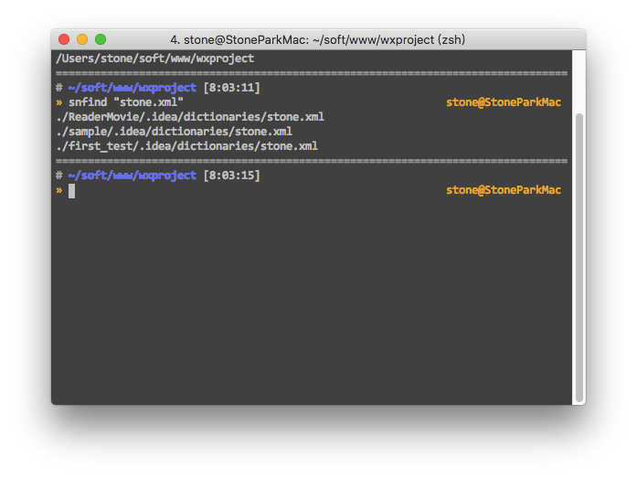

# wechat-record


---


```javascript
console.log('hello world')
```

## 陌生单词



---


---

## css实现一行文字居中，多行文字左对齐

https://www.cnblogs.com/flxy-1028/p/6079681.html

```
<text class="post-title"><text class="post-title-inside">{{item.title}}</text></text>

.post-title {

/*当文字为一行是，则P的宽度小于div的宽度，p标签居中显示在盒子内，文字也就居中了 ;当大于一行时，P的宽度和div的宽度是一致的 ,文字就居左对齐了*/
  width       : 90%;
  text-align  : center;
  font-size   : unit(34, rpx);
  font-weight : bold;
  color       : #333333;

  /*display: inline-block使P的宽度根据文字的宽度伸缩 */
  .post-title-inside {
    text-align : left;
    display    : inline-block
  }
  //  垂直方向用px, 水平方向用 rpx | 经验 , 高度不要钱, 宽度得适配
}
```

---

## 微信小程序 列表渲染 wx:for
https://www.w3cschool.cn/weixinapp/weixinapp-list.html


---


## 微信小程序用到block时的一个坑
https://www.cnblogs.com/wxx-17-5-13/p/8799450.html

```javascript
最近要写微信小程序，大致浏览了一下官网看到for循环可以写在view和block标签里。

用在view中只能应用单个节点。比如：

<view wx:for="{{array}}" wx:for-index="idx" wx:for-item="itemName">
  {{idx}}: {{itemName.message}}
</view>
<view wx:for="{{[1, 2, 3, 4, 5, 6, 7, 8, 9]}}" wx:for-item="i">
  <view wx:for="{{[1, 2, 3, 4, 5, 6, 7, 8, 9]}}" wx:for-item="j">
    <view wx:if="{{i <= j}}">
      {{i}} * {{j}} = {{i * j}}
    </view>
  </view>
</view>
用在block中可以渲染一个包含多节点的结构块。比如：

<block wx:for="{{[1, 2, 3]}}">
  <view> {{index}}: </view>
  <view> {{item}} </view>
</block>

今天遇到到一个问题：我想让block中循环输出的内容横向布局......
官网看了好几遍，网上搜了好久依然没有结果...
在看慕课视频时听到老师一句：block其实没啥意义，就相当于一个括号..
所以要让block中循环输出的内容横向布局只需要在block外面嵌套一个view标签就行233333
<view style=“display='flex'”>

<block wx:for="{{[1, 2, 3]}}">
  <view> {{index}}: </view>
  <view> {{item}} </view>
</block>

</view>
```

---

## ngrok
https://ngrok.com/download

## rpx scss 解决


## rpx 不同的解决方案
https://blog.csdn.net/lulitianyu/article/details/83240864

## wechat 命令行工具
https://developers.weixin.qq.com/miniprogram/dev/devtools/cli.html


## 在 微信开发者工具 的 设置 - 编辑器 中勾选文件保存时自动编译小程序，可实现自动刷新。注意：其它选项请不要勾选！！！
无语... 竟然会有这种坑...
https://github.com/issaTan/wap-cli

## 微信小程序 还有三方工具???
https://segmentfault.com/a/1190000007270749
